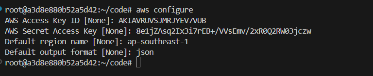
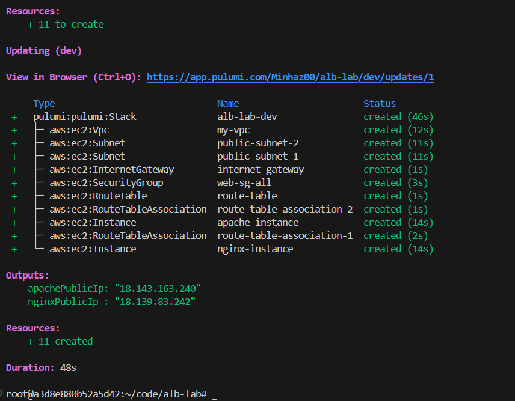
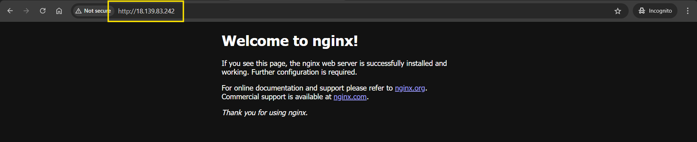
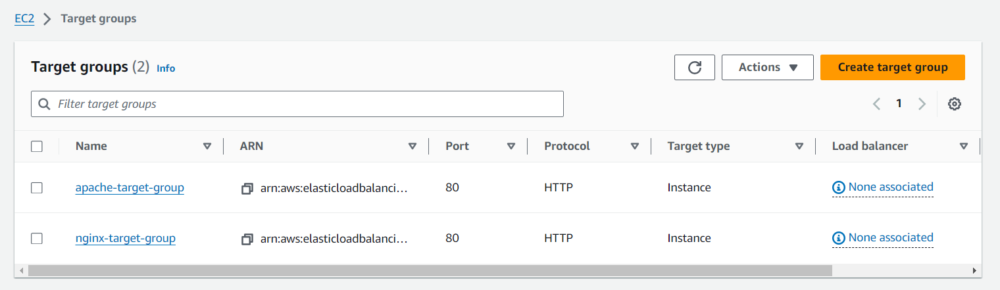
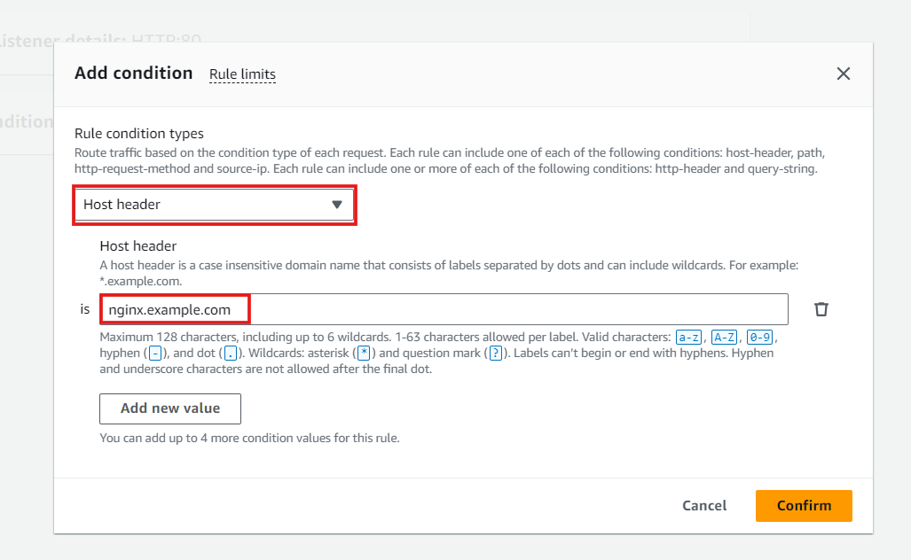
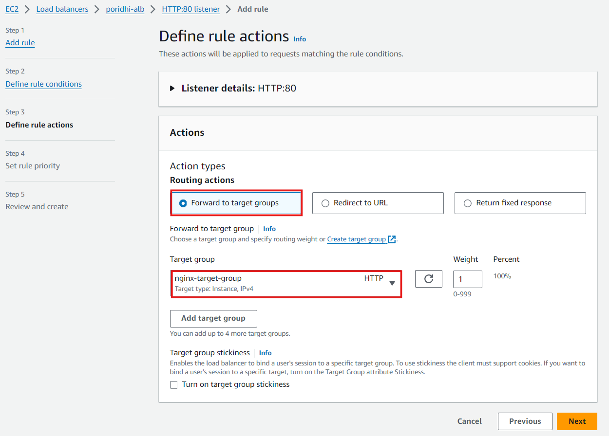
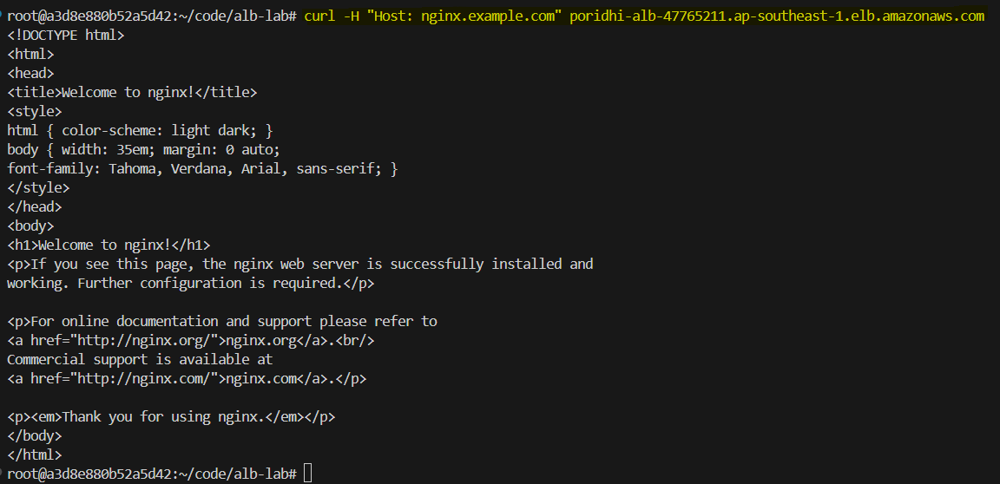
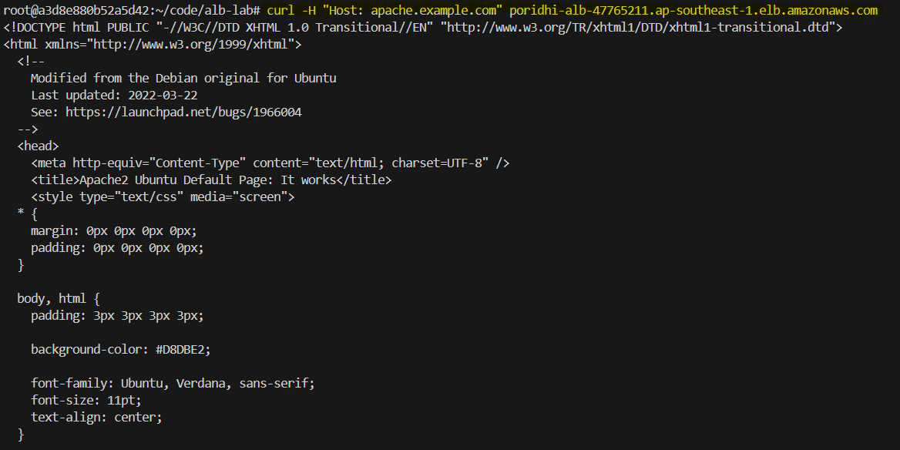

# Routing Multiple Domain Names Using a Single ALB


In today's cloud-based environments, efficiently managing multiple applications or services under different domain names is crucial for both cost management and operational efficiency. Traditionally, each domain might require a separate load balancer, leading to increased costs and complexity. However, with AWS Application Load Balancer (ALB), you can route traffic for multiple domain names (or subdomains) using a single load balancer through a feature known as host-based routing. This lab will guide you through the process of setting up and configuring this functionality using Pulumi.js for infrastructure as code (IaC) and the AWS Management Console for manual configuration.


This lab is important because it showcases how to optimize AWS resources by consolidating multiple load balancers into one, thereby reducing costs while ensuring efficient and organized traffic routing. This is particularly beneficial for organizations that manage multiple web applications or microservices under different domain names.


## Task Description

In this lab, you will:

- Set up the necessary AWS infrastructure using Pulumi.js, including a VPC, public subnets, EC2 instances running Nginx and Apache, and related resources.
- Manually configure AWS Application Load Balancer (ALB) with host-based routing to direct traffic based on domain names.
- Testing Host-Based Routing on AWS ALB Using `curl`

## Step 1: Configure AWS CLI

Open Command Prompt or PowerShell and run:
```sh
aws configure
```



Enter your AWS Access Key ID, Secret Access Key, region (`ap-southeast-1`), and default output format (`json`).

## Step 2: Set Up a Pulumi Project

### Set Up a Pulumi Project
Create a new directory for your project and navigate into it:
```sh
mkdir alb-lab
cd alb-lab
```

### Initialize a New Pulumi Project
Run the following command to create a new Pulumi project:
```sh
pulumi new aws-javascript
```
Follow the prompts to set up your project. Provide your pulumi token and setup your pulumi project name, description, region etc.

### Create a Key Pair
Run the following command to create a new key pair:
```sh
aws ec2 create-key-pair --key-name MyKeyPair --query 'KeyMaterial' --output text > MyKeyPair.pem
```

### Set File Permissions
```sh
chmod 400 MyKeyPair.pem
```

## Step 3: Create the Pulumi Program

We will use Pulumi.js to create the required infrastructure, including a VPC, public subnets, and EC2 instances.

### Define the Infrastructure

Next, we will define the infrastructure in the `index.ts` file.

1. **VPC**: Create a Virtual Private Cloud (VPC) to host your infrastructure.
2. **Public Subnets**: Create two public subnets in different availability zones.
3. **Internet Gateway**: Set up an internet gateway to allow traffic in and out of the VPC.
4. **Route Table**: Create a route table and associate it with the public subnets.
5. **Security Group**: Define a security group to control traffic to and from the EC2 instances.
6. **EC2 Instances**: Launch two EC2 instances, one running Nginx and the other running Apache.

Here’s the code to set up the infrastructure:

```javascript
const pulumi = require("@pulumi/pulumi");
const aws = require("@pulumi/aws");

// Create a VPC
const vpc = new aws.ec2.Vpc("my-vpc", {
    cidrBlock: "10.0.0.0/16",
    enableDnsSupport: true,
    enableDnsHostnames: true,
    tags: { Name: "poridhi-pvc" },

});

// Create the first public subnet in availability zone 1
const publicSubnet1 = new aws.ec2.Subnet("public-subnet-1", {
    vpcId: vpc.id,
    cidrBlock: "10.0.1.0/24",  // Adjusted CIDR block for the first subnet
    availabilityZone: "ap-southeast-1a",  // Adjust region and AZ as necessary
    mapPublicIpOnLaunch: true,
    tags: { Name: "public-subnet-1" },
});

// Create the second public subnet in availability zone 2
const publicSubnet2 = new aws.ec2.Subnet("public-subnet-2", {
    vpcId: vpc.id,
    cidrBlock: "10.0.2.0/24",  // Adjusted CIDR block for the second subnet
    availabilityZone: "ap-southeast-1b",  // Different availability zone
    mapPublicIpOnLaunch: true,
    tags: { Name: "public-subnet-2" },
});

// Create an Internet Gateway
const internetGateway = new aws.ec2.InternetGateway("internet-gateway", {
    vpcId: vpc.id,
    tags: { Name: "my-igw" },
});

// Create a route table and associate it with the public subnets
const routeTable = new aws.ec2.RouteTable("route-table", {
    vpcId: vpc.id,
    routes: [{
        cidrBlock: "0.0.0.0/0",
        gatewayId: internetGateway.id,
    }],
    tags: { Name: "my-rt" },
});

// Associate the route table with the first public subnet
new aws.ec2.RouteTableAssociation("route-table-association-1", {
    subnetId: publicSubnet1.id,
    routeTableId: routeTable.id,
});

// Associate the route table with the second public subnet
new aws.ec2.RouteTableAssociation("route-table-association-2", {
    subnetId: publicSubnet2.id,
    routeTableId: routeTable.id,
});

// Security Group for EC2 instances
const securityGroup = new aws.ec2.SecurityGroup("web-sg-all", {
    vpcId: vpc.id,
    ingress: [
        { protocol: "tcp", fromPort: 22, toPort: 22, cidrBlocks: ["0.0.0.0/0"] },  // SSH
        { protocol: "tcp", fromPort: 80, toPort: 80, cidrBlocks: ["0.0.0.0/0"] }   // HTTP
    ],
    egress: [
        { protocol: "-1", fromPort: 0, toPort: 0, cidrBlocks: ["0.0.0.0/0"] }
    ]
});

// Create an EC2 instance (Nginx) in the first public subnet
const nginxInstance = new aws.ec2.Instance("nginx-instance", {
    ami: "ami-01811d4912b4ccb26",  // Replace with a valid Nginx AMI ID
    instanceType: "t2.micro",
    subnetId: publicSubnet1.id,  // First public subnet
    keyName: "MyKeyPair",
    associatePublicIpAddress: true,
    vpcSecurityGroupIds: [securityGroup.id],
    userData: `#!/bin/bash
    sudo apt update
    sudo apt install -y nginx
    sudo systemctl start nginx`,
    tags: { Name: "nginx-server" },
});

// Create an EC2 instance (Apache) in the second public subnet
const apacheInstance = new aws.ec2.Instance("apache-instance", {
    ami: "ami-01811d4912b4ccb26",  // Replace with a valid Apache AMI ID
    instanceType: "t2.micro",
    subnetId: publicSubnet2.id,  // Second public subnet
    keyName: "MyKeyPair",
    associatePublicIpAddress: true,
    vpcSecurityGroupIds: [securityGroup.id],
    userData: `#!/bin/bash
    sudo apt update
    sudo apt install -y apache2
    sudo systemctl start apache2`,
    tags: { Name: "apache-server" },
});

// Export the public IPs of the instances
module.exports = {
    nginxPublicIp: nginxInstance.publicIp,
    apachePublicIp: apacheInstance.publicIp,
};
```

### Deploy the Infrastructure
Run the following command to deploy the infrastructure:

  ```bash
  pulumi up
  ```

Confirm the changes and wait for the resources to be provisioned.



After successful creation, we can see the EC2 instances from AWS console:


## Step 4: Verifying the EC2 Instances

Once the infrastructure is created, verify that both Nginx and Apache servers are running by accessing their public IPs in a web browser.


- **Nginx**: `http://<nginx-public-ip>`

    

- **Apache**: `http://<apache-public-ip>`

    

You should see the default welcome pages for Nginx and Apache, respectively.


## Step 5: Creating Target Groups

Next, we'll create two target groups in the AWS Management Console, one for the Nginx server and another for the Apache server.


1. **Go to the EC2 Dashboard** and navigate to the **Target Groups** section.
2. **Create a Target Group for Nginx**:
    - Choose **Instance** as the target type.
    - Name the target group (e.g., `nginx-target-group`).
    - Select **HTTP** and port **80**.
    - Choose the VPC created earlier.
    - Register the Nginx instance to this target group.

3. **Create a Target Group for Apache**:
    - Repeat the process, naming this group (e.g., `apache-target-group`).
    - Register the Apache instance to this target group.


   


## Step 6: Setting Up the Application Load Balancer (ALB)

Now, we'll set up the ALB to handle host-based routing.

### Create an Application Load Balancer


- Navigate to the **Load Balancers** section and click **Create Load Balancer**.
- Choose **Application Load Balancer**.
- Set it to **Internet-facing** and select the VPC and subnets created earlier.
- Configure the security group to allow all traffic from all source for now on.
- Configure the Listeners. The default listener will be HTTP on port 80. Select one of the target group as default.
- Review and create the ALB.

Wait for a few minutes before the application load balancer status is `Active`.


### Add rules 

Add rules to forward requests based on the `Host header` (domain name) to the respective target groups. 


Go to the ALB and then the default rules. Select `Add rules` to create new rules:


#### For `nginx`:
- Requests for `nginx.example.com` forward to the `nginx-target-group`.

    

- Create a new condition.

    

- Select the target groups.

    

Now, set the priority `1` and create.    


#### For `apache`:

Go to the ALB and then the default rules. Select `Add rules` to create new rules for the apache server in the same way. 

- Requests for `apache.example.com` forward to the `apache-target-group`.
- Add a new condition. 
- Select the target groups.
- Set  priority `2` and create.


## Step 7: Testing the Configuration

Using `curl` with the `-H` flag to manually set the `Host` header is a good approach for testing how your ALB routes requests based on different hostnames. This method is quick and effective for verifying that your ALB is correctly routing traffic to the appropriate backend services (e.g., Nginx, Apache) based on the `Host` header.

### Identify Your ALB's DNS Name
- Log in to the AWS Management Console.
- Navigate to **EC2 Dashboard** > **Load Balancers**.
- Select your ALB and note down the DNS name from the **Description** tab.

    

### Test Nginx Routing
To test if requests to `nginx.example.com` are being routed correctly to the Nginx backend, run the following command:

```bash
curl -H "Host: nginx.example.com" http://<ALB-DNS-Name>
```



### Test Apache Routing
To test if requests to `apache.example.com` are being routed correctly to the Apache backend, run the following command:

```bash
curl -H "Host: apache.example.com" http://<ALB-DNS-Name>
```



### Analyze the Response
- If the routing is correctly configured, you should receive the expected response from the respective backend service (Nginx or Apache).
- If the routing is incorrect, you may receive a response from the wrong service or an HTTP error.


## Conclusion

In this lab, you've successfully set up a single AWS Application Load Balancer (ALB) to route traffic to different back-end servers based on the requested domain name. This setup is highly scalable and cost-effective for managing multiple applications or services under different domains, all through a single load balancer.

This hands-on experience with Pulumi.js and AWS Management Console has equipped you with the skills to manage and deploy host-based routing in a real-world cloud environment. The consolidation of resources under a single ALB not only simplifies the architecture but also significantly reduces operational costs.


