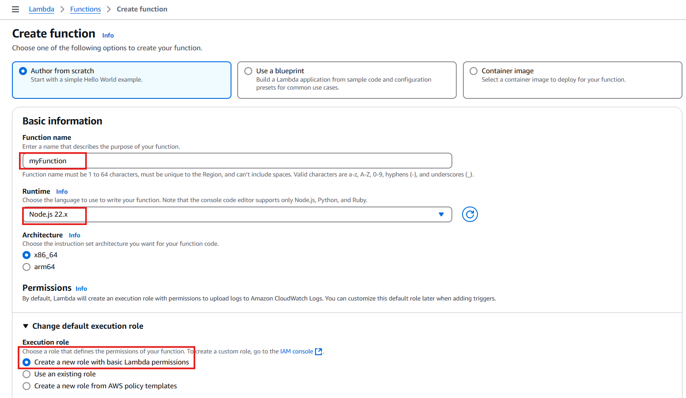
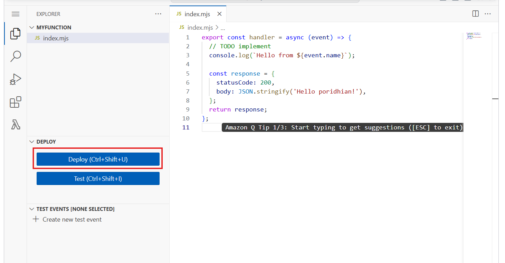
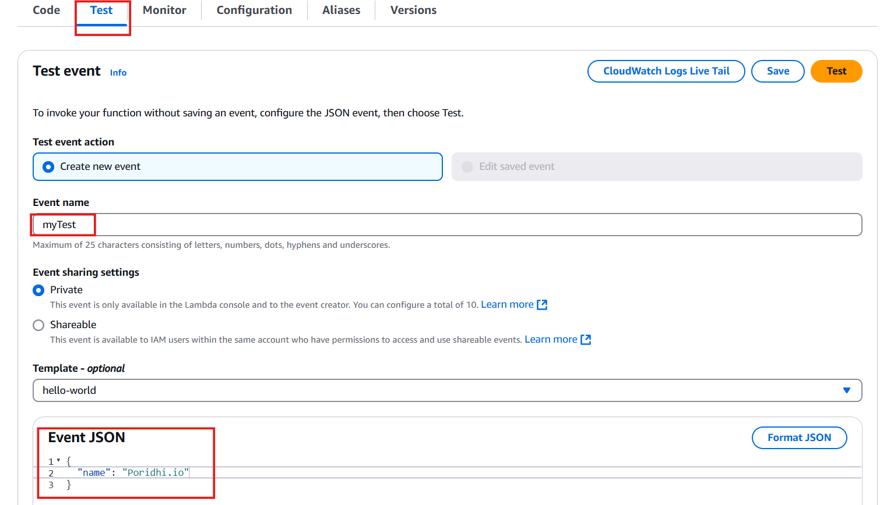
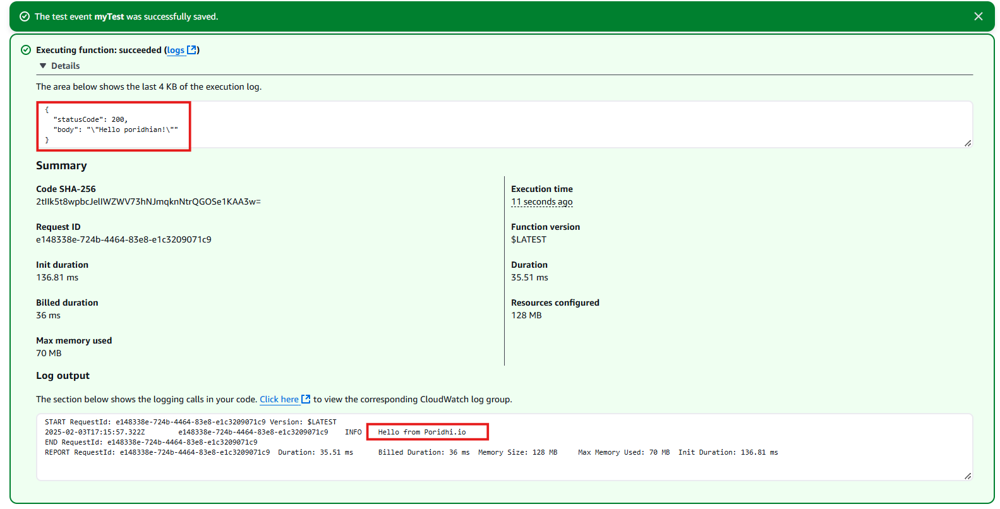

# **Introduction to AWS Lambda Function**

AWS Lambda is a powerful serverless compute service that enables you to run code without the complexity of provisioning or managing servers. It automatically scales your applications by running code in response to events, making it an efficient choice for building microservices, event-driven applications, and backend services. AWS Lambda supports various programming languages, including NodeJS, which will be used in this lab.


In this hands-on lab, you will create a Lambda function using the NodeJS within the AWS Management Console. 


### EC2 vs. Lambda: Understanding the Difference

When deciding between AWS Lambda and Amazon EC2, it's important to understand their differences and ideal use cases.

**Amazon EC2 (Elastic Compute Cloud)** is a virtual machine service that allows you to run and manage servers in the cloud. It provides full control over the operating system, networking, and installed software, making it suitable for long-running applications, custom environments, and workloads that require persistent storage and high computing power. Use cases for EC2 include:

- Hosting traditional web applications and backend servers.

- Running large-scale machine learning or data processing tasks.

- Deploying applications that require extensive customization and control.

**AWS Lambda**, on the other hand, is a serverless compute service designed for event-driven execution. It automatically scales and executes code only when triggered by an event, making it cost-efficient for applications that do not require continuous processing. Common use cases for Lambda include:

- Running lightweight API backends.

- Processing real-time data streams (e.g., logs, analytics, IoT events).

- Automating tasks such as file processing and database updates.

- Executing scheduled jobs without managing infrastructure.

Lambda is best suited for short-lived tasks with quick execution times, whereas EC2 is ideal for applications that require sustained operation and complex configurations.

## Task description

By the end of this lab, you will:
- Gain an understanding of AWS Lambda and its use cases.
- Learn how to create and configure a Lambda function from scratch using NodeJS.
- Execute the function using test events and analyze the results.


By following these steps, you will develop foundational knowledge that will help you in building more complex serverless applications using AWS Lambda.


## Solution

### Step 1: Log in to AWS Management Console
1. Navigate to the [AWS Management Console](https://aws.amazon.com/console/).
2. Log in using your credentials.
3. Ensure that you are in the **ap-southeast-1** Region.

### Step 2: Create a Lambda Function
1. Open the **Lambda** service in the AWS console.
2. Click **Create function**.
3. Ensure that the **Author from scratch** option is selected.
4. Configure the function with the following settings:
   - **Function name**: `myFunction`
   - **Runtime**: Select the latest version of **NodeJS**.
   - **Execution role**: Expand **Change default execution role** and verify that **Create a new role with basic Lambda permissions** is selected.
        
    

5. Click **Create function**.

Once the function is created, scroll down to the **Code** tab.

### Step 3: Modify the Lambda Function Code
1. Under **Code source**, select `index.mjs`.
2. Replace the existing code with the following:

    ```js
    export const handler = async (event) => {
        console.log(`Hello from ${event.name}`);
        const response = {
            statusCode: 200,
            body: JSON.stringify('Hello poridhian!'),
        };
        return response;
    };
    ```

    
3. Click **Deploy**.

### Step 4: Create a Test Event and Execute the Lambda Function
1. Click **Test**, then select **Configure test event**.
2. Enter `myTest` in the **Event name** field.

    

3. Replace the sample event JSON with the following:

    ```json
    {
        "name": "Poridhi.io"
    }
    ```
4. Click **Format JSON** to validate the JSON.
5. Click **Save**.
6. Click **Test** to execute the function.
7. Review the execution results displayed on the screen.

    


## Conclusion
Congratulations! You have successfully created and executed an AWS Lambda function using the AWS Management Console. This hands-on lab provided a foundational understanding of AWS Lambda. You can now explore additional functionalities like environment variables, triggers, and error handling to enhance your Lambda functions further.

