# Building a Serverless Application Using Step Functions, API Gateway, Lambda, and S3 in AWS

## Introduction

In this AWS hands-on lab, we will create a fully functional **serverless reminder application** using **S3, Lambda, API Gateway, Step Functions, Simple Email Service (SES), and Simple Notification Service (SNS)**. Serverless architectures enable developers to build scalable and cost-efficient applications without managing infrastructure.


By the end of this lab, you will gain practical experience in:
- Setting up an **API Gateway** to expose a REST API
- Using **AWS Lambda** to handle business logic
- Orchestrating workflows with **Step Functions**
- Storing data in **S3** and sending email reminders via **SES**

## Lab Architecture


The architecture of our serverless application consists of the following components:

- **Amazon API Gateway**: Serves as the entry point for HTTP requests and triggers AWS Step Functions.
- **AWS Step Functions**: Manages and executes the workflow by invoking Lambda functions.
- **AWS Lambda Functions**: Handles computation tasks such as processing requests and sending email reminders.
- **Amazon S3**: Stores the frontend files for hosting a static website.
- **AWS SES**: Sends email notifications to users.


## Task Description

The goal is to create an API that processes user input, orchestrates a workflow using Step Functions and Lambda, and sends email reminders via SES. The frontend, hosted in an S3 bucket, allows users to interact with the API through a form submission.

## Step-by-Step Solution

### Step 1: Validate an Email Address in SES

1. Navigate to **AWS Management Console** > **Simple Email Service (SES)**.
2. Click **Identities** > **Create Identity**.

    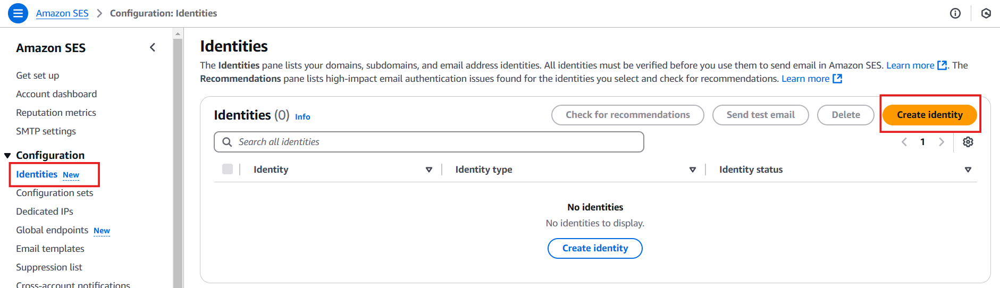

3. Select **Email Address** and enter a valid email.

    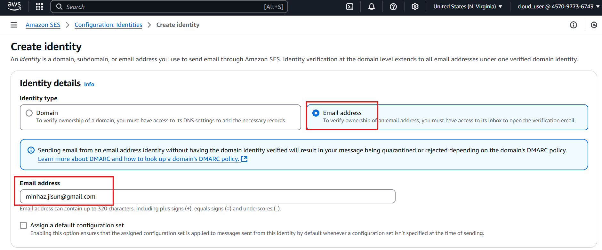

4. Click **Create Identity** and check your inbox for a verification email as it requires verification.

    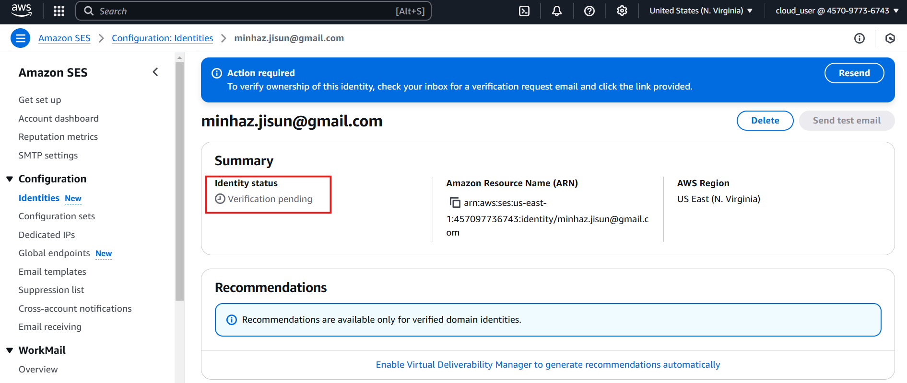

5. Click the verification link to validate your email.

    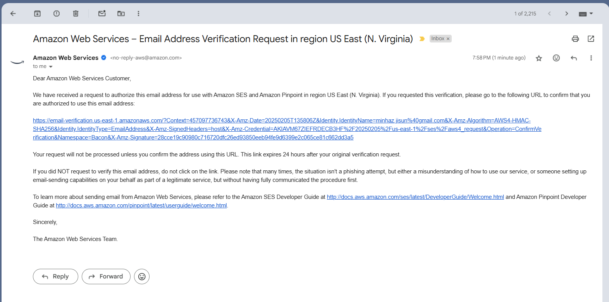

    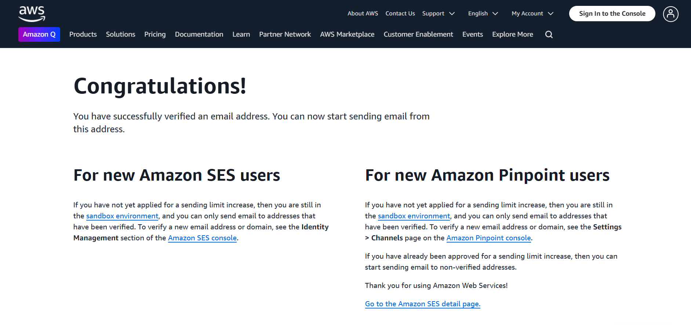

    You can see now that the identity is verified.

    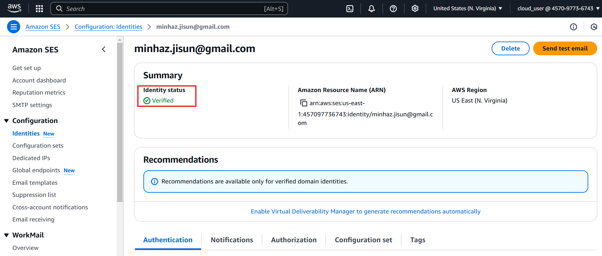

### Step 2: Create the Email Reminder Lambda Function

1. Navigate to **AWS Lambda**.
2. Click **Create function**.
3. Select **Author from scratch**.
4. Enter **Function name**: `email_reminder`.
5. Choose **Runtime**: Python 3.x.
6. Select **Execution Role**: `LambdaRuntimeRole`.
7. Click **Create function**.

    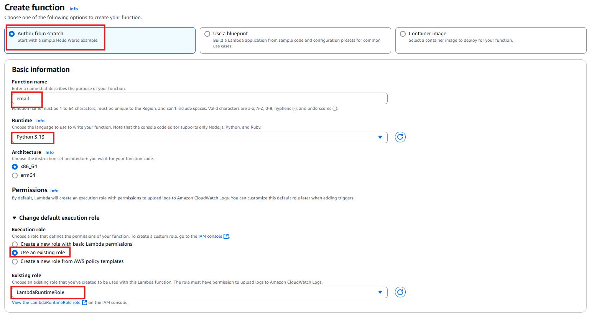

8. Copy and paste the following code into the function editor:
```python
import boto3

VERIFIED_EMAIL = 'YOUR_SES_VERIFIED_EMAIL'

ses = boto3.client('ses')

def lambda_handler(event, context):
    ses.send_email(
        Source=VERIFIED_EMAIL,
        Destination={
            'ToAddresses': [event['email']]  # Also a verified email
        },
        Message={
            'Subject': {'Data': 'A reminder from your reminder service!'},
            'Body': {'Text': {'Data': event['message']}}
        }
    )
    return 'Success!'
```
9. Set `VERIFIED_EMAIL` with your verified email address you used for SES.

    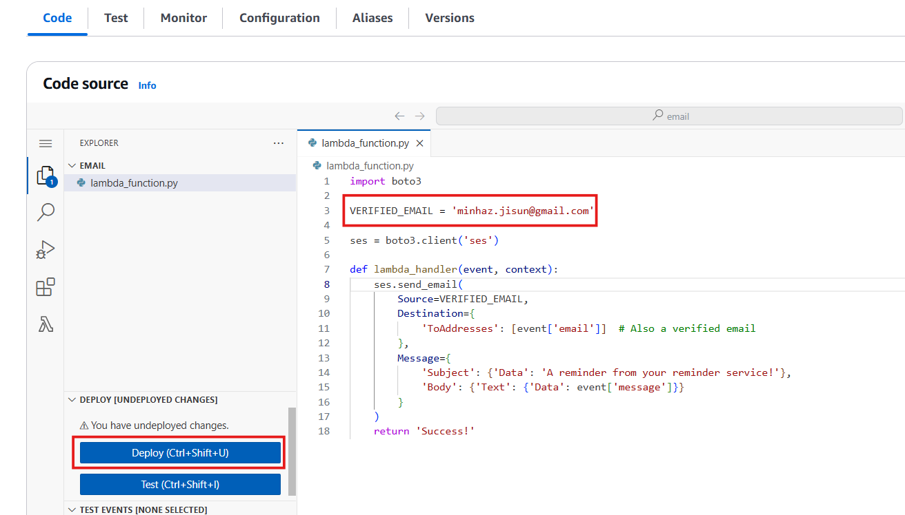

10. Click **Deploy**.    

### Step 3: Create the Step Function State Machine

1. Navigate to **AWS Step Functions**.
2. Click **Create state machine**.
3. Select **Create your own** workflow.

    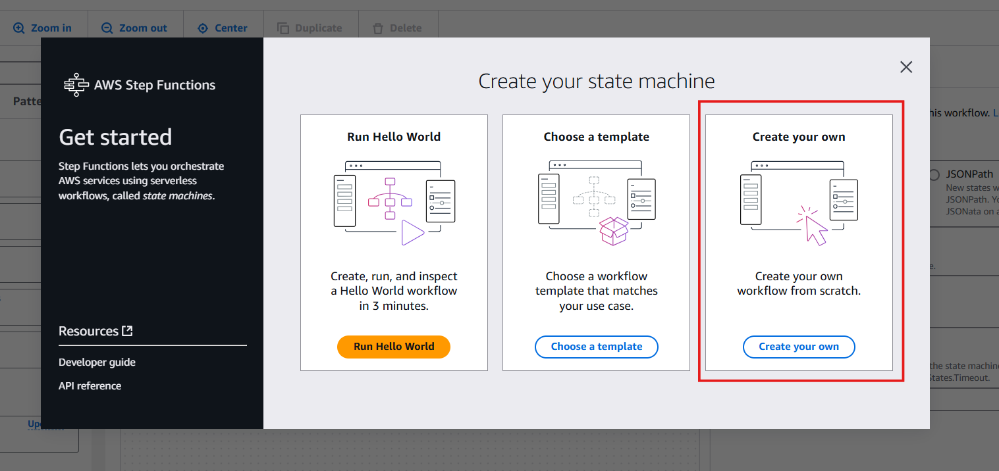

4. Choose **Code** and paste the following JSON:
```json
{
  "Comment": "An example of the Amazon States Language using a choice state.",
  "StartAt": "SendReminder",
  "States": {
    "SendReminder": {
      "Type": "Wait",
      "SecondsPath": "$.waitSeconds",
      "Next": "ChoiceState"
    },
    "ChoiceState": {
      "Type" : "Choice",
      "Choices": [
        {
          "Variable": "$.preference",
          "StringEquals": "email",
          "Next": "EmailReminder"
        }
      ],
      "Default": "DefaultState"
    },

    "EmailReminder": {
      "Type" : "Task",
      "Resource": "EMAIL_REMINDER_ARN",
      "Next": "NextState"
    },

    "DefaultState": {
      "Type": "Fail",
      "Error": "DefaultStateError",
      "Cause": "No Matches!"
    },

    "NextState": {
      "Type": "Pass",
      "End": true
    }
  }
}
```

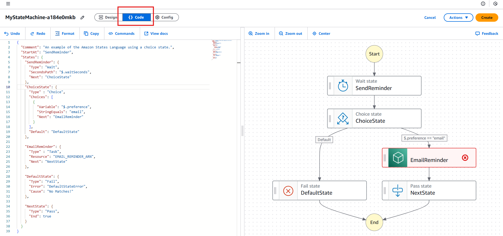

5. Replace `EMAIL_REMINDER_ARN` with your email reminder lambda function ARN.

    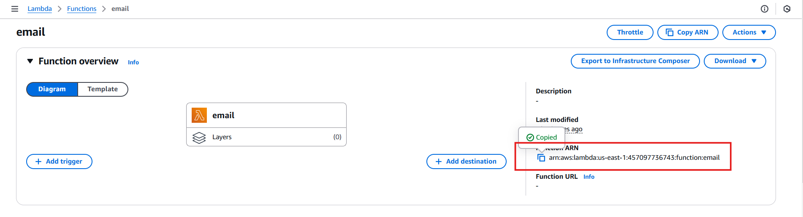

6. Goto **Config**, choose **RoleForStepFunction**, and **Create State Machine**.

    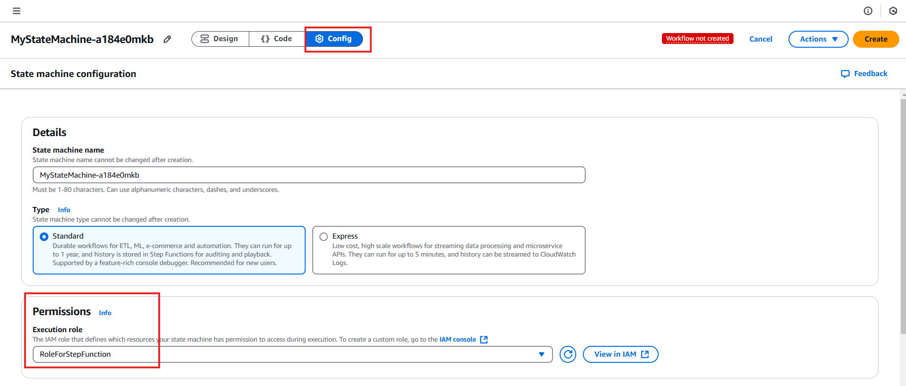


### Step 4: Configure the API Handler Lambda Function

1. Navigate to **AWS Lambda**.
2. Click **Create function**.
3. Enter **Function name**: `api_handler`.
4. Choose **Runtime**: Python 3.x.
5. Select **Execution Role**: `LambdaRuntimeRole`.

    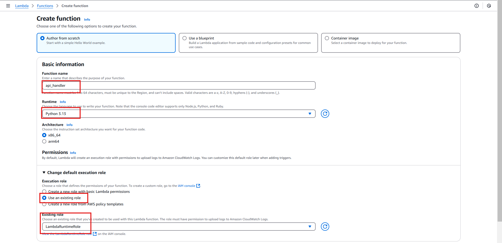

6. Click **Create function**.
7. Copy and paste the following code:
   ```python
    import boto3
    import json
    import os
    import decimal

    SFN_ARN = 'STEP_FUNCTION_ARN'

    sfn = boto3.client('stepfunctions')

    def lambda_handler(event, context):
        print('EVENT:')
        print(event)
        data = json.loads(event['body'])
        data['waitSeconds'] = int(data['waitSeconds'])
        
        # Validation Checks
        checks = []
        checks.append('waitSeconds' in data)
        checks.append(type(data['waitSeconds']) == int)
        checks.append('preference' in data)
        checks.append('message' in data)
        if data.get('preference') == 'email':
            checks.append('email' in data)

        # Check for any errors in validation checks
        if False in checks:
            response = {
                "statusCode": 400,
                "headers": {"Access-Control-Allow-Origin":"*"},
                "body": json.dumps(
                    {
                        "Status": "Success", 
                        "Reason": "Input failed validation"
                    },
                    cls=DecimalEncoder
                )
            }
        # If none, run the state machine and return a 200 code saying this is fine :)
        else: 
            sfn.start_execution(
                stateMachineArn=SFN_ARN,
                input=json.dumps(data, cls=DecimalEncoder)
            )
            response = {
                "statusCode": 200,
                "headers": {"Access-Control-Allow-Origin":"*"},
                "body": json.dumps(
                    {"Status": "Success"},
                    cls=DecimalEncoder
                )
            }
        return response

    # This is a workaround for: http://bugs.python.org/issue16535
    class DecimalEncoder(json.JSONEncoder):
        def default(self, obj):
            if isinstance(obj, decimal.Decimal):
                return int(obj)
            return super(DecimalEncoder, self).default(obj)
   ```
8. Replace `STEP_FUNCTION_ARN` with your step function ARN.

    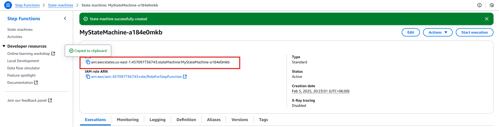

9. Click **Deploy**.

### Step 5: Create an API Gateway to Trigger Step Functions

1. Navigate to **API Gateway**.
2. Click **Create API** > **REST API**.
3. Enter **API Name**: `reminders`.

    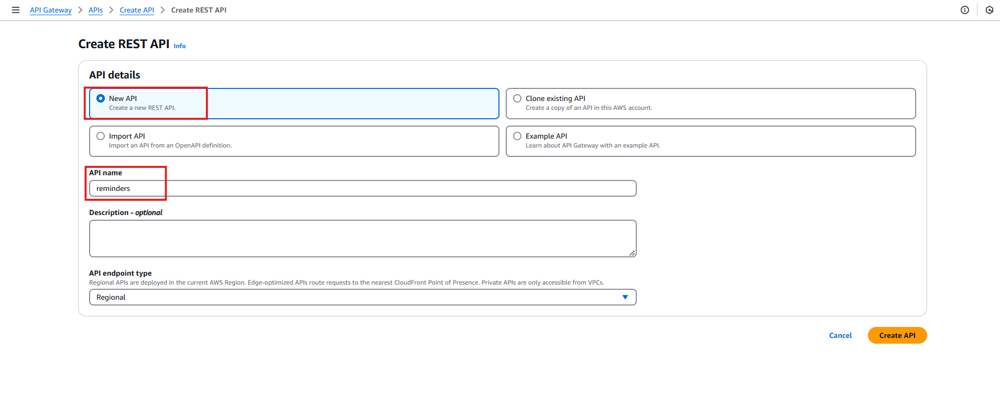

4. Click **Create Resource** and name it `reminders`.
5. Enable **CORS**.

    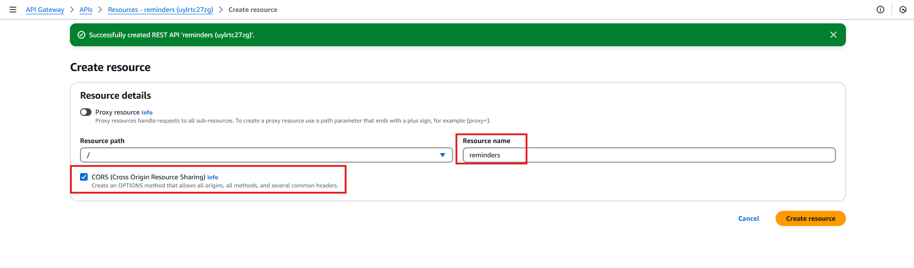

6. Create a **POST method** for the `reminders` resource.
7. Set **Integration type**: Lambda Function.
8. Enable **Lambda Proxy Integration**.
9. Select the **api_handler** function.

    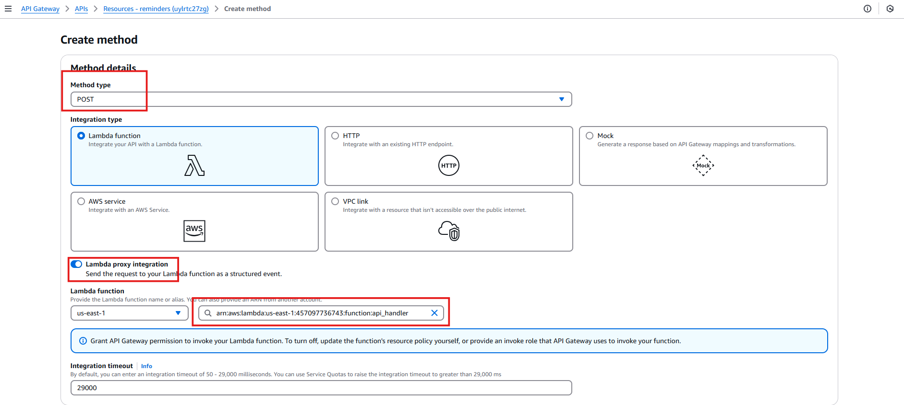

10. Deploy the API to a **new stage** called `prod`.

    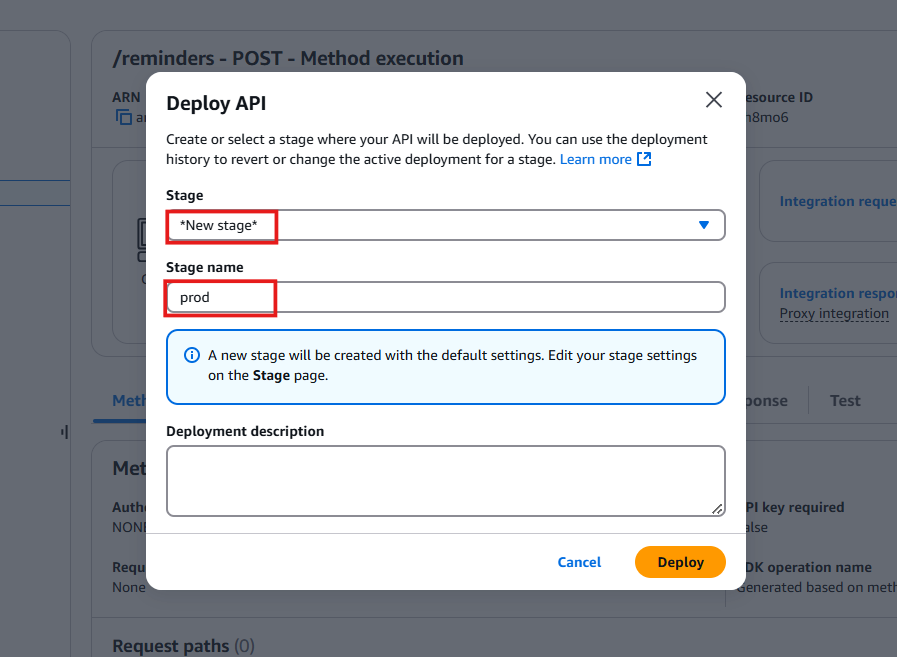

### Step 6: Create a Static Website in S3


Create a folder `static_website` in your in your local machine for static website codes:

Create `index.html`:

```html
<!DOCTYPE html>
<html lang="en">
  <head>
    <meta charset="utf-8">
    <meta name="viewport" content="width=device-width, initial-scale=1, shrink-to-fit=no">
    <meta name="description" content="">
    <meta name="author" content="">

    <title>FembotIT</title>

    <!-- Bootstrap core CSS -->
    <link rel="stylesheet" href="https://maxcdn.bootstrapcdn.com/bootstrap/4.0.0-alpha.6/css/bootstrap.min.css" integrity="sha384-rwoIResjU2yc3z8GV/NPeZWAv56rSmLldC3R/AZzGRnGxQQKnKkoFVhFQhNUwEyJ" crossorigin="anonymous">

    <!-- Custom styles for this template -->
    <link href="main.css" rel="stylesheet">

    <!-- JavaScript stuff for the sending of requests -->
    <script src="https://ajax.googleapis.com/ajax/libs/jquery/3.1.1/jquery.min.js"></script>
    <script src="https://cdnjs.cloudflare.com/ajax/libs/fetch/2.0.1/fetch.js"></script>

  </head>

  <body>

    <div class="container">
      <form class="form-signin">
        <center><h2 class="form-signin-heading">FembotIT Pet Reminders</h2></center>
        <center><h3 class="form-signin-heading">Remember all the things</h3></center>
        <div id='error-message'></div>
        <div id='success-message'></div>
        <label for="waitSeconds" class="sr-only"></label>
        <p>Required sections:</p>
        <input type="text" id="waitSeconds" class="form-control" placeholder="Seconds to wait... e.g. 10">
        <label for="message" class="sr-only">Message (Required)</label>
        <input type="text" id="message" class="form-control" placeholder="Message (Required)">
        <hr>
        <p>Email address required for email reminders:</p>
        <label for="email" class="sr-only">email</label>
        <input type="email" id="email" class="form-control" placeholder="someone@something.com">
        <hr>
        <h3>Reminder Type:</h3>
    
        <button id="emailButton" class="btn btn-md btn-primary btn-block" type="submit">email</button>
       

        <div id='results-message'></div>
      </form>

    </div> <!-- /container -->

    <script src="formlogic.js"></script>
    <script src="https://code.jquery.com/jquery-3.1.1.slim.min.js" integrity="sha384-A7FZj7v+d/sdmMqp/nOQwliLvUsJfDHW+k9Omg/a/EheAdgtzNs3hpfag6Ed950n" crossorigin="anonymous"></script>
    <script src="https://cdnjs.cloudflare.com/ajax/libs/tether/1.4.0/js/tether.min.js" integrity="sha384-DztdAPBWPRXSA/3eYEEUWrWCy7G5KFbe8fFjk5JAIxUYHKkDx6Qin1DkWx51bBrb" crossorigin="anonymous"></script>
    <script src="https://maxcdn.bootstrapcdn.com/bootstrap/4.0.0-alpha.6/js/bootstrap.min.js" integrity="sha384-vBWWzlZJ8ea9aCX4pEW3rVHjgjt7zpkNpZk+02D9phzyeVkE+jo0ieGizqPLForn" crossorigin="anonymous"></script>
  </body>
</html>
```

Create `main.css`:

```css
body {
  padding-top: 40px;
  padding-bottom: 40px;
  background-color: #eee;
}

hr {
  border-top: solid black;
}

div #error-message {
  color: red;
  font-size: 15px;
  font-weight: bold;
}

div #success-message, #results-message {
  color: green;
  font-size: 15px;
  font-weight: bold;
}

.form-signin {
  max-width: 530px;
  padding: 15px;
  margin: 0 auto;
}
.form-signin .form-signin-heading,
.form-signin .checkbox {
  margin-bottom: 10px;
}
.form-signin .checkbox {
  font-weight: normal;
}
.form-signin .form-control {
  position: relative;
  height: auto;
  -webkit-box-sizing: border-box;
          box-sizing: border-box;
  padding: 10px;
  font-size: 16px;
}
.form-signin .form-control:focus {
  z-index: 2;
}
.form-signin input[type="Artist"] {
  margin-bottom: -1px;
  border-bottom-right-radius: 0;
  border-bottom-left-radius: 0;
}
.form-signin input[type="bottom"] {
  margin-bottom: 10px;
  border-top-left-radius: 0;
  border-top-right-radius: 0;
}
```

Create `error.html`:

```html
<!doctype html>
<html>
<head>
</head>

<body>
<p>This page was not found. Sorry! Did you mean to go to the <a href="./index.html">home page</a>?</p>
</body>
</html>
```


Create  `formlogic.js`:

```js
// Replace the YOUR_API_ENDPOINT_URL with yours
// It should look something like this:
// https://example1a2s3d.execute-api.us-east-1.amazonaws.com/prod/reminders

var API_ENDPOINT = 'UPDATE_TO_YOUR_INVOKE_URL_ENDPOINT/reminders';

// Setup divs that will be used to display interactive messages
var errorDiv = document.getElementById('error-message')
var successDiv = document.getElementById('success-message')
var resultsDiv = document.getElementById('results-message')

// Setup easy way to reference values of the input boxes
function waitSecondsValue() { return document.getElementById('waitSeconds').value }
function messageValue() { return document.getElementById('message').value }
function emailValue() { return document.getElementById('email').value }


function clearNotifications() {
    // Clear any exisiting notifications in the browser notifications divs
    errorDiv.textContent = '';
    resultsDiv.textContent = '';
    successDiv.textContent = '';
}

document.getElementById('emailButton').addEventListener('click', function(e) {
    sendData(e, 'email');
});

function sendData (e, pref) {
    // Prevent the page reloading and clear exisiting notifications
    e.preventDefault()
    clearNotifications()
    // Prepare the appropriate HTTP request to the API with fetch
    // create uses the root /prometheon endpoint and requires a JSON payload
    fetch(API_ENDPOINT, {
        headers:{
            "Content-type": "application/json"
        },
        method: 'POST',
        body: JSON.stringify({
            waitSeconds: waitSecondsValue(),
            preference: pref,
            message: messageValue(),
            email: emailValue(),
            
        }),
        mode: 'cors'
    })
    .then((resp) => resp.json())
    .then(function(data) {
        console.log(data)
        successDiv.textContent = 'Looks ok. But check the result below!';
        resultsDiv.textContent = JSON.stringify(data);
    })
    .catch(function(err) {
        errorDiv.textContent = 'Yikes! There was an error:\n' + err.toString();
        console.log(err)
    });
};
```


Now follow the following steps:

1. Update `formlogic.js` in the static website folder to include the API Gateway URL. Update `UPDATE_TO_YOUR_INVOKE_URL_ENDPOINT` with your invoke URL endpoint.

    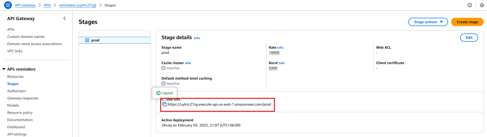

    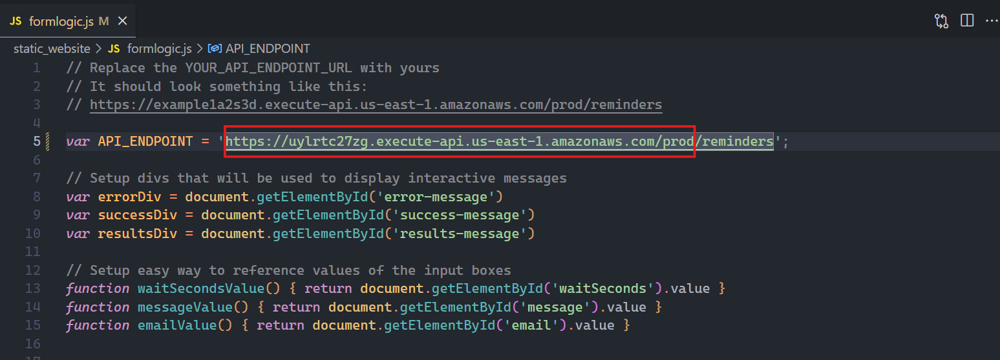

    Save the file.

2. Navigate to **S3** > **Create bucket**.
3. Enter a globally unique **Bucket Name**.
4. Enable **ACLs** and **Public Access**.

    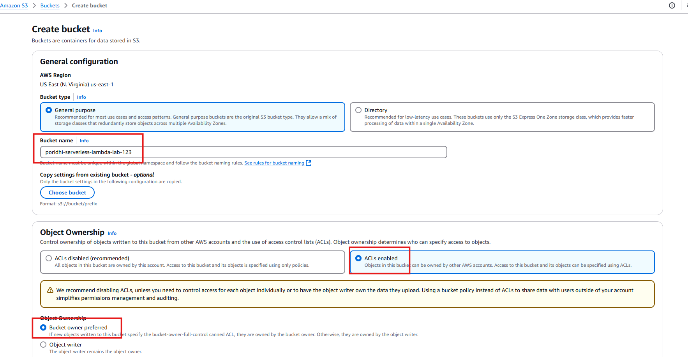

    Unblock public access:

    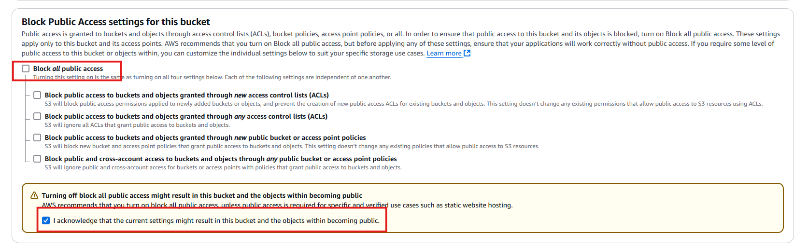

5. Goto the S3 bucket and upload website files (all files from `static_website` folder) then select them all and set **public-read access**.

    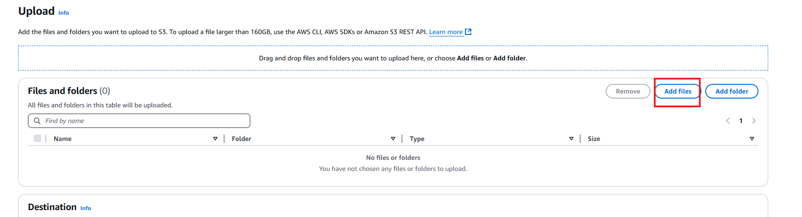

    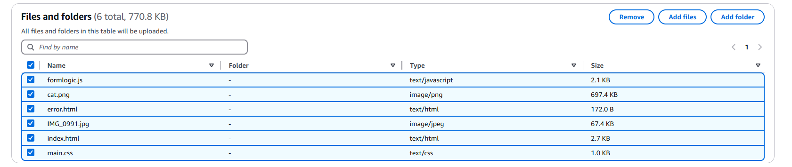

    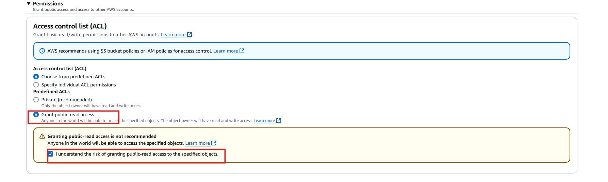


6. Goto **Properties**:

    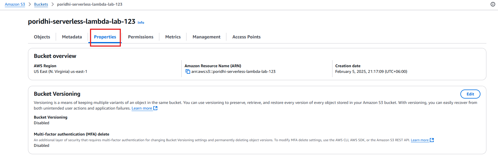

    Enable **Static website hosting**:

    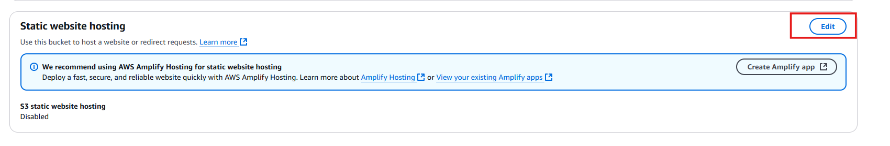


   - **Index document**: `index.html`
   - **Error document**: `error.html`

    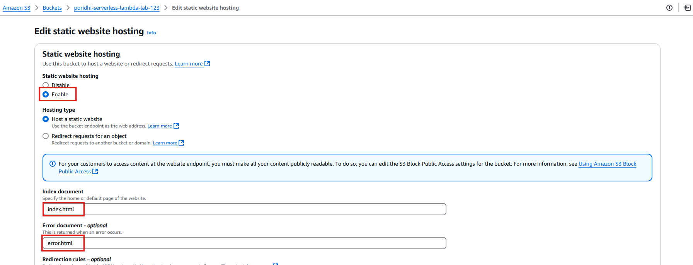

7. Copy the **S3 website URL** and test.

    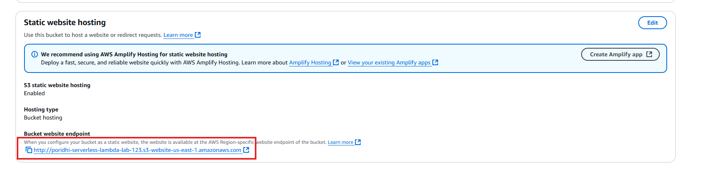

### Step 7: Test the Application

1. Open the static website.

    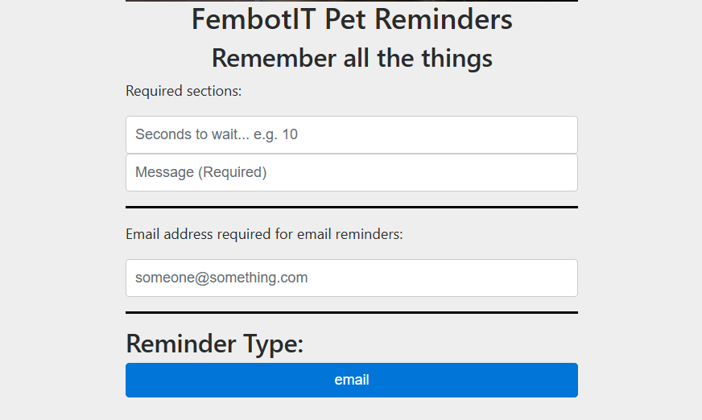

2. Fill in the form as follows and submit.

    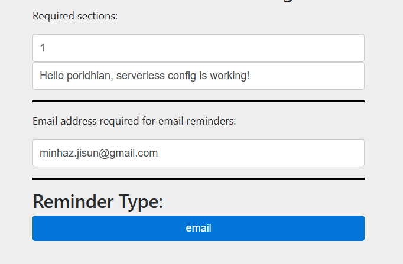

    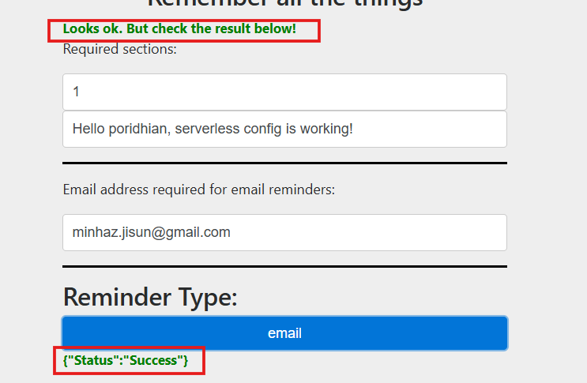

3. Monitor Step Functions execution.

    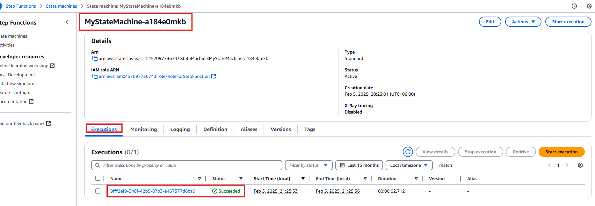

    Click the execution name:

    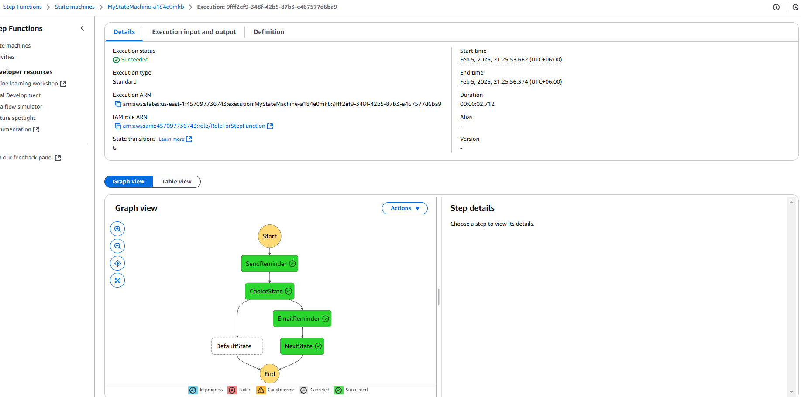

4. Check SES email delivery. It may be in spam folder.

    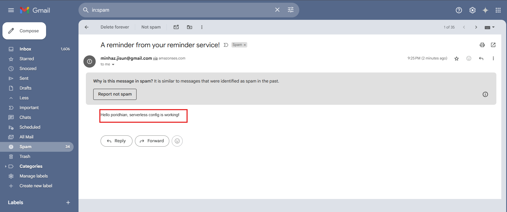


## Conclusion

We successfully built a **serverless application** using **Step Functions, API Gateway, Lambda, and S3**. This architecture supports scalable, event-driven workflows while reducing operational overhead. Future improvements can include logging, monitoring, and security enhancements using AWS services like CloudWatch and IAM.

