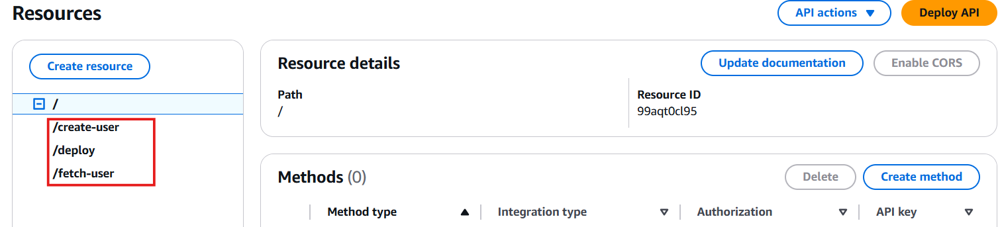
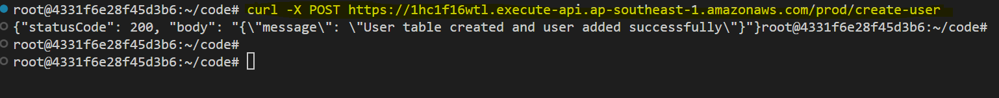

# **Automated EC2 Deployment & PostgreSQL Management with Lambda & API Gateway**

This guide explains how to deploy an EC2 instance with PostgreSQL using AWS Lambda and API Gateway, ensuring proper permissions and security settings. It also includes Lambda functions for creating and fetching users in the PostgreSQL database, along with steps to add a custom layer for `psycopg2`.

Automating EC2 instance deployment with PostgreSQL using AWS Lambda and API Gateway simplifies infrastructure management. This serverless approach enables dynamic provisioning, efficient database operations, and secure API access. It’s ideal for applications requiring on-demand database instances, scalable cloud environments, and automated infrastructure setups.


## **1. Setting Up the Network Environment**  

Before deploying the EC2 instance, you need to create a VPC with the necessary networking components for internet access and communication. Follow these steps:  

- **Create a VPC** with a CIDR block (e.g., `10.0.0.0/16`).  
- **Create a Public Subnet** within the VPC (e.g., `10.0.0.0/24`).  
- Go to subnet settings and **Enable Auto-Assign Public IP** for the subnet.  
- **Create an Internet Gateway (IGW)** and attach it to the VPC.  
- **Create a Route Table** within this VPC.
- Associate **Route Table** with the public subnet.  
- **Add a Route** in the route table to direct `0.0.0.0/0` traffic to the IGW.  

- Go to your VPC and see the resource map as follows: 

    


## 2. Set Up Required IAM Roles

### A. Create Lambda Execution Role
1. Create a custom policy to allow `iam:PassRole` for EC2 using the following JSON configuration:
    ```json
    {
        "Version": "2012-10-17",
        "Statement": [
            {
                "Effect": "Allow",
                "Action": "iam:PassRole",
                "Resource": "arn:aws:iam::<ACCOUNT_ID>:role/EC2SSMRole"
            }
        ]
    }
    ``` 
    Replace the `<ACCOUNT_ID>` with your AWS account Id.
    Save the policy naming it `EC2PassRolePolicy`. 


2. Go to IAM Console → Roles → Create Role
3. Select "AWS Service" and choose "Lambda"
4. Attach the following policies:
   - `AWSLambdaBasicExecutionRole`
   - `AmazonEC2FullAccess`
   - `AmazonSSMFullAccess`
   - **Custom policy**: `EC2PassRolePolicy`
5. Name the role `LambdaEC2DeploymentRole` and create it.

    

### B. Create EC2 Role
1. Go to IAM Console → Roles → Create Role
2. Select "AWS Service" and choose "EC2"
3. Attach the following policies:
   - `AmazonSSMManagedInstanceCore`
   - `AmazonEC2FullAccess`
4. Name it `EC2SSMRole` and create the role.

    


## 3. Create Security Group

1. Go to EC2 Console → Security Groups → Create Security Group.
2. Name it `PostgreSQL-EC2-SG`.
3. Add inbound rules:
   - **Type:** PostgreSQL (Port 5432) → **Source:** Anywhere-IPv4 (0.0.0.0/0)
   - **Type:** SSH (Port 22) → **Source:** Anywhere-IPv4 (0.0.0.0/0)

    

## 4. Create Key Pair

1. Go to EC2 Console → Key Pairs → Create Key Pair
2. Name it `postgres-ec2-key`
3. Choose RSA and `.pem` format.
4. Click **Create key pair**.
4. Then download the key.


## 5. Create Lambda Function for EC2 Deployment

1. Go to Lambda Console → Create Function
2. Choose "Author from scratch"
3. Enter details:
   - **Function name:** `EC2PostgreSQLDeployment`
   - **Runtime:** Python 3.9
   - **Architecture:** x86_64
   - **Permissions:** Use existing role → `LambdaEC2DeploymentRole`
4. Set timeout to **5 minutes** in Configuration → General Configuration

    

5. Replace the code in the Lambda function with:

```python
import json
import boto3
import time
from botocore.exceptions import ClientError, WaiterError

def lambda_handler(event, context):
    ec2 = boto3.client('ec2')

    instance_params = {
        'ImageId': 'ami-0672fd5b9210aa093',  # Ubuntu 22.04 LTS AMI (Change as per your region)
        'InstanceType': 't2.micro',
        'MinCount': 1,
        'MaxCount': 1,
        'SecurityGroupIds': ['sg-0bf3cab7329a1c1fe'],  # Replace with your security group ID
        'SubnetId': 'subnet-05c5672f1e80b5086',  # Replace with your subnet ID
        'KeyName': 'postgres-ec2-key',  # Replace with your key pair name
        'IamInstanceProfile': {'Name': 'EC2SSMRole'},  # Role for SSM access
        'UserData': '''#!/bin/bash
            # Update and install PostgreSQL
            apt update -y
            apt install -y postgresql postgresql-contrib

            # Start PostgreSQL service
            systemctl start postgresql
            systemctl enable postgresql

            # Set up PostgreSQL database and user
            sudo -u postgres psql -c "CREATE DATABASE myapp;"
            sudo -u postgres psql -c "CREATE USER myappuser WITH PASSWORD 'MyAppPassword123';"
            sudo -u postgres psql -c "GRANT ALL PRIVILEGES ON DATABASE myapp TO myappuser;"

            # Allow remote access (Optional)
            echo "host all all 0.0.0.0/0 md5" >> /etc/postgresql/14/main/pg_hba.conf
            sed -i "s/#listen_addresses = 'localhost'/listen_addresses = '*'/" /etc/postgresql/14/main/postgresql.conf
            systemctl restart postgresql
            ufw allow 5432
        '''.encode('utf-8')
    }

    try:
        response = ec2.run_instances(**instance_params)
        instance_id = response['Instances'][0]['InstanceId']

        # Wait for instance to be running
        try:
            waiter = ec2.get_waiter('instance_running')
            waiter.wait(InstanceIds=[instance_id], WaiterConfig={'Delay': 5, 'MaxAttempts': 10})

            # Get instance details
            instance_info = ec2.describe_instances(InstanceIds=[instance_id])
            public_ip = instance_info['Reservations'][0]['Instances'][0].get('PublicIpAddress', 'Not assigned yet')

            return {
                'statusCode': 200,
                'body': json.dumps({
                    'message': 'EC2 instance with PostgreSQL created successfully.',
                    'instance_id': instance_id,
                    'public_ip': public_ip,
                    'postgres_user': 'myappuser',
                    'postgres_database': 'myapp',
                    'status': 'INITIALIZING',
                    'next_steps': [
                        f'SSH into instance: ssh -i YOUR_KEY.pem ubuntu@{public_ip}',
                        'Check PostgreSQL status: systemctl status postgresql',
                        'Login to PostgreSQL: psql -h {public_ip} -U myappuser -d myapp'
                    ]
                })
            }
        
        except WaiterError:
            return {
                'statusCode': 200,
                'body': json.dumps({
                    'message': 'EC2 instance created but still initializing',
                    'instance_id': instance_id,
                    'status': 'INITIALIZING'
                })
            }
    
    except ClientError as e:
        return {
            'statusCode': 500,
            'body': json.dumps({'error': str(e)})
        }
```

Replace the `ImageId`, `SecurityGroupIds`, `SubnetId` in `instance_params` with valid values.

7. Click **Deploy**.

8. Test the lambda function
    - Go to **Test** tab
    - Create a test event **test** with empty event json:
        ```json
        {}
        ```
    - Click **Save** then click **Test**

    - You will see a EC2 creation was successful and PostgreSQL was setup successfully.

       


## 6. Create Lambda Functions for PostgreSQL Operations

### A. Create `create_user` Lambda Function
1. Go to Lambda Console → Create Function
2. Choose "Author from scratch"
3. Enter details:
   - **Function name:** `create_user`
   - **Runtime:** Python 3.9
   - **Architecture:** x86_64
   - **Permissions:** Use existing role → `LambdaEC2DeploymentRole`

4. Set timeout to **5 minutes** in Configuration → General Configuration   

    

5. Replace the code with:

```python
import psycopg2
import json

# PostgreSQL Configuration
DB_HOST = "your-ec2-public-ip"  # Replace with your EC2 public IP
DB_USER = "myappuser"
DB_PASSWORD = "MyAppPassword123"
DB_NAME = "myapp"

def lambda_handler(event, context):
    try:
        # Connect to PostgreSQL
        conn = psycopg2.connect(
            host=DB_HOST,
            user=DB_USER,
            password=DB_PASSWORD,
            database=DB_NAME,
            connect_timeout=5
        )
        cursor = conn.cursor()

        # Create Table
        create_table_sql = """CREATE TABLE IF NOT EXISTS users (
            id SERIAL PRIMARY KEY,
            name VARCHAR(255) NOT NULL,
            email VARCHAR(255) UNIQUE NOT NULL
        )"""
        cursor.execute(create_table_sql)

        # Insert User
        insert_user_sql = "INSERT INTO users (name, email) VALUES (%s, %s)"
        user_data = ("John Doe", "john.doe@example.com")
        cursor.execute(insert_user_sql, user_data)

        # Commit changes and close connection
        conn.commit()
        cursor.close()
        conn.close()

        return {
            'statusCode': 200,
            'body': json.dumps({'message': 'User table created and user added successfully'})
        }

    except Exception as e:
        return {'statusCode': 500, 'body': json.dumps({'error': str(e)})}
```

Replace the `DB_HOST` value with your EC2 instance public IP.

6. Click **Deploy**.

### B. Create `fetch_user` Lambda Function
1. Go to Lambda Console → Create Function
2. Choose "Author from scratch"
3. Enter details:
   - **Function name:** `fetch_user`
   - **Runtime:** Python 3.9
   - **Architecture:** x86_64
   - **Permissions:** Use existing role → `LambdaEC2DeploymentRole`

4. Set timeout to **5 minutes** in Configuration → General Configuration   

    

5. Replace the code with:

```python
import psycopg2
import json

# PostgreSQL Configuration
DB_HOST = "your-ec2-public-ip"  # Replace with your EC2 public IP
DB_USER = "myappuser"
DB_PASSWORD = "MyAppPassword123"
DB_NAME = "myapp"

def lambda_handler(event, context):
    try:
        # Connect to PostgreSQL
        conn = psycopg2.connect(
            host=DB_HOST,
            user=DB_USER,
            password=DB_PASSWORD,
            database=DB_NAME,
            connect_timeout=5
        )
        cursor = conn.cursor()

        # Fetch data
        cursor.execute("SELECT * FROM users")
        users = cursor.fetchall()

        # Close connection
        cursor.close()
        conn.close()

        return {
            'statusCode': 200,
            'body': json.dumps({'users': users})
        }

    except Exception as e:
        return {'statusCode': 500, 'body': json.dumps({'error': str(e)})}
```

Replace the `DB_HOST` value with your EC2 instance public IP.

6. Click **Deploy**.


## 7. Add a Custom Layer for `psycopg2`

### Steps to Create and Attach a Custom Layer

1. Intall `zip` in your local machine if not already installed. Install the python 3.9 version for this lab:

    ```bash
    sudo apt update
    sudo apt install zip
    sudo apt install python3.9 -y
    sudo apt install python3.9-distutils -y
    curl -sS https://bootstrap.pypa.io/get-pip.py | python3.9
    ```

    Check installation:

    ```bash
    python3.9 --version
    python3.9 -m pip --version
    ```

2. Install `psycopg2` locally:

   ```bash
   mkdir -p python/lib/python3.9/site-packages
   pip install psycopg2-binary -t python/lib/python3.9/site-packages
   zip -r psycopg2_layer.zip python
   ```

3. Upload the layer to AWS Lambda:

   - Go to AWS Lambda Console → Layers → Create Layer.
   - Name the layer `psycopg2_layer`.
   - Upload the `psycopg2_layer.zip` file.
   - Choose compatible runtimes (e.g., Python 3.9).

        

   - Click **Create**.


3. **Attach the Layer to Lambda Functions:**
   - Go to each Lambda function (`create_user` and `fetch_user`).
   - Scroll to the **Layers** section and click **Add a layer**.
   - Select **Custom layers** and choose `psycopg2_layer`.
   - Select available version.

        

   - Click **Add**.


## 8. Test `create_user` and `fetch_user` lambda functions

1. Test the `create_user` lambda function

    - Go to `create_user` lambda function
    - Go to **Test** tab
    - Create a test event **test** with empty event json:
        ```json
        {}
        ```
    - Click **Save** then click **Test**

    - You will see a user has been created successfully.

        


2. Test the `fetch_user` lambda function

    - Go to `fetch_user` lambda function
    - Go to **Test** tab
    - Create a test event **test** with empty event json:
        ```json
        {}
        ```
    - Click **Save** then click **Test**

    - You will see demo user fetched successfully.

        


## 9. Create API Gateway

1. Go to API Gateway Console → Create API → **REST API**.

2. Name it `My-REST-API`.

3. Create resources `/deploy`, `/create-user`, and `/fetch-user`.

    


4. Add methods:

   - **POST** for `/deploy` → Integration type: **Lambda Function** → Select `EC2PostgreSQLDeployment`

   - **POST** for `/create-user` → Integration type: **Lambda Function** → Select `create_user`

   - **GET** for `/fetch-user` → Integration type: **Lambda Function** → Select `fetch_user`

   

5. Deploy API → Create a new stage `prod`.


## 10. Testing API gateway

1. **Get the invoke URL**:

     You can get the invoke url from the **Stages** of your REST API. 

    


2. **Test PostgreSQL Deployment**:
    
    Use the `/deploy` endpoint to deploy PostgreSQL on EC2. Replace `<Invoke URL>` with the invoke url your API invoke URL.

   ```bash
   curl -X POST <Invoke URL>/deploy
   ```

   Expected output:

    


Before using the following command, change the EC2 IP address in `DB_HOST` variable in your `create_user` and `fetch_user` lambda functions and deploy again.

3. **Test creating user**:
  
   Use the `/create-user` endpoint to create a new user. Replace `<Invoke URL>` with the invoke url your API invoke URL.

   ```bash
   curl -X POST <Invoke URL>/create-user
   ```

   Expected output:

    

4. **Test fetching user**:

    Use the `/fetch-user` endpoint to fetch user. Replace `<Invoke URL>` with the invoke url your API invoke URL.

   ```bash
   curl -X GET <Invoke URL>/fetch-user
   ```

   Expected output:

    


## Conclusion  

In this guide, we successfully automated the deployment of an EC2 instance with PostgreSQL using AWS Lambda and API Gateway. We also implemented Lambda functions for database operations, ensuring secure and efficient user management. This approach streamlines infrastructure provisioning while maintaining flexibility and scalability for cloud-based applications.
 