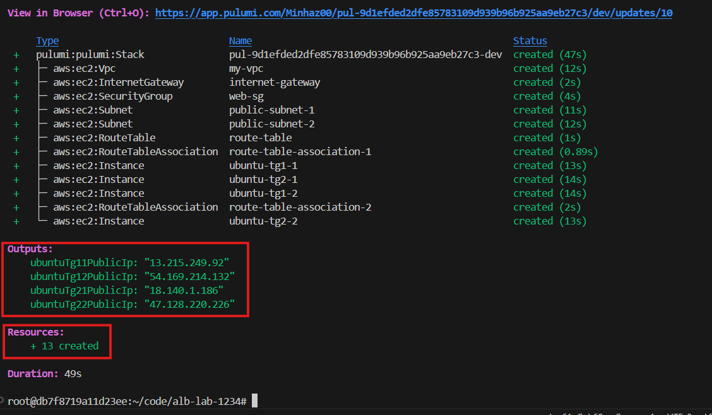
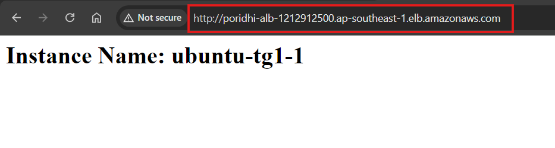
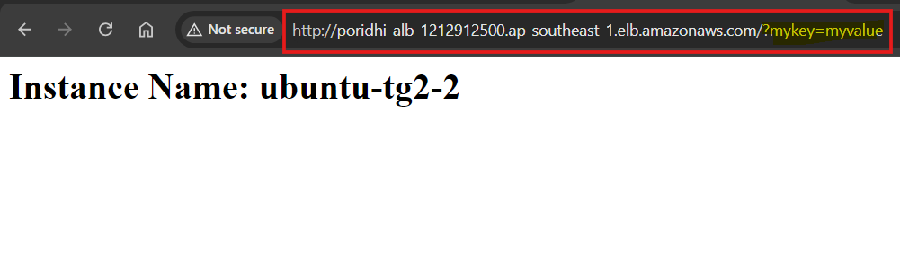
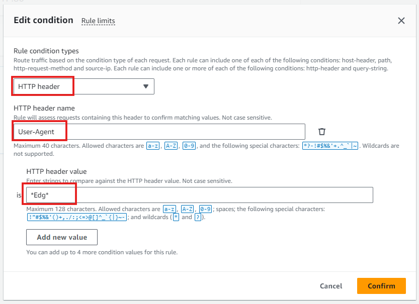

# Route Traffic using Load Balancer Listener Rules


In this lab, you will learn how to set up an Application Load Balancer (ALB) in AWS to route traffic to multiple target groups based on specific conditions using listener rules. This advanced load balancing scenario is essential when dealing with complex web applications where routing traffic needs to be done based on the request's content, such as the HTTP method, the path, or even custom headers.


Modern web applications often need to route requests based on various factors like request type, user agent, path, or even specific values in the query string. For instance, a GET request might fetch data, while a POST request might update it, and these operations could be handled by different servers or services. Routing traffic effectively not only improves performance but also ensures security and scalability.


## Task Overview

In this lab, you’ll create an Application Load Balancer (ALB) that routes HTTP traffic to multiple EC2 instances organized into different target groups. 


The traffic will be routed based on rules applied to the requests, such as:

- Specific values in query strings.
- Specific HTTP headers.
- The type of HTTP method (GET or POST).


This setup allows for granular control over how traffic is handled, enabling the application to scale effectively and handle different request types appropriately.


## Step 1: Configure AWS CLI

Open Command Prompt or PowerShell and run:
```sh
aws configure
```

Enter your AWS Access Key ID, Secret Access Key, region (`ap-southeast-1`), and default output format (`json`).

## Step 2: Set Up a Pulumi Project

### Set Up a Pulumi Project
Create a new directory for your project and navigate into it:
```sh
mkdir alb-listener-rules
cd alb-listener-rules
```

### Initialize a New Pulumi Project
Run the following command to create a new Pulumi project:
```sh
pulumi new aws-javascript
```
Follow the prompts to set up your project. Provide your pulumi token and setup your pulumi project name, description, region etc.

### Create a Key Pair
Run the following command to create a new key pair:
```sh
aws ec2 create-key-pair --key-name MyKeyPair --query 'KeyMaterial' --output text > MyKeyPair.pem
```

### Set File Permissions
```sh
chmod 400 MyKeyPair.pem
```

## Step 3: Create the Pulumi Program

We will use Pulumi.js to create the required infrastructure, including a VPC, public subnets, and EC2 instances.


### Define the Infrastructure


Next, we will define the infrastructure in the `index.ts` file.

1. **VPC**: Creates a Virtual Private Cloud (VPC) with a CIDR block of 10.0.0.0/16 to host the infrastructure.

2. **Public Subnets**: Sets up two public subnets in different availability zones (ap-southeast-1a and ap-southeast-1b) for high availability.

3. **Internet Gateway**: Establishes an Internet Gateway to allow traffic in and out of the VPC, enabling public internet access.

4. **Route Table**: Creates a route table and associates it with both public subnets, directing internet-bound traffic through the Internet Gateway.

5. **Security Group**: Defines a security group that allows all inbound and outbound traffic (0.0.0.0/0) for the EC2 instances.

6. **EC2 Instances**: Launches four EC2 instances (t2.small) running Ubuntu:
   - Two instances (`ubuntu-tg1-1`, `ubuntu-tg1-2`) in one target group
   - Two instances (`ubuntu-tg2-1`, `ubuntu-tg2-2`) in another target group
   - All instances are configured with Nginx and display a custom HTML page showing the `instance name`

This infrastructure is designed for high availability across two availability zones in the ap-southeast-1 region, with public IP addresses exported for each EC2 instance.

Here’s the code to set up the infrastructure:

```javascript
const pulumi = require("@pulumi/pulumi");
const aws = require("@pulumi/aws");

// Create a VPC
const vpc = new aws.ec2.Vpc("my-vpc", {
    cidrBlock: "10.0.0.0/16",
    enableDnsSupport: true,
    enableDnsHostnames: true,
    tags: { Name: "poridhi-vpc" },

});

// Create Public Subnet 1
const publicSubnet1 = new aws.ec2.Subnet("public-subnet-1", {
    vpcId: vpc.id,
    cidrBlock: "10.0.1.0/24",
    availabilityZone: "ap-southeast-1a",
    mapPublicIpOnLaunch: true,
    tags: { Name: "public-subnet-1" },
});

// Create Public Subnet 2
const publicSubnet2 = new aws.ec2.Subnet("public-subnet-2", {
    vpcId: vpc.id,
    cidrBlock: "10.0.2.0/24",
    availabilityZone: "ap-southeast-1b",
    mapPublicIpOnLaunch: true,
    tags: { Name: "public-subnet-2" },
});


// Create an Internet Gateway
const internetGateway = new aws.ec2.InternetGateway("internet-gateway", {
    vpcId: vpc.id,
    tags: { Name: "my-igw" },
});

// Create a route table and associate it with the public subnets
const routeTable = new aws.ec2.RouteTable("route-table", {
    vpcId: vpc.id,
    routes: [{
        cidrBlock: "0.0.0.0/0",
        gatewayId: internetGateway.id,
    }],
    tags: { Name: "my-rt" },
});

// Associate the route table with the first public subnet
new aws.ec2.RouteTableAssociation("route-table-association-1", {
    subnetId: publicSubnet1.id,
    routeTableId: routeTable.id,
});

// Associate the route table with the second public subnet
new aws.ec2.RouteTableAssociation("route-table-association-2", {
    subnetId: publicSubnet2.id,
    routeTableId: routeTable.id,
});

// Security Group for EC2 instances
const securityGroup = new aws.ec2.SecurityGroup("web-sg", {
    vpcId: vpc.id,
    ingress: [
        { protocol: "tcp", fromPort: 22, toPort: 22, cidrBlocks: ["0.0.0.0/0"] },  // SSH
        { protocol: "tcp", fromPort: 80, toPort: 80, cidrBlocks: ["0.0.0.0/0"] }   // HTTP
    ],
    egress: [
        { protocol: "-1", fromPort: 0, toPort: 0, cidrBlocks: ["0.0.0.0/0"] }
    ]
});

// Define the AMI ID for Amazon ubuntu
const amiId = "ami-01811d4912b4ccb26"; 

// Define the instance type
const instanceType = "t2.small";

const createUserData = (instanceName) => `#!/bin/bash
sudo apt update
sudo apt install -y nginx

# Hardcoded instance name
INSTANCE_NAME="${instanceName}"

# Create the HTML file
echo "<html>
<head><title>Instance Info</title></head>
<body>
<h1>Instance Name: $INSTANCE_NAME</h1>
</body>
</html>" > /var/www/html/index.html

sudo systemctl restart nginx
`;

// Launch EC2 instances
const ubuntuTg11 = new aws.ec2.Instance("ubuntu-tg1-1", {
    instanceType: instanceType,
    ami: amiId,
    subnetId: publicSubnet1.id, 
    keyName: "MyKeyPair",
    associatePublicIpAddress: true,
    vpcSecurityGroupIds: [securityGroup.id],
    userData: createUserData("ubuntu-tg1-1"),
    tags: {
        Name: "ubuntu-tg1-1",
    },
});

const ubuntuTg12 = new aws.ec2.Instance("ubuntu-tg1-2", {
    instanceType: instanceType,
    ami: amiId,
    subnetId: publicSubnet2.id, 
    keyName: "MyKeyPair",
    associatePublicIpAddress: true,
    vpcSecurityGroupIds: [securityGroup.id],
    userData: createUserData("ubuntu-tg1-2"),
    tags: {
        Name: "ubuntu-tg1-2",
    },
});

const ubuntuTg21 = new aws.ec2.Instance("ubuntu-tg2-1", {
    instanceType: instanceType,
    ami: amiId,
    subnetId: publicSubnet1.id,  
    keyName: "MyKeyPair",
    associatePublicIpAddress: true,
    vpcSecurityGroupIds: [securityGroup.id],
    userData: createUserData("ubuntu-tg2-1"),
    tags: {
        Name: "ubuntu-tg2-1",
    },
});

const ubuntuTg22 = new aws.ec2.Instance("ubuntu-tg2-2", {
    instanceType: instanceType,
    ami: amiId,
    subnetId: publicSubnet2.id, 
    keyName: "MyKeyPair",
    associatePublicIpAddress: true,
    vpcSecurityGroupIds: [securityGroup.id],
    userData: createUserData("ubuntu-tg2-2"),
    tags: {
        Name: "ubuntu-tg2-2",
    },
});

// Export the public IPs of the EC2 instances
module.exports = {
    ubuntuTg11PublicIp: ubuntuTg11.publicIp,
    ubuntuTg12PublicIp: ubuntuTg12.publicIp,
    ubuntuTg21PublicIp: ubuntuTg21.publicIp,
    ubuntuTg22PublicIp: ubuntuTg22.publicIp,
}
```

Setting up these EC2 instances as your backend servers allows the ALB to distribute traffic across them. By preparing different instances and categorizing them into target groups, you’ll later be able to route traffic based on specific conditions to the most suitable group of instances.


### Deploy the Infrastructure
Run the following command to deploy the infrastructure:

  ```bash
  pulumi up
  ```

Confirm the changes and wait for the resources to be provisioned.



After successful creation, we can see the EC2 instances from AWS console:


## Step 4: Verifying the EC2 Instances

Once the infrastructure is created, verify that both Nginx and Apache servers are running by accessing their public IPs in a web browser.

- **ubuntu-tg2-2**: `http://<ubuntu-tg2-2-public-ip>`

   

We can try for other instances as well.


## **Step 5: Creating Target Groups**

Target groups in AWS are collections of resources (in this case, EC2 instances) that a load balancer uses to route traffic. In this step, you will create two target groups, each containing two of the EC2 instances.


1. **Navigate to the Target Groups Section**:
   - In the **EC2 Dashboard**, scroll down on the left navigation pane and select **Target Groups**.
   - Click on the **Create target group** button.

2. **Create the First Target Group**:
   - **Choose** "Instances" as the target type.
   - **Name** the target group `tg1`.
   - **Set** the protocol to `HTTP` and the port to `80`.
   - **Select** the two instances you named `ubuntu-tg1-1` and `ubuntu-tg1-2`.
   - **Click** on **Create** to finalize.

3. **Repeat for the Second Target Group**:
   - **Name** the second target group `tg2`.
   - **Select** the two instances you named `ubuntu-tg2-1` and `ubuntu-tg2-2`.
   - **Follow** the same steps as for `tg1`.


## **Step 3: Creating the Application Load Balancer**


In this step, you will create an Application Load Balancer (ALB) that will distribute incoming HTTP requests to the EC2 instances in the target groups. The ALB will listen for incoming traffic on port 80.


1. **Navigate to Load Balancers**:
   - In the **EC2 Dashboard**, scroll down and select **Load Balancers** from the left-hand menu.
   - Click on **Create Load Balancer** and choose **Application Load Balancer**.

2. **Configure the Load Balancer**:
   - Name the load balancer `poridhi-alb`.
   - Set the scheme to **Internet-facing** and the IP address type to **IPv4**.
   - Select your VPC and at least two subnets in different Availability Zones (`ap-southeast-1a` and `ap-southeast-1b`).

3. **Set Security Groups**:
   - **Choose** an existing security group or create a new one that allows HTTP traffic on port 80. We created a new security group. 

   

4. **Set Up the Listener**:
   - **Configure** a listener for HTTP on port 80.
   - **Set the default action** to forward traffic to `tg1`.

5. **Review and Create**:
   - **Review** your settings and click **Create**.


6. **Test the ALB**:
   - **Open** a web browser and test the following URLs:
   - **Query String Rule**: `<Load Balancer DNS>` should route to `tg1`.

      

      Refreash to see another instance in tg1.

      


## **Step 4: Adding Listener Rules**

Listener rules determine how the load balancer handles incoming requests. These rules use conditions to match specific attributes of the requests (such as HTTP method, URL path, or query string) and then route the traffic to the appropriate target group based on those conditions.

### Understanding Condition Types

#### **1. Host Header**:
- **Purpose**: Routes traffic based on the hostname in the request.
- **Example**: Traffic from `example.com` could be routed to a different target group than traffic from `api.example.com`.

#### **2. Path Pattern**:
- **Purpose**: Routes traffic based on the URL path.
- **Example**: Requests to `/images/*` could be routed to a different target group optimized for handling image files, while `/videos/*` could go to another group.

#### **3. HTTP Header**:
- **Purpose**: Routes traffic based on specific headers, such as `User-Agent`.
- **Example**: Requests from browsers like Firefox or Chrome can be routed differently based on the `User-Agent` header.

#### **4. HTTP Request Method**:
- **Purpose**: Routes traffic based on the HTTP method, such as `GET` or `POST`.
- **Example**: GET requests might be handled by a group of servers optimized for fetching data, while POST requests are handled by servers dealing with data updates.

#### **5. Query String**:
- **Purpose**: Routes traffic based on key-value pairs in the URL's query string.
- **Example**: If a query string contains `?type=video`, the request can be routed to a target group that handles video processing.

#### **6. Source IP**:
- **Purpose**: Routes traffic based on the source IP address of the client.
- **Example**: Traffic from specific IP addresses could be directed to a restricted admin area or a separate service.

### 1. Create a new Rule


- In the **Load Balancers** section, select the load balancer you just created.
- Go to the **Listeners** tab and click on **View/edit rules** for the HTTP listener on port 80.

   

- **Name**: Name it `Rule1`.
- **Add a Rule**: Add a condition based on the query string.
- **Example Condition**: If the query string contains `?mykey=myvalue`, forward the traffic to `tg2`.

   

- **Action**: Set the action to forward traffic to `tg2`.

   


- Set priority `1` and save it. 

#### Test this Conditions
   - **Open** a web browser and test the following URLs:
   - **Query String Rule**: `<Load Balancer DNS>?mykey=myvalue` should route to `tg2`.

      


### 2. Create another Rule


   - **Name**: Name it `Rule2`.
   - **Add a Rule**: Add a condition based on the HTTP Header.
   - **Example Condition**: If you open from Microsoft edge browser it will forward to `tg2`.

      

   - Set priority and save it.

#### Test this Conditions
   - **Open** `Microsoft Edge` browser and test the following URLs:
   - **Query String Rule**: `<Load Balancer DNS>` should route to `tg2`.

         

      


### 3. Create another Rule (Practice)

   - **Add a Rule**: Add a condition based on the HTTP method.
   - **Example Condition**: If the HTTP method is `POST`, forward the traffic to `tg2`.
   - **Action**: Set the action to forward traffic to `tg2`.
   - **Review** your rules and save them.

#### Test this Conditions
   - **HTTP Method Rule**: Use a tool like **Postman** to send a POST request to `<Load Balancer DNS>`. The traffic should route to `tg2`.


Testing ensures that your listener rules are correctly set up and that the load balancer routes traffic as intended. It’s a crucial step to verify that the infrastructure you’ve built behaves as expected under different scenarios, ensuring that your application will perform correctly in a production environment.


## **Conclusion**

In this lab, you’ve successfully created an advanced load balancing setup using AWS’s Application Load Balancer. You’ve learned how to set up multiple EC2 instances, group them into target groups, create an ALB, and define listener rules to route traffic based on specific conditions. This setup allows for a highly flexible and scalable architecture, essential for modern web applications that require precise control over traffic distribution.