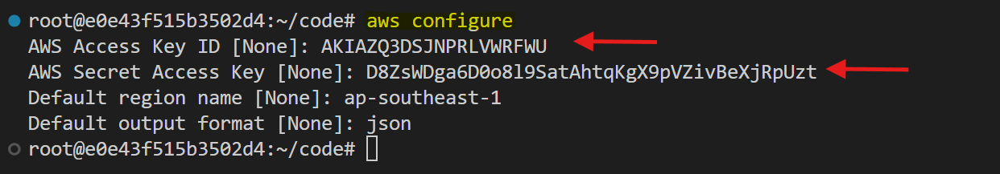
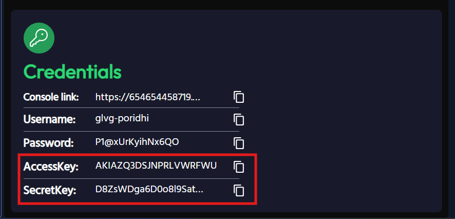
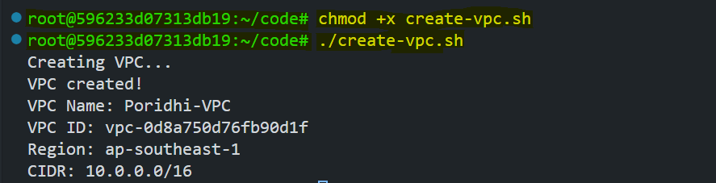
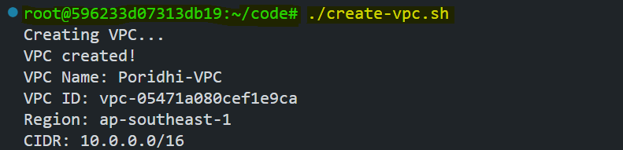
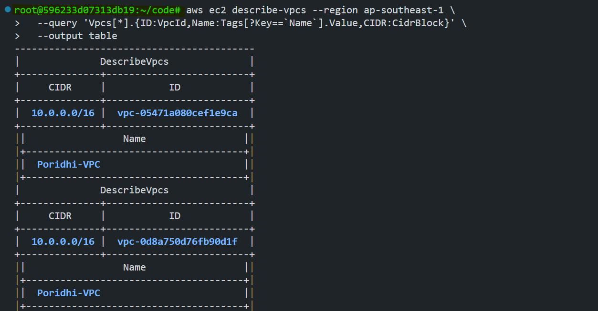
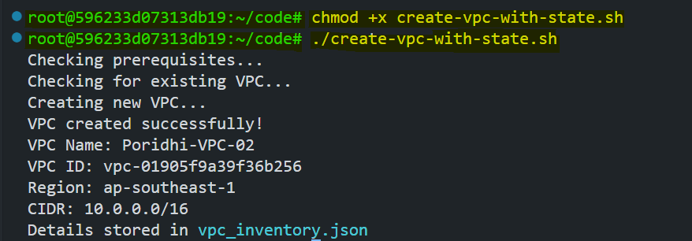
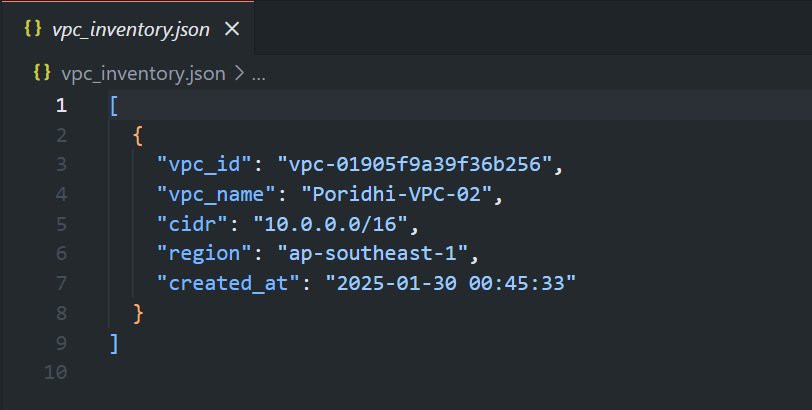
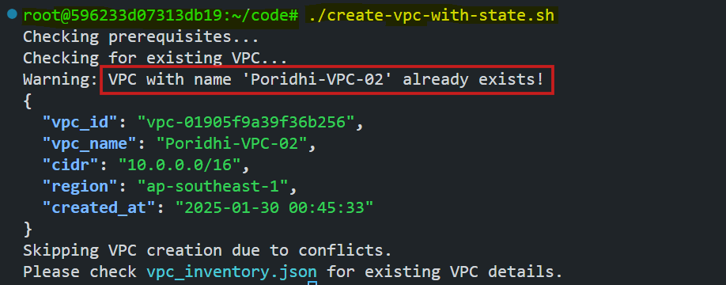

# AWS VPC Infrastructure Creation using Bash Script

This lab walks through creating and managing AWS Virtual Private Clouds (VPCs) using Bash scripts, implementing state management to prevent duplicate resources, and following AWS networking best practices.

## Prerequisites

### Required Tools
- AWS CLI installed and configured with appropriate credentials
- Bash shell environment
- jq (JSON processor)

### Installing jq
Run the following commands to install jq on Ubuntu/Debian:

```bash
# Update package list
sudo apt-get update

# Install jq
sudo apt-get install -y jq

# Verify installation
jq --version
```

### Why We Need `jq`?

`jq` is a lightweight and powerful command-line JSON processor.

We need `jq` because:

1. **JSON Parsing**: Efficiently reads and writes JSON data
   
2. **Data Manipulation**: Makes it easy to:
   - Filter data
   - Transform structures
   - Update values
   - Extract specific fields

3. **Command Line Usage**: Works well in shell scripts and command line

4. **Data Validation**: Ensures proper JSON formatting

5. **Query Features**: 
   - Supports complex queries
   - Pattern matching
   - Data transformation

Without `jq`, handling JSON in shell scripts would be complex and error-prone.

## AWS Configuration

First, we need to configure our AWS CLI with the following command:

```bash
aws configure
``` 

This command sets up your AWS CLI with the necessary credentials, region, and output format.



You will find the `AWS Access key` and `AWS Seceret Access key` on Lab description page,where you generated the credentials.



## VPC Creation using Bash Script

Create a new file named `create-vpc.sh` and add the following script:

```bash
#!/bin/bash

# Configuration
REGION="ap-southeast-1"
VPC_NAME="Poridhi-VPC"
VPC_CIDR="10.0.0.0/16"

# Create VPC
echo "Creating VPC..."
VPC_ID=$(aws ec2 create-vpc \
  --cidr-block $VPC_CIDR \
  --region $REGION \
  --query 'Vpc.VpcId' \
  --output text)

# Add name tag
aws ec2 create-tags \
  --resources $VPC_ID \
  --tags Key=Name,Value=$VPC_NAME \
  --region $REGION

echo "VPC created!"
echo "VPC Name: $VPC_NAME"
echo "VPC ID: $VPC_ID"
echo "Region: $REGION"
echo "CIDR: $VPC_CIDR"
```

This will create a VPC with the specified name and CIDR block in the specified region(`ap-southeast-1`).

### Running the Bash Script

Make the script executable by running the following command:

```bash
chmod +x create-vpc.sh
```

Run the script by executing the following command:

```bash
./create-vpc.sh
```



We can see that the VPC has been created successfully. Now, what will happen if we run the script again? Let's find out.

### Running the Script Again

Run the script again by executing the following command:

```bash
./create-vpc.sh
```



We can see that the VPC has been created successfully again with the same name and CIDR block. But this is not expected. We don't want to create VPCs with the same name and CIDR block because it can create following issues:

- It can cause problems if you ever want to peer these VPCs.
- It makes network planning and management more complicated.
- It could lead to IP conflicts if you ever need to merge or connect these networks.

### Testing Duplicate VPC Creation

We can check existing VPCs by running the following command:

```bash
aws ec2 describe-vpcs --region ap-southeast-1 \
  --query 'Vpcs[*].{ID:VpcId,Name:Tags[?Key==`Name`].Value,CIDR:CidrBlock}' \
  --output table
```



We can solve this issue by using state management. We will create a JSON file to store the VPC details and check if the VPC already exists in the JSON file before creating it.

## Enhanced Solution with State Management

Create a new file named `create-vpc-with-state.sh` and add the following script:

```bash
#!/bin/bash

# Configuration
REGION="ap-southeast-1"
VPC_NAME="Poridhi-VPC-02"
VPC_CIDR="10.0.0.0/16"
JSON_FILE="vpc_inventory.json"

# Function to check if jq is installed
check_jq() {
    if ! command -v jq &> /dev/null; then
        echo "Error: jq is not installed. Please install jq first."
        exit 1
    fi
}

# Function to create or update JSON file if it doesn't exist
init_json_file() {
    if [ ! -f "$JSON_FILE" ]; then
        echo "[]" > "$JSON_FILE"
    fi
}

# Function to check for existing VPC with same name or CIDR
check_existing_vpc() {
    local name_exists=$(jq -r --arg name "$VPC_NAME" --arg cidr "$VPC_CIDR" \
        'map(select(.vpc_name == $name)) | length' "$JSON_FILE")
    
    local cidr_exists=$(jq -r --arg name "$VPC_NAME" --arg cidr "$VPC_CIDR" \
        'map(select(.cidr == $cidr)) | length' "$JSON_FILE")

    if [ "$name_exists" -gt 0 ]; then
        echo "Warning: VPC with name '$VPC_NAME' already exists!"
        jq -r --arg name "$VPC_NAME" \
            'map(select(.vpc_name == $name)) | .[]' "$JSON_FILE"
        return 1
    fi

    if [ "$cidr_exists" -gt 0 ]; then
        echo "Warning: VPC with CIDR '$VPC_CIDR' already exists!"
        jq -r --arg cidr "$VPC_CIDR" \
            'map(select(.cidr == $cidr)) | .[]' "$JSON_FILE"
        return 1
    fi

    return 0
}

# Function to add VPC details to JSON file
add_vpc_to_json() {
    local vpc_id=$1
    local temp_file="temp_$JSON_FILE"
    
    jq --arg id "$vpc_id" \
       --arg name "$VPC_NAME" \
       --arg cidr "$VPC_CIDR" \
       --arg region "$REGION" \
       '. += [{
           "vpc_id": $id,
           "vpc_name": $name,
           "cidr": $cidr,
           "region": $region,
           "created_at": (now | strftime("%Y-%m-%d %H:%M:%S"))
       }]' "$JSON_FILE" > "$temp_file" && mv "$temp_file" "$JSON_FILE"
}

# Main script
echo "Checking prerequisites..."
check_jq
init_json_file

echo "Checking for existing VPC..."
if check_existing_vpc; then
    echo "Creating new VPC..."
    VPC_ID=$(aws ec2 create-vpc \
        --cidr-block $VPC_CIDR \
        --region $REGION \
        --query 'Vpc.VpcId' \
        --output text)

    # Add name tag
    aws ec2 create-tags \
        --resources $VPC_ID \
        --tags Key=Name,Value=$VPC_NAME \
        --region $REGION

    # Add to JSON inventory
    add_vpc_to_json $VPC_ID

    echo "VPC created successfully!"
    echo "VPC Name: $VPC_NAME"
    echo "VPC ID: $VPC_ID"
    echo "Region: $REGION"
    echo "CIDR: $VPC_CIDR"
    echo "Details stored in $JSON_FILE"
else
    echo "Skipping VPC creation due to conflicts."
    echo "Please check $JSON_FILE for existing VPC details."
fi
```

This Bash script automates the creation of an AWS VPC while ensuring that duplicate VPCs (by name or CIDR) are not created.  

### **Key Steps:**  
1. **Prerequisite Check:** Ensures `jq` (a JSON processor) is installed.  
2. **JSON Initialization:** Creates an inventory file (`vpc_inventory.json`) if it doesn’t exist.  
3. **VPC Existence Check:**  
   - Checks if a VPC with the same name or CIDR already exists in the JSON file.  
   - If a match is found, it prints details and stops execution.  
4. **VPC Creation:**  
   - If no conflict is found, it creates a new VPC in AWS using `aws ec2 create-vpc`.  
   - Tags the VPC with the provided name.  
5. **Inventory Update:** Stores the new VPC details (ID, name, CIDR, region, timestamp) in `vpc_inventory.json`.  
6. **Final Output:** Displays VPC details if successfully created, otherwise skips creation.  

This script ensures VPCs are managed efficiently without accidental duplicates.

### Running the Script

Make the script executable by running the following command:

```bash
chmod +x create-vpc-with-state.sh
```

Run the script by executing the following command:

```bash
./create-vpc-with-state.sh
```



We can see that the VPC has been created successfully and a JSON file named `vpc_inventory.json` has been created where we can see the VPC details. 



Now that we have a state file, we can use it to check if the VPC already exists in the JSON file before creating it.

### Running the Script Again

Run the script again by executing the following command:

```bash
./create-vpc-with-state.sh
```



We can see that the VPC has not been created and there is a warning message saying that the VPC with the same name already exists. In this manner, we can avoid creating duplicate VPCs.

## Verifying VPC Creation

We can verify the VPC creation by logging into the AWS Management Console and checking the VPCs.


We can see that duplicate VPCs are not created after we started to store the VPC details in the JSON file.

## Conclusion

This lab demonstrated the creation and management of AWS VPCs using bash scripts. We started with a basic VPC creation script, identified challenges with duplicate CIDR blocks, and implemented a solution using JSON-based state management. By utilizing `jq` for JSON processing, we created a robust system to track VPC creation and prevent duplicates. 

