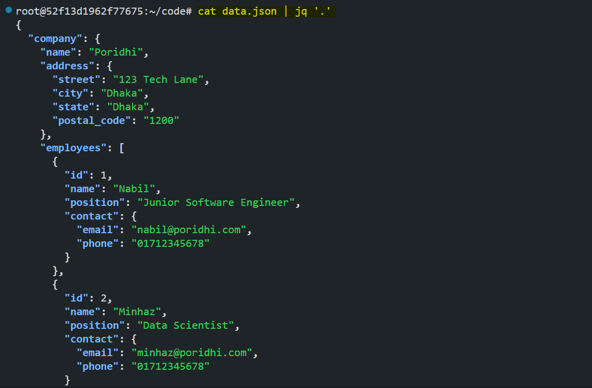
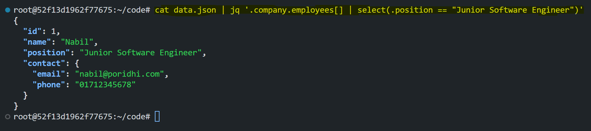

# Parsing and Manipulating JSON with jq

JSON (JavaScript Object Notation) is a lightweight and widely-used data format for exchanging structured information. It is commonly found in configuration files, API responses, and log files. To efficiently parse and manipulate JSON data from the command line, we use `jq`, a powerful command-line tool designed specifically for working with JSON.


## Task Overview

`jq` allows users to filter, extract, transform, and format JSON data with ease. This lab will guide you through installing `jq`, using essential commands, and applying practical examples to understand its capabilities.

By the end of this lab, you will be able to:
- Parse and extract specific data from JSON files
- Filter and transform JSON data using `jq`
- Format and prettify JSON output

## Why Use `jq`?

- Simplifies JSON processing on the command line.
- Works efficiently with large JSON files.
- Supports filtering, mapping, and transformation of JSON data.
- Useful for handling configuration files, logs, and API responses.

## Installing jq

Run the following commands to install `jq`:

```sh
sudo apt-get update
sudo apt-get install jq
```

## Using jq for JSON Parsing

For this lab, we'll use the following sample JSON file (`data.json`). So, let's create a file named `data.json` and add the following JSON data to it:

```json
{
  "company": {
    "name": "Poridhi",
    "address": {
      "street": "123 Tech Lane",
      "city": "Dhaka",
      "state": "Dhaka",
      "postal_code": "1200"
    },
    "employees": [
      {
        "id": 1,
        "name": "Nabil",
        "position": "Junior Software Engineer",
        "contact": {
          "email": "nabil@poridhi.com",
          "phone": "01712345678"
        }
      },
      {
        "id": 2,
        "name": "Minhaz",
        "position": "Data Scientist",
        "contact": {
          "email": "minhaz@poridhi.com",
          "phone": "01712345678"
        }
      }
    ]
  }
}
```

## Task 1: Extracting Specific Fields

#### Extracting the company name:

```sh
cat data.json | jq '.company.name'
```


The `.company.name` filter selects and returns the value of the `name` field inside the `company` object.

**Without `jq`**: You would need to manually search through the JSON file or use complex `grep` and `awk` commands, making it harder to extract structured data.

#### Extracting the city from the address:
```sh
cat data.json | jq '.company.address.city'
```


The `.company.address.city` filter drills down into the address object and extracts the city value.

## Task 2: Listing All Employee Names

```sh
cat data.json | jq '.company.employees[].name'
```


The `.company.employees[]` expands the employees array, and `.name` extracts the name field from each object in the array.

**Without `jq`**: Extracting this data would require writing a script in Python or another language to loop through the array.

## Task 3: Extracting Complete Employee Details

```sh
cat data.json | jq '.company.employees[]'
```


The `.company.employees[]` expands the employees array, returning each employee object in full detail.

## Task 4: Extracting Employee Contact Information

```sh
cat data.json | jq '.company.employees[].contact'
```


The `.company.employees[].contact` filter extracts only the contact object for each employee.

## Task 5: Formatting JSON Output

To pretty-print JSON:

```sh
cat data.json | jq '.'
```
This outputs the JSON data in a readable, formatted manner.



The `.` filter prints the entire JSON document, formatting it with proper indentation for readability.

**Without `jq`**: JSON would be displayed as a single unformatted line, making it difficult to read.

## Task 6: Filtering Data

#### Finding employees with a specific position (e.g., Junior Software Engineer):

```sh
cat data.json | jq '.company.employees[] | select(.position == "Junior Software Engineer")'
```



The `select(.position == "Junior Software Engineer")` filters the employees array to return only those whose position matches the specified string.

## Conclusion
This lab provided an introduction to `jq` and demonstrated its power in handling JSON data. You learned how to extract, filter, and format JSON data using various `jq` commands. By mastering `jq`, you can efficiently work with JSON in configuration management, log analysis, and API data processing.

