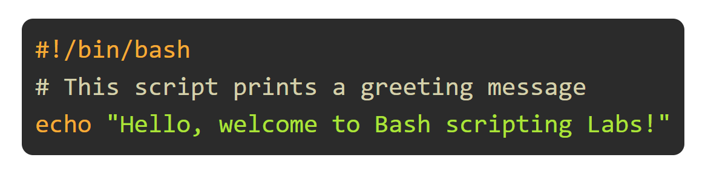
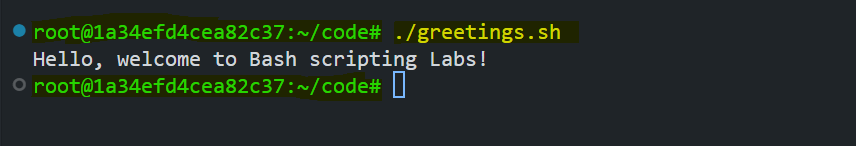
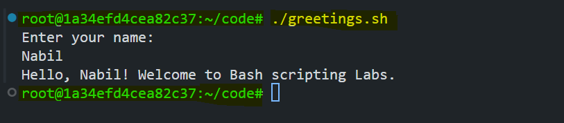

# Introduction to Bash Scripting

This lab introduces the basics of Bash scripting. You will learn how to create, execute, and understand a simple Bash script step by step.



## Prerequisites
- Basic familiarity with the Linux command line
- A Linux-based system (or WSL on Windows)

## Step 1: Creating Your First Bash Script

### Script Name: `greetings.sh`

A Bash script is a file containing a sequence of commands that are executed in order. Let’s create a simple script that prints a greeting message. But first, let's understand what is a shebang line.

### What is a Shebang Line?

The first line of a Bash script usually starts with `#!/bin/bash`. This is known as the shebang line. It tells the operating system which interpreter to use to execute the script. Without this line, the script may not run as expected unless explicitly invoked with `bash script_name.sh`.


### Instructions:

1. Create a new file named `greetings.sh`:

   ```bash
   vim greetings.sh
   ```
2. Add the following lines to the file:

   ```bash
   #!/bin/bash
   # This script prints a greeting message
   echo "Hello, welcome to Bash scripting Labs!"
   ```
   **Explanation:**
   - `#!/bin/bash` → Shebang line, tells the system to use Bash to interpret the script.
   - `echo` → Prints text to the terminal.

3. Save and exit (For `vim`, press `ESC`, then `:wq`).

## Step 2: Making the Script Executable

By default, newly created scripts are not executable. We need to grant execute permission.

```bash
chmod +x greetings.sh
```

This makes `greetings.sh` executable.

## Step 3: Running the Script

Now, you can execute your script.

```bash
./greetings.sh
```



## Step 4: Accepting User Input

Let’s modify our script to accept a user’s name and display a personalized message.

### Update `greetings.sh`:

```bash
#!/bin/bash
# This script takes user input and prints a personalized greeting

echo "Enter your name:"
read name
echo "Hello, $name! Welcome to Bash scripting Labs."
```

### Explanation:
- `read name` → Takes user input and stores it in the variable `name`.
- `$name` → Uses the stored value to personalize the message.

### Run the updated script:

```bash
./greetings.sh
```



## Conclusion

In this lab, we:
- Learned about shebang line
- Created and executed a basic Bash script
- Made the script interactive with user input

You are now familiar with the basics of Bash scripting! Keep experimenting and adding new functionalities.

