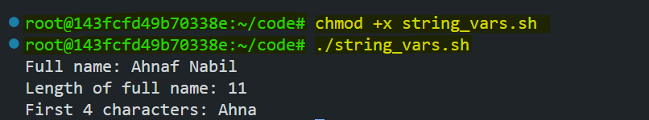
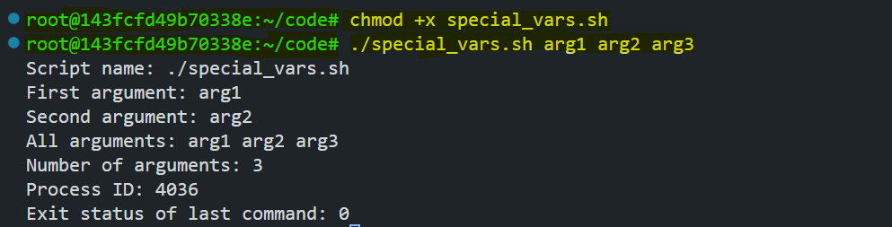
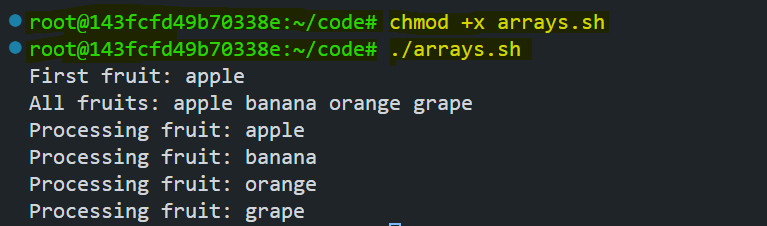

# Variables in Bash Scripting

Variables in Bash scripting play a crucial role in storing and managing data. They allow scripts to handle dynamic values, making automation more efficient. In this lab, we will explore different types of variables, their scope, and best practices for using them effectively in Bash scripts.

By the end of this lab, you will understand:
- User-defined variables
- System variables
- Special variables
- Array variables
- Readonly variables
- Variable scope and export

## Prerequisites

- Basic knowledge of Linux/Unix command line
- A Linux environment or terminal with Bash shell

## User-Defined Variables

User-defined variables are variables that you create to store and manipulate data in your script. They help manage dynamic content and make scripts more flexible.

### Declaring and Using Variables

Create a new script named `variables.sh` and add the following content:

```bash
#!/bin/bash

# Assigning values to variables
name="Nabil"
age=25
department="CSE"

# Printing variables
echo "Name: $name"
echo "Age: $age"
echo "Department: $department"
```

This script declares three variables: `name`, `age`, and `department`, and prints their values.

**Execute and run the script:**

```bash
chmod +x variables.sh
./variables.sh
```


### String Operations

Create a script named `string_vars.sh`:

```bash
#!/bin/bash

# String operations
first_name="Ahnaf"
last_name="Nabil"

# String concatenation
full_name="$first_name $last_name"
echo "Full name: $full_name"

# String length
name_length=${#full_name}
echo "Length of full name: $name_length"

# Substring extraction
echo "First 4 characters: ${full_name:0:4}"
```

This script declares two variables: `first_name` and `last_name`, and does string operations on them like concatenation and substring extraction.

**Execute and run the script:**

```bash
chmod +x string_vars.sh
./string_vars.sh
```



## System Variables

System variables are predefined variables in the Bash environment that provide information about the system and user.

Create a file named `system_vars.sh`:

```bash
#!/bin/bash

echo "Home directory: $HOME"
echo "Current user: $USER"
echo "Shell being used: $SHELL"
echo "Present working directory: $PWD"
echo "Path settings: $PATH"
```

This script prints system variables like home directory, current user, shell being used, present working directory, and path settings.

**Execute and run the script:**

```bash
chmod +x system_vars.sh
./system_vars.sh
```


## Special Variables

Special variables provide useful information about the script execution environment and command-line arguments.

Create a file named `special_vars.sh`:

```bash
#!/bin/bash

echo "Script name: $0"
echo "First argument: $1"
echo "Second argument: $2"
echo "All arguments: $@"
echo "Number of arguments: $#"
echo "Process ID: $$"
echo "Exit status of last command: $?"
```

### **Explanation**

1. **`$0`** → Displays the script name.  
   - Example output: `Script name: ./special_vars.sh`

2. **`$1`, `$2`** → Represent the first and second command-line arguments.  
   - If executed as `./special_vars.sh arg1 arg2 arg3`, the output would be:  
     ```
     First argument: arg1
     Second argument: arg2
     ```

3. **`$@`** → Displays all the arguments passed to the script.  
   - Output: `All arguments: arg1 arg2 arg3`

4. **`$#`** → Shows the total number of arguments passed.  
   - Output: `Number of arguments: 3`

5. **`$$`** → Prints the process ID (PID) of the script itself.  
   - Example output: `Process ID: 12345` (The actual PID will vary.)

6. **`$?`** → Displays the exit status of the last executed command.  
   - If the previous command was successful, it returns `0`; otherwise, it returns a non-zero error code.

**Execute and run the script:**

```bash
chmod +x special_vars.sh
./special_vars.sh arg1 arg2 arg3
```



## Array Variables

Arrays allow you to store multiple values in a single variable, making it easier to manage lists of data.

Create a file named `arrays.sh`:

```bash
#!/bin/bash

# Declaring arrays
declare -a fruits=("apple" "banana" "orange" "grape")

# Accessing array elements
echo "First fruit: ${fruits[0]}"
echo "All fruits: ${fruits[@]}"

# Iterating through array
for fruit in "${fruits[@]}"; do
    echo "Processing fruit: $fruit"
done
```

This script declares an array `fruits` and iterates through it, printing each fruit.

**Execute and run the script:**

```bash
chmod +x arrays.sh
./arrays.sh
```



## Readonly Variables
Readonly variables prevent modification after assignment, ensuring constant values remain unchanged.

Create a file named `readonly_vars.sh`:

```bash
#!/bin/bash

# Declare readonly variables
readonly MIN_AGE=18
readonly MAX_AGE=65
readonly COMPANY_NAME="Poridhi"

# Declare a readonly array
readonly VALID_DEPARTMENTS=("HR" "Engineering" "Marketing" "Finance")

# Function to validate age
validate_age() {
    local age=$1
    if [[ $age -lt $MIN_AGE || $age -gt $MAX_AGE ]]; then
        echo "Age $age is not within the allowed range ($MIN_AGE - $MAX_AGE)."
    else
        echo "Age $age is valid."
    fi
}

# Demonstrate readonly behavior
echo "Company: $COMPANY_NAME"
echo "Valid Departments: ${VALID_DEPARTMENTS[@]}"

# Test age validation
validate_age 20
validate_age 70

# Attempt to modify readonly variables (this will cause an error)
echo "Trying to modify readonly variables..."
MIN_AGE=16  # This should fail
VALID_DEPARTMENTS[0]="Sales"  # This should fail
```

### Explanation:

1. Declares three **readonly variables**: `MIN_AGE`, `MAX_AGE`, and `COMPANY_NAME`.
2. Defines a **readonly array** `VALID_DEPARTMENTS`.
3. Implements `validate_age()` to check if an age is within the allowed range.
4. Demonstrates attempting to modify readonly variables, which results in an error.

Try executing and running the script with:

```bash
chmod +x readonly_vars.sh
./readonly_vars.sh
```

You'll see an error when attempting to modify `MIN_AGE` or `VALID_DEPARTMENTS`, proving they are readonly.


## Variable Scope and Export

Variable scope determines where a variable can be accessed, affecting its availability across scripts.

Create two files:

`parent.sh`:
```bash
#!/bin/bash

# Local variable
local_var="I am local"

# Exported variable
export shared_var="I am shared"

# Call child script
./child.sh
```

This script declares two variables: `local_var` and `shared_var`, and exports `shared_var`. It then calls `child.sh`, which attempts to access these variables.

`child.sh`:
```bash
#!/bin/bash

echo "In child script"
echo "Trying to access local_var: $local_var"
echo "Accessing shared_var: $shared_var"
```

This script attempts to access `local_var` and `shared_var` from the parent script.

Now, Make both scripts executable using the `chmod` command:

```bash
chmod +x parent.sh
chmod +x child.sh
```

Execute and run the parent script:

```bash
./parent.sh
```

You'll see that `child.sh` can access `shared_var` but not `local_var`, demonstrating the scope of variables. `local_var` is not exported to child scripts. That's why `child.sh` can't access `local_var`.


## Conclusion

Variables are essential building blocks in Bash scripting, allowing for efficient data handling and automation. By mastering user-defined, system, special, array, and readonly variables, you can write more dynamic and reliable scripts. Additionally, understanding variable scope helps in managing data across different script executions.

