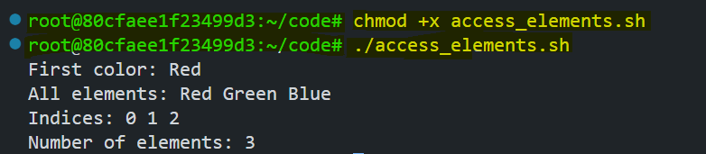

# Arrays in Bash Scripting

Arrays in Bash scripting allow you to store multiple values in a single variable, making it easier to manage lists and collections of data. In this lab, you'll learn how to declare, manipulate, and iterate over arrays for scripting.


By the end of this lab, you will get to know about:
- Declaring and initializing arrays
- Accessing array elements
- Modifying arrays (adding, removing, updating)
- Iterating through arrays
- Using associative arrays (Bash 4+)

## Prerequisites

- Basic knowledge of Linux/Unix command line
- A Linux environment or terminal with Bash shell

## Declaring and Initializing Arrays

Arrays can store multiple values under a single variable name. Here’s how to declare them:

### Example: Basic Array Declaration

Create a script `array_basics.sh`:

```bash
#!/bin/bash

# Declare an array of fruits
fruits=("Apple" "Banana" "Orange" "Grape")

# Print all elements
echo "All fruits: ${fruits[@]}"

# Declare an array with spaces/newlines
books=(
  "1984"
  "Brave New World"
  "Fahrenheit 451"
)
echo "Books: ${books[@]}"
```

This script declares an array of fruits and prints all elements. It also demonstrates how to declare an array with spaces/newlines.

**Execute and run the script:**

```bash
chmod +x array_basics.sh
./array_basics.sh
```


## Accessing Array Elements

Access elements using indices (starting at 0):

### Example: Indexing and Properties

Create `access_elements.sh`:

```bash
#!/bin/bash

colors=("Red" "Green" "Blue")

echo "First color: ${colors[0]}"        
echo "All elements: ${colors[@]}"       
echo "Indices: ${!colors[@]}"           
echo "Number of elements: ${#colors[@]}" 
```

**Key Syntax:**
- **`${array[index]}`** → Access element at `index`.
- **`${!array[@]}`** → List all indices.
- **`${#array[@]}`** → Count elements.

Execute and run the script:

```bash
chmod +x access_elements.sh
./access_elements.sh
```



## Modifying Arrays

Add, update, or remove elements dynamically:

### Example: Appending and Removing Elements

Create `modify_array.sh`:

```bash
#!/bin/bash

languages=("Bash" "Python")
echo "Original Languages: ${languages[@]}"

# Append elements
languages+=("JavaScript" "Java")
echo "After Appending: ${languages[@]}"

# Update an element
languages[2]="Ruby"
echo "After Updating: ${languages[@]}"

# Remove the third element (index 2)
unset languages[2]
echo "After Removing: ${languages[@]}"
```

This script appends elements to the array and updates an element. It also removes an element from the array.

**Note:** `unset` removes elements, which may create gaps (sparse arrays).

Execute and run the script:

```bash
chmod +x modify_array.sh
./modify_array.sh
```


## Iterating Over Arrays

Loop through arrays using `for` loops:

### Example: Iteration Methods

Create `iterate_array.sh`:

```bash
#!/bin/bash

teams=("Developers" "Designers" "QA" "DevOps")

# Loop with indices
for i in "${!teams[@]}"; do
  echo "Team $i: ${teams[$i]}"
done

# Loop through elements directly
for team in "${teams[@]}"; do
  echo "Processing $team..."
done
```

This script loops through the array using indices and directly through elements.

Execute and run the script:

```bash
chmod +x iterate_array.sh
./iterate_array.sh
```


## Associative Arrays (Bash 4+)

An `associative array` in Bash is a type of array that allows you to use `string keys` instead of just numeric indices. This means you can store and retrieve values using meaningful names rather than numbers. 


### **Syntax:**

```bash
declare -A my_array
```

- `declare` → Used to define a variable.
- `-A` → Tells Bash that my_array is an associative array.


### Example: Key-Value Storage

Create `associative_array.sh`:

```bash
#!/bin/bash

declare -A user_roles 
user_roles=(
  ["Nabil"]="admin"
  ["Minhaz"]="developer"
  ["Yasin"]="guest"
)

echo "Nabil's role: ${user_roles["Nabil"]}" 
echo "All users: ${!user_roles[@]}"          
echo "All roles: ${user_roles[@]}"           
```

This script declares an associative array and prints the value of `Nabil's role`. It also prints all users and all roles.

**Note:** Requires Bash version 4+. Check your version with `bash --version`.

Execute and run the script:

```bash
chmod +x associative_array.sh
./associative_array.sh
```


## Conclusion

Arrays are indispensable for managing collections of data in Bash scripts. Whether you're handling command-line arguments, processing files, or organizing key-value pairs, arrays provide the flexibility needed for advanced scripting. By completing this lab, you've gained a solid foundation in using arrays in Bash scripting.