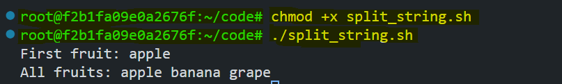

# String Operations in Bash Scripting

Working with strings is a crucial skill in Bash scripting, enabling you to handle text efficiently for automation, data processing, and system administration tasks. This guide walks you through essential string operations, from basic declaration to advanced manipulation techniques.


By the end of this lab, you'll be able to:
- Declare and print strings
- Concatenate and measure string length
- Extract substrings and perform replacements
- Trim whitespace and convert case
- Split strings into arrays
- Check for substrings and empty strings

## Prerequisites

- A basic understanding of Linux/Unix command line operations.
- Access to a Linux environment or a terminal with Bash shell.

## Basic String Declaration and Printing

Declaring and printing strings is the foundation of string operations in Bash. This script demonstrates how to define strings and print them effectively.

### Script: `string_basics.sh`

```bash
#!/bin/bash

# Declare strings
str1="Bash"
str2='Scripting'
str3="Hello, Poridhi!"

# Print strings
echo "$str1 $str2" 
echo '$str1 $str2'
echo "$str3"      
```

### Explanation

In Bash, double quotes (`" "`) and single quotes (`' '`) are both used for defining strings, but they handle variables differently:

- `Double Quotes (" ")`: Allow variable interpolation, meaning variables inside the quotes will be replaced with their values.
- `Single Quotes (' ')`: Treat everything literally, meaning variables inside will not be expanded.

### Running the Script

```bash
chmod +x string_basics.sh
./string_basics.sh
```


## String Concatenation

String concatenation joins multiple strings together, either from variables or literals.

### Script: `concatenate.sh`

```bash
#!/bin/bash

first="Poridhi"
second="Labs"

# Concatenate variables
combined="$first $second"
echo "$combined"
echo "Welcome to $first $second!"
```

### Explanation

- Strings can be concatenated directly using variable expansion (`$var`).
- Spaces must be explicitly included where needed.

### Running the Script

```bash
chmod +x concatenate.sh
./concatenate.sh
```


## String Length Calculation

To determine the length of a string, use the syntax `${#variable}`.

### Script: `string_length.sh`


```bash
#!/bin/bash

str="Poridhi"
echo "Length of '$str': ${#str}"
```

### Explanation
- `${#str}` returns the number of characters in the string.

### Running the Script

```bash
chmod +x string_length.sh
./string_length.sh
```


## Substring Extraction

Substring extraction retrieves a portion of a string using specific indices.

### Script: `substring.sh`

```bash
#!/bin/bash

str="Hello Poridhi"

# Extract from index 6 (length 7)
substr="${str:6:7}"
echo "Substring: $substr"
echo "First 5 chars: ${str:0:5}"
echo "Omitting length: ${str:6}"
```

### Explanation
- `${str:start:length}` extracts a substring from `start` index of specified `length`.
- Omitting `length` extracts everything from `start` to the end.

### Running the Script

```bash
chmod +x substring.sh
./substring.sh
```


## String Substitution

Replace occurrences of a substring within a string.

### Script: `substitution.sh`

```bash
#!/bin/bash

str="Bash is fun. Bash is powerful."

echo "${str/Bash/Shell}"  # Replace first occurrence
echo "${str//Bash/Shell}" # Replace all occurrences
echo "${str%. *}"  # Remove suffix
```

### Explanation

1. **`${str/Bash/Shell}`** → Replaces the **first** occurrence of `"Bash"` with `"Shell"`.  
   **Output:** `Shell is fun. Bash is powerful.`  

2. **`${str//Bash/Shell}`** → Replaces **all** occurrences of `"Bash"` with `"Shell"`.  
   **Output:** `Shell is fun. Shell is powerful.`  

3. **`${str%. *}`** → Removes everything after the **last period (`.`) and space**.  
   **Output:** `Bash is fun` (Removes `" Bash is powerful."`).  

### Running the Script

```bash
chmod +x substitution.sh
./substitution.sh
```


## Trimming Whitespace

Whitespace can be trimmed from strings using parameter expansion or `sed`.

### Script: `trimming.sh`


```bash
#!/bin/bash

str="   Trim this string   "

# Method 1: Parameter expansion
shopt -s extglob
trimmed="${str##*( )}"
trimmed="${trimmed%%*( )}"
echo "Trimmed: '$trimmed'"

# Method 2: Using sed
trimmed_sed=$(echo "$str" | sed -e 's/^[[:space:]]*//' -e 's/[[:space:]]*$//')
echo "Trimmed with sed: '$trimmed_sed'"
```

### Explanation

1. **Method 1: Parameter Expansion**
   - **`shopt -s extglob`** enables advanced pattern matching (extended globbing).

   - **`${str##*( )}`** removes leading spaces from the string.
   - **`${trimmed%%*( )}`** removes trailing spaces from the string.
   - **Output:** The trimmed string without leading and trailing spaces.

2. **Method 2: Using `sed`**
   - **`sed -e 's/^[[:space:]]*//'`** removes leading spaces.
   - **`sed -e 's/[[:space:]]*$//'`** removes trailing spaces.
   - **Output:** The string trimmed of spaces using `sed`.

Both methods remove spaces from the beginning and end of the string, but the second method uses an external tool (`sed`), while the first relies on built-in Bash functionality.

### Running the Script

```bash
chmod +x trimming.sh
./trimming.sh
```


## Case Conversion

Convert strings between uppercase and lowercase.

### Script: `case_conversion.sh`


```bash
#!/bin/bash

str="Bash Scripting"

echo "${str^^}"  # Uppercase
echo "${str,,}"  # Lowercase
echo "${str^}"   # Capitalize first letter
```

### Explanation
- `${var^^}` converts to uppercase.
- `${var,,}` converts to lowercase.
- `${var^}` capitalizes only the first character.

### Running the Script

```bash
chmod +x case_conversion.sh
./case_conversion.sh
```


## Splitting Strings into Arrays

Use `IFS` (Internal Field Separator) to split strings into arrays.

### Script: `split_string.sh`


```bash
#!/bin/bash

csv="apple,banana,grape"
IFS=',' read -ra fruits <<< "$csv"

echo "First fruit: ${fruits[0]}"
echo "All fruits: ${fruits[@]}"
```

When `IFS=','` is set, Bash treats the comma as a separator. When it finds a comma, it splits the string at that point and stores each part as a separate array element.

### Explanation
- `IFS=','` sets the delimiter to `,`.
- `read -ra` reads input into an array.

### Running the Script

```bash
chmod +x split_string.sh
./split_string.sh
```



## Checking Substrings and Empty Strings

Determine if a string contains a substring or is empty.

### Script: `substring_check.sh`


```bash
#!/bin/bash

str="Linux is awesome"

if [[ "$str" == *"is"* ]]; then
  echo "Substring found!"
fi

empty_str=""
if [[ -z "$empty_str" ]]; then
  echo "String is empty"
fi
```

### Explanation
- `[[ "$str" == *"pattern"* ]]` checks for substring presence.
- `[[ -z "$str" ]]` checks if the string is empty.

### Running the Script

```bash
chmod +x substring_check.sh
./substring_check.sh
```


## Conclusion

By mastering string operations in Bash, you can handle text, automate tasks, and simplify workflows more efficiently. In this lab, you learned key techniques like concatenation, substring extraction, replacement, trimming, case conversion, and splitting strings. These skills will help you write better scripts for tasks like processing logs and managing data. 