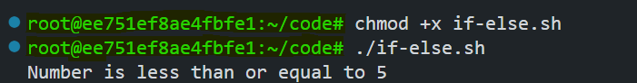
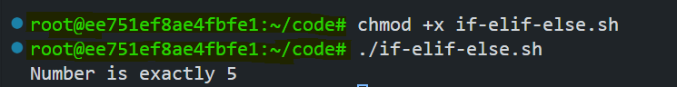
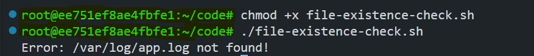
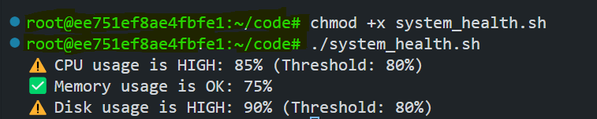

# Conditional Statements in Bash Scripting

Conditional statements are the backbone of decision-making in Bash scripts. They allow your scripts to execute different commands based on specific conditions, enabling dynamic and responsive automation. In this lab, you'll learn the syntax of conditional statements and apply them to a real-world scenario: a **system health monitoring script**.


By the end of this lab, you will understand:
- Syntax of `if`, `elif`, and `else` statements
- Numeric, string, and file comparisons
- Logical operators (`AND`, `OR`, `NOT`)
- Real-world use case: `System health monitoring`


## Prerequisites
- Basic knowledge of Linux/Unix command line
- A Linux environment or terminal with Bash shell

## Syntax of Conditional Statements

### Basic Structure

```bash
if [ condition ]; then
  # Commands if condition is true
elif [ another_condition ]; then
  # Commands if another_condition is true
else
  # Commands if all conditions are false
fi
```

#### Explanation

The `if-elif-else` structure in Bash allows decision-making in scripts:

1. **`if [ condition ]; then`** → Executes commands **if condition is true**.  
2. **`elif [ another_condition ]; then`** → Checks another condition **if the first one is false**.  
3. **`else`** → Executes commands **if none of the conditions are met**.  
4. **`fi`** → Marks the **end** of the conditional statement.  


### Comparison Operators
| **Type**       | **Operator** | **Description**                     |
|----------------|--------------|-------------------------------------|
| **Numeric**    | `-eq`        | Equal to                            |
|                | `-ne`        | Not equal to                        |
|                | `-lt`        | Less than                           |
|                | `-gt`        | Greater than                        |
|                | `-le`        | Less than or equal to               |
|                | `-ge`        | Greater than or equal to            |
| **String**     | `=`          | Equal                               |
|                | `!=`         | Not equal                           |
|                | `-z`         | String is empty                     |
| **File Tests** | `-f`         | File exists                         |
|                | `-d`         | Directory exists                    |
|                | `-r`         | File is readable                    |

### Logical Operators
- `&&` (AND): `if [ condition1 ] && [ condition2 ]; then`
- `||` (OR): `if [ condition1 ] || [ condition2 ]; then`
- `!` (NOT): `if ! [ condition ]; then`

## Examples of Conditional Statements

### 1. Simple If Statement

#### **Script: `Simple-if.sh`** 

```bash
num=10
if [ "$num" -gt 5 ]; then
  echo "Number is greater than 5"
fi
```

#### Run the script

```bash
chmod +x Simple-if.sh
./Simple-if.sh
```


### 2. If-Else Statement

#### **Script: `if-else.sh`** 

```bash
num=3
if [ "$num" -gt 5 ]; then
  echo "Number is greater than 5"
else
  echo "Number is less than or equal to 5"
fi
```

#### Run the script

```bash
chmod +x if-else.sh
./if-else.sh
```



### 3. If-Elif-Else Statement

#### **Script: `if-elif-else.sh`** 

```bash
num=5
if [ "$num" -gt 10 ]; then
  echo "Number is greater than 10"
elif [ "$num" -eq 5 ]; then
  echo "Number is exactly 5"
else
  echo "Number is less than 5"
fi
```

#### Run the script

```bash
chmod +x if-elif-else.sh
./if-elif-else.sh
```



### 4. Logical Operators Example

#### **Script: `logical-operators.sh`** 

Check if **both** CPU and memory usage are high:

```bash
cpu_usage=85
mem_usage=75
CPU_THRESHOLD=80
MEM_THRESHOLD=70


if [ "$cpu_usage" -gt "$CPU_THRESHOLD" ] && [ "$mem_usage" -gt "$MEM_THRESHOLD" ]; then
  echo "‼️  CRITICAL: Both CPU and memory are overloaded!"
fi
```

#### Run the script

```bash
chmod +x logical-operators.sh
./logical-operators.sh
```


### 5. File Existence Check

#### **Script: `file-existence-check.sh`** 

```bash
LOG_FILE="/var/log/app.log"
if [ -f "$LOG_FILE" ]; then
  echo "Processing $LOG_FILE..."
else
  echo "Error: $LOG_FILE not found!"
fi
```

#### Run the script

```bash
chmod +x file-existence-check.sh
./file-existence-check.sh
```



## Scenario: System Health Monitoring

### Problem Statement
You need to create a script that checks critical system resources (CPU, memory, and disk usage). If any resource exceeds a safe threshold, the script should alert the user.

### Solution Code
Create a file `system_health.sh`:
```bash
#!/bin/bash

# Thresholds
CPU_THRESHOLD=80    # 80% CPU usage
MEM_THRESHOLD=80    # 80% memory usage
DISK_THRESHOLD=80   # 80% disk usage

# Get current usage values
cpu_usage=85
mem_usage=75
disk_usage=90


# Check CPU usage
if [ "$cpu_usage" -gt "$CPU_THRESHOLD" ]; then
  echo "⚠️  CPU usage is HIGH: $cpu_usage% (Threshold: $CPU_THRESHOLD%)"
else
  echo "✅ CPU usage is OK: $cpu_usage%"
fi

# Check Memory usage
if [ "$mem_usage" -gt "$MEM_THRESHOLD" ]; then
  echo "⚠️  Memory usage is HIGH: $mem_usage% (Threshold: $MEM_THRESHOLD%)"
else
  echo "✅ Memory usage is OK: $mem_usage%"
fi

# Check Disk usage
if [ "$disk_usage" -gt "$DISK_THRESHOLD" ]; then
  echo "⚠️  Disk usage is HIGH: $disk_usage% (Threshold: $DISK_THRESHOLD%)"
else
  echo "✅ Disk usage is OK: $disk_usage%"
fi
```

### Explanation
1. **Thresholds**: Define safe limits for CPU, memory, and disk usage.
2. **Simulated Data**: For simplicity, hardcode usage values (`cpu_usage=85`, etc.). In a real script, you'd fetch these dynamically.
3. **Condition Checks**:
   - `if [ "$cpu_usage" -gt "$CPU_THRESHOLD" ]`: Checks if CPU usage exceeds the threshold using `-gt` (greater than).
   - Similar logic applies to memory and disk checks.

### Run the Script
```bash
chmod +x system_health.sh
./system_health.sh
```



## Conclusion

Conditional statements empower your scripts to make intelligent decisions, adapting to different scenarios dynamically. By mastering `if`/`else`, logical operators, and real-world use cases like system monitoring, you can build robust automation tools that respond effectively to changing conditions.