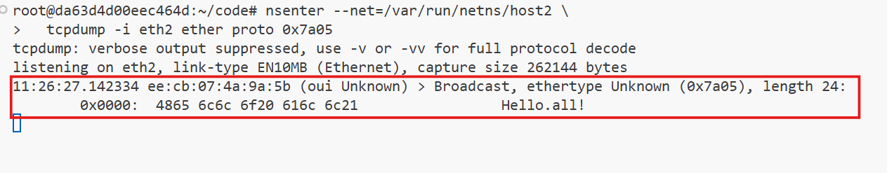
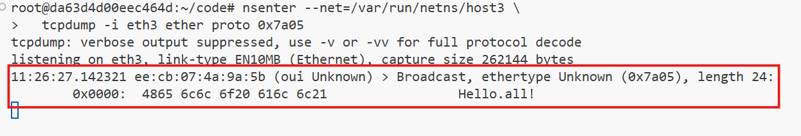
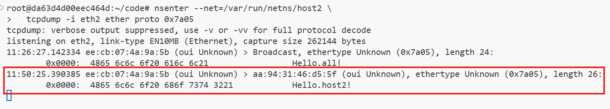
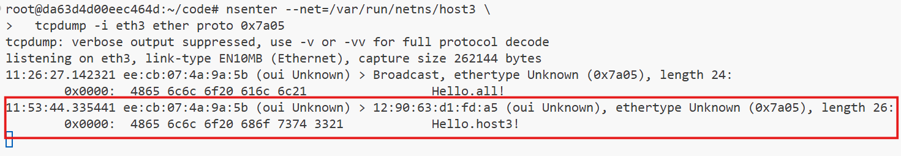

# **Ethernet Broadcast Domains**

In Ethernet, a Layer 2 (L2) segment is where all connected devices can communicate directly using their MAC addresses or by sending broadcast frames. These connected devices form what is known as a "broadcast domain." Within this domain, any broadcast traffic sent by one device is received by all others, enabling seamless communication among all devices in the network.

- **Single Broadcast Domain:** A single L2 segment is limited to one broadcast domain, meaning all devices connected to this segment are part of the same network scope and share broadcast traffic.

- **Multiple L2 Segments:** When we interconnect multiple L2 segments by using a bridge, we can form a unified and larger broadcast domain. This method allows us to extend the network, overcoming hardware constraints such as the limited number of ports on a single switch, while maintaining efficient communication between devices.

This lab will guide you through creating simple L2 network segments using Linux namespaces, virtual Ethernet (veth) pairs, and a virtual bridge. 


Here’s an organized prerequisite paragraph with complete instructions, code, and explanations for your document on the Ethernet broadcast domain:


## **Prerequisites**

To emulate and explore Ethernet broadcast domains, we will utilize Linux network virtualization tools, including network namespaces, virtual Ethernet (veth) devices, and Linux bridge devices. These tools allow us to create isolated network nodes, virtual interfaces, and switches to mimic real-world networking environments.

We will use the following helper scripts to streamline the setup process:  

1. **`create_bridge`**: This script creates a new network namespace containing a Linux bridge device, which acts as a virtual switch.  
2. **`create_end_host`**: This script creates an isolated network namespace for a host, connecting it to a specified bridge via a veth device.  
3. **`connect_bridges`**: This script connects two Linux bridges (potentially in different namespaces) using an auxiliary veth pair.  

These scripts simplify creating and managing the network infrastructure for our experiments. If you're using your Linux machine, copy the scripts below to your environment and execute them with `sudo`.


## **Helper Scripts**

Paste the following Bash functions into the terminal:

### **1. Create a Bridge Namespace**

```bash
create_bridge() {
  local nsname="$1"
  local ifname="$2"

  echo "Creating bridge ${nsname}/${ifname}"

  ip netns add ${nsname}
  ip netns exec ${nsname} ip link set lo up
  ip netns exec ${nsname} ip link add ${ifname} type bridge
  ip netns exec ${nsname} ip link set ${ifname} up
}
```

This script creates a namespace (`nsname`) and a bridge (`ifname`) to act as a virtual switch. 

#### Steps:

1. **Namespace creation:** Uses ip netns add to create a new network namespace (nsname).
2. **Loopback setup:** Enables the lo (loopback) interface for internal communication.
3. **Bridge creation:** Adds a virtual bridge device (ifname) of type bridge.
4. **Bridge activation:** Sets the bridge interface to the "up" state, making it functional.


### **2. Create an End Host Namespace**

```bash
create_end_host() {
  local host_nsname="$1"
  local peer1_ifname="$2"
  local peer2_ifname="$2b"
  local bridge_nsname="$3"
  local bridge_ifname="$4"

  echo "Creating end host ${host_nsname} connected to ${bridge_nsname}/${bridge_ifname} bridge"

  ip netns add ${host_nsname}
  ip netns exec ${host_nsname} ip link set lo up

  ip link add ${peer1_ifname} netns ${host_nsname} type veth peer \
              ${peer2_ifname} netns ${bridge_nsname}
  ip netns exec ${host_nsname} ip link set ${peer1_ifname} up
  ip netns exec ${bridge_nsname} ip link set ${peer2_ifname} up

  ip netns exec ${bridge_nsname} ip link set ${peer2_ifname} master ${bridge_ifname}
}
```

This script creates a namespace (`host_nsname`) for an end host and connects it to a bridge using a veth pair. 

#### Steps:

1. **Namespace creation:** Creates an end-host network namespace (host_nsname).
1. **Loopback setup:** Activates the loopback interface inside the namespace.
1. **veth pair creation:** Creates a veth pair connecting the namespace (peer1_ifname) and the bridge namespace (peer2_ifname).
1. **Interface activation:** Sets both veth interfaces to the "up" state.
1. **Bridge connection:** Attaches one end of the veth pair to the bridge device in the bridge namespace.

### **3. Connect Two Bridges**

```bash
connect_bridges() {
  local bridge1_nsname="$1"
  local bridge1_ifname="$2"
  local bridge2_nsname="$3"
  local bridge2_ifname="$4"
  local peer1_ifname="veth_${bridge2_ifname}"
  local peer2_ifname="veth_${bridge1_ifname}"

  echo "Connecting bridge ${bridge1_nsname}/${bridge1_ifname} to ${bridge2_nsname}/${bridge2_ifname} bridge using veth pair"

  ip link add ${peer1_ifname} netns ${bridge1_nsname} type veth peer \
              ${peer2_ifname} netns ${bridge2_nsname}
  ip netns exec ${bridge1_nsname} ip link set ${peer1_ifname} up
  ip netns exec ${bridge2_nsname} ip link set ${peer2_ifname} up

  ip netns exec ${bridge1_nsname} ip link set ${peer1_ifname} master ${bridge1_ifname}
  ip netns exec ${bridge2_nsname} ip link set ${peer2_ifname} master ${bridge2_ifname}
}
```

This script connects two bridges using a veth pair, enabling communication between them. 

#### Steps:

1. **veth pair creation:** Establishes a virtual link between two bridges using a veth pair.
1. **Interface activation:** Sets the veth interfaces to the "up" state in their respective namespaces.
1. **Bridge attachment:** Connects each veth interface to its respective bridge.


### **Sending Ethernet Frames**

The `ethsend` Python script demonstrates sending raw Ethernet frames. This script manually transmits Ethernet frames at the data link layer. Save the following code as `ethsend.py`:

```python
#!/usr/bin/env python3

import fcntl
import socket
import struct
import sys

def send_frame(ifname, dstmac, eth_type, payload):
    s = socket.socket(socket.AF_PACKET, socket.SOCK_RAW)
    s.bind((ifname, 0))

    info = fcntl.ioctl(s.fileno(),
                       0x8927,
                       struct.pack('256s', bytes(ifname, 'utf-8')[:15]))
    srcmac = ':'.join('%02x' % b for b in info[18:24])

    payload_bytes = payload.encode('utf-8')
    assert len(payload_bytes) <= 1500

    frame = human_mac_to_bytes(dstmac) + \
            human_mac_to_bytes(srcmac) + \
            eth_type + \
            payload_bytes

    return s.send(frame)

def human_mac_to_bytes(addr):
    return bytes.fromhex(addr.replace(':', ''))

def main():
    ifname = sys.argv[1]
    dstmac = sys.argv[2]
    payload = sys.argv[3]
    ethtype = b'\x7A\x05'
    send_frame(ifname, dstmac, ethtype, payload)

if __name__ == "__main__":
    main()
```

**Functions:**
- **`human_mac_to_bytes`:** Converts a human-readable MAC address into raw bytes.
- **`send_frame`:** Handles the entire process of creating and sending the Ethernet frame.
- **`main`:** Parses command-line arguments and sends a frame with the specified payload.


**Code Overview:**
1. **Socket Creation:**
   ```python
   s = socket.socket(socket.AF_PACKET, socket.SOCK_RAW)
   s.bind((ifname, 0))
   ```
   Creates a raw socket for Layer 2 communication (`SOCK_RAW`) bound to a specific network interface (`ifname`).

2. **Get Source MAC Address:**
   ```python
   info = fcntl.ioctl(s.fileno(), 0x8927, struct.pack('256s', bytes(ifname, 'utf-8')[:15]))
   srcmac = ':'.join('%02x' % b for b in info[18:24])
   ```
   Uses `ioctl` to retrieve the MAC address of the specified interface.

3. **Frame Construction:**
   ```python
   frame = human_mac_to_bytes(dstmac) + \
           human_mac_to_bytes(srcmac) + \
           eth_type + \
           payload_bytes
   ```
   Constructs an Ethernet frame:
     - Destination MAC (`dstmac`).
     - Source MAC (`srcmac`).
     - Ethernet type (`eth_type`).
     - Payload (`payload_bytes`).

4. **Send Frame:**
   ```python
   return s.send(frame)
   ```
   Transmits the constructed frame via the raw socket.


## Example Usage

1. Create a namespace (`nsname`) and a bridge (`ifname`) to act as a virtual switch.

    ```bash
    create_bridge <namespace_name> <bridge_name>
    ```

2. Create a namespace (`host_nsname`) for an end host and connects it to a bridge using a veth pair. Use the command:

    ```bash
    create_end_host <host_namespace> <veth_interface_host> <bridge_namespace> <bridge_name>
    ```

3. Connect two bridges using a veth pair, enabling communication between them. Use:

    ```bash
    connect_bridges <bridge1_namespace> <bridge1_name> <bridge2_namespace> <bridge2_name>
    ```


4. Send raw Ethernet frames by running the python script with:

    ```bash
    python3 ethsend.py <interface_name> <destination_mac> <payload_message>
    ```


This setup will prepare your environment for experimenting with Ethernet broadcast domains.


## **Scenario: Multiple Hosts, One Network Switch**


This lab demonstrates the simplest possible broadcast domain scenario where multiple network hosts are connected to a single virtual network switch (bridge). It provides an overview of how Ethernet broadcast frames propagate within a shared Layer 2 (L2) domain and how hosts can communicate directly using MAC addresses. This exercise uses Linux network namespaces to simulate the setup.


### Architecture Overview

We simulate a network topology consisting of:

1. A virtual bridge (`br1`) acting as the network switch.

2. Three hosts (`host1`, `host2`, and `host3`) connected to the bridge via virtual Ethernet interfaces.


### **1. Create a New Network Namespace for the Bridge**
This step creates the virtual switch (`br1`) within a new network namespace (`bridge1`).
```bash
create_bridge bridge1 br1
```

`create_bridge`: A helper command to create a network namespace (`bridge1`) and a bridge device (`br1`) inside it.


### **2. Create Three Hosts Connected to the Bridge**
Create three network namespaces representing hosts (`host1`, `host2`, and `host3`) and connect them to the bridge (`br1`) using virtual Ethernet interfaces.
```bash
create_end_host host1 eth1 bridge1 br1
create_end_host host2 eth2 bridge1 br1
create_end_host host3 eth3 bridge1 br1
```
`create_end_host`: A helper command to create a namespace for each host and attach their virtual Ethernet interfaces (`eth1`, `eth2`, `eth3`) to the bridge (`br1`).


### **3. Verification Commands for the Created Resources**

#### **List All Network Namespaces**
To check the network namespaces created:
```bash
ip netns list
```
This should display:
```
bridge1
host1
host2
host3
```

#### **Inspect the Bridge (`br1`)**
To view the bridge (`br1`) and its associated interfaces:
```bash
ip netns exec bridge1 brctl show
```
This will show the bridge and its attached virtual Ethernet interfaces (`eth1`, `eth2`, `eth3`).

#### **Check Virtual Ethernet Interfaces**
To view the virtual Ethernet interfaces associated with each namespace:
```bash
ip netns exec host1 ip link
ip netns exec host2 ip link
ip netns exec host3 ip link
```
Each command should list the interfaces, such as `eth1` for `host1`, `eth2` for `host2`, and `eth3` for `host3`.


### **4. Ensure `tcpdump` is Installed**

`tcpdump` is a powerful command-line packet analyzer. It allows you to capture and display packets being transmitted or received over a network interface (e.g., eth1, eth2).

Before moving on to the next steps check if tcpdump is installed on the host system:

```bash
sudo apt update
sudo apt-get install tcpdump -y
```


### **5. Monitor Traffic on Host2**


Open a terminal to monitor traffic on `host2`'s `eth2` interface:
```bash
nsenter --net=/var/run/netns/host2 \
  tcpdump -i eth2 ether proto 0x7a05
```

  - `nsenter`: Executes commands inside the network namespace (`host2`).
  - `tcpdump`: Captures packets on the `eth2` interface filtering for Ethernet protocol `0x7a05`.


### **6. Monitor Traffic on Host3**


Open another terminal to monitor traffic on `host3`'s `eth3` interface:
```bash
nsenter --net=/var/run/netns/host3 \
  tcpdump -i eth3 ether proto 0x7a05
```


### **7. Send a Broadcast Frame from Host1**


Open a new terminal and use a broadcast MAC address (`FF:FF:FF:FF:FF:FF`) to send a frame from `host1` to all hosts in the same broadcast domain:
```bash
nsenter --net=/var/run/netns/host1 \
  python3 ethsend.py eth1 ff:ff:ff:ff:ff:ff 'Hello all!'
```

  - `ethsend.py`: Sends an Ethernet frame from `eth1` with the specified MAC address and payload.
  - `ff:ff:ff:ff:ff:ff`: Broadcast MAC address for all devices in the same Layer 2 network.


### **8. Verify Broadcast on Host2 and Host3**
Check the `tcpdump` output in the `host2` and `host3` terminals to confirm the broadcast message (`Hello all!`) is received.






### **9. Send Unicast Frames**


To demonstrate direct communication between hosts, send Ethernet frames from `host1` to `host2` and `host3` individually:

#### host1 to host2:

1. Retrieve the MAC address of `host2`'s `eth2` interface:
   ```bash
   ETH2_MAC=$(ip netns exec host2 ip link show eth2 | grep ether | awk '{print $2}')
   ```

2. Send a frame to `host2`:
   ```bash
   nsenter --net=/var/run/netns/host1 \
     python3 ethsend.py eth1 ${ETH2_MAC} "Hello host2!"
   ```

3. Verify on Host2:

    

#### host1 to host3:

1. Retrieve the MAC address of `host3`'s `eth3` interface:
   ```bash
   ETH3_MAC=$(ip netns exec host3 ip link show eth3 | grep ether | awk '{print $2}')
   ```

2. Send a frame to `host3`:
   ```bash
   nsenter --net=/var/run/netns/host1 \
     python3 ethsend.py eth1 ${ETH3_MAC} "Hello host3!"
   ```

3. Verify on Host3:

    


### **Cleanup**
To remove all created network namespaces and clean up the environment:
```bash
ip netns delete bridge1
ip netns delete host1
ip netns delete host2
ip netns delete host3
```


## **Conclusion**
This lab demonstrates the concept of broadcast and unicast communication within a single broadcast domain. It shows how Ethernet frames are transmitted and received, emphasizing the importance of MAC addresses in Layer 2 communication. By using Linux namespaces and virtual Ethernet interfaces, we effectively simulate and test real-world networking concepts in a controlled environment.
