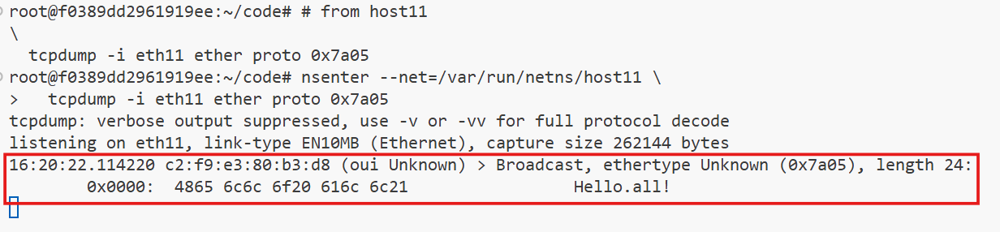
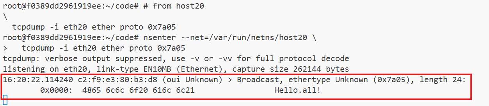
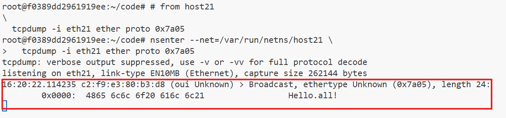

# **Ethernet Broadcast Domains Using Linux Virtualization Tools**

Broadcast domains play a critical role in networking by defining the scope within which devices can communicate at the data link layer. In this document, we will emulate Ethernet broadcast domains using Linux network virtualization tools such as network namespaces, virtual Ethernet (veth) devices, and Linux bridge devices. This setup mimics real-world networking scenarios and helps us understand the principles of broadcast domains.

We will explore two scenarios:
1. Interconnecting multiple network switches to form a single broadcast domain.
2. Implementing hierarchical internetworking for performance optimization.


## **Prerequisites**

To perform the experiments, ensure the following:

- Linux environment with root access.
- Knowledge of basic networking concepts.
- Linux network virtualization tools such as `ip netns`, `veth`, and `bridge` utilities.
- The provided helper scripts for setting up network namespaces, bridges, and veth connections.

### **Helper Scripts**
Copy the following Bash functions into your terminal and execute them:

### **1. Create a Bridge Namespace**

```bash
create_bridge() {
  local nsname="$1"
  local ifname="$2"

  echo "Creating bridge ${nsname}/${ifname}"

  ip netns add ${nsname}
  ip netns exec ${nsname} ip link set lo up
  ip netns exec ${nsname} ip link add ${ifname} type bridge
  ip netns exec ${nsname} ip link set ${ifname} up
}
```

### **2. Create an End Host Namespace**

```bash
create_end_host() {
  local host_nsname="$1"
  local peer1_ifname="$2"
  local peer2_ifname="$2b"
  local bridge_nsname="$3"
  local bridge_ifname="$4"

  echo "Creating end host ${host_nsname} connected to ${bridge_nsname}/${bridge_ifname} bridge"

  ip netns add ${host_nsname}
  ip netns exec ${host_nsname} ip link set lo up

  ip link add ${peer1_ifname} netns ${host_nsname} type veth peer \
              ${peer2_ifname} netns ${bridge_nsname}
  ip netns exec ${host_nsname} ip link set ${peer1_ifname} up
  ip netns exec ${bridge_nsname} ip link set ${peer2_ifname} up

  ip netns exec ${bridge_nsname} ip link set ${peer2_ifname} master ${bridge_ifname}
}
```

### **3. Connect Two Bridges**

```bash
connect_bridges() {
  local bridge1_nsname="$1"
  local bridge1_ifname="$2"
  local bridge2_nsname="$3"
  local bridge2_ifname="$4"
  local peer1_ifname="veth_${bridge2_ifname}"
  local peer2_ifname="veth_${bridge1_ifname}"

  echo "Connecting bridge ${bridge1_nsname}/${bridge1_ifname} to ${bridge2_nsname}/${bridge2_ifname} bridge using veth pair"

  ip link add ${peer1_ifname} netns ${bridge1_nsname} type veth peer \
              ${peer2_ifname} netns ${bridge2_nsname}
  ip netns exec ${bridge1_nsname} ip link set ${peer1_ifname} up
  ip netns exec ${bridge2_nsname} ip link set ${peer2_ifname} up

  ip netns exec ${bridge1_nsname} ip link set ${peer1_ifname} master ${bridge1_ifname}
  ip netns exec ${bridge2_nsname} ip link set ${peer2_ifname} master ${bridge2_ifname}
}
```

### **Sending Ethernet Frames**

The `ethsend` Python script demonstrates sending raw Ethernet frames. This script manually transmits Ethernet frames at the data link layer. Save the following code as `ethsend.py`:

```python
#!/usr/bin/env python3

import fcntl
import socket
import struct
import sys

def send_frame(ifname, dstmac, eth_type, payload):
    s = socket.socket(socket.AF_PACKET, socket.SOCK_RAW)
    s.bind((ifname, 0))

    info = fcntl.ioctl(s.fileno(),
                       0x8927,
                       struct.pack('256s', bytes(ifname, 'utf-8')[:15]))
    srcmac = ':'.join('%02x' % b for b in info[18:24])

    payload_bytes = payload.encode('utf-8')
    assert len(payload_bytes) <= 1500

    frame = human_mac_to_bytes(dstmac) + \
            human_mac_to_bytes(srcmac) + \
            eth_type + \
            payload_bytes

    return s.send(frame)

def human_mac_to_bytes(addr):
    return bytes.fromhex(addr.replace(':', ''))

def main():
    ifname = sys.argv[1]
    dstmac = sys.argv[2]
    payload = sys.argv[3]
    ethtype = b'\x7A\x05'
    send_frame(ifname, dstmac, ethtype, payload)

if __name__ == "__main__":
    main()
```

## **Scenario 1: Interconnecting Network Switches**

### **Objective**
Demonstrate how multiple interconnected network switches form a single broadcast domain.

### **Steps**

### 1. **Create Two Disjoint Network Segments**

   ```bash
   create_bridge bridge10 br10
   create_end_host host10 eth10 bridge10 br10
   create_end_host host11 eth11 bridge10 br10
   ```

   ```bash
   create_bridge bridge20 br20
   create_end_host host20 eth20 bridge20 br20
   create_end_host host21 eth21 bridge20 br20
   ```

### 2. **Connect the Two Bridges**

   ```bash
   connect_bridges bridge10 br10 bridge20 br20
   ```

### 3. **Test the Broadcast Domain**

- ### Monitor traffic on all hosts except the first host of the first switch. 

    Run the following three commands in three different terminals: 

    ```bash
    # On host11
    nsenter --net=/var/run/netns/host11 tcpdump -i eth11 ether proto 0x7a05
    ```
    ```bash
    # On host20
    nsenter --net=/var/run/netns/host20 tcpdump -i eth20 ether proto 0x7a05
    ```
    ```bash
    # On host21
    nsenter --net=/var/run/netns/host21 tcpdump -i eth21 ether proto 0x7a05
    ```

- #### Send a broadcast message from the first host:

    ```bash
    # On host10
    nsenter --net=/var/run/netns/host10 python3 ethsend.py eth10 ff:ff:ff:ff:ff:ff 'Hello all!'
    ```

- #### Observe that all hosts receive the broadcast message

    From the perspective of the nodes (logically), there is no distinction between being connected to a single switch (bridge) or multiple interconnected switches. Together, they still constitute one unified Layer 2 (L2) segment and a single broadcast domain.

    

    

    

### 4. **Clean Up**

To clean things up, just remove the created network namespaces:

   ```bash
   ip netns delete bridge10
   ip netns delete host10
   ip netns delete host11

   ip netns delete bridge20
   ip netns delete host20
   ip netns delete host21
   ```


## **Scenario 2: Hierarchical Internetworking**

### **Objective**
Show how multi-level interconnection of switches also forms a single broadcast domain. In large setups, connecting switches in a flat structure can cause a lot of transit traffic. To improve performance, a hierarchical arrangement of switches is used.

This example will demonstrate that a multi-level switch interconnection still operates as a single broadcast domain.

### **Steps**

### 1. **Create two disjoint network segments**

   ```bash
   # 1st Lower-layer segment
   create_bridge bridge10 br10
   create_end_host host10 eth10 bridge10 br10
   create_end_host host11 eth11 bridge10 br10
   ```

   ```bash
   # 2nd Lower-layer segment
   create_bridge bridge20 br20
   create_end_host host20 eth20 bridge20 br20
   create_end_host host21 eth21 bridge20 br20
   ```


### 2. **Create a higher-layer switch and connect the lower-layer switches to it**

   ```bash
   # Higher-layer switch
   create_bridge bridge30 br30
   ```

   ```bash
   # Connect both lower-layer switches to higher layer switch
   connect_bridges bridge10 br10 bridge30 br30
   connect_bridges bridge20 br20 bridge30 br30
   ```

### 3. **Test the Broadcast Domain**

To show that all hosts are part of a single broadcast domain, begin by monitoring traffic on all hosts except the first one connected to the first lower-layer switch.

First lower-layer switch, second host (in a separate terminal):

```bash
# from host11
nsenter --net=/var/run/netns/host11 \
  tcpdump -i eth11 ether proto 0x7a05
```
Second lower-layer switch, first host (in a separate terminal):

```bash
# from host20
nsenter --net=/var/run/netns/host20 \
  tcpdump -i eth20 ether proto 0x7a05
```

Second lower-layer switch, second host (in a separate terminal):

```bash
# from host21
nsenter --net=/var/run/netns/host21 \
  tcpdump -i eth21 ether proto 0x7a05
``` 

Finally, using one more terminal, send a broadcast message from the first host of the first lower-layer switch:

```bash
nsenter --net=/var/run/netns/host10 \
  ethsend eth10 ff:ff:ff:ff:ff:ff 'Hello all!'
```  

### 4. **Clean Up**

Let's remove the created network namespaces:

   ```bash
   ip netns delete bridge10
   ip netns delete host10
   ip netns delete host11

   ip netns delete bridge20
   ip netns delete host20
   ip netns delete host21

   ip netns delete bridge30
   ```


## **Conclusion**

These experiments demonstrate how Linux virtualization tools can emulate Ethernet broadcast domains and the effects of interconnecting network switches. They highlight the principles of broadcast communication, scalability, and hierarchical networking, providing a practical foundation for understanding real-world networking environments.

