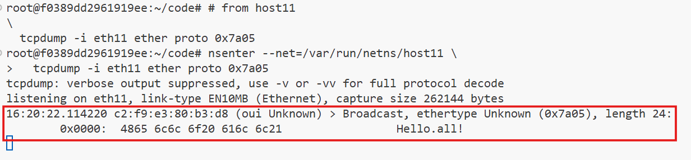
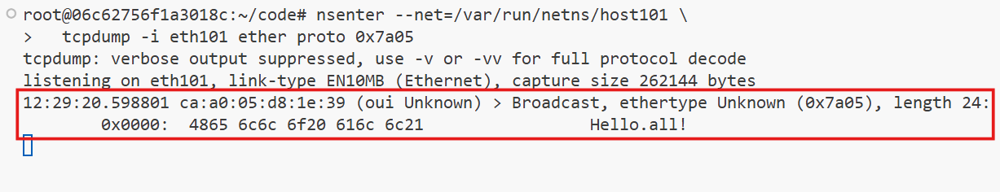
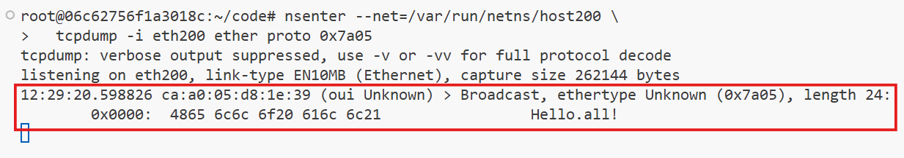
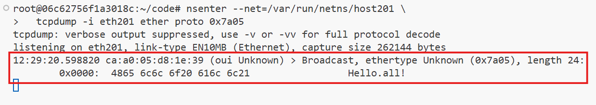

# **Ethernet Broadcast Domains Using Linux Virtualization Tools**

Broadcast domains play a critical role in networking by defining the scope within which devices can communicate at the data link layer. In this document, we will emulate Ethernet broadcast domains using Linux network virtualization tools such as network namespaces, virtual Ethernet (veth) devices, and Linux bridge devices. This setup mimics real-world networking scenarios and helps us understand the principles of broadcast domains.

We will explore two scenarios:
1. Interconnecting multiple network switches to form a single broadcast domain.
2. Implementing hierarchical internetworking for performance optimization.


## **Prerequisites**

To perform the experiments, ensure the following:

- Linux environment with root access.
- Knowledge of basic networking concepts.
- Linux network virtualization tools such as `ip netns`, `veth`, and `bridge` utilities.
- The provided helper scripts for setting up network namespaces, bridges, and veth connections.

### **Helper Scripts**
Copy the following Bash functions into your terminal and execute them:

### **1. Create a Bridge Namespace**

```bash
create_bridge() {
  local nsname="$1"
  local ifname="$2"

  echo "Creating bridge ${nsname}/${ifname}"

  ip netns add ${nsname}
  ip netns exec ${nsname} ip link set lo up
  ip netns exec ${nsname} ip link add ${ifname} type bridge
  ip netns exec ${nsname} ip link set ${ifname} up
}
```

### **2. Create an End Host Namespace**

```bash
create_end_host() {
  local host_nsname="$1"
  local peer1_ifname="$2"
  local peer2_ifname="$2b"
  local bridge_nsname="$3"
  local bridge_ifname="$4"

  echo "Creating end host ${host_nsname} connected to ${bridge_nsname}/${bridge_ifname} bridge"

  ip netns add ${host_nsname}
  ip netns exec ${host_nsname} ip link set lo up

  ip link add ${peer1_ifname} netns ${host_nsname} type veth peer \
              ${peer2_ifname} netns ${bridge_nsname}
  ip netns exec ${host_nsname} ip link set ${peer1_ifname} up
  ip netns exec ${bridge_nsname} ip link set ${peer2_ifname} up

  ip netns exec ${bridge_nsname} ip link set ${peer2_ifname} master ${bridge_ifname}
}
```

### **3. Connect Two Bridges**

```bash
connect_bridges() {
  local bridge1_nsname="$1"
  local bridge1_ifname="$2"
  local bridge2_nsname="$3"
  local bridge2_ifname="$4"
  local peer1_ifname="veth_${bridge2_ifname}"
  local peer2_ifname="veth_${bridge1_ifname}"

  echo "Connecting bridge ${bridge1_nsname}/${bridge1_ifname} to ${bridge2_nsname}/${bridge2_ifname} bridge using veth pair"

  ip link add ${peer1_ifname} netns ${bridge1_nsname} type veth peer \
              ${peer2_ifname} netns ${bridge2_nsname}
  ip netns exec ${bridge1_nsname} ip link set ${peer1_ifname} up
  ip netns exec ${bridge2_nsname} ip link set ${peer2_ifname} up

  ip netns exec ${bridge1_nsname} ip link set ${peer1_ifname} master ${bridge1_ifname}
  ip netns exec ${bridge2_nsname} ip link set ${peer2_ifname} master ${bridge2_ifname}
}
```

### **Sending Ethernet Frames**

The `ethsend` Python script demonstrates sending raw Ethernet frames. This script manually transmits Ethernet frames at the data link layer. Save the following code as `ethsend.py`:

```python
#!/usr/bin/env python3

import fcntl
import socket
import struct
import sys

def send_frame(ifname, dstmac, eth_type, payload):
    s = socket.socket(socket.AF_PACKET, socket.SOCK_RAW)
    s.bind((ifname, 0))

    info = fcntl.ioctl(s.fileno(),
                       0x8927,
                       struct.pack('256s', bytes(ifname, 'utf-8')[:15]))
    srcmac = ':'.join('%02x' % b for b in info[18:24])

    payload_bytes = payload.encode('utf-8')
    assert len(payload_bytes) <= 1500

    frame = human_mac_to_bytes(dstmac) + \
            human_mac_to_bytes(srcmac) + \
            eth_type + \
            payload_bytes

    return s.send(frame)

def human_mac_to_bytes(addr):
    return bytes.fromhex(addr.replace(':', ''))

def main():
    ifname = sys.argv[1]
    dstmac = sys.argv[2]
    payload = sys.argv[3]
    ethtype = b'\x7A\x05'
    send_frame(ifname, dstmac, ethtype, payload)

if __name__ == "__main__":
    main()
```

### **Install `tcpdump`**

`tcpdump` is a powerful command-line packet analyzer. It allows you to capture and display packets being transmitted or received over a network interface (e.g., eth1, eth2).

Before moving on to the next steps check if tcpdump is installed on the host system:

```bash
sudo apt update
sudo apt-get install tcpdump -y
```

## **Scenario 1: Interconnecting Network Switches**


### **Objective**
Demonstrate how multiple interconnected network switches form a single broadcast domain.

### **Steps**

### 1. **Create Two Disjoint Network Segments**

#### **Segment I**

- **Create a Bridge for Segment I:**

   ```bash
   create_bridge bridge10 br10
   ```
- **Add Hosts to Segment I:**

   ```bash
   create_end_host host10 eth10 bridge10 br10
   create_end_host host11 eth11 bridge10 br10
   ```


#### **Segment II**   

- **Create a Bridge for Segment II:**
   ```bash
   create_bridge bridge20 br20
   ```

- **Add Hosts to Segment II:**
   ```bash
   create_end_host host20 eth20 bridge20 br20
   create_end_host host21 eth21 bridge20 br20
   ```

### 2. **Connect the Two Bridges**

- **Connect `bridge10` to `bridge20`:**

   ```bash
   connect_bridges bridge10 br10 bridge20 br20
   ```

### 3. **Test the Broadcast Domain**

To demonstrate that all hosts form a single broadcast domain, monitor traffic on specific hosts and send a broadcast message.

#### **Monitor traffic**

Run the following three commands in three different terminals.

1. **Start Monitoring on `host11`:**

    ```bash
    # On host11
    nsenter --net=/var/run/netns/host11 tcpdump -i eth11 ether proto 0x7a05
    ```

    This monitors traffic on `eth11` for a specific protocol.


2. **Start Monitoring on `host20`:**

    ```bash
    # On host20
    nsenter --net=/var/run/netns/host20 tcpdump -i eth20 ether proto 0x7a05
    ```

    This monitors traffic on `eth20` for a specific protocol.

2. **Start Monitoring on `host21`:**

    ```bash
    # On host21
    nsenter --net=/var/run/netns/host21 tcpdump -i eth21 ether proto 0x7a05
    ```

    This monitors traffic on `eth21` for a specific protocol.

#### **Send a broadcast message**

1. **Broadcast a Message from `host10`:**

    ```bash
    # On host10
    nsenter --net=/var/run/netns/host10 \
      python3 ethsend.py eth10 ff:ff:ff:ff:ff:ff 'Hello all!'
    ```
    This sends a broadcast message, `Hello all!`, from `eth10` to all hosts in the network.

- #### Observe that all hosts receive the broadcast message

    From the perspective of the nodes (logically), there is no distinction between being connected to a single switch (bridge) or multiple interconnected switches. Together, they still constitute one unified Layer 2 (L2) segment and a single broadcast domain.

    

    

    

### 4. **Clean Up**

To clean things up, just remove the created network namespaces:

   ```bash
   ip netns delete bridge10
   ip netns delete host10
   ip netns delete host11

   ip netns delete bridge20
   ip netns delete host20
   ip netns delete host21
   ```


## **Scenario 2: Hierarchical Internetworking**


### **Objective**
Show how multi-level interconnection of switches also forms a single broadcast domain. In large setups, connecting switches in a flat structure can cause a lot of transit traffic. To improve performance, a hierarchical arrangement of switches is used.

This example will demonstrate that a multi-level switch interconnection still operates as a single broadcast domain.

### **Steps**

### **1. Create Two Disjoint Network Segments**

#### Lower-layer Segment I
- **Create a Bridge for Segment I:**

   ```bash
   create_bridge bridge100 br100
   ```
   This command creates a bridge named `bridge100` with the interface `br100`, forming the backbone for Segment I.

- **Add Hosts to Segment I:**
   ```bash
   create_end_host host100 eth100 bridge100 br100
   create_end_host host101 eth101 bridge100 br100
   ```
   These commands add two end hosts, `host100` and `host101`, with interfaces `eth100` and `eth101` respectively, to `bridge100`.

#### Lower-layer Segment II
- **Create a Bridge for Segment II:**

   ```bash
   create_bridge bridge200 br200
   ```
   This creates a bridge named `bridge200` with the interface `br200`, forming the backbone for Segment II.

- **Add Hosts to Segment II:**

   ```bash
   create_end_host host200 eth200 bridge200 br200
   create_end_host host201 eth201 bridge200 br200
   ```
   These commands add two end hosts, `host200` and `host201`, with interfaces `eth200` and `eth201` respectively, to `bridge200`.

### **2. Create a Higher-layer Switch**
- **Create the Higher-layer Bridge:**

   ```bash
   create_bridge bridge300 br300
   ```
   This command creates a higher-layer bridge named `bridge300` with the interface `br300`, acting as a switch to interconnect the lower-layer segments.

### **3. Connect Lower-layer Switches to the Higher-layer Switch**
- **Connect `bridge100` to `bridge300`:**

   ```bash
   connect_bridges bridge100 br100 bridge300 br300
   ```
   This connects the lower-layer switch `bridge100` to the higher-layer switch `bridge300`.

- **Connect `bridge200` to `bridge300`:**

   ```bash
   connect_bridges bridge200 br200 bridge300 br300
   ```
   This connects the lower-layer switch `bridge200` to the higher-layer switch `bridge300`.

### **4. Verify the Broadcast Domain**
To demonstrate that all hosts form a single broadcast domain, monitor traffic on specific hosts and send a broadcast message.

#### **Monitor Traffic**

Run the following command to monitor traffic in separate terminals.

1. **Start Monitoring on `host101` (Segment I):**
   ```bash
   nsenter --net=/var/run/netns/host101 \
     tcpdump -i eth101 ether proto 0x7a05
   ```
   This monitors traffic on `eth101` for a specific protocol.

2. **Start Monitoring on `host200` (Segment II):**
   ```bash
   nsenter --net=/var/run/netns/host200 \
     tcpdump -i eth200 ether proto 0x7a05
   ```
   This monitors traffic on `eth200` for the same protocol.

3. **Start Monitoring on `host201` (Segment II):**
   ```bash
   nsenter --net=/var/run/netns/host201 \
     tcpdump -i eth201 ether proto 0x7a05
   ```
   This monitors traffic on `eth201` for the same protocol.

#### **Send a Broadcast Message**
1. **Broadcast a Message from `host100` (Segment I):**
   ```bash
   nsenter --net=/var/run/netns/host100 \
     python3 ethsend.py eth100 ff:ff:ff:ff:ff:ff 'Hello all!'
   ```
   This sends a broadcast message, `Hello all!`, from `eth100` to all hosts in the network.

#### **Verify Broadcast Reception**
All monitored terminals (`host101`, `host200`, `host201`) should display the broadcast message, confirming a single broadcast domain.

  

  

  


### **5. Clean Up the Setup**

1. **Remove Namespaces for Segment I:**
   ```bash
   ip netns delete bridge100
   ip netns delete host100
   ip netns delete host101
   ```

2. **Remove Namespaces for Segment II:**
   ```bash
   ip netns delete bridge200
   ip netns delete host200
   ip netns delete host201
   ```

3. **Remove Namespace for the Higher-layer Switch:**
   ```bash
   ip netns delete bridge300
   ```

## **Conclusion**

These experiments demonstrate how Linux virtualization tools can emulate Ethernet broadcast domains and the effects of interconnecting network switches. They highlight the principles of broadcast communication, scalability, and hierarchical networking, providing a practical foundation for understanding real-world networking environments.

