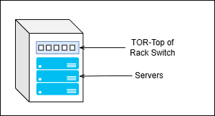
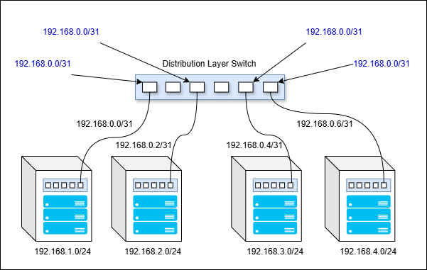
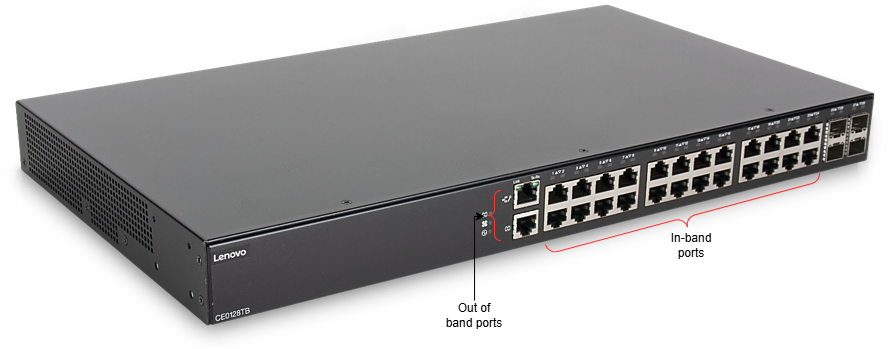

## **Top-of-Rack (TOR) Switch**

A **Top-of-Rack (TOR) switch** is a key networking device in modern data centers. It’s located physically at the top of a server rack (hence the name) and serves as the primary point of connection for all servers in that rack. Its design simplifies cabling, optimizes performance, and integrates seamlessly into the broader data center network.

### **What Roles Does a TOR Switch Serve?**

The TOR switch is multifunctional, fulfilling roles in both Layer 2 (L2) and Layer 3 (L3) of the OSI model:

**1. Layer 2 (L2) Bridge Role:**

- Acts as a transparent multi-port bridge, meaning it facilitates communication within the rack at the data link layer.
- Operates based on MAC (Media Access Control) addresses, forwarding Ethernet frames between servers without involving IP routing.
- Ensures that all devices in the rack belong to the same broadcast domain (a group of devices that can reach each other via L2 broadcasts).
- Key features:
    - **MAC Learning:** Dynamically learns which MAC address resides on which port.
    - **Frame Forwarding:** Directs traffic between servers in the rack based on MAC tables.

    

**2. Layer 3 (L3) Router Role:**

- Some ports on the TOR switch are configured as Layer 3 interfaces. These ports handle traffic leaving the rack, forwarding it to other subnets or networks.
- Operates based on IP routing, directing packets between different subnets using routing tables.
- Acts as the **default gateway** for all servers in the rack, meaning all traffic destined for external networks flows through it.

    

### **Why is it Called a TOR Switch?**

- **Physical Location:** Positioned at the top of the rack for easy cable management. All servers connect to this single switch using short cables.
- **Logical Organization:** Forms the "top" of the rack’s networking hierarchy, interfacing with higher-level devices.

## **TOR Switch and Rack Design**

### **Rack Networking Structure**

A typical data center rack consists of:
- **Servers:** Physical machines performing computations or hosting applications.
- **TOR Switch:** Connecting all servers within the rack and linking the rack to the larger data center network.

### **Network Segmentation**

- All servers in the rack belong to the same **IP subnet** (e.g., `/24`, meaning up to 254 usable addresses).
- The subnet boundary ensures that L2 (frame-based) communication stays within the rack.
- The TOR switch ensures that:
  - **Intra-rack communication** (between servers in the same rack) remains in L2 mode.
  - **Inter-rack communication** (between servers in different racks) is routed through L3.

### **How TOR Switches Operate**
- **L2 Mode:**  
  TOR switches handle intra-rack traffic as a transparent bridge. Servers in the rack communicate directly using their MAC addresses, without involving higher-layer switches.
- **L3 Mode:**  
  One or more ports on the TOR switch operate in L3 mode to connect the rack's subnet to the broader network. These ports:
  - Have IP addresses and act as nodes in the L3 topology.
  - Route traffic to "distribution layer" switches for internetworking.
- **Distribution Layer Switches:**  
  - These higher-layer switches connect multiple TOR switches.
  - They work as pure L3 routers with many ports (48, 64, or more), each assigned an IP address.
  - Provide redundancy and scalability by connecting to multiple TOR switches.

---

## A simple hierarchical networking example

We will illustrate a **data center network hierarchy** that involves **Top of Rack (TOR) switches** and a **Distribution Layer Switch**. Here is the diagram which we will be using to explain the concept.

### **1. Components in the Diagram**

#### **a) Top of Rack (TOR) Switches:**
- There are **four racks**, each with its own TOR switch. 
- These TOR switches connect to the servers in their respective racks.
- Each rack has its own **/24 subnet**, meaning it can have up to 256 IP addresses for servers in that rack:
  - Rack 1: `192.168.1.0/24`
  - Rack 2: `192.168.2.0/24`
  - Rack 3: `192.168.3.0/24`
  - Rack 4: `192.168.4.0/24`

#### **b) Distribution Layer Switch:**
- This is a centralized **Layer 3 (L3) switch or router** connecting all the TOR switches.
- The distribution layer provides interconnectivity between different racks (subnets).
- Links between the TOR switches and the distribution switch are **point-to-point connections**, each with its own **/31 subnet**.

---

### **2. Subnetting in the Diagram**

#### **a) TOR to Servers (Intra-Rack):**
- Within each rack, the TOR switch operates in **Layer 2 (L2)** mode.
- Servers communicate with one another using **MAC addresses** within the same `192.168.x.0/24` subnet.

#### **b) TOR to Distribution Switch (Inter-Rack):**
- The connections between the TOR switches and the distribution switch are **/31 subnets**, which provide exactly **2 usable IP addresses** (sufficient for point-to-point links):
  - `192.168.0.0/31` for Rack 1 TOR to Distribution Switch
  - `192.168.0.2/31` for Rack 2 TOR to Distribution Switch
  - `192.168.0.4/31` for Rack 3 TOR to Distribution Switch
  - `192.168.0.6/31` for Rack 4 TOR to Distribution Switch

#### **Why /31 Subnets?**
- **Efficiency:** A /31 subnet minimizes IP address waste because it allocates only two IPs: one for the TOR switch and one for the distribution switch.
- Ideal for point-to-point links.

### **3. Data Flow in the Diagram**

#### **a) Intra-Rack Communication (L2):**

When a server in a rack communicates with another server in the **same rack**, the TOR switch forwards the traffic locally at Layer 2.  
- Example: Server `192.168.1.10` in Rack 1 can directly communicate with Server `192.168.1.20` in Rack 1 without involving the distribution switch.

#### **b) Inter-Rack Communication (L3):**
When a server in one rack communicates with a server in another rack, the traffic is routed through the **distribution switch**:

**Example:** Server `192.168.1.10` in Rack 1 wants to communicate with Server `192.168.4.15` in Rack 4.

1. Traffic leaves Rack 1 and goes to the TOR switch.
2. The TOR switch routes it to the distribution switch using the `192.168.0.0/31` subnet.
3. The distribution switch routes the traffic to Rack 4’s TOR switch using the `192.168.0.6/31` subnet.
4. Rack 4’s TOR switch forwards the traffic to Server `192.168.4.15`.

Certainly! Let’s break this down into detailed explanations for **physical and logical design** in the context of the diagram and how it works in a typical data center network.

---

## **Physical and Logical Design**

#### **1. Physical Connections**

**a) Physical Connection Between TOR and Distribution Switches:**
- Each **Top of Rack (TOR)** switch in the racks connects to the **distribution layer switch**.
- In real-world setups, these connections are:
  - **Redundant:** At least two physical connections from each TOR switch to two distribution switches for failover and high availability. This ensures that if one link or distribution switch fails, the other link keeps the communication going.
  - **High Bandwidth:** Using technologies like **10G, 25G, or even 40G Ethernet** for high-speed connectivity between the TOR switches and the distribution layer.

**b) Server Connections to the TOR Switch:**
- Each server within a rack is physically connected to the TOR switch using Ethernet cables.
- These connections are typically **1G or 10G Ethernet** for data traffic.
- All servers in a rack communicate with each other locally via the TOR switch, reducing the load on higher-level switches.

---

#### **2. Logical Configuration**

The **logical configuration** refers to how the devices (like TOR and distribution switches) operate and handle data traffic. Here’s the breakdown:

**a) Top of Rack (TOR) Switches:**
- TOR switches are hybrid devices capable of both:
  1. **Bridging (Layer 2):**
     - Within each rack, the TOR switch acts as a **bridge** to connect servers in the same subnet.
     - For example:
       - Servers in Rack 1 (192.168.1.0/24) communicate directly through the TOR switch at Layer 2.
       - TOR switches use **MAC addresses** to forward packets within the rack.
  2. **Routing (Layer 3):**
     - TOR switches also act as **routers** to connect to the distribution layer for inter-rack communication.
     - For example:
       - Traffic from a server in Rack 1 (192.168.1.10) to a server in Rack 2 (192.168.2.15) will be routed via the TOR switch and passed up to the distribution switch.

**b) Distribution Layer Switch:**
- The distribution layer switch is responsible for **interconnecting all TOR switches** and managing traffic between racks.
- Key roles:
  - **Layer 3 Routing:**
    - Handles routing between the TOR switches (inter-rack communication).
    - Uses IP subnets to determine which TOR switch to forward traffic to.
  - **Route Summarization:**
    - The distribution layer aggregates routes from multiple TOR switches to simplify routing tables and optimize network performance.
    - Example:
      - Instead of managing individual IPs like `192.168.1.10` or `192.168.2.15`, the distribution switch may summarize these into larger blocks (`192.168.1.0/24`, `192.168.2.0/24`).

**c) Logical Connections Between TOR and Distribution Layer:**
- The connections between TOR switches and the distribution switch use **/31 subnets**, which are point-to-point links.
- Example:
  - TOR switch in Rack 1 has an IP of `192.168.0.0/31`, and the distribution switch has `192.168.0.1/31`.
- Why /31 Subnets?
  - Efficient IP usage: Only two IP addresses are needed (one for each endpoint of the link).
  - Simplifies routing for point-to-point connections.

## **How Physical and Logical Designs Work Together**

Let’s see how these concepts interact in practice:

1. **Server Communication Within the Same Rack (Intra-Rack):**
   - Servers in Rack 1 communicate directly through the TOR switch at Layer 2 (bridging).
   - The TOR switch forwards frames based on MAC addresses, and there’s no need for IP routing.

2. **Server Communication Across Racks (Inter-Rack):**
   - Traffic between servers in different racks passes through:
     1. TOR switch in the source rack (Layer 3 routing).
     2. Distribution switch, which routes it to the destination TOR switch (Layer 3 routing).
     3. TOR switch in the destination rack forwards the traffic to the target server.

3. **Redundant and High-Performance Links:**
   - If one physical connection between a TOR switch and the distribution layer fails, traffic seamlessly switches to the redundant link.
   - Bundled links ensure that even high-bandwidth traffic can flow smoothly between layers.
---

### **Management and Configuration**
- **Out-of-Band Ports:**
  - Switches include dedicated out-of-band management ports (always in L3 mode) shown in the [diagram](https://lenovopress.lenovo.com/lp1061-ce0128tb-gigabit-ethernet-campus-switch).
  - These ports allow administrators to log in remotely (e.g., via SSH) and manage the switch, even if other ports are misconfigured.
- **Switch OS:**
  - Internally, many modern switches run Linux, FreeBSD, or Unix-like operating systems.
  - Administrators can manage them using familiar tools (e.g., `ip`, `bridge`) to configure routing tables, assign IPs, or enslave ports to virtual bridges.
- **Perspective:**  
  - A managed switch is essentially a highly optimized Linux server with multiple network interfaces.

  

This section emphasizes that while TOR switches act as bridges and routers, their configuration determines their function. Moreover, advanced tools like VXLAN extend the functionality beyond physical limitations, offering scalable and flexible networking solutions in modern data centers.