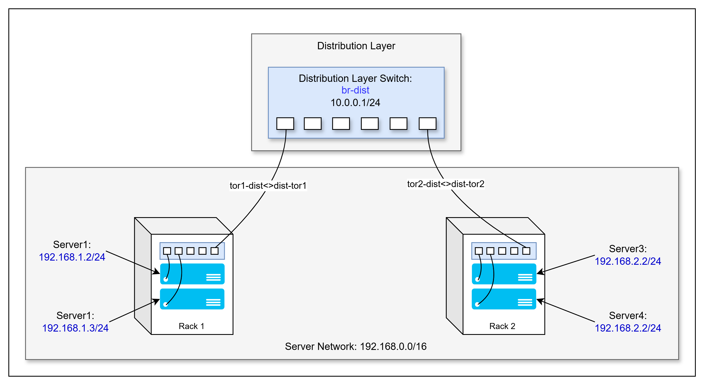
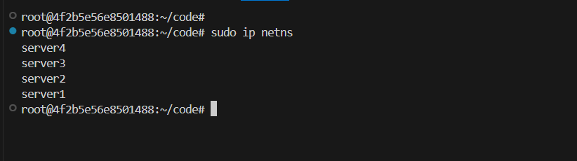
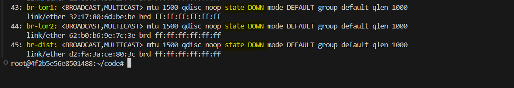
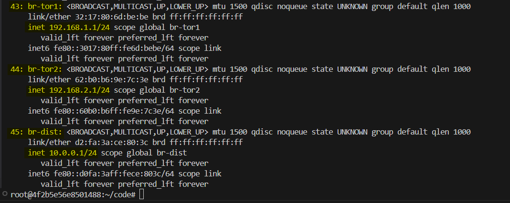
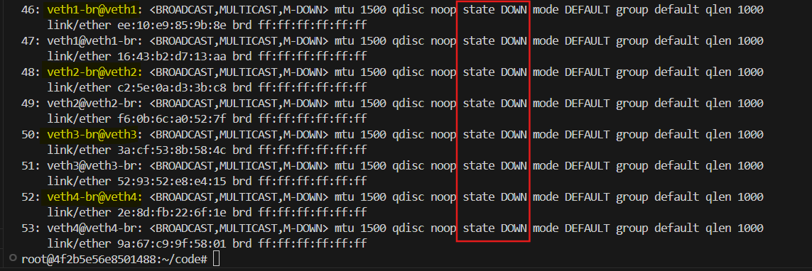
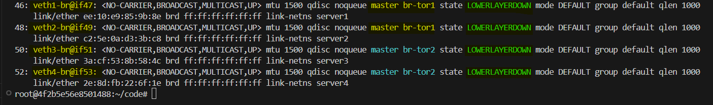
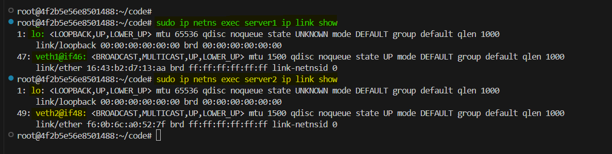
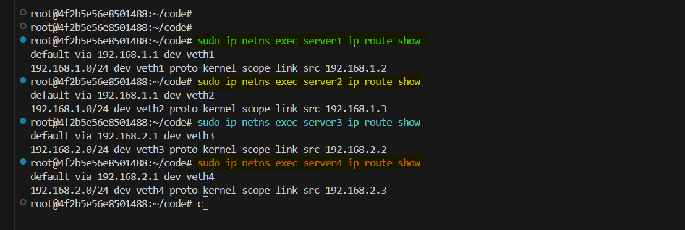
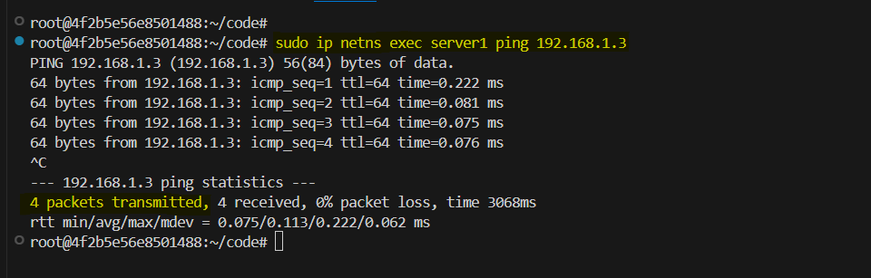
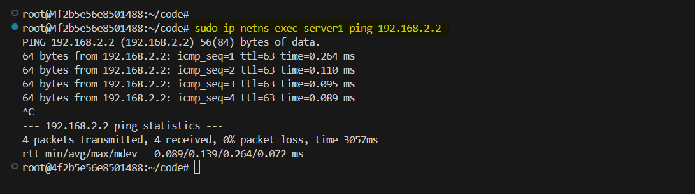

# **Network Setup Guide**

This lab outlines the steps to create an isolated network topology using Linux network namespaces, bridges, and veth pairs. The setup includes two racks `(TOR1 and TOR2)` connected to a distribution layer `(BR-DIST)`. Each rack contains two servers.



## **Prerequisites**
- **Operating System**: Linux with root or sudo access.
- **Required Tools**:
  - `iproute2`: For managing namespaces, links, and routes.
  - `iptables`: For configuring forwarding and NAT.
  - `ping`: For connectivity testing.
  - `sysctl`: For modifying kernel parameters.

## **Setup Steps**

### **1. Create Network Namespaces**

We will simulate servers using network namespaces. Each server will be represented by a network namespace. Namespaces isolate the network environments of different servers. Run the following commands to create four namespaces for the servers:  

```bash
sudo ip netns add server1
sudo ip netns add server2
sudo ip netns add server3
sudo ip netns add server4
```

Verify the namespaces are created:

```bash
sudo ip netns
```



### **2. Create Bridge Interfaces**

Bridges simulate network switches and connect namespaces.  
1. **Create the bridges**:
   ```bash
   sudo ip link add br-tor1 type bridge
   sudo ip link add br-tor2 type bridge
   sudo ip link add br-dist type bridge
   ```

    Verify the bridges are created:
    ```bash
    sudo ip link show
    ```
    

2. **Activate the bridges**:

    As we have created the bridges, we need to activate them.
   ```bash
   sudo ip link set br-tor1 up
   sudo ip link set br-tor2 up
   sudo ip link set br-dist up
   ```
3. **Assign IPs to TOR bridges**:
   ```bash
   sudo ip addr add 192.168.1.1/24 dev br-tor1
   sudo ip addr add 192.168.2.1/24 dev br-tor2
   sudo ip addr add 10.0.0.1/24 dev br-dist
   ```
   Verify the IPs are assigned:
   ```bash
   sudo ip addr show
   ```
   

### **3. Create Server Connections**

Virtual Ethernet (veth) pairs connect namespaces to bridges.  
1. **Create veth pairs for each server**:
   ```bash
   sudo ip link add veth1 type veth peer name veth1-br
   sudo ip link add veth2 type veth peer name veth2-br
   sudo ip link add veth3 type veth peer name veth3-br
   sudo ip link add veth4 type veth peer name veth4-br
   ```

   Verify the veth pairs are created:
   ```bash
   sudo ip link show
   ```
    
2. **Assign to namespaces**:
   ```bash
   sudo ip link set veth1 netns server1
   sudo ip link set veth2 netns server2
   sudo ip link set veth3 netns server3
   sudo ip link set veth4 netns server4
   ```
3. **Connect to bridges**:
   ```bash
   sudo ip link set veth1-br master br-tor1
   sudo ip link set veth2-br master br-tor1
   sudo ip link set veth3-br master br-tor2
   sudo ip link set veth4-br master br-tor2
   ```
4. **Activate interfaces**:
   ```bash
   sudo ip link set veth1-br up
   sudo ip link set veth2-br up
   sudo ip link set veth3-br up
   sudo ip link set veth4-br up
   ```

   Verify the interfaces are activated:
   ```bash
   sudo ip link show
   ```
   

### **4. Configure Server Networking**

Assign IP addresses and bring up interfaces inside each namespace.  
1. **Rack 1 (TOR1)**:
   ```bash
   sudo ip netns exec server1 ip link set lo up
   sudo ip netns exec server1 ip link set veth1 up
   sudo ip netns exec server1 ip addr add 192.168.1.2/24 dev veth1

   sudo ip netns exec server2 ip link set lo up
   sudo ip netns exec server2 ip link set veth2 up
   sudo ip netns exec server2 ip addr add 192.168.1.3/24 dev veth2
   ```

   Verify the interfaces are activated:
   ```bash
   sudo ip netns exec server1 ip link show
   sudo ip netns exec server2 ip link show
   ```
   

2. **Rack 2 (TOR2)**:

    ```bash
    sudo ip netns exec server3 ip link set lo up
    sudo ip netns exec server3 ip link set veth3 up
    sudo ip netns exec server3 ip addr add 192.168.2.2/24 dev veth3

    sudo ip netns exec server4 ip link set lo up
    sudo ip netns exec server4 ip link set veth4 up
    sudo ip netns exec server4 ip addr add 192.168.2.3/24 dev veth4
    ```

### **5. Connect Distribution Layer**

Create links between TOR bridges and the distribution bridge. 

1. **Add veth pairs**:
   ```bash
   sudo ip link add tor1-dist type veth peer name dist-tor1
   sudo ip link add tor2-dist type veth peer name dist-tor2
   ```
2. **Attach links to the bridges**:
   ```bash
   sudo ip link set tor1-dist master br-tor1
   sudo ip link set dist-tor1 master br-dist
   sudo ip link set tor2-dist master br-tor2
   sudo ip link set dist-tor2 master br-dist
   ```
3. **Activate the interfaces**:
   ```bash
   sudo ip link set tor1-dist up
   sudo ip link set dist-tor1 up
   sudo ip link set tor2-dist up
   sudo ip link set dist-tor2 up
   ```

   Verify the interfaces are activated:
   ```bash
   sudo ip link show
   ```

### **6. Configure Bridge Settings**

Enable ARP proxy on TOR bridges and bridge-nf.

```bash
# Enable ARP proxy on TOR bridges
sudo sysctl -w net.ipv4.conf.br-tor1.proxy_arp=1
sudo sysctl -w net.ipv4.conf.br-tor2.proxy_arp=1

# Enable bridge-nf
sudo modprobe br_netfilter
sudo bash -c 'echo 0 > /proc/sys/net/bridge/bridge-nf-call-iptables'

# Set bridges in promiscuous mode
sudo ip link set br-tor1 promisc on
sudo ip link set br-tor2 promisc on
```

### **7. Configure Routing**

Enable IP forwarding and add routes on the distribution bridge.  

```bash
# Enable IP forwarding
sudo sysctl -w net.ipv4.ip_forward=1

# Add routes on br-dist
sudo ip route add 192.168.1.0/24 via 192.168.1.1 dev br-tor1
sudo ip route add 192.168.2.0/24 via 192.168.2.1 dev br-tor2

# Configure server default routes
sudo ip netns exec server1 ip route add default via 192.168.1.1
sudo ip netns exec server2 ip route add default via 192.168.1.1
sudo ip netns exec server3 ip route add default via 192.168.2.1
sudo ip netns exec server4 ip route add default via 192.168.2.1
```

Verify the server routes are added:
```bash
sudo ip netns exec server1 ip route show
sudo ip netns exec server2 ip route show
sudo ip netns exec server3 ip route show
sudo ip netns exec server4 ip route show
```



### **8. Configure Forwarding Rules**

Enable packet forwarding and masquerading.

```bash
# Enable packet forwarding
sudo iptables -A FORWARD -i br-tor1 -o br-tor2 -j ACCEPT
sudo iptables -A FORWARD -i br-tor2 -o br-tor1 -j ACCEPT

# Enable masquerading
sudo iptables -t nat -A POSTROUTING -o br-tor2 -j MASQUERADE
sudo iptables -t nat -A POSTROUTING -o br-tor1 -j MASQUERADE
```

### **Testing**

Test intra-rack and inter-rack connectivity.

```bash
# Test intra-rack connectivity
sudo ip netns exec server1 ping 192.168.1.3
```


```bash
# Test inter-rack connectivity
sudo ip netns exec server1 ping 192.168.2.2
```




## **Conclusion**

This lab provided a comprehensive understanding of how to create an isolated network topology using Linux network namespaces, bridges, and veth pairs. It demonstrated how to set up a simple network with two racks connected to a distribution layer, and how to configure routing and forwarding rules to ensure proper network communication between the servers.

