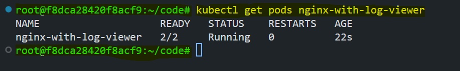
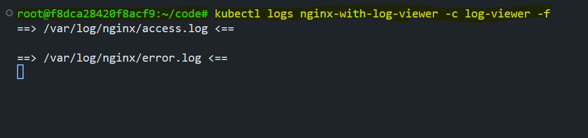
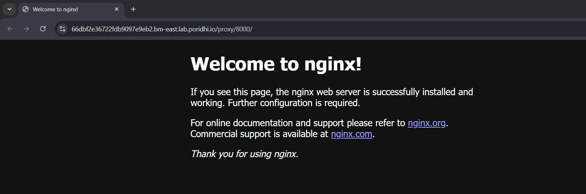
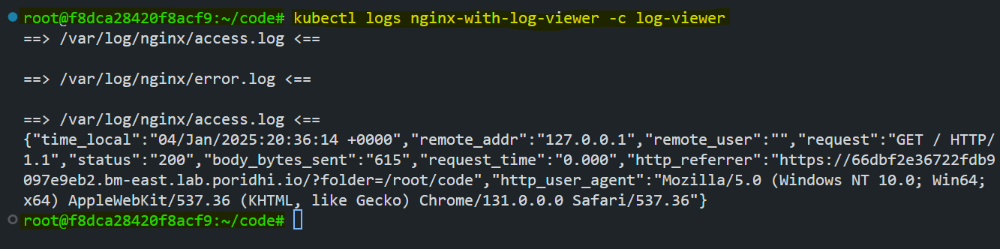

# Nginx Log Monitoring with Sidecar Container

This guide provides a step-by-step approach to implementing a real-time log monitoring solution for Nginx using the sidecar container pattern in Kubernetes. By following this pattern, you can view Nginx logs without accessing the main container directly, enhancing observability and modularity.


## Architecture Components

### 1. Main Container (Nginx)
- **Purpose**: Serves web content and generates logs.
- **Image**: `nginx:latest`
- **Log Location**: `/var/log/nginx/`
- **Generated Logs**:
  - **access.log**: Records all HTTP requests.
  - **error.log**: Records all error events.

### 2. Sidecar Container (Log Monitor)
- **Purpose**: Streams Nginx logs in real-time for easy viewing.
- **Image**: `alpine:latest`
- **Monitored Logs**: `access.log` and `error.log`
- **Output**: Streams logs to `stdout`, accessible via `kubectl logs`.

## What is Sidecar Container?

A **sidecar container** in Kubernetes is a container that is deployed alongside the main application container (the "primary container") within the same **Pod**. Sidecar containers complement and enhance the functionality of the primary container by providing auxiliary features or services.

### Characteristics of a Sidecar Container

1. **Shared Context**: Sidecar containers share the same network namespace, storage volumes, and lifecycle as the primary container within the Pod.
2. **Complementary Role**: They are not standalone; they work in conjunction with the primary container to provide additional functionality.
3. **Same Pod**: Since both containers are in the same Pod, they can communicate via localhost and share resources.

### Common Use Cases for Sidecar Containers

1. **Logging and Monitoring**: A sidecar container can collect logs or metrics from the primary container and send them to a central monitoring system (e.g., Fluentd or Prometheus exporters).
2. **Proxy Services**: Sidecar containers can act as reverse proxies, load balancers, or service mesh proxies (e.g., Envoy or Istio sidecars).
3. **Configuration Management**: Sidecar containers can dynamically fetch configuration data and share it with the primary container.
4. **Data Synchronization**: They can sync data between local storage and remote systems, such as uploading files to a cloud storage bucket.

## Implementation Steps

### Step 1: Create a Kubernetes ConfigMap
Store the custom Nginx configuration in a Kubernetes ConfigMap for use in the Pod.

#### ConfigMap Manifest (`configmap.yaml`):

```yaml
apiVersion: v1
kind: ConfigMap
metadata:
  name: nginx-config
  labels:
    app: nginx
    environment: dev
    team: devops
    tier: backend
    version: v1.0
data:
  default.conf: |
    events {
        worker_connections 1024;
    }
    
    http {
        include       /etc/nginx/mime.types;
        default_type  application/octet-stream;

        log_format json_combined escape=json
            '{'
            '"time_local":"$time_local",'
            '"remote_addr":"$remote_addr",'
            '"remote_user":"$remote_user",'
            '"request":"$request",'
            '"status":"$status",'
            '"body_bytes_sent":"$body_bytes_sent",'
            '"request_time":"$request_time",'
            '"http_referrer":"$http_referer",'
            '"http_user_agent":"$http_user_agent"'
            '}';

        access_log /var/log/nginx/access.log json_combined;
        error_log /var/log/nginx/error.log;

        sendfile on;
        keepalive_timeout 65;

        server {
            listen 80;
            server_name localhost;

            location / {
                root   /usr/share/nginx/html;
                index  index.html index.htm;
            }
        }
    }
```

This ConfigMap defines a custom Nginx configuration for a Kubernetes environment. Here's a brief explanation of its components:

1. **Metadata:**
   - `name`: Identifies the ConfigMap as `nginx-config`.
   - `labels`: Metadata labels for categorization (e.g., `app: nginx`, `environment: dev`).

2. **Data Section:**
   - **`default.conf`**: Contains the Nginx configuration:
     - **`events` block**: Sets the maximum number of simultaneous connections per worker process (`worker_connections 1024`).
     - **`http` block**: Configures HTTP settings:
       - Includes MIME types and sets a default file type.
       - Defines a custom JSON log format (`json_combined`) for structured logging.
       - Specifies paths for access logs (`/var/log/nginx/access.log`) and error logs (`/var/log/nginx/error.log`).
       - Enables `sendfile` for efficient file transfers and sets a keep-alive timeout.
     - **`server` block**: Configures a server listening on port 80:
       - Serves static files from `/usr/share/nginx/html`.
       - Uses `index.html` or `index.htm` as the default index file.

This ConfigMap is used to mount the Nginx configuration file into an Nginx container, allowing custom settings to be applied.

**Apply the ConfigMap to your Kubernetes cluster:**

```bash
kubectl apply -f configmap.yaml
```

### Step 2: Define the Pod Manifest
Create a Pod that includes both the Nginx container and the sidecar container for log monitoring.

#### Pod Manifest (`pod.yaml`):
```yaml
apiVersion: v1
kind: Pod
metadata:
  name: nginx-with-log-viewer
  labels:
    app: nginx
    environment: dev
    team: devops
    tier: backend
    version: v1.0
spec:
  containers:
  - name: nginx
    image: nginx:latest
    ports:
    - containerPort: 80
    volumeMounts:
    - name: nginx-config
      mountPath: /etc/nginx/nginx.conf
      subPath: default.conf
    - name: log-volume
      mountPath: /var/log/nginx

  - name: log-viewer
    image: alpine:latest
    command: ["/bin/sh", "-c"]
    args:
    - |
      while true; do
        if [ -f /var/log/nginx/access.log ] && [ -f /var/log/nginx/error.log ]; then
          tail -f /var/log/nginx/access.log /var/log/nginx/error.log
        else
          sleep 1
        fi
      done
    volumeMounts:
    - name: log-volume
      mountPath: /var/log/nginx

  volumes:
  - name: nginx-config
    configMap:
      name: nginx-config
  - name: log-volume
    emptyDir: {}
```

This Kubernetes Pod manifest creates a Pod named `nginx-with-log-viewer`, consisting of two containers: 

1. **Nginx Container:**
   - Runs the `nginx:latest` image.
   - Serves content on port 80.
   - Mounts a ConfigMap (`nginx-config`) at `/etc/nginx/nginx.conf` to provide a custom Nginx configuration.
   - Mounts a shared volume (`log-volume`) at `/var/log/nginx` for storing logs.

2. **Log Viewer Container:**
   - Runs the `alpine:latest` image.
   - Continuously monitors and streams the Nginx access and error logs from `/var/log/nginx` using `tail -f`.
   - Uses the same shared volume (`log-volume`) to access the logs generated by the Nginx container.

**Volumes:**
- `nginx-config`: ConfigMap-based volume to provide the Nginx configuration.
- `log-volume`: An `emptyDir` volume shared between the two containers for log storage and access.

This Pod demonstrates the sidecar container pattern, where the Log Viewer container streams Nginx logs in real-time for monitoring purposes.

**Apply the Pod manifest to your cluster:**

```bash
kubectl apply -f pod.yaml
```

## Deployment Verification

### Verify Pod Deployment
Check the status of the Pod:
```bash
kubectl get pods nginx-with-log-viewer
```
Ensure the Pod is running, and both containers (nginx and log-viewer) are healthy.



### View Real-time Logs

Stream logs from the sidecar container:
```bash
kubectl logs nginx-with-log-viewer -c log-viewer -f
```



We can see that there is no logs in the sidecar container as we have not generated any traffic to the Nginx service yet. Let's generate some traffic to the Nginx service and see the logs in the sidecar container.

### Filter Logs by Type

We can also filter the logs by type using the `grep` command.

- **Access Logs**:

  ```bash
  kubectl logs nginx-with-log-viewer -c log-viewer | grep access.log
  ```
- **Error Logs**:

  ```bash
  kubectl logs nginx-with-log-viewer -c log-viewer | grep error.log
  ```

## Testing the Setup

### Generate Test Traffic
Forward the Nginx service to your local machine:

```bash
kubectl port-forward nginx-with-log-viewer 8000:80
```
Access the service from your browser:



### Verify Logs

Check the sidecar container logs to confirm the traffic is recorded:

```bash
kubectl logs nginx-with-log-viewer -c log-viewer
```



Now, we can see that the logs are being streamed to the sidecar container. 

## Conclusion

By following this guide, you have successfully implemented a sidecar container pattern to monitor Nginx logs in real-time while maintaining modularity and security. For advanced use cases, integrate this solution with your existing logging infrastructure to further enhance observability. 

