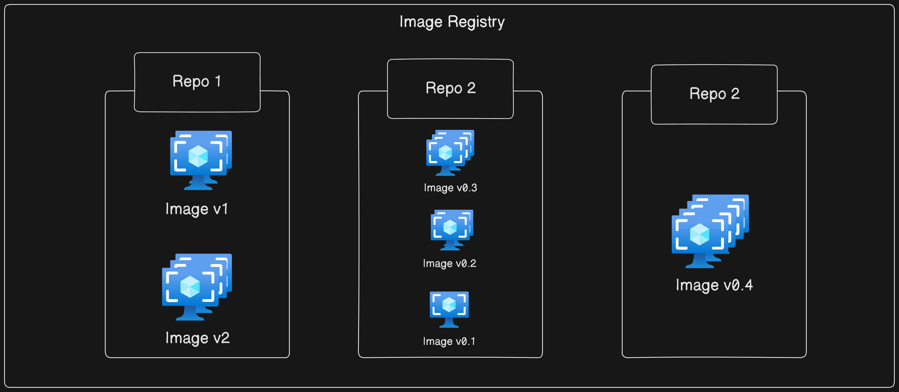

# Docker Images - The Deep Dive

## Images and Containers
A `Docker image` is a lightweight, standalone, and executable software package that includes everything needed to run a piece of software, including the code, runtime, libraries, environment variables, and configuration files. Docker images are built in layers, where each layer represents a filesystem change (e.g., adding a file or installing a package),


On the other hand, A `Docker container` is a runnable instance of a Docker image. Containers are isolated environments that run on a single operating system kernel, sharing the OS but maintaining separate user spaces.

## Image Size is a big issue

The main goal of containers is to execute a single application or service, requiring only the necessary code and dependencies without any extra components. Consequently, container images are compact and stripped of non-essential elements. For instance, the official Alpine Linux image is merely 7MB, as it excludes multiple shells and package managers. Many images even omit a shell or package manager if the application doesn't require them. Containers share the host's kernel, eliminating the need for a kernel in the image. 

Typically, container images include only essential filesystem components and basic structures, hence the phrase "images contain just enough OS." In contrast, Windows-based images are larger due to the nature of the Windows OS, often spanning several gigabytes and requiring more time for push and pull operations.

## Pulling Images
A freshly installed Docker host has no images in its local repository. We can check for existing images and pull new ones using the following commands:

```sh
$ docker images
$ docker pull redis:latest
$ docker pull alpine:latest
```

### Example Outputs
**Linux Example:**

```sh
$ docker pull redis:latest
latest: Pulling from library/redis
Digest: sha256:ea30bef6a1424d032295b90db20a869fc8db76331091543b7a80175cede7d887
Status: Downloaded newer image for redis:latest
docker.io/library/redis:latest

$ docker pull alpine:latest
latest: Pulling from library/alpine
Digest: sha256:02bb6f428431fbc2809c5d1b41eab5a68350194fb508869a33cb1af4444c9b11
Status: Downloaded newer image for alpine:latest
docker.io/library/alpine:latest

$ docker images
REPOSITORY   TAG     IMAGE ID        CREATED       SIZE
alpine       latest  44dd6f223004    9 days ago    7.73MB 
redis        latest  2334573cc576    2 weeks ago   111MB
```

**Windows Example:**

```sh
> docker pull mcr.microsoft.com/powershell:latest
latest: Pulling from powershell
Digest: sha256:fbc9555...123f3bd7
Status: Downloaded newer image for mcr.microsoft.com/powershell:latest
mcr.microsoft.com/powershell:latest

> docker images
REPOSITORY                      TAG      IMAGE ID       CREATED      SIZE
mcr.microsoft.com/powershell    latest   73175ce91dff   2 days ago   495MB
mcr.microsoft.com/.../iis       latest   6e5c6561c432   3 days ago   5.05GB
```

## Image Naming conventions
When pulling an image, specify its name and tag. Images are stored in registries, with Docker Hub being the most common. Images from official repositories are vetted and secure, while unofficial repositories require careful scrutiny.

### Examples:
**Pulling Official Repositories:**

Docker Hub features official repositories, which host images curated and verified by both the application vendor and Docker, Inc. These repositories are expected to maintain up-to-date, high-quality code that meets security standards, is well-documented, and follows best practices.

Most popular applications and operating systems have official repositories on Docker Hub, identifiable by their placement at the top level of the Docker Hub namespace and a green "Docker official image" badge. Some examples include:

- Nginx: [https://hub.docker.com/_/nginx/](https://hub.docker.com/_/nginx/)
- Busybox: [https://hub.docker.com/_/busybox/](https://hub.docker.com/_/busybox/)
- Redis: [https://hub.docker.com/_/redis/](https://hub.docker.com/_/redis/)
- MongoDB: [https://hub.docker.com/_/mongo/](https://hub.docker.com/_/mongo/)

```sh
$ docker pull mongo:4.2.24
$ docker pull busybox:glibc
$ docker pull alpine
```

**Unofficial Repositories:**

In contrast, non-official repositories can be less reliable, akin to the "wild west." While they may contain valuable content, users should exercise caution as these images may lack proper documentation, security measures, or adherence to best practices. It's prudent to be skeptical of software from the internet, including images from official repositories.

Pulling images from an unofficial repository follows a similar process. You need to `prefix` the repository name with a Docker Hub `username` or `organization` name. For instance

```sh
$ docker pull <username>/<repository>:<tag>
```

**Third-Party Registries:**

If you want to pull images from `3rd party registries` (not Docker Hub) you just prepend the repository name with the DNS name of the registry. For example, the following command pulls the 3.1.5 image from the google-containers/git-sync repo on the Google Container Registry (gcr.io).

```sh
$ docker pull gcr.io/google-containers/git-sync:v3.1.5
```

## Image Registries
Registries serve as centralized storage for container images, often implementing the OCI distribution-spec, hence termed OCI registries. They securely store images and facilitate easy access across different environments. Some registries offer additional features like image scanning and integration with build pipelines.

While Docker Hub is the most common registry, others include third-party registries and secure on-premises options. Despite the availability of alternatives, the Docker client defaults to Docker Hub. Consequently, we'll use Docker Hub throughout this book. When configuring Docker, it defaults to using https://index.docker.io/v1/ as its primary registry, which automatically redirects to https://index.docker.io/v2/.



Registries organize images into repositories, each containing one or more images. To illustrate, imagine an image registry with three repositories, and within each repository, there are multiple images. This hierarchical structure can sometimes be confusing, so the figure provides a visual representation.

## Image Naming and Tagging
Tags are arbitrary alpha-numeric values stored as metadata. An image can have multiple tags, allowing flexible versioning.

### Example:

```sh
$ docker images
REPOSITORY               TAG       IMAGE ID       CREATED       SIZE
nigelpoulton/tu-demo     latest    c610c6a38555   22 months ago 58.1MB
nigelpoulton/tu-demo     v1        c610c6a38555   22 months ago 58.1MB
nigelpoulton/tu-demo     v2        6ba12825d092   16 months ago 58.6MB
```

When you don't specify an image tag after the repository name, Docker automatically assumes you're referring to the image tagged as "latest." However, if the repository lacks an image tagged as "`latest`," the command will fail. It's crucial to understand that the "latest" tag doesn't ensure it's the most recent image in the repository.