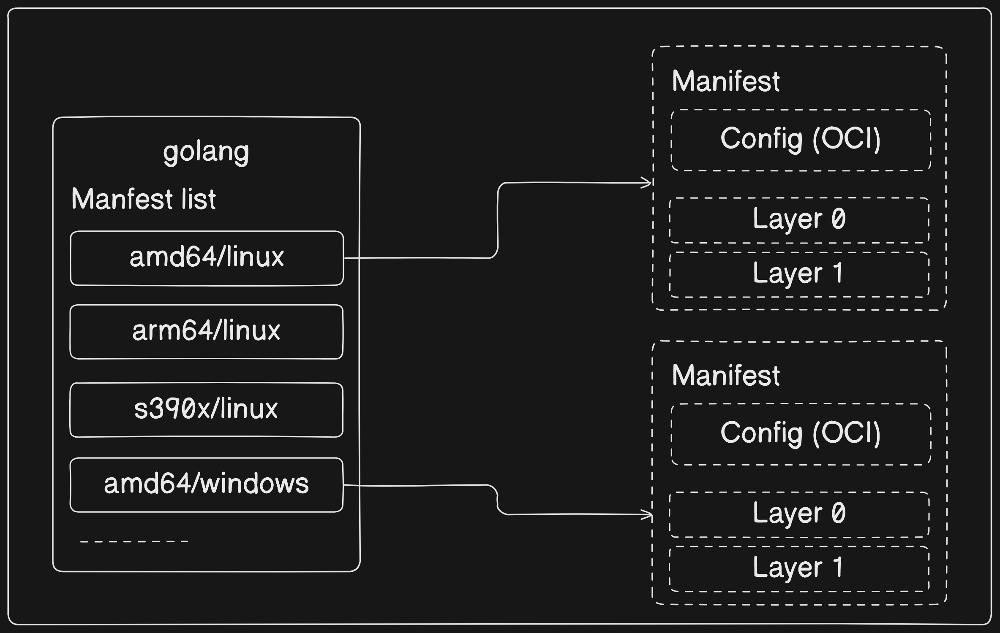

# Docker Image Layer Sharing and Digests

In Docker, **images are the building blocks of containers**. Docker optimizes storage and performance by allowing multiple images to share common layers. This means that if two or more images have the **same layers**, Docker will reuse those layers rather than storing duplicate copies. This sharing mechanism reduces disk space usage and speeds up image operations.

### Usage Scenario

Consider a scenario where you have **multiple versions** of an application stored in separate Docker images. If these versions share common dependencies or configurations, Docker will share the underlying layers among them, saving storage space and improving performance.

### Example

The output of a `docker pull` command with the `-a` flag demonstrates Docker's ability to recognize shared layers:

```sh
$ docker pull -a ubuntu
latest: Pulling from library/ubuntu
...
Digest: sha256:...
Status: Downloaded newer image for ubuntu
docker.io/library/ubuntu:latest

$ docker images
REPOSITORY          TAG       IMAGE ID       CREATED        SIZE
ubuntu              latest    abcdef123456   2 weeks ago    72.9MB
ubuntu              20.04     abcdef123456   2 weeks ago    72.9MB
ubuntu              18.04     123abcdef456   2 weeks ago    69.7MB
```

In this example, we pulled the Ubuntu image with multiple tags (`latest`, `20.04`, `18.04`). The `docker pull -a ubuntu` command downloads all available tags of the Ubuntu image from the Docker Hub repository. The subsequent `docker images` command displays the list of downloaded images, including their repository, tag, image ID, creation date, and size.

The `IMAGE ID` for tags `latest` and `20.04` is the same (`abcdef123456`), indicating that these tags share the same underlying image layers. This demonstrates image layer sharing, where common layers are reused across different versions or tags of the same image, saving storage space and bandwidth.

## Pulling Images by Digests

Using image `tags` for pulling images can lead to **ambiguity and potential issues**, especially when tags are `mutable`. Docker provides a solution to this problem through image digests, which are immutable identifiers based on the contents of the image.

### Explanation

Image digests are `cryptographic` hashes that uniquely identify Docker images. Unlike tags, which can be changed or reused, digests remain constant even if the image content is modified. This ensures that the pulled image matches the expected content, enhancing reliability and security.

### Example

Every time we pull an image, the docker pull command includes the image’s `digest` as part of the information returned. We can also view the digests of images in Docker host’s local repository by adding the `--digests` flag to the docker images command. These are both shown in the following example.


```sh
$ docker pull alpine
Using default tag: latest
latest: Pulling from library/alpine
08409d417260: Pull complete
Digest: sha256:02bb6f42...44c9b11
Status: Downloaded newer image for alpine:latest
docker.io/library/alpine:latest

$ docker images --digests alpine
REPOSITORY   TAG       DIGEST                        IMAGE ID       CREATED      SIZE
alpine       latest    sha256:02bb6f42...44c9b11     44dd6f223004   9 days ago   7.73MB
```
The snipped output above shows the digest for the alpine image as -

`sha256:02bb6f42...44c9b11`


Now that we know the digest of the image, we can use it when pulling the image again. This will ensure that we get exactly the image we expect!

```sh
$ docker pull alpine@sha256:02bb6f428431fbc2809c5d1b41eab5a68350194fb508869a33cb1af4444c9b11
```

Here, the image is pulled using its digest `sha256:02bb6f428431fbc2809c5d1b41eab5a68350194fb508869a33cb1af4444c9b11`, ensuring that the exact image with its immutable content is retrieved.


# Understanding Multi-Architecture Images in Docker

Docker's simplicity has been a key factor in its widespread adoption. However, with technological advancements, Docker's scope has expanded to support different platforms and architectures, such as `Windows and Linux`, on various CPU architectures like `ARM, x64, PowerPC, and s390x`. This evolution has introduced complexities, especially when dealing with images that have multiple versions for different platforms and architectures. This complexity challenged the seamless Docker experience users were accustomed to.

### Definition Clarification

In the context of Docker, "`architecture`" refers to CPU architecture, such as x64 and ARM, while "`platform`" denotes the operating system (OS) or the combination of OS and architecture.

### Introducing Multi-Architecture Images

To address the challenges posed by diverse platforms and architectures, Docker introduced multi-architecture images. These images enable a single image tag, like `golang:latest`, to encompass versions for multiple platforms and architectures. With multi-architecture images, users can simply execute a `docker pull golang:latest` command from any platform or architecture, and Docker automatically retrieves the appropriate image variant.



To facilitate this, Docker Registry API incorporates two essential constructs:

1. **Manifest Lists**: These lists enumerate the architectures supported by a specific image tag. Each architecture entry points to its corresponding manifest containing image configuration and layer data.

2. **Manifests**: Each supported architecture has its manifest detailing the layers used to construct it.

### Operational Overview

When Docker users pull an image, Docker interacts with `Docker Hub`, checking if a `manifest list` exists for the image. If so, Docker parses the list to identify an entry corresponding to the **user's platform and architecture**. Subsequently, Docker retrieves the manifest for the relevant architecture and extracts the cryptographic IDs of its layers. These layers are then fetched from Docker Hub and assembled on the user's Docker host.

### Practical Demonstration

To illustrate the concept, consider the following examples executed on Linux ARM and Windows x64 systems. Both commands initiate a container based on the official golang image and execute the `go version` command. Despite the differing platforms and CPU architectures, Docker seamlessly selects the appropriate image variant:

- **Linux on ARM64 Example**:
```sh
$ docker run --rm golang go version
go version go1.20.4 linux/arm64
```
- **Windows on x64 Example**:
```sh
> docker run --rm golang go version
go version go1.20.4 windows/amd64
```

### Manifest Inspection

The `docker manifest` command allows users to examine the manifest list of any image on Docker Hub. The following example inspects the manifest list for the golang image, showcasing support for Linux and Windows across various CPU architectures.

```sh
$ docker manifest inspect golang | grep 'architecture\|os'
"architecture": "amd64",
            "os": "linux"
            "architecture": "arm",
            "os": "linux",
            "architecture": "arm64",
            "os": "linux",
            "architecture": "386",
            "os": "linux"
            "architecture": "mips64le",
            "os": "linux"
            "architecture": "ppc64le",
            "os": "linux"
            "architecture": "s390x",
            "os": "linux"
            "architecture": "amd64",
            "os": "windows",
            "os.version": "10.0.20348.1726"
            "architecture": "amd64",
            "os": "windows",
            "os.version": "10.0.17763.4377"
```
All official images have manifest lists.

### Conclusion

Multi-architecture images represent Docker's commitment to flexibility and compatibility across diverse environments. By seamlessly accommodating multiple platforms and architectures under a single image tag, Docker enhances the user experience and simplifies image management across heterogeneous infrastructures.