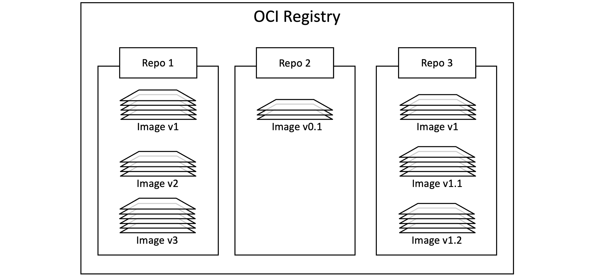

# Docker images - The deep dive

We’ve mentioned a couple of times already that images are like stopped containers. In fact, you can stop a container and create a new image from it. With this in mind, images are considered build-time constructs, whereas containers are run-time constructs.


## Images and containers
Figure 6.1 shows high-level view of the relationship between images and containers. We use the docker run and docker service create commands to start one or more containers from a single image. Once you’ve started a container from an image, the two constructs become dependent on each other, and you cannot delete the image until the last container using it has been stopped and destroyed.

## Images are usually small
The whole purpose of a container is to run a single application or service. This means it only needs the code and dependencies of the app it’s running — it doesn’t need anything else. This means images are also small and stripped of all non-essential parts.

For example, at the time of writing the official Alpine Linux image is 7MB. This is because it doesn’t ship with 6 different shells, three different package managers and more… In fact, a lot of images ship without a shell or a package manager – if the application doesn’t need it, it doesn’t get included in the image.

Images don’t include a kernel. This is because containers share the kernel of the host they’re running on. It’s normal for the only OS components included in an image to be a few important filesystem components and other basic constructs. This is why you’ll sometimes hear people say “images contain just enough OS”.

Windows-based images tend to be a lot bigger than Linux-based images because of the way the Windows OS works. It’s not uncommon for Windows images to be several gigabytes and take a long time to push and pull.

## Pulling images
A cleanly installed Docker host has no images in its local repository.

The local image repository on a Linux host is usually in `/var/lib/docker/``<storage-driver>`. If you’re using Docker on your Mac or PC with Docker Desktop, everything runs inside of a VM.

You can use the following command to check if your Docker host has any images in its local repository.

```sh
$ docker images
```

REPOSITORY  TAG      IMAGE ID       CREATED         SIZE
The process of getting images onto a Docker host is called pulling. So, if you want the latest Busybox image on your Docker host, you’d have to pull it. Use the following commands to pull some images and then check their sizes.

If you are following along on Linux and haven’t added your user account to the local docker Unix group, you may need to add sudo to the beginning of all the following commands.

**Linux example:**
```sh
$ docker pull redis:latest
latest: Pulling from library/redis
b5d25b35c1db: Pull complete
6970efae6230: Pull complete
fea4afd29d1f: Pull complete
7977d153b5b9: Pull complete
7945d827bd72: Pull complete
b6aa3d1ce554: Pull complete
Digest: sha256:ea30bef6a1424d032295b90db20a869fc8db76331091543b7a80175cede7d887
Status: Downloaded newer image for redis:latest
docker.io/library/redis:latest

$ docker pull alpine:latest
latest: Pulling from library/alpine
08409d417260: Pull complete
Digest: sha256:02bb6f428431fbc2809c5d1b41eab5a68350194fb508869a33cb1af4444c9b11
Status: Downloaded newer image for alpine:latest
docker.io/library/alpine:latest

$ docker images
REPOSITORY   TAG     IMAGE ID        CREATED       SIZE
alpine       latest  44dd6f223004    9 days ago    7.73MB 
redis        latest  2334573cc576    2 weeks ago   111MB
Windows example:

> docker pull mcr.microsoft.com/powershell:latest
latest: Pulling from powershell
5b663e3b9104: Pull complete 
9018627900ee: Pull complete     
133ab280ee0f: Pull complete    
084853899645: Pull complete  
399a2a3857ed: Pull complete   
6c1c6d29a559: Pull complete  
d1495ba41b1c: Pull complete  
190bd9d6eb96: Pull complete  
7c239384fec8: Pull complete    
21aee845547a: Pull complete  
f951bda9026b: Pull complete  
Digest: sha256:fbc9555...123f3bd7
Status: Downloaded newer image for mcr.microsoft.com/powershell:latest
mcr.microsoft.com/powershell:latest

> docker images
REPOSITORY                      TAG      IMAGE ID       CREATED      SIZE
mcr.microsoft.com/powershell    latest   73175ce91dff   2 days ago   495MB
mcr.microsoft.com/.../iis       latest   6e5c6561c432   3 days ago   5.05GB
```

As you can see, the images are now present in the Docker host’s local repository. You can also see that the Windows images are a lot larger and comprise many more layers.

## Image naming
When pulling an image, you have to specify the name of the image you’re pulling. Let’s take a minute to look at image naming. To do that we need a bit of background on how images are stored.

## Image registries
We store images in centralised places called registries. Most modern registries implement the OCI distribution-spec and we sometimes call them OCI registries. The job of a registry is to securely store container images and make them easy to access from different environments. Some registries offer advanced services such as image scanning and integration with build pipelines.

The most common registry is Docker Hub, but others exist including 3rd-party registries and secure on-premises registries. However, the Docker client is opinionated and defaults to using Docker Hub. We’ll be using Docker Hub for the rest of the book.

The output of the following command is snipped, but you can see that Docker is configured to use https://index.docker.io/v1/ as its default registry. This automatically redirects to https://index.docker.io/v2/.

```sh
$ docker info
 <Snip>
 Default Runtime: runc
 containerd version: 2806fc1057397dbaeefbea0e4e17bddfbd388f38
 runc version: v1.1.5-0-gf19387a
 Registry: https://index.docker.io/v1/
 <Snip>
```
Image registries contain one or more image repositories. In turn, image repositories contain one or more images. That might be a bit confusing, so Figure 6.2 shows a picture of an image registry with 3 repositories, and each repository has one or more images.



## Official repositories
Docker Hub has the concept of official repositories.

As the name suggests, official repositories are the home to images that have been vetted and curated by the application vendor and Docker, Inc. This means they should contain up-to-date, high-quality code, that is secure, well-documented, and in-line with best practices.

If a repository isn’t an official repository it can be like the wild-west — you should not assume they are safe, well-documented or built according to best practices. That’s not saying the images they contain are bad. There’s some excellent stuff in unofficial repositories. You just need to be very careful before trusting code from them. To be honest, you should never trust software from the internet — even images from official repositories.

Most of the popular applications and operating systems have official repositories on Docker Hub. They’re easy to spot because they live at the top level of the Docker Hub namespace and have a green “Docker official image” badge. The following list shows a few official repositories and their URLs that exist at the top-level of the Docker Hub namespace:

- nginx: https://hub.docker.com/_/nginx/
- busybox: https://hub.docker.com/_/busybox/
- redis: https://hub.docker.com/_/redis/
- mongo: https://hub.docker.com/_/mongo/

On the other hand, my own personal images live in the wild west of unofficial repositories and should not be trusted. Here are some examples of images in my repositories:

- nigelpoulton/tu-demo — https://hub.docker.com/r/nigelpoulton/tu-demo/
- nigelpoulton/pluralsight-docker-ci — https://hub.docker.com/r/nigelpoulton/pluralsight-docker-ci/

Not only are images in my repositories not vetted, not kept up-to-date, not secure, and not well documented… they also don’t live at the top-level of the Docker Hub namespace. My repositories all live within the nigelpoulton second-level namespace.

After all of that, we can finally look at how we address images on the Docker command line.

## Image naming and tagging
Addressing images from official repositories is as simple as providing the repository name and tag separated by a colon (:). The format for docker pull, when working with an image from an official repository is:

```sh
$ docker pull <repository>:<tag>
```
In the Linux examples from earlier, we pulled an Alpine and a Redis image with the following two commands:

```sh
$ docker pull alpine:latest
$ docker pull redis:latest`
```

These pulled the images tagged as “latest” from the top-level “alpine” and “redis” repositories.

The following examples show how to pull various different images from official repositories:

```sh
$ docker pull mongo:4.2.24
# This will pull the image tagged as `4.2.24` from the official `mongo` repository.

$ docker pull busybox:glibc
# This will pull the image tagged as `glibc` from the official `busybox` repository.

$ docker pull alpine
# This will pull the image tagged as `latest` from the official `alpine` repository.
```

### A couple of points about those commands.

- First, if you do not specify an image tag after the repository name, Docker will assume you are referring to the image tagged as latest. If the repository doesn’t have an image tagged as latest the command will fail.

- Second, the latest tag doesn’t have any magical powers. Just because an image is tagged as latest does not guarantee it is the most recent image in the repository!

Pulling images from an unofficial repository is essentially the same — you just need to prepend the repository name with a Docker Hub username or organization name. The following example shows how to pull the v2 image from the tu-demo repository owned by a not-to-be-trusted person whose Docker Hub account name is nigelpoulton.

```sh
$ docker pull nigelpoulton/tu-demo:v2
```

This will pull the image tagged as `v2` from the `tu-demo` repository within the `nigelpoulton` namespace.

If you want to pull images from `3rd party registries` (not Docker Hub) you just prepend the repository name with the DNS name of the registry. For example, the following command pulls the 3.1.5 image from the google-containers/git-sync repo on the Google Container Registry (gcr.io).

```sh
$ docker pull gcr.io/google-containers/git-sync:v3.1.5
v3.1.5: Pulling from google-containers/git-sync
597de8ba0c30: Pull complete 
b263d8e943d1: Pull complete 
a20ed723abc0: Pull complete 
49535c7e3a51: Pull complete 
4a20d0825f07: Pull complete 
Digest: sha256:f38673f25b8...b5f8f63c4da7cc6
Status: Downloaded newer image for gcr.io/google-containers/git-sync:v3.1.5
gcr.io/google-containers/git-sync:v3.1.5
```
Notice how the pull experience is exactly the same from Docker Hub and other registries.

## Images with multiple tags
One final word about image tags… A single image can have as many tags as you want. This is because tags are arbitrary alpha-numeric values that are stored as metadata alongside the image.

At first glance, the following output appears to show three images. However, on closer inspection it’s actually two images – the image with the c610c6a38555 ID is tagged as latest as well as v1.

```sh
$ docker images
REPOSITORY               TAG       IMAGE ID       CREATED       SIZE
nigelpoulton/tu-demo     latest    c610c6a38555   22 months ago   58.1MB
nigelpoulton/tu-demo     v1        c610c6a38555   22 months ago   58.1MB
nigelpoulton/tu-demo     v2        6ba12825d092   16 months ago   58.6MB
```
This is a perfect example of the warning issued earlier about the latest tag. In this example, the latest tag refers to the same image as the v1 tag. This means it’s pointing to the older of the two images! Moral of the story, latest is an arbitrary tag and is not guaranteed to point to the newest image in a repository!


# Filtering the output of docker images
Docker provides the **--filter** flag to filter the list of images returned by docker images.

The following example will only return dangling images.

```sh
$ docker images --filter dangling=true
REPOSITORY    TAG       IMAGE ID       CREATED       SIZE
<none>        <none>    4fd34165afe0   7 days ago    14.5MB
```
The following example will only return images with the nigelpoulton/tu-demo repository name.

**A dangling image** is an image that is no longer tagged and appears in listings as **<none>:<none>.** A common way they occur is when building a new image with a tag that already exists. When this happens, Docker will build the new image, notice that an existing image already has the same tag, remove the tag from the existing image and give it to the new image.

Consider this example, you build a new application image based on `alpine:3.4` and tag it as `dodge:challenger`. Then you update the image to use `alpine:3.5` instead of `alpine:3.4`. When you build the new image, the operation will create a new image tagged as dodge:challenger and remove the tags from the old image. The old image will become a dangling image.

You can delete all dangling images on a system with the `docker image prune` command. If you add the `-a` flag, Docker will also remove all unused images (those not in use by any containers).

Docker currently supports the following filters:

- dangling: Accepts true or false, and returns only dangling images (true), or non-dangling images (false).
- before: Requires an image name or ID as argument, and returns all images created before it.
- since: Same as above, but returns images created after the specified image.
- label: Filters images based on the presence of a label or label and value. The docker images command does not display labels in its output.
- reference: Filters images based on their reference (i.e., their name and tag).

For all other filtering you can use `reference`.

Here’s an example using reference to display only images tagged as `“latest”`. At the time of writing this works on some Docker installations and not others (possibly not working on systems that use containerd for image management).

```sh
$ docker images --filter=reference="*:latest"
REPOSITORY   TAG       IMAGE ID       CREATED       SIZE
busybox      latest    3596868f4ba8   7 days ago    3.72MB
alpine       latest    44dd6f223004   9 days ago    7.73MB
redis        latest    2334573cc576   2 weeks ago   111MB
```
You can also use the `--format` flag to format output using **Go templates**. For example, the following command will only return the size property of images on a Docker host.

```sh
$ docker images --format "{{.Size}}"
3.72MB
7.73MB
111MB
265MB
58.1MB
```
Use the following command to return all images, but only display repo, tag and size.

```sh
$ docker images --format "{{.Repository}}: {{.Tag}}: {{.Size}}"
busybox: latest: 3.72MB
alpine: latest: 7.73MB
redis: latest: 111MB
portainer/portainer-ce: latest: 265MB
nigelpoulton/tu-demo: latest: 58.1MB
```

If you need more powerful filtering, you can always use the tools provided by your `OS and shell` such as `grep` and `awk`. You may also find a **Docker Desktop extension** that’s useful.

## Searching Docker Hub from the CLI
The docker search command lets you search Docker Hub from the CLI. It has limited value as you can only pattern-match against strings in the **“NAME”** field. However, you can filter output based on any of the returned columns.

In its simplest form, it searches for all repos containing a certain string in the “NAME” field. For example, the following command searches for all repos with “nigelpoulton” in the “NAME” field.

```sh
$ docker search nigelpoulton
NAME                         DESCRIPTION               STARS   AUTOMATED
nigelpoulton/pluralsight..   Web app used in...        22       [OK]
nigelpoulton/tu-demo                                   12
nigelpoulton/k8sbook         Kubernetes Book web app   2
nigelpoulton/workshop101     Kubernetes 101 Workshop
```

The “NAME” field is the repository name. This includes the Docker ID, or organization name, for unofficial repositories. For example, the following command lists all repositories that include the string “alpine” in the name.
```sh
$ docker search alpine
NAME                   DESCRIPTION          STARS    OFFICIAL    AUTOMATED
alpine                 A minimal Docker..   9962     [OK]
rancher/alpine-git                             1
grafana/alpine         Alpine Linux with..     4
```
Notice how some of the repositories returned are official and some are unofficial. You can use `--filter` `"is-official=true"` so that only official repos are displayed.
```sh
$ docker search alpine --filter "is-official=true"
NAME                   DESCRIPTION          STARS    OFFICIAL    AUTOMATED
alpine                 A minimal Docker..   9962     [OK]
```
One last thing about docker search. By default, Docker will only display 25 lines of results. However, you can use the `--limit` flag to increase that to a maximum of 100.


# Images and layers
A Docker image is a collection of loosely-connected read-only layers where each layer comprises one or more files. Figure 6.3 shows an image with 5 layers.


Docker takes care of stacking the layers and representing them as a single unified object.

There are a few ways to see and inspect the layers that make up an image. In fact, we saw one earlier when pulling images. The following example looks closer at an image pull operation.

```sh
$ docker pull ubuntu:latest
latest: Pulling from library/ubuntu
952132ac251a: Pull complete
82659f8f1b76: Pull complete
c19118ca682d: Pull complete
8296858250fe: Pull complete
24e0251a0e2c: Pull complete
Digest: sha256:f4691c96e6bbaa99d...28ae95a60369c506dd6e6f6ab
Status: Downloaded newer image for ubuntu:latest
docker.io/ubuntu:latest
```

Each line in the output above that ends with “Pull complete” represents a layer in the image the was pulled. As we can see, this image has 5 layers and is shown in Figure 6.4 with layer IDs.


Another way to see the layers of an image is to inspect the image with the docker inspect command. The following example inspects the same ubuntu:latest image.

```sh
$ docker inspect ubuntu:latest
[
    {
        "Id": "sha256:bd3d4369ae.......fa2645f5699037d7d8c6b415a10",
        "RepoTags": [
            "ubuntu:latest"
        "RootFS": {
            "Type": "layers",
            "Layers": [
                "sha256:c8a75145fc...894129005e461a43875a094b93412",
                "sha256:c6f2b330b6...7214ed6aac305dd03f70b95cdc610",
                "sha256:055757a193...3a9565d78962c7f368d5ac5984998",
                "sha256:4837348061...12695f548406ea77feb5074e195e3",
                "sha256:0cad5e07ba...4bae4cfc66b376265e16c32a0aae9"
            ]
        }
    }
]
```

The trimmed output shows 5 layers again. Only this time they’re shown using their `SHA256 hashes`.

The docker `inspect` command is a great way to see the details of an image.

The docker `history` command is another way of inspecting an image and seeing layer data. However, it shows the build history of an image and is not a strict list of layers in the final image. For example, some Dockerfile instructions `(“ENV”, “EXPOSE”, “CMD”, and “ENTRYPOINT”)` add metadata to the image and do not create a layer.

All Docker images start with a base layer, and as changes are made and new content is added, new layers are added on top.

Consider the following oversimplified example of building a simple Python application. You might have a corporate policy that all applications are based on the official Ubuntu 22:04 image. This would be your image’s base layer. Adding the Python package will add a second layer on top of the base layer. If you later add source code files, these will be added as additional layers. The final image will have three layers as shown in Figure 6.5 (remember this is an over-simplified example for demonstration purposes).


It’s important to understand that as additional layers are added, the image is always the combination of all layers stacked in the order they were added. Take a simple example of two layers as shown in Figure 6.6. Each layer has 3 files, but the overall image has 6 files as it is the combination of both layers.


Note: We’ve shown the image layers in Figure 6.6 in a slightly different way to previous figures. This is just to make showing the files easier.

In the slightly more complex example of the three-layer image in Figure 6.7, the overall image only presents 6 files in the unified view. This is because File 7 in the top layer is an updated version of File 5 directly below (inline). In this situation, the file in the higher layer obscures the file directly below it. This allows updated versions of files to be added as new layers to the image.


Docker employs a storage driver that is responsible for stacking layers and presenting them as a single unified filesystem/image. Examples of storage drivers on Linux include overlay2, devicemapper, btrfs and zfs. As their names suggest, each one is based on a Linux filesystem or block-device technology, and each has its own unique performance characteristics.

No matter which storage driver is used, the user experience is the same.

Figure 6.8 shows the same 3-layer image as it will appear to the system. I.e. all three layers stacked and merged, giving a single unified view.


## Sharing image layers
Multiple images can, and do, share layers. This leads to efficiencies in space and performance.

The following example shows the output of a docker pull command with the -a flag. This can be used to download all images in a repository. The command has limitations and may fail if the repository has images for multiple platforms and architectures such as Linux and Windows, or amd64 and arm64.

```sh
$ docker pull -a nigelpoulton/tu-demo
latest: Pulling from nigelpoulton/tu-demo
aad63a933944: Pull complete 
f229563217f5: Pull complete 
Digest: sha256:c9f8e18822...6cbb9a74cf

v1: Pulling from nigelpoulton/tu-demo
aad63a933944: Already exists 
f229563217f5: Already exists 

fc669453c5af: Pull complete 
Digest: sha256:674cb03444...f8598e4d2a

v2: Pulling from nigelpoulton/tu-demo
Digest: sha256:c9f8e18822...6cbb9a74cf
Status: Downloaded newer image for nigelpoulton/tu-demo
docker.io/nigelpoulton/tu-demo

$ docker images
REPOSITORY             TAG       IMAGE ID       CREATED       SIZE
nigelpoulton/tu-demo   latest    d5e1e48cf932   2 weeks ago   104MB
nigelpoulton/tu-demo   v2        d5e1e48cf932   2 weeks ago   104MB
nigelpoulton/tu-demo   v1        6852022de69d   2 weeks ago   104MB
```

Notice the lines ending in Already exists.

These lines tell us that Docker is smart enough to recognize when it’s being asked to pull an image layer that it already has a local copy of. In this example, Docker pulled the image tagged as latest first. Then, when it pulled the v1 and v2 images, it noticed that it already had some of the layers that make up those images. This happens because the three images in this repository are almost identical, and therefore share many layers. In fact, the only difference between v1 and v2 is the top layer.

As mentioned previously, Docker on Linux supports many storage drivers. Each is free to implement image layering, layer sharing, and copy-on-write (CoW) behaviour in its own way. However, the end result and user experience is the same.

## Pulling images by digest
So far, we’ve shown you how to pull images using their name (tag). This is by far the most common method, but it has a problem — tags are mutable! This means it’s possible to accidentally tag an image with the wrong tag (name). Sometimes, it’s even possible to tag an image with the same tag as an existing, but different, image. This can cause problems!

As an example, imagine you’ve got an image called golftrack:1.5 and it has a known bug. You pull the image, apply a fix, and push the updated image back to its repository using the same tag.

Take a moment to consider what happened there… You have an image called golftrack:1.5 that has a bug. That image is being used by containers in your production environment. You create a new version of the image that includes a fix. Then comes the mistake… you build and push the fixed image back to its repository with the same tag as the vulnerable image!. This overwrites the original image and leaves you without a great way of knowing which of your production containers are using the vulnerable image and which are using the fixed image — they both have the same tag!

This is where image digests come to the rescue.

Docker supports content addressable storage model. As part of this model, all images get a cryptographic content hash. For the purposes of this discussion, we’ll call this hash as the digest. As the digest is a hash of the contents of the image, it’s impossible to change the contents of the image without creating a new unique digest. Put another way, you cannot change the content of an image and keep the old digest. This means digests are immutable and provide a solution to the problem we just mentioned.

Every time you pull an image, the docker pull command includes the image’s digest as part of the information returned. You can also view the digests of images in your Docker host’s local repository by adding the --digests flag to the docker images command. These are both shown in the following example.

```sh
$ docker pull alpine
Using default tag: latest
latest: Pulling from library/alpine
08409d417260: Pull complete
Digest: sha256:02bb6f42...44c9b11
Status: Downloaded newer image for alpine:latest
docker.io/library/alpine:latest

$ docker images --digests alpine
REPOSITORY   TAG       DIGEST                        IMAGE ID       CREATED      SIZE
alpine       latest    sha256:02bb6f42...44c9b11     44dd6f223004   9 days ago   7.73MB
```
The snipped output above shows the digest for the alpine image as -

`sha256:02bb6f42...44c9b11`

Now that we know the digest of the image, we can use it when pulling the image again. This will ensure that we get exactly the image we expect!

At the time of writing, there is no native Docker command that will retrieve the digest of an image from a remote registry such as Docker Hub. This means the only way to determine the digest of an image is to pull it by tag and then make a note of its digest. This may change in the future.

The following example deletes the alpine:latest image from your Docker host and then shows how to pull it again using its digest instead of its tag. The actual digest is truncated in the book so that it fits on one line. Substitute this for the real digest of the version you pulled on your own system.

```sh
$ docker rmi alpine:latest
Untagged: alpine:latest
Untagged: alpine@sha256:02bb6f428431fbc2809c5d1b41eab5a68350194fb508869a33cb1af4444c9b11
Deleted: sha256:44dd6f2230041eede4ee5e792728313e43921b3e46c1809399391535c0c0183b
Deleted: sha256:94dd7d531fa5695c0c033dcb69f213c2b4c3b5a3ae6e497252ba88da87169c3f

$ docker pull alpinesha256:02bb6f42...44c9b11
docker.io/library/alpine@sha256:02bb6f42...44c9b11: Pulling from library/alpine
08409d417260: Pull complete
Digest: sha256:02bb6f428431...9a33cb1af4444c9b11
Status: Downloaded newer image for alpine@sha256:02bb6f428431...9a33cb1af4444c9b11
docker.io/library/alpine@sha256:02bb6f428431...9a33cb1af4444c9b11
```

## A little bit more about image hashes (digests)
As previously mentioned, an image is a loose collection of independent layers.

In some ways, the image is just a manifest file that lists the layers and some metadata. The application and dependencies live in the layers and each layer is fully independent with no concept of being part of something bigger.

Each image is identified by a crypto ID that is a hash of the manifest file. Each layer is identified by a crypto ID that is a hash of the layer content.

This means that changing the contents of the image, or any of its layers, will cause the associated crypto hashes to change. As a result, images and layers are immutable and we can easily identify if changes have been made.

So far, things are pretty simple. But they’re about to get a bit more complicated.

When we push and pull images, the layers are compressed to save network bandwidth and storage space in the registry. However, compressed content is different to uncompressed content. As a result, content hashes no longer match after push or pull operations.

This presents various problems. For example, Docker Hub verifies every pushed layer to make sure it wasn’t tampered with en route. To do this, it runs a hash against the layer content and checks it against the hash that was sent. As the layer was compressed the hash verification will fail.

To get around this, each layer also gets something called a distribution hash. This is a hash of the compressed version of the layer and is included with every layer pushed and pulled to a registry. This is used to verify that the layer arrived without being tampered with.


## Multi-architecture images
One of the best things about Docker is its simplicity. However, as technologies grow they get more complex. This happened for Docker when it started supporting different platforms and architectures such as Windows and Linux, on variations of ARM, x64, PowerPC, and s390x. All of a sudden, popular images had versions for different platforms and architectures and as users we had to add extra steps to make sure we were pulling the right version for our environments. This broke the smooth Docker experience.

Note: We’re using the term “architecture” to refer to CPU architecture such as x64 and ARM. We use the term “platform” to refer to either the OS (Linux or Windows) or the combination of OS and architecture.

**Multi-architecture images to the rescue!**

Fortunately, there’s a slick way of supporting multi-arch images. This means a single image, such as golang:latest, can have images for Linux on x64, Linux on PowerPC, Windows x64, Linux on different versions of ARM, and more. To be clear, we’re talking about a single image tag supporting multiple platforms and architectures. We’ll see it in action in a second, but it means you can run a simple docker pull golang:latest from any platform or architecture and Docker will pull the correct image.

To make this happen, the Registry API supports two important constructs:

- manifest lists
- manifests

The manifest list is exactly what it sounds like: a list of architectures supported by a particular image tag. Each supported architecture then has its own manifest that lists the layers used to build it.

Figure 6.9 uses the official golang image as an example. On the left is the manifest list with entries for each architecture the image supports. The arrows show that each entry in the manifest list points to a manifest containing image config and layer data.


Let’s look at the theory before seeing it in action.

Assume you’re running Docker on a Raspberry Pi (Linux on ARM). When you pull an image, Docker makes the relevant calls to Docker Hub. If a manifest list exists for the image, it will be parsed to see if an entry exists for Linux on ARM. If it exists, the manifest for the Linux ARM image is retrieved and parsed for the crypto ID’s of the layers. Each layer is then pulled from Docker Hub and assembled on the Docker host.

Let’s see it in action.

The following examples start are from a Linux ARM system and a Windows x64 system. Both start a new container based the official golang image and run the go version command. The outputs show the version of Go as well as the platform and CPU architecture of the host. Notice how both commands are exactly the same and Docker takes care of getting the right image for the platform and architecture!

Linux on arm64 example:

```sh
$ docker run --rm golang go version
<Snip>
go version go1.20.4 linux/arm64
Windows on x64 example:

> docker run --rm golang go version

go version go1.20.4 windows/amd64
```
The Windows Golang image is currently over 2GB in size and may take a long time to download.

The `‘docker manifest’` command lets you inspect the manifest list of any image on Docker Hub. The following example inspects the manifest list on Docker Hub for the golang image. You can see that Linux and Windows are supported on various CPU architectures. You can run the same command without the grep filter to see the full JSON manifest list.

```sh
$ docker manifest inspect golang | grep 'architecture\|os'
            "architecture": "amd64",
            "os": "linux"
            "architecture": "arm",
            "os": "linux",
            "architecture": "arm64",
            "os": "linux",
            "architecture": "386",
            "os": "linux"
            "architecture": "mips64le",
            "os": "linux"
            "architecture": "ppc64le",
            "os": "linux"
            "architecture": "s390x",
            "os": "linux"
            "architecture": "amd64",
            "os": "windows",
            "os.version": "10.0.20348.1726"
            "architecture": "amd64",
            "os": "windows",
            "os.version": "10.0.17763.4377"
```

All official images have manifest lists.


You can create your own builds for different platforms and architectures with docker buildx and then use docker manifest create to create your own manifest lists.

The following command builds an image for ARMv7 called myimage:arm-v7 from the current directory. It’s based on code in **https://github.com/nigelpoulton/psweb**.

```sh
$ docker buildx build --platform linux/arm/v7 -t myimage:arm-v7 .
[+] Building 43.5s (11/11) FINISHED
 => [internal] load build definition from Dockerfile          0.0s
 => => transferring dockerfile: 368B                          0.0s
 <Snip>
 => => exporting manifest list sha256:2a621c3d06...84f9395d6  0.0s
 => => naming to docker.io/library/myimage:arm-v7             0.0s
 => => unpacking to docker.io/library/myimage:arm-v7          0.8s
```
The beauty of the command is that you don’t have to run it from an ARMv7 Docker node. In fact, the example shown was ran on Linux on x64 hardware.

## Deleting Images
When you no longer need an image on your Docker host, you can delete it with the docker rmi command. rmi is short for remove image.

Deleting an image will remove the image and all of its layers from your Docker host. This means it will no longer show up in docker images commands and all directories on the Docker host containing the layer data will be deleted. However, if an image layer is shared by another image, it won’t be deleted until all images that reference it have been deleted.

Delete the images pulled in the previous steps with the docker rmi command. The following example deletes an image by its ID, this might be different on your system.

```sh
$ docker rmi 44dd6f223004
Untagged: alpine@sha256:02bb6f428431fbc2809c5d1...9a33cb1af4444c9b11
Deleted: sha256:44dd6f2230041eede4ee5e7...09399391535c0c0183b
Deleted: sha256:94dd7d531fa5695c0c033dc...97252ba88da87169c3f
```
You can list multiple images on the same command by separating them with whitespace like the following.
```sh
$ docker rmi f70734b6a266 a4d3716dbb72
```
You won’t be able to delete an image if it’s in use by a running container. You’ll need to stop and delete any containers before deleting the image.

A handy shortcut for deleting all images on a Docker host is to run the docker rmi command and pass it a list of all image IDs on the system by calling docker images with the -q flag. This is shown next.

If you are following along on a Windows system, this will only work in a PowerShell terminal. It will not work on a CMD prompt.
```sh
$ docker rmi $(docker images -q) -f
```
To understand how this works, download a couple of images and then run docker images -q.
```sh
$ docker pull alpine
Using default tag: latest
latest: Pulling from library/alpine
08409d417260: Pull complete
Digest: sha256:02bb6f428431fbc2809c5...a33cb1af4444c9b11
Status: Downloaded newer image for alpine:latest
docker.io/library/alpine:latest

$ docker pull ubuntu
Using default tag: latest
latest: Pulling from library/ubuntu
79d0ea7dc1a8: Pull complete
Digest: sha256:dfd64a3b4296d8c9b62aa3...ee20739e8eb54fbf
Status: Downloaded newer image for ubuntu:latest
docker.io/library/ubuntu:latest

$ docker images -q
44dd6f223004
3f5ef9003cef
See how docker images -q returns a list containing just the image IDs of all local images. Passing this list to docker rmi will delete all images on the system as shown next.

$ docker rmi $(docker images -q) -f
Untagged: alpine:latest
Untagged: alpine@sha256:02bb6f428431fb...a33cb1af4444c9b11
Deleted: sha256:44dd6f2230041...09399391535c0c0183b
Deleted: sha256:94dd7d531fa56...97252ba88da87169c3f
Untagged: ubuntu:latest
Untagged: ubuntu@sha256:dfd64a3b4296d8...9ee20739e8eb54fbf
Deleted: sha256:3f5ef9003cefb...79cb530c29298550b92
Deleted: sha256:b49483f6a0e69...f3075564c10349774c3

$ docker images
REPOSITORY     TAG    IMAGE ID    CREATED     SIZE
```