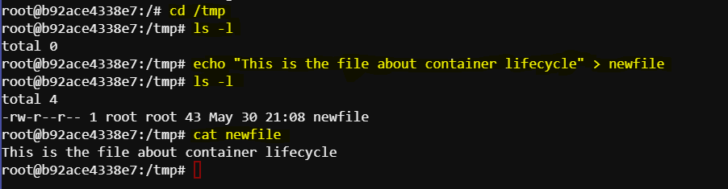

# The Lifecycle of a Container


This document outlines the lifecycle of a Docker container, from creation to deletion, using the example of a container named "percy."

## 1. Creating and Starting a Container

To create and start a Docker container, use the `docker run` command. This example names the container "percy" and starts an interactive bash shell within an Ubuntu container:

```sh
docker run --name percy -it ubuntu:latest /bin/bash
```

Once the command is executed, we are placed inside the container shell:

```sh
root@b92ace4338e7:/# 
```

## 2. Writing Data to the Container

Within the container, we can write data to the filesystem. The following commands navigate to the `/tmp` directory, create a new file, and verify its contents:

```sh
cd /tmp
ls -l
```

Now, create a file named `newfile` in this directory:

```sh
echo "This is the file about container lifecycle" > newfile
ls -l
```

View the data of the file using:

```sh
cat newfile
```



## 3. Stopping the Container

Press Ctrl-PQ to exit the container without killing it. To stop the container, use the `docker stop` command:

```sh
docker stop percy
```

Stopping a container is like putting it on vacation—it stops running but retains its data and configuration.

## 4. Listing Containers

To verify the container's status, list all running containers:

```sh
docker ps
```

Since the container is stopped, it won't appear in the list. To show all containers, including stopped ones, use:

```sh
docker ps -a
```

We should see an output similar to this:

```sh
CONTAINER ID   IMAGE           COMMAND       CREATED          STATUS                        PORTS     NAMES
b92ace4338e7   ubuntu:latest   "/bin/bash"   12 minutes ago   Exited (137) 26 seconds ago             percy
```

## 5. Restarting the Container

Restart the stopped container with the `docker start` command:

```sh
docker start percy
```

Check the running containers again:

```sh
docker ps
```

Now, the container should be running again and we should see an output similar to this:

```sh
CONTAINER ID   IMAGE           COMMAND       CREATED          STATUS         PORTS     NAMES
b92ace4338e7   ubuntu:latest   "/bin/bash"   14 minutes ago   Up 4 seconds             percy
```


## 6. Verifying Data Persistence

Reattach to the container to verify the data persistence:

```sh
docker exec -it percy bash
```

Check the file created earlier:

```sh
cd /tmp
ls -l
cat newfile
```

we should see an output similar to this:

```sh
This is the file about container lifecycle
```
This demonstrates that the data persisted even after the container was stopped and restarted.

## 7. Deleting the Container

Press Ctrl-PQ to exit the container without killing it. To delete the container, first stop it if it’s running:

```sh
docker stop percy
```

Then remove the container:

```sh
docker rm percy
```

Verify the container has been deleted:

```sh
docker ps -a
```
No containers should be listed. 

## Conclusion

This document outlined the lifecycle of a Docker container through the example of a container named "percy". We covered how to create, start, stop, restart, and delete a container, as well as how to verify data persistence within the container. By following these steps, we can effectively manage Docker containers and understand their lifecycle.
