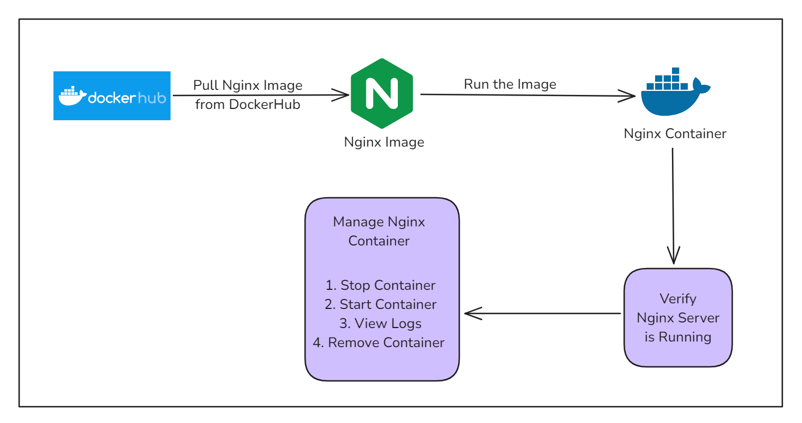

# Running an NGINX Web Server in a Docker Container

This guide provides step-by-step instructions to set up and run an NGINX web server inside a Docker container. NGINX is a powerful web server and reverse proxy widely used for serving static content, load balancing, and more. Docker is a platform that allows you to easily create, deploy, and run applications in containers.



In this guide, we will demonstrate how to set up and run an NGINX web server inside a Docker container. By following these steps, you will learn how to pull the NGINX Docker image, configure a simple HTML file to be served by NGINX, and run the web server inside a container. Additionally, we will cover managing the NGINX container, including starting, stopping, viewing logs, and removing the container. This setup allows for a flexible and efficient way to deploy a web server using Docker’s containerization capabilities.

## Prerequisites

- **Docker Installed**: Ensure that Docker is installed and running on your system.
- **Basic Command Line Knowledge**: Familiarity with the terminal or command prompt.

## Steps to Run NGINX in a Docker Container

### 1. Pull the NGINX Docker Image

First, pull the NGINX image from Docker Hub by running:

```bash
docker pull nginx
```

This command downloads the latest NGINX image from the official Docker repository.

### 2. Create a Directory for NGINX Content

Create a directory on your system to hold the NGINX configuration files and web content:

```bash
mkdir -p ~/nginx/html
```

### 3. Create a Simple HTML File

Create a simple HTML file to be served by the NGINX web server:

```bash
echo '<h1>Hello, Docker!</h1>' > ~/nginx/html/index.html
```

### 4. Run the NGINX Container

Run the NGINX container, mapping the local directory to the container’s web root:

```bash
docker run --name my-nginx -v ~/nginx/html:/usr/share/nginx/html:ro -p 8080:80 -d nginx
```

**Explanation of the command options:**

- `--name my-nginx`: Names the container **my-nginx**.
- `-v ~/nginx/html:/usr/share/nginx/html:ro`: Maps the local `~/nginx/html` directory to the container's `/usr/share/nginx/html` directory in read-only mode.
- `-p 8080:80`: Maps port `8080` on the host to port `80` in the container.
- `-d nginx`: Runs the NGINX container in detached mode.

### 5. Verify the NGINX Server

To verify the container is running:

```bash
docker ps
```

This command lists all running containers. You should see **my-nginx** listed.

To verify that the NGINX server is serving your content, use:

```bash
curl http://localhost:8080
```

You should see the following output:

```html
<h1>Hello, Docker!</h1>
```


## Managing the NGINX Container

### Stopping the Container

To stop the running NGINX container:

```bash
docker stop my-nginx
```

### Starting the Container

To start the stopped container:

```bash
docker start my-nginx
```

### Viewing Container Logs

To view the logs of the NGINX container:

```bash
docker logs my-nginx
```

### Removing the Container

To remove the NGINX container, first ensure it is stopped:

```bash
docker stop my-nginx
```

Then remove the container:

```bash
docker rm my-nginx
```

## Conclusion

By following this guide, you have successfully set up and run an NGINX web server inside a Docker container. You have learned how to pull the NGINX image, configure a simple web page, and run the server in a containerized environment. Furthermore, you have been introduced to managing the container, including starting, stopping, and removing it. This streamlined approach simplifies web server deployment and management, providing a powerful way to handle web applications with ease and scalability.