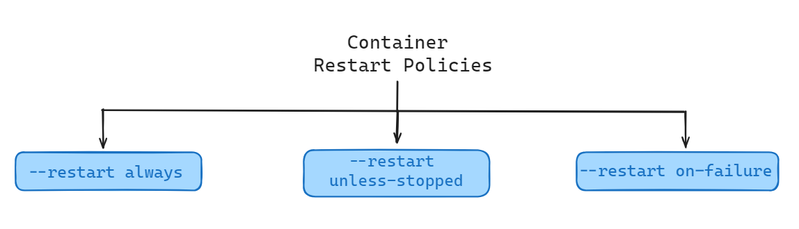
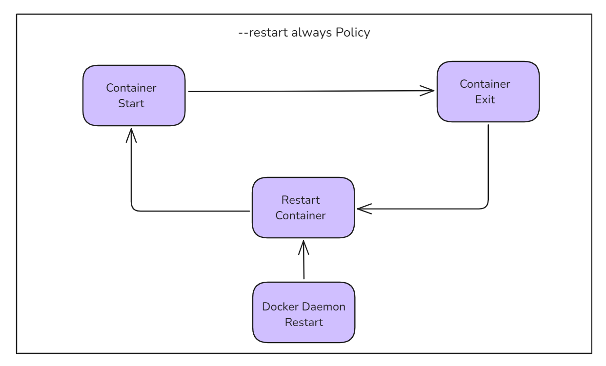
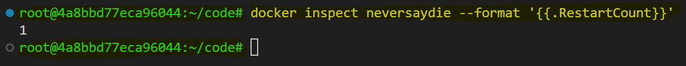
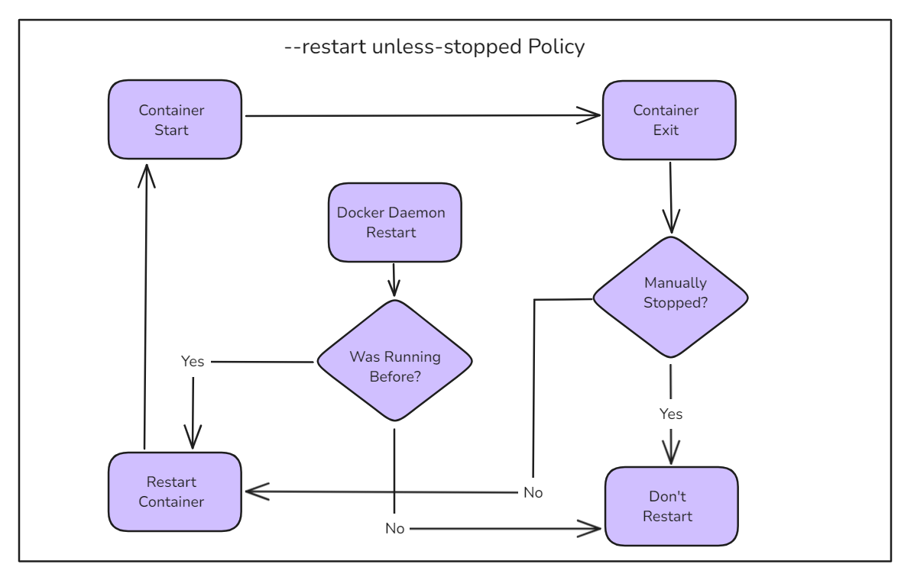
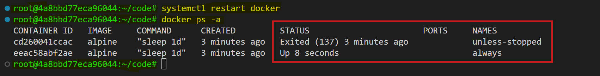
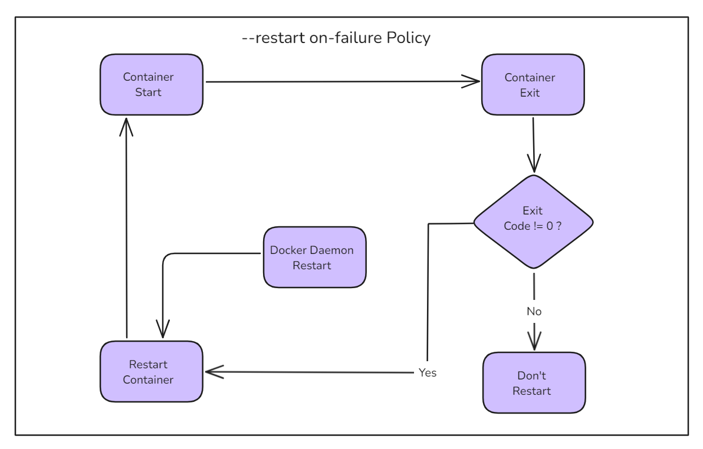
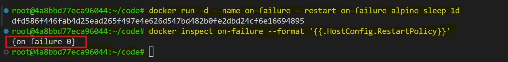

# Docker Container Restart Policies

It's often a good idea to run containers with a restart policy. This is a basic form of self-healing that allows the local Docker engine to automatically restart failed containers.

Restart policies are applied per container. They can be configured imperatively on the command line as part of `docker run` commands or declaratively in YAML files for use with higher-level tools such as Docker Swarm, Docker Compose, and Kubernetes.

In this document, we will get to know about the following restart policies:

- **always**
- **unless-stopped**
- **on-failure**



## Restart Policies Explained

## always

The `always` policy is the simplest. When a container has this restart policy, Docker will automatically restart the container if it stops or encounters an error.



### Demonstration

1. Start a new interactive container with the `--restart always` policy and run a shell process:
   ```sh
   docker run --name neversaydie -it --restart always alpine sh
   ```

2. When we started the ``alpine`` container, we told it to run the shell(sh). This makes the shell the one-and-only process running inside the container. We can see this by running ``ps -elf`` from inside the container. We will see a output similar to this:

   ```sh
   PID   USER     TIME  COMMAND
    1 root      0:00 sh
    7 root      0:00 ps -elf
   ```
   The first process in the list, with PID 1, is the shell we told the container to run. The second process is the ``ps -elf`` command we ran to produce the list. This is a short-lived process that exits as soon as the output is displayed.

3. Type `exit` from the shell to kill the container's PID 1 process and stop the container. Docker will automatically restart it because it has the `--restart always` policy.

4. Check the container’s status:
   ```sh
   docker ps
   ```
   We should see that the container is running again.

   ```sh
   CONTAINER ID   IMAGE     COMMAND   CREATED          STATUS         PORTS     NAMES
   9a9fa81a0691   alpine    "sh"      14 minutes ago   Up 5 seconds             neversaydie
   ```
   The container was created 14 minutes ago but has only been up for 5 seconds. This is because the exit command killed it, and Docker restarted it.

   You will see a output similar to this:

   

Be aware that Docker has restarted the same container and not created a new one. If we inspect it with `docker inspect`, we can see the `restartCount` has been incremented.

```sh
docker inspect neversaydie --format '{{.RestartCount}}'
```



An interesting feature of the `--restart always` policy is that if we stop a container with `docker stop` and then restart the Docker daemon, the container will be restarted. 

To illustrate:

1. Start a new container with the `--restart always` policy and intentionally stop it with the `docker stop` command.
2. The container will be in the Stopped (Exited) state.
3. Restart the Docker daemon, and the container will be automatically restarted when the daemon comes back up.

## unless-stopped

The main difference between the `always` and `unless-stopped` policies is that containers with the `--restart unless-stopped` policy will not be restarted when the daemon restarts if they were in the Stopped (Exited) state.



### Example

1. Create two new containers:
   ```sh
   docker run -d --name always --restart always alpine sleep 1d
   docker run -d --name unless-stopped --restart unless-stopped alpine sleep 1d
   ```

2. Verify both containers are running:
   ```sh
   docker ps
   ```
   we will see output similar like this:

   ```sh
   CONTAINER ID   IMAGE     COMMAND      CREATED          STATUS          PORTS     NAMES
   b69a8c552269   alpine    "sleep 1d"   47 seconds ago   Up 46 seconds             unless-stopped
   f1b6f3e6a555   alpine    "sleep 1d"   47 seconds ago   Up 46 seconds             always
   ```

3. Stop both containers:
   ```sh
   docker stop always unless-stopped
   ```

   Verify both containers are stopped:

   ```sh
   docker ps -a
   ```
   we will see output similar like this:

   

4. Restart Docker:
   ```sh
   systemctl restart docker
   ```

5. Check the status of the containers:
   ```sh
   docker ps -a
   ```
   we will see output similar like this:

   

The `always` container has been restarted, but the `unless-stopped` container has not.

## on-failure

The `on-failure` policy will restart a container if it exits with a non-zero exit code. It will also restart containers when the Docker daemon restarts, even those that were in the stopped state.



### Demonstration

1.  Use the `docker run` command with the `--restart` option set to on-failure.

      ```sh
      docker run -d --name on-failure --restart on-failure alpine sleep 1d
      ```

2. Verify the restart policy:

      ```sh
      docker inspect on-failure --format '{{.HostConfig.RestartPolicy}}'
      ```

      
