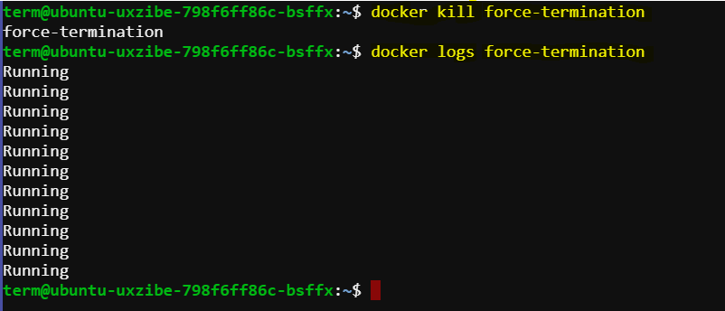

# Differentiating Docker `stop` vs `kill`

This lab scenario provides a comprehensive overview of the differences between Docker's `stop` and `kill` commands, including their behavior, use cases, and practical examples. Understanding these differences is crucial for proper container management, especially when ensuring that applications shut down gracefully.

## Introduction

In Docker, both `stop` and `kill` commands are used to terminate a running container, but they work differently:

- **`docker stop`**: Sends a `SIGTERM` signal first, allowing the process to clean up before termination. If the process doesn't terminate within a specified timeout (default 10 seconds), Docker sends a `SIGKILL` signal to forcefully stop the process.
- **`docker kill`**: Sends a `SIGKILL` signal immediately, terminating the process without allowing any clean-up.


## Using `docker stop`

### Step 1: Run a Container with a Process that Handles SIGTERM

Run a container with an Ubuntu image, simulating a process that handles the `SIGTERM` signal:

```sh
docker run --name graceful-termination -d ubuntu:latest /bin/bash -c "trap 'echo SIGTERM received; exit 0' SIGTERM; while :; do echo 'Running'; sleep 1; done"
```

### Breakdown of the Command

1. **`docker run`**:
   - The primary Docker command to create and start a new container.

2. **`--name graceful-termination`**:
   - Names the container `graceful-termination` for easier management and reference.

3. **`-d`**:
   - Runs the container in detached mode, meaning it will run in the background.

4. **`ubuntu:latest`**:
   - Specifies the Docker image to use, in this case, the latest version of the Ubuntu image.

5. **`/bin/bash -c`**:
   - Starts a Bash shell within the container to execute the following script.

6. **`"trap 'echo SIGTERM received; exit 0' SIGTERM; while :; do echo 'Running'; sleep 1; done"`**:
   - **`trap 'echo SIGTERM received; exit 0' SIGTERM`**: Sets up a trap to catch the `SIGTERM` signal. When this signal is received, the message "SIGTERM received" is printed and the script exits with a status of 0, indicating a graceful shutdown.
   - **`while :; do echo 'Running'; sleep 1; done`**: An infinite loop that prints "Running" every second. This keeps the container running until it is stopped.


### Step 2: Stop the Container

Use the `docker stop` command to terminate the container:

```sh
docker stop graceful-termination
```

### Step 3: Check the Container Logs

Examine the logs to verify how the process inside the container handled the `SIGTERM` signal:

```sh
docker logs graceful-termination
```

#### Expected Logs

```plaintext
Running
Running
Running
SIGTERM received
```

The logs should show that the process received the `SIGTERM` signal, executed the trap command, printed "SIGTERM received," and exited gracefully.


## Using `docker kill`

### Step 1: Run a Container with a Process that Would Handle SIGTERM

Run a similar container as before:

```sh
docker run --name force-termination -d ubuntu:latest /bin/bash -c "trap 'echo SIGTERM received; exit 0' SIGTERM; while :; do echo 'Running'; sleep 1; done"
```

### Step 2: Kill the Container

Use the `docker kill` command to terminate the container:

```sh
docker kill force-termination
```

### Step 3: Check the Container Logs

Examine the logs to verify the behavior of the process inside the container when terminated by `SIGKILL`:

```sh
docker logs force-termination
```

### Expected Logs

```plaintext
Running
Running
Running
```

The logs should show continuous "Running" messages without any indication of "SIGTERM received," demonstrating that the process was abruptly terminated by the `SIGKILL` signal.



## Summary of Differences

- **Signal Sent**:
  - `stop`: Sends `SIGTERM` first, then `SIGKILL` if the process doesn't terminate within the timeout.
  - `kill`: Sends `SIGKILL` immediately.

- **Graceful Shutdown**:
  - `stop`: Allows the process to handle the signal and perform clean-up operations.
  - `kill`: Does not allow any handling or clean-up.

- **Use Case**:
  - `stop`: Preferred for gracefully shutting down applications.
  - `kill`: Used for forcefully terminating unresponsive containers.

By examining the container logs, we can clearly see the difference in behavior. The `stop` command allows the application to handle the termination signal, whereas the `kill` command results in immediate termination without any clean-up.
