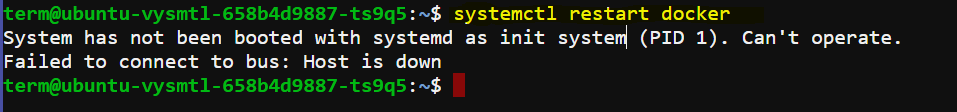
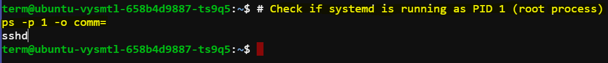
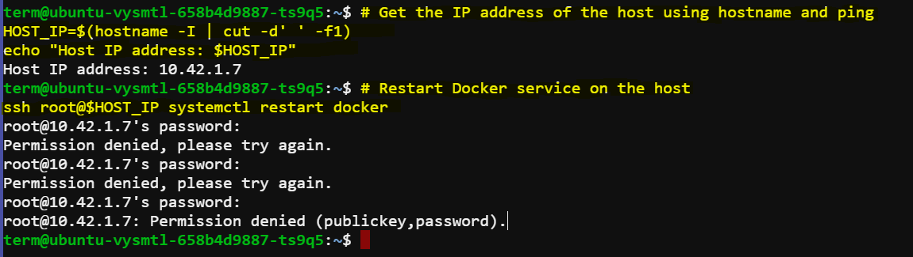

# Docker Restarting Issues

Encountered issues while attempting to restart the docker using ``systemctl restart docker`` in docker networking lab. The main problem is the System has not been booted with systemd as init system. 



The error message indicates that the system is not using ``systemd`` as its init system.

## Attempted solution

## Check if ``systemd`` is Running

First, determine the init system running on the host. This can be systemd, sysvinit, upstart, or something else.

```sh
# Check if systemd is running as PID 1 (root process)
ps -p 1 -o comm=
```



It seems like the environment does not have systemd running as PID 1. This typically happens in containerized environments where the init system is not systemd but something else, like sshd in our case.

In such scenarios, especially when we're working within a container or a non-standard environment, we usually don't manage services like Docker from within the container itself. Instead, we manage Docker on the host system.

## Determine the Host IP Address:

First, we need to determine the IP address of the host system. This will allow us to connect to the Docker daemon running on the host.

```bash
# Get the IP address of the host using hostname and ping
HOST_IP=$(hostname -I | cut -d' ' -f1)
echo "Host IP address: $HOST_IP"
```

## Restart Docker Service on the Host:

Connect to the Docker daemon on the host and restart the Docker service.

```bash
# Restart Docker service on the host
ssh root@$HOST_IP systemctl restart docker
```


