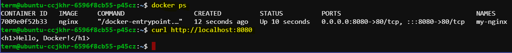

# Running an NGINX Web Server in a Docker Container

This guide provides step-by-step instructions to set up and run an NGINX web server inside a Docker container. NGINX is a powerful web server and reverse proxy that is widely used for serving static content, load balancing, and more. Docker is a platform that allows us to easily create, deploy, and run applications in containers.

## Steps to Run NGINX in a Docker Container

### 1. Pull the NGINX Docker Image

First, we need to pull the NGINX image from Docker Hub. Open the terminal and run:

```sh
docker pull nginx
```

This command downloads the latest NGINX image from the official Docker repository.

### 2. Create a Directory for NGINX Content

Create a directory on your the system to hold the NGINX configuration files and web content. For example:

```sh
mkdir -p ~/nginx/html
```

### 3. Create a Simple HTML File

Create a simple HTML file to be served by the NGINX web server. In the terminal, run:

```sh
echo '<h1>Hello, Docker!</h1>' > ~/nginx/html/index.html
```

### 4. Run the NGINX Container

Run the NGINX container, mapping the local directory to the container’s web root. Use the following command:

```sh
docker run --name my-nginx -v ~/nginx/html:/usr/share/nginx/html:ro -p 8080:80 -d nginx
```

Explanation of the command options:

- `--name my-nginx`: Names the container "my-nginx".
- `-v ~/nginx/html:/usr/share/nginx/html:ro`: Maps the local `~/nginx/html` directory to the container's `/usr/share/nginx/html` directory in read-only mode.
- `-p 8080:80`: Maps port 8080 on the host to port 80 in the container.
- `-d nginx`: Runs the NGINX container in detached mode.

### 5. Verify the NGINX Server

To verfify the container is running:

```sh
docker ps
```


To verify that the NGINX server is running, curl Nginx using:

```bash
curl http://localhost:8080
```

We should see the "Hello, Docker!" message.



## Managing the NGINX Container

### Stopping the Container

To stop the running NGINX container, use the command:

```sh
docker stop my-nginx
```

### Starting the Container

To start the stopped container, use:

```sh
docker start my-nginx
```

### Viewing Container Logs

To view the logs of the NGINX container, use:

```sh
docker logs my-nginx
```

### Removing the Container

To remove the NGINX container, first ensure it is stopped:

```sh
docker stop my-nginx
```

Then remove the container:

```sh
docker rm my-nginx
```


## Conclusion

By following this guide, we have successfully set up and run an NGINX web server inside a Docker container. This setup allows for easy deployment and management of our web server. 