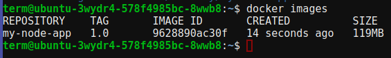
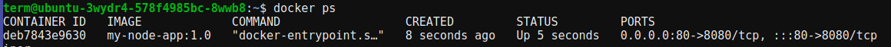
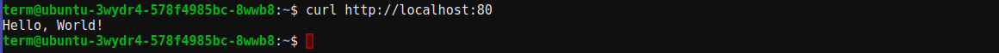
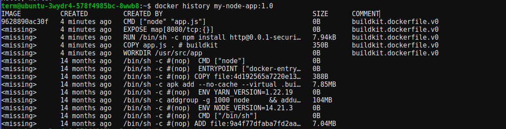
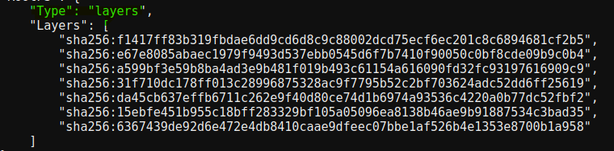
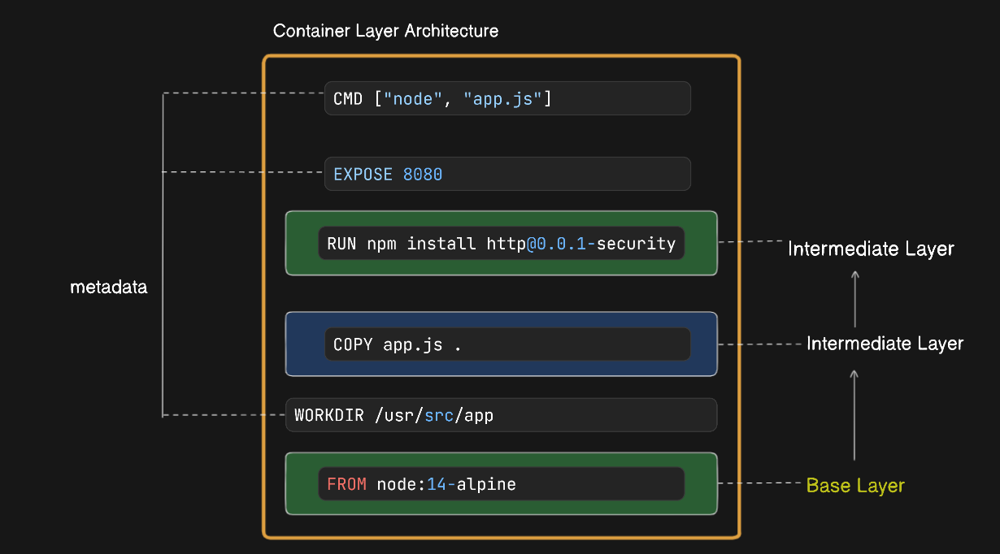

# Containerize a Single-Container App

### Introduction

In this guide, we will walk through the process of containerizing a simple Node.js application. Containerization is the process of packaging an application along with its dependencies, libraries, and configuration files into a single package known as a container. Containers ensure that the application runs consistently across different computing environments. 

This guide will help us understand the basics of Docker and how to containerize a Node.js app. We will also explore how Docker layers work and their significance in the containerization process.

### Creating the Application Code

First, let's create a simple Node.js application. We will start by creating a directory for our app and navigating into it:

```bash
mkdir my-node-app
cd my-node-app
```

Next, we'll create a file named `app.js` with the following content:

```javascript
// app.js
const http = require('http');

const hostname = '0.0.0.0';
const port = 8080;

const server = http.createServer((req, res) => {
  res.statusCode = 200;
  res.setHeader('Content-Type', 'text/plain');
  res.end('Hello, World!\n');
});

server.listen(port, hostname, () => {
  console.log(`Server running at http://${hostname}:${port}/`);
});
```

### Creating the Dockerfile

Next, we'll create a Dockerfile in the same directory with the following content. This Dockerfile will use `npm` to install `http` directly:

```Dockerfile
# Use an official Node.js runtime as the base image
FROM node:14-alpine

# Set the working directory
WORKDIR /usr/src/app

# Copy the application code
COPY app.js .

# Install the necessary Node.js package
RUN npm install http@0.0.1-security

# Expose the port the app runs on
EXPOSE 8080

# Define the command to run the app
CMD ["node", "app.js"]
```


### Containerizing the App / Building the Image

Now we can build a new Docker image named `my-node-app:1.0`:

```bash
docker build -t my-node-app:1.0 .
```

We can check that the image exists:

```bash
docker images
```



### Pushing the Image (Optional)

To push the image to Docker Hub, we need to follow these steps:

1. Log in to Docker Hub:

    ```bash
    docker login
    ```

2. Tag the image with our Docker ID:

    ```bash
    docker tag my-node-app:1.0 <docker-id>/my-node-app:1.0
    ```

3. Push the tagged image to Docker Hub:

    ```bash
    docker push <docker-id>/my-node-app:1.0
    ```

### Running the App

We can run the containerized application with the following command:

```bash
docker run -d --name my-node-app-container -p 80:8080 my-node-app:1.0
```

Check that the container is running:

```bash
docker ps
```



### Testing the App

To test the app, we can use `curl` to send a request to the running container:

```bash
curl http://localhost:80
```

This should return:



### Looking a Bit Closer

To see the instructions that were used to build the image, we use:

```bash
docker history my-node-app:1.0
```

Output Example:



To inspect the list of image layers, we use:

```bash
docker inspect my-node-app:1.0
```

Output Example (Layers Snippet):



### Detailed Breakdown of Dockerfile Instructions and Layers



Here is a table summarizing the Dockerfile instructions and their impact on the image layers:

| **Instruction**                          | **Description**                           | **Layer**             |
|------------------------------------------|-------------------------------------------|-----------------------|
| `FROM node:14-alpine`                    | Specifies the base image.                 | Adds a new layer      |
| `WORKDIR /usr/src/app`                   | Sets the working directory.               | Does not add a new layer (metadata only) |
| `COPY app.js .`                          | Copies the `app.js` file into the image.  | Adds a new layer      |
| `RUN npm install http@0.0.1-security`    | Installs the `http` package.              | Adds a new layer      |
| `EXPOSE 8080`                            | Documents the port the app listens on.    | Does not add a new layer (metadata only) |
| `CMD ["node", "app.js"]`                 | Specifies the command to run the application. | Does not add a new layer (metadata only) |

### Best Practices

- Use official base images for security and updates.
- Keep Dockerfiles in version control.
- Treat Dockerfiles as documentation for our application.

This document guides us through containerizing and running a Node.js application using Docker.It also ensuring we understand each step of the process and the significance of Docker layers in an engaging manner.