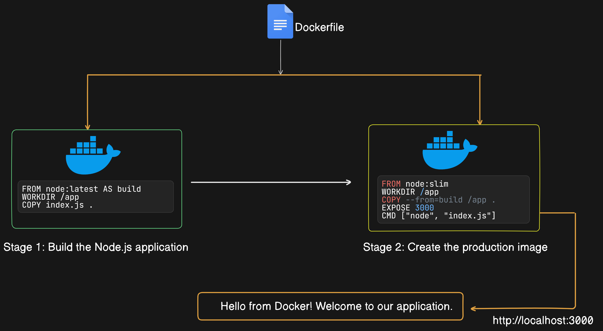
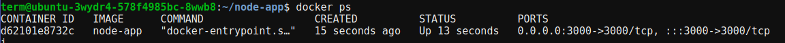
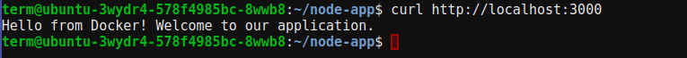

# Multi-stage Builds with a Simple Node.js App

## Introduction

In the world of making programs run smoothly inside containers, we've found that using just one step to build them isn't always the best idea. When we stick to single steps, our containers can end up being really big and slow. But fear not! There's a better way: multi-stage builds. These help us make our containers smaller and faster without losing any important stuff.

Today, we're going on an adventure to discover how multi-stage builds work. We'll break down the complicated bits into easy-to-understand pieces.


## Step 1: Create a Simple Node.js App

Create a directory for our project and navigate into it:

```bash
mkdir node-app
cd node-app
```

Now, create a file named `app.js` and add the following code:

```javascript
const http = require('http');

const server = http.createServer((req, res) => {
  res.writeHead(200, {'Content-Type': 'text/plain'});
  res.end('Hello from Docker! Welcome to our application.\n');
});

const PORT = process.env.PORT || 3000;
server.listen(PORT, () => {
  console.log(`Server running at http://localhost:${PORT}/`);
});

```

This simple Node.js application creates an HTTP server that listens on port 3000 and responds with "Hello, world!" to all requests.

## Step 2: Create a Dockerfile

Next, let's create a Dockerfile to containerize our Node.js application using two-stage builds:

```Dockerfile
# Stage 1: Build the Node.js application
FROM node:latest AS build

WORKDIR /app

COPY app.js .

# Stage 2: Create the production image
FROM node:slim

WORKDIR /app

COPY --from=build /app .

EXPOSE 3000

CMD ["node", "app.js"]
```





### Stage 1 (`build`):

- **Purpose:** Build the Node.js application.
- **Functionality:**
  - Uses `node:latest` image as the base, providing necessary build tools.
  - Sets the working directory to `/app` where application code will be copied.
  - Copies `index.js` into the image, preparing for application build.

### Stage 2:

- **Purpose:** Create the production image.
- **Functionality:**
  - Uses `node:slim` image as the base, providing a minimal runtime environment.
  - Sets the working directory to `/app`, ensuring consistency with the build stage.
  - Copies the built application from the `build` stage into this stage, excluding unnecessary build tools.
  - Exposes port 3000, allowing external communication with the application.
  - Defines the command to run the application (`node index.js`), starting the HTTP server.

## Step 3: Build and Run the Docker Image

Now, let's build and run the Docker image:

```bash
docker build -t node-app .
docker run -d -p 3000:3000 node-app
```

Check that the container is running:

```bash
docker ps
```



This will build the Docker image based on the Dockerfile and run a container based on that image. The application will be accessible at `http://localhost:3000`.

### Testing the App


To test the app, we can use `curl` to send a request to the running container:

```bash
curl http://localhost:3000
```

This should return:



## Conclusion

In this guide, we've demonstrated how to use two-stage builds in Docker to containerize a simple Node.js application. Each stage has a specific purpose, allowing us to create smaller and more efficient Docker images by separating the build process into distinct steps.