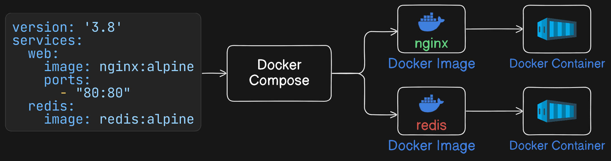
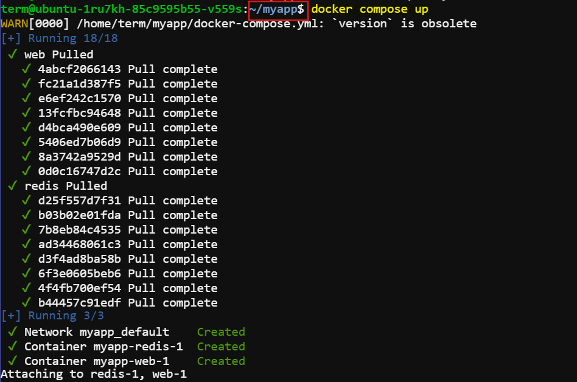
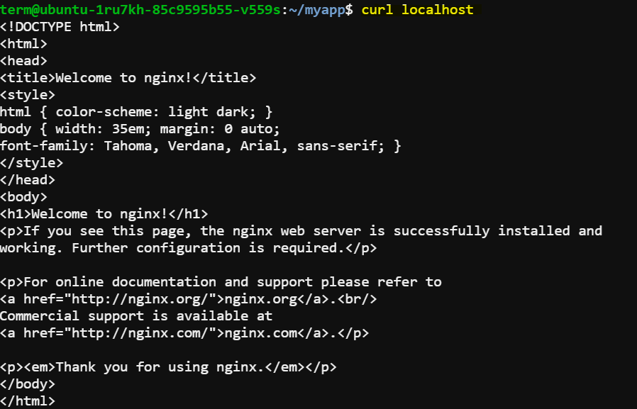

# Introduction to Docker Compose

In this session we will learn the basics of `Docker Compose` and how to manage multi-container applications easily.


## Multi-Container Applications

#### What are Multi-Container Applications?

Modern cloud-native applications are often composed of multiple smaller services that work together to form a complete application. 


This is known as the microservices pattern. These could include:

- Web front-end
- Database
- Authentication service

and so on.

#### Challenges with Microservices:

Managing and deploying multiple microservices can be complex and cumbersome, requiring careful orchestration of each service.

## What is Docker Compose?

Docker Compose is a tool that allows you to define and manage multi-container Docker applications. It uses a declarative configuration file, typically in YAML format, to specify the services, networks, and volumes required for the application.

#### Benefits of Docker Compose:
- Simplifies the orchestration of multi-container applications.
- Allows for a single configuration file to define and manage all services.
- Integrates with version control systems for better management.

## Basic Docker Compose Commands

**Check Installation:**
```bash
docker compose version
```

**Start an Application:**
```bash
docker compose up
```

**Stop an Application:**
```bash
docker compose down
```

**View Container Status:**
```bash
docker compose ps
```

## Simple Docker Compose Example

Let's create a basic Docker Compose setup with a `web` server using ` nginx:alpine` image and a `redis` service using `redis:alpine` image.

### Step 1: Create a Directory
Create a directory for your project.
```bash
mkdir myapp
cd myapp
```

### Step 2: Create Docker Compose File
Create a file named `docker-compose.yml` and add the following content:

```yaml
version: '3.8'

services:
  web:
    image: nginx:alpine
    ports:
      - "80:80"
  redis:
    image: redis:alpine
```

This file defines two services: a web server (nginx) and a Redis server.



### Step 3: Start the Application
Run the following command to start the services:
```bash
docker compose up
```
You should see output indicating the services are starting.

Expected output:



### Step 4: Verify the Setup

Check localhost:

```bash
curl localhost
```

You should see the default Nginx welcome page.

Expected output:



### Step 5: View Status
Check the status of the running containers:
```bash
docker compose ps
```

Expected output:


### Step 6: Stop the Application
Stop the services with:
```bash
docker compose down
```

## Conclusion
You have learned the basics of Docker Compose, created a simple multi-container application, and practiced using basic commands. This knowledge will help you manage more complex applications in the future.