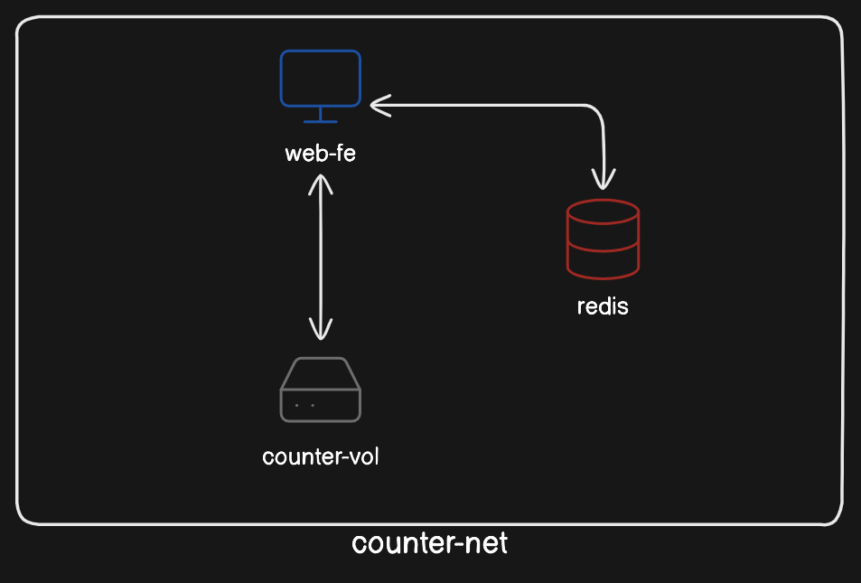
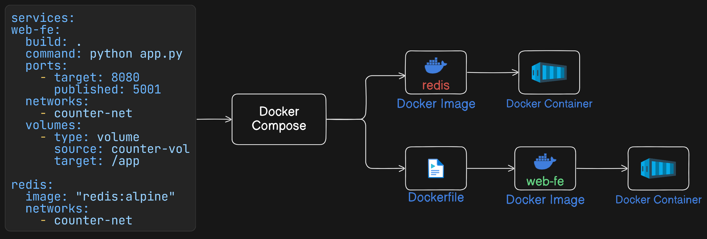
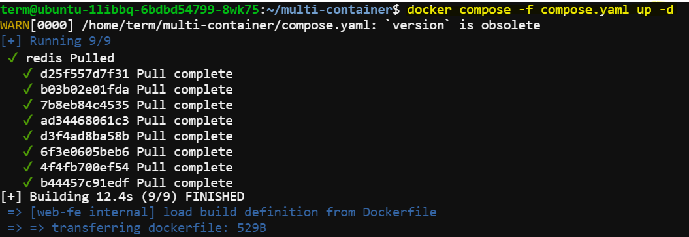
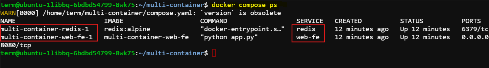
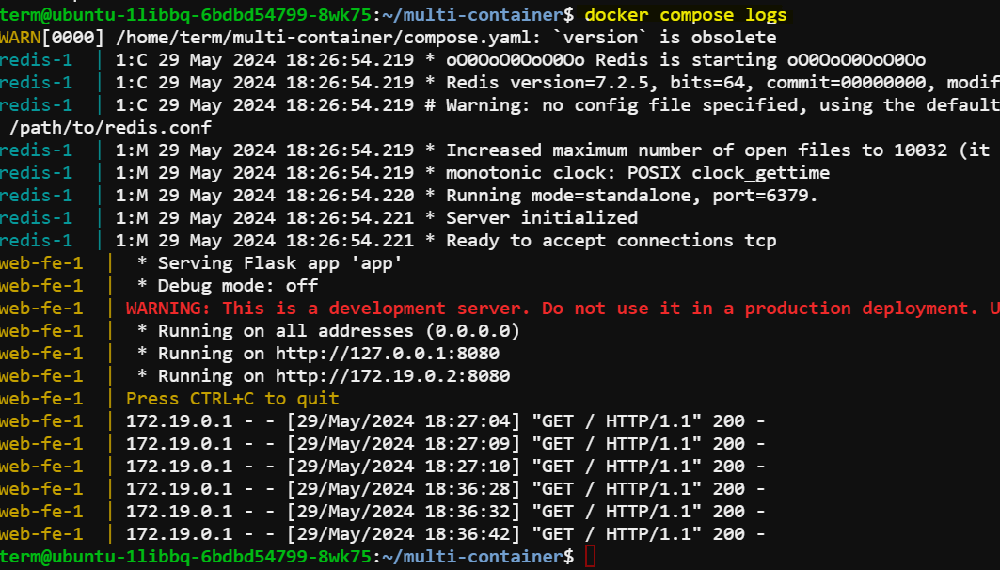
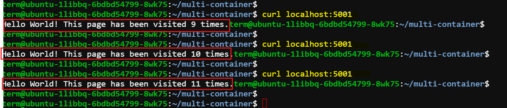

# Deploy the multi-container application using Docker Compose

In this session, we will learn how to define services, networks, and volumes in a Docker Compose file and verify the setup by running a simple application.




We'll need to set up the directory structure, create the necessary files (`app.py`, `Dockerfile`, `compose.yaml`), and then deploy and verify the application. Here's a step-by-step guide:

## Step 1: Set Up Directory Structure

Create a directory for your project:

   ```bash
   mkdir multi-container
   cd multi-container
   ```

## Step 2: Create `app.py`
Inside the `multi-container` directory, create a file named `app.py`:

```python
from flask import Flask
from redis import Redis

app = Flask(__name__)
redis = Redis(host='redis', port=6379)

@app.route('/')
def hello():
    count = redis.incr('hits')
    return f'Hello World! This page has been visited {count} times.\n'

if __name__ == "__main__":
    app.run(host="0.0.0.0", port=8080)
```


The` app.py` script creates a simple web application using `Flask`. When accessed, it counts the number of visits to the root URL and displays a message with the visit count. This count is stored in a `Redis` database. The script runs a web server to serve the application on port `8080`.


## Step 3: Create `Dockerfile`
Create a `Dockerfile` in the same directory:

```Dockerfile
# Use the official Python image from the Docker Hub
FROM python:3.9-alpine

# Set the working directory in the container
WORKDIR /app

# Copy the current directory contents into the container at /app
COPY . /app

# Install any needed packages specified in requirements.txt
RUN pip install flask redis

# Make port 8080 available to the world outside this container
EXPOSE 8080

# Define environment variable
ENV NAME World

# Run app.py when the container launches
CMD ["python", "app.py"]
```

   The `Dockerfile` builds a Docker image for the `web-fe` service in the Docker Compose setup. It uses the official Python 3.9 Alpine image, sets the working directory to `/app`, copies the current directory's contents into the container, installs Flask and Redis, exposes port 8080, and runs the Flask application (`app.py`) when the container starts. This setup ensures the `web-fe` service is ready to serve the application and interact with the Redis service defined in the `compose.yaml` file.

## Step 4: Create `compose.yaml`
Create a `compose.yaml` file:

```yaml
version: '3.8'

services:
  web-fe:
    build: .
    command: python app.py
    ports:
      - target: 8080
        published: 5001
    networks:
      - counter-net
    volumes:
      - type: volume
        source: counter-vol
        target: /app

  redis:
    image: "redis:alpine"
    networks:
      - counter-net

networks:
  counter-net:

volumes:
  counter-vol:

```



The `compose.yaml` file defines a multi-container application using Docker Compose. It consists of two services:

1. **web-fe**:
   - Builds an image using the current directory's Dockerfile.
   - Runs a Python script (`app.py`) to serve a Flask application.
   - Maps port 5001 on the host to port 8080 in the container.
   - Connects to the `counter-net` network.
   - Mounts a volume named `counter-vol` to the `/app` directory in the container.

2. **redis**:
   - Pulls the `redis:alpine` image from Docker Hub.
   - Connects to the `counter-net` network.

The `counter-net` network facilitates communication between the `web-fe` and `redis` services. Additionally, the `counter-vol` volume provides persistent storage for the `web-fe` service.

It’s also worth knowing that Compose builds `networks` and `volumes` before deploying `services`. This makes sense, as networks and volumes are lower-level infrastructure objects that are consumed by services (containers).

## Step 5: Deploy the Application

With all the files in place, you can now deploy the application using Docker Compose. Run the following command from the `multi-container` directory:

```bash
docker compose -f compose.yaml up -d
```



## Step 6: Verify the Deployment
Verify that the services are running:

```bash
docker compose ps
```

You should see two services: `web-fe` and `redis`.

Expected output:



Check the logs for any errors:

```bash
docker compose logs
```

Expected output:



Use the following command: 

```bash
curl localhost:5001
```
You should see the message indicating the number of visits to the page.

Expected output:




List the processes running inside of each service (container):

```bash
docker compose top
```


Use the following command to stop the app without deleting its resources:

```bash
docker compose stop
```

With the app in the stopped state, restart it with the docker compose restart command:

```bash
docker compose restart
```


Verify the volume and network:

- List volumes to verify `counter-vol`:

    ```bash
    docker volume ls
    ```

- List networks to verify `counter-net`:

    ```bash
    docker network ls
    ``` 

## Cleanup

When you're done testing, you can stop and remove the containers, networks, and volumes:

```bash
docker compose down --volumes
```

This setup allows you to run and verify the multi-container Flask application using Docker Compose, with persistent storage and network configuration as described.