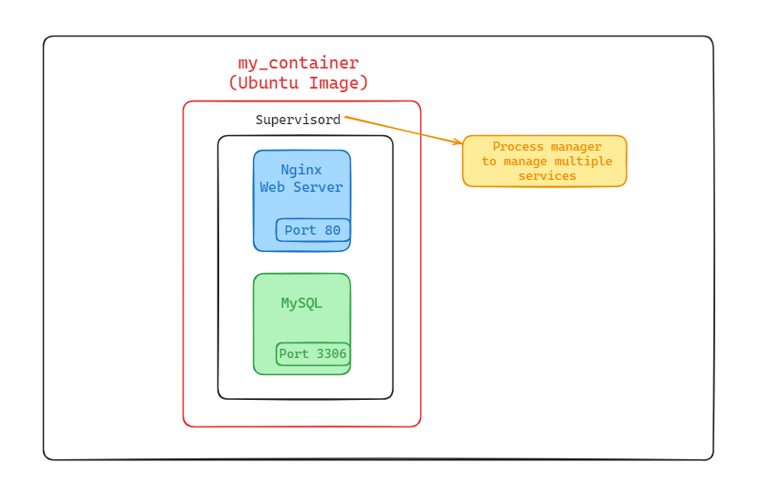
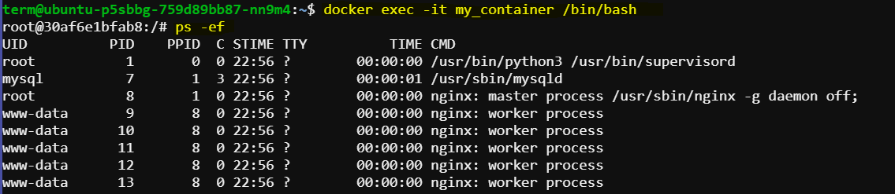
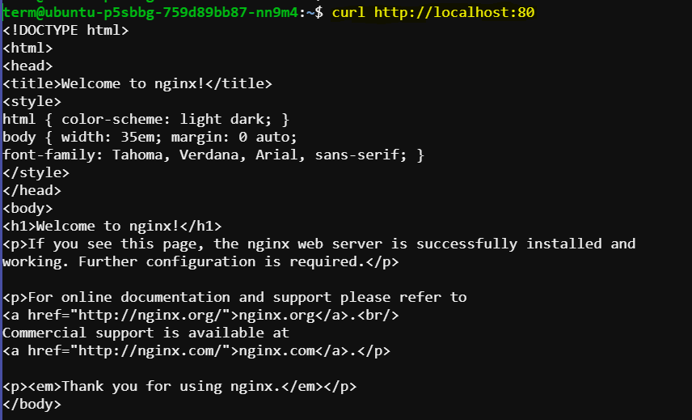

# Setting Up a Host-Like Environment Using Docker Containers

This documentation provides a step-by-step guide to create a Docker container that mimics a traditional host environment. The container will be capable of running multiple processes and services using `supervisord` as the process manager.

## Features

- **Nginx**: Web server.
- **MySQL**: Database server.
- **Supervisord**: Process manager to manage multiple services.




## Host-Like Environment Setup

### 1. Create Dockerfile

Create a Dockerfile with the following content:

```Dockerfile
# Use an official Ubuntu base image
FROM ubuntu:latest

# Set environment variables to avoid user prompts during package installations
ENV DEBIAN_FRONTEND=noninteractive

# Update the package list and install necessary packages
RUN apt-get update && apt-get install -y \
    nginx \
    mysql-server \
    supervisor \
    && rm -rf /var/lib/apt/lists/*

# Add supervisor configuration file
COPY supervisord.conf /etc/supervisor/conf.d/supervisord.conf

# Expose ports for services (e.g., 80 for nginx, 3306 for MySQL)
EXPOSE 80 3306

# Start supervisord to run multiple services
CMD ["/usr/bin/supervisord"]
```


**Explanation:**
- **Base Image:** `ubuntu:latest` provides a minimal Ubuntu environment.
- **Environment Variables:** `DEBIAN_FRONTEND=noninteractive` ensures package installations don't prompt for user input.
- **Package Installation:** Installs `nginx`, `mysql-server`, and `supervisor`, followed by cleanup to reduce image size.
- **Configuration:** Copies a custom supervisord configuration file into the container.
- **Ports:** Exposes necessary ports for Nginx and MySQL.
- **Entrypoint:** Uses supervisord to manage services within the container.

### 2. Create supervisord Configuration

Create a `supervisord.conf` file with the following content:

```ini
[supervisord]
nodaemon=true

[program:nginx]
command=/usr/sbin/nginx -g "daemon off;"
autorestart=true

[program:mysql]
command=/usr/sbin/mysqld
autorestart=true
```

**Explanation:**
- **supervisord:** Runs in the foreground (`nodaemon=true`).
- **Nginx:** Configured to run in the foreground (`daemon off;`) and restart automatically if it fails.
- **MySQL:** Configured to restart automatically if it fails.

### 3. Build the Docker Image

Build the Docker image using the Dockerfile and supervisord configuration:

```sh
docker build -t my_host_like_env .
```

### 4. Run the Docker Container

Run the Docker container based on the image you just built:

```sh
docker run -d --name my_container -p 80:80 -p 3306:3306 my_host_like_env
```

Check the container is running using:

```sh
docker ps
```

The output will look something similar like this:

```sh
CONTAINER ID   IMAGE              COMMAND                  CREATED         STATUS         PORTS                                                       
                   NAMES
30af6e1bfab8   my_host_like_env   "/usr/bin/supervisord"   9 seconds ago   Up 6 seconds   0.0.0.0:80->80/tcp, :::80->80/tcp, 0.0.0.0:3306->3306/tcp, :
::3306->3306/tcp   my_container
```


```sh
docker exec -it my_container /bin/bash
```
This will open a new terminal inside the container. You can now verify that Nginx and MySQL process running using:

```sh
ps -ef
```
The ``ps -ef`` command is commonly used for system monitoring and troubleshooting to check which processes are running, their resource usage, and the commands used to start them.



Exit the container using ``exit`` command.

### 5. Access Services

### Accessing Nginx Web Server

1. Access Nginx via curl or wget:

    ```sh
    curl http://localhost:80
    ```

    If Nginx is running correctly, this command will fetch the default Nginx welcome page.

    

2. Access Nginx logs:

    ```sh
    docker exec -it my_container tail -f /var/log/nginx/access.log
    ```
    This command will show the Nginx access log. You can replace ``access.log`` with ``error.log`` for error logs.

    

### Accessing MySQL Database Server

1. Access MySQL via MySQL Client:

    Connect to MySQL server running inside the container

    ```sh
    docker exec -it my_container mysql -uroot -p
    ```
    If prompted for a password, the default password is empty (just press Enter).
    Once connected, you can interact with MySQL as you would on a standard MySQL server.

    

2. Access MySQL logs:

    ```sh
    docker exec -it my_container tail -f /var/log/mysql/error.log
    ```
    This command will show the MySQL error log. Replace ``error.log`` with ``query.log`` for the query log, if configured.

    

## Usage

### Managing Services

Inside the running container, you can manage services using `supervisorctl`:

```sh
# Check status of services
supervisorctl status

# Stop a service
supervisorctl stop nginx

# Start a service
supervisorctl start nginx

# Restart a service
supervisorctl restart nginx
```


## Conclusion

You now have a Docker container that simulates a traditional host environment capable of running multiple processes and services. You can extend this setup by adding more services or customizing configurations as per your requirements.
