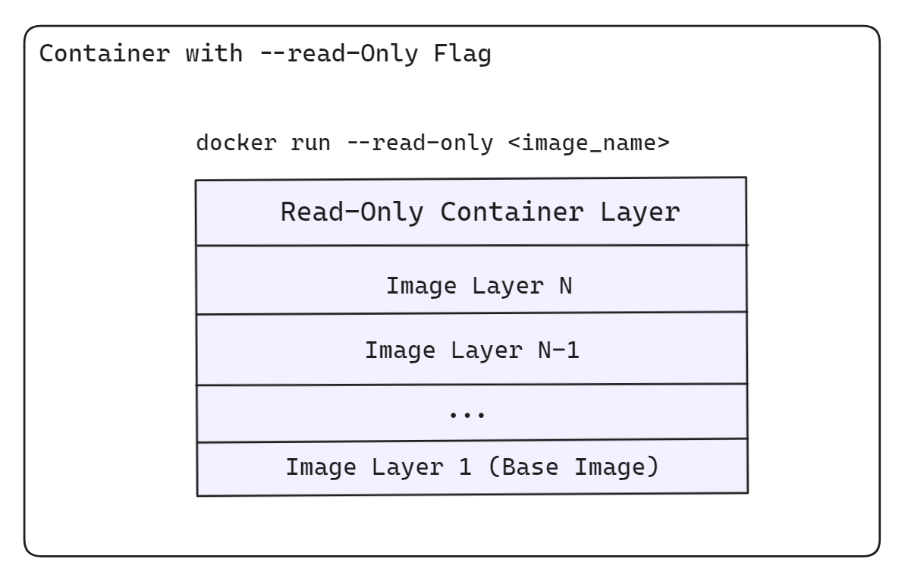
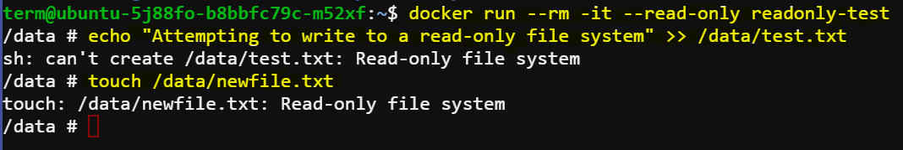
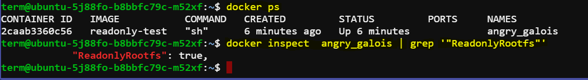

# Setting Up a Docker Container with a Read-Only File System

Ensuring the security and data integrity of Docker containers is critical in any robust DevOps environment. One effective measure is to run Docker containers with a read-only file system. This prevents any modifications to the container's file system during runtime, mitigating risks associated with unauthorized changes or accidental data corruption.



## Scenario Overview

Imagine you are a DevOps engineer at a company that values security and data integrity. One of your tasks is to ensure that certain Docker containers run with a read-only file system to prevent any modifications to the container’s file system during runtime. You will set up a Docker container with a read-only file system and verify its behavior.

## Objectives

- Set up a Docker container with a read-only file system.
- Verify that the container operates as expected and that the file system is indeed read-only.


## Required Steps

### Step 1: Create a Docker Image

1. **Create a Dockerfile**:
    Create a file named `Dockerfile` and add the following content:

    ```dockerfile
    FROM alpine:latest

    # Create a directory and add a sample file
    RUN mkdir /data && echo "This is a read-only test file" > /data/test.txt

    # Set the working directory
    WORKDIR /data

    CMD ["sh"]
    ```

    This Dockerfile creates a Docker image based on the Alpine Linux distribution, creates a directory `/data` and adds a sample file `test.txt` to it, and sets the working directory to `/data`.


2. **Build the Docker Image**:
    Open your terminal, navigate to the directory containing the `Dockerfile`, and run the following command:

    ```sh
    docker build -t readonly-test .
    ```

### Step 2: Run the Docker Container with a Read-Only File System

1. **Run the Docker Container**:
    Use the `--read-only` flag to start the container with a read-only file system:

    ```sh
    docker run --rm -it --read-only readonly-test
    ```

2. **Verify the Read-Only File System**:
    Once inside the container, attempt to modify the file or create a new file:

    ```sh
    # Try to modify the existing file
    echo "Attempting to write to a read-only file system" >> /data/test.txt
    
    # Try to create a new file
    touch /data/newfile.txt
    ```
    Both commands should fail, indicating that the file system is indeed read-only.

### Step 3: Verify Read-Only Behavior

1. **Check for Errors**:
    The commands above should result in error messages similar to:
    ```
    sh: can't create /data/test.txt: Read-only file system
    touch: /data/newfile.txt: Read-only file system
    ```

    

2. **Confirm File System Status**:
    You can further confirm the read-only status by inspecting the file system options:

    ```sh
    docker inspect  container_name | grep '"ReadonlyRootfs"'
    ```
    Run this command in a new terminal so that the container state remains running. Replace `container_name` with the actual container name or ID.

    This command should output `true`, indicating that the root file system is indeed read-only.

    

## Conclusion

By following these steps, you have successfully set up and verified a Docker container with a read-only file system. This configuration helps enhance security and data integrity by preventing any modifications to the container's file system during runtime.

