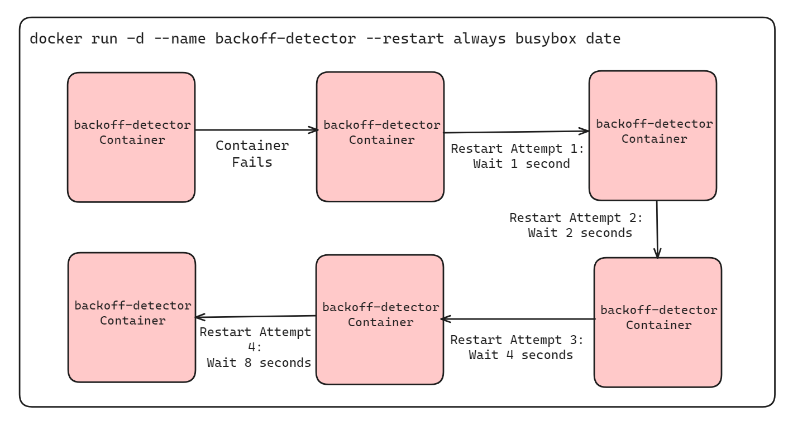
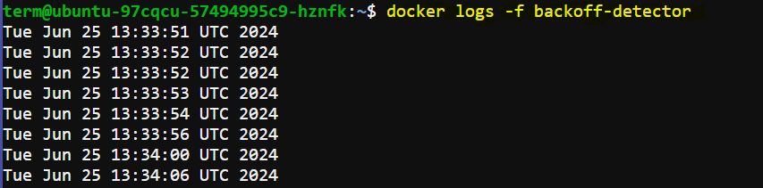
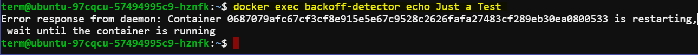

# Automatic Restart of Docker Containers

In this lab, you will learn how Docker manages automatic container restarts using different restart policies, specifically focusing on the exponential backoff strategy. This hands-on scenario will help you understand how Docker handles container failures and delays between restart attempts.

## Restart Policy

Docker provides functionality to automatically restart containers using a restart policy. This can be configured at container creation time using the `--restart` flag. The available options include:

1. **Never Restart (default)**: Docker will not attempt to restart the container.
2. **Restart on Failure**: Docker will attempt to restart the container when a failure is detected.
3. **Restart for a Predetermined Time on Failure**: Docker will attempt to restart the container for a specified duration after a failure is detected.
4. **Always Restart**: Docker will always attempt to restart the container regardless of the reason it stopped.

## Exponential Backoff Strategy

Docker employs an exponential backoff strategy to manage the timing of restart attempts. This strategy is designed to prevent continuous and immediate restarts, which could potentially cause more problems. The backoff strategy works by progressively increasing the wait time between successive restart attempts. For instance:
- 1st restart attempt: wait 1 second
- 2nd restart attempt: wait 2 seconds
- 3rd restart attempt: wait 4 seconds
- 4th restart attempt: wait 8 seconds
- And so on...



This method is widely used in service restoration to avoid overwhelming the system.

## Example Demonstration

You can observe Docker's exponential backoff strategy by running a container that always restarts and prints the current time. Use the following command to create such a container:

```bash
docker run -d --name backoff-detector --restart always busybox date
```

After a few seconds, use the trailing logs feature to watch the container restart and back off:

```bash
docker logs -f backoff-detector
```

The logs will show the times the container has restarted and the waiting periods between restarts. The container will print the current time upon restarting and then exit.



## Interaction During Backoff Periods

The only reason you might not want to directly adopt this feature is that the container is not running during the backoff period. During the backoff periods, the container is in a `restarting` state and is not running. This means you cannot execute additional commands in the container. For example:

```bash
docker exec backoff-detector echo Just a Test
```

This command will result in an error message because the container is not in an active state.



This means you cannot perform any operations that require the container to be running, such as executing other commands in the container.

## Advanced Restart Strategies

While the `--restart` flag is useful for basic recovery, it has limitations. During backoff periods, the container is not running, which means diagnostic tools and other processes cannot be executed. For a more comprehensive solution, consider using containers that run init or supervisor processes. These processes can manage the lifecycle of your application more robustly and provide better control over container behavior during failures.
