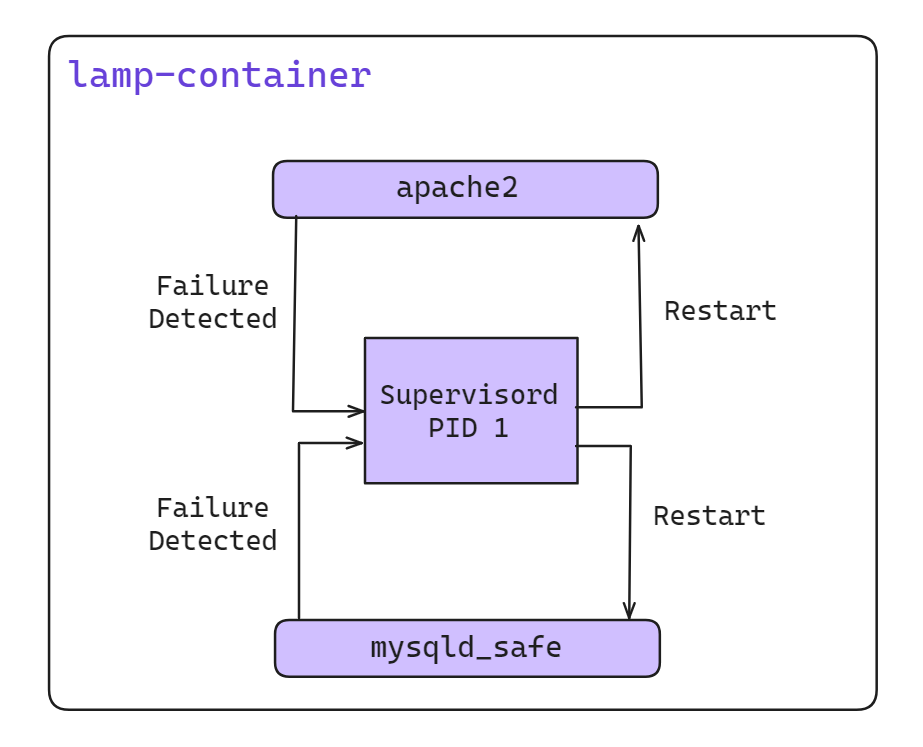
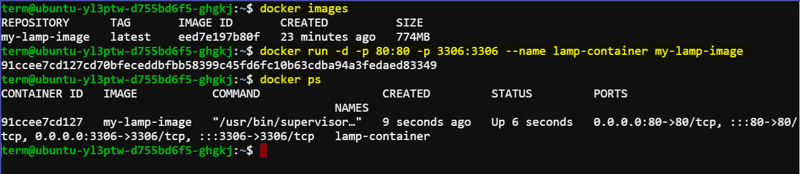
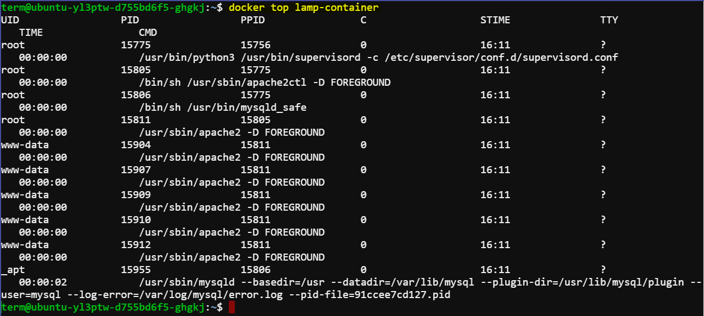
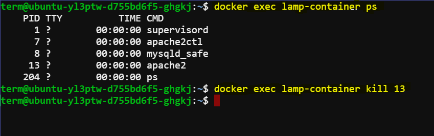
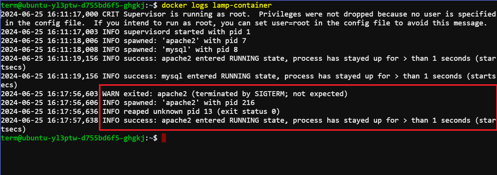

# Keeping Containers Running with Supervisor

A **supervisor process**, or **init process**, is a program that’s used to launch and maintain the state of other programs. On a Linux system, PID #1 is an init process. It starts all the other system processes and restarts them in the event that they fail unexpectedly. This concept can be effectively applied inside containers to start and manage processes.

Using a supervisor process inside your container ensures that the container remains operational even if the main process—such as a web server—fails and needs to be restarted. Several programs can serve as supervisor processes inside a container. The most popular ones include `init`, `systemd`, `runit`, `upstart`, and `supervisord`.

## Example: Using Supervisord in a Container

Suppose a company provides software that produces a full LAMP (Linux, Apache, MySQL, PHP) stack inside a single container. These containers use `supervisord` to ensure that all the related processes are kept running. Below is an example of how to use such a container.



### Create a LAMP Docker Image

Creating a LAMP (Linux, Apache, MySQL, PHP) stack image using `supervisord` allows you to manage multiple processes within a single Docker container. Here’s a step-by-step guide to create such an image:

#### Step 1: Dockerfile Setup

Create a `Dockerfile` to define your LAMP stack image. Here, we'll use `supervisord` to manage Apache and MySQL processes.

```dockerfile
# Use an official Ubuntu as a parent image
FROM ubuntu:latest

# Install necessary packages (Apache, PHP, MySQL client, supervisor)
RUN apt-get update && \
    apt-get install -y apache2 php libapache2-mod-php mysql-client supervisor && \
    apt-get clean && \
    rm -rf /var/lib/apt/lists/*

# Install MySQL server (choose a root password during installation)
RUN apt-get update && \
    DEBIAN_FRONTEND="noninteractive" apt-get -y install mysql-server && \
    apt-get clean && \
    rm -rf /var/lib/apt/lists/*

# Configure Apache
RUN a2enmod rewrite

# Configure supervisord
COPY supervisord.conf /etc/supervisor/conf.d/supervisord.conf

# Expose ports
EXPOSE 80 3306

# Start supervisord to manage Apache and MySQL services
CMD ["/usr/bin/supervisord", "-c", "/etc/supervisor/conf.d/supervisord.conf"]
```

#### Step 2: Supervisord Configuration

Create a `supervisord.conf` file in the same directory as your `Dockerfile`:

```ini
[supervisord]
nodaemon=true

[program:apache2]
command=/usr/sbin/apache2ctl -D FOREGROUND

[program:mysql]
command=/usr/bin/mysqld_safe
```

#### Step 3: Build and Run the Docker Image

Now, build your Docker image using the `Dockerfile`:

```sh
docker build -t my-lamp-image .
```

### Starting the Container

And finally, run a container using your newly created image:

```sh
docker run -d -p 80:80 -p 3306:3306 --name lamp-container my-lamp-image
```



### Checking Running Processes

You can see what processes are running inside this container by using the `docker top` command:

```bash
docker top lamp-container
```

The `top` subcommand will show the host PID for each of the processes in the container. You’ll see `supervisord`, `mysql`, and `apache` included in the list of running programs.



### Stopping a Process Inside the Container

Now that the container is running, you can test the `supervisord` restart functionality by manually stopping one of the processes inside the container.

To kill a process inside a container from within that container, you need to know the PID in the container’s PID namespace. To get that list, run the following `exec` subcommand:

```bash
docker exec lamp-container ps
```

The process list generated will have `apache2` listed in the CMD column:

```
PID TTY      TIME     CMD
1   ?        00:00:00 supervisord
433 ?        00:00:00 mysqld_safe
835 ?        00:00:00 apache2
842 ?        00:00:00 ps
```

The values in the PID column will be different when you run the command. Find the PID on the row for `apache2` and then insert that for `<PID>` in the following command:

```bash
docker exec lamp-container kill <PID>
```



Running this command will execute the Linux `kill` program inside the `lamp-container` container and tell the `apache2` process to shut down. When `apache2` stops, the `supervisord` process will log the event and restart the process. The container logs will clearly show these events:

```
... exited: apache2 (exit status 0; expected)
... spawned: 'apache2' with pid 820
... success: apache2 entered RUNNING state, process has stayed up for > than 1 seconds (startsecs)
```



This ensures that the `apache2` process is restarted by `supervisord`, thereby maintaining the container's functionality.

By using a supervisor process inside containers, you can manage and monitor the state of your applications, ensuring high availability and reliability of your services.