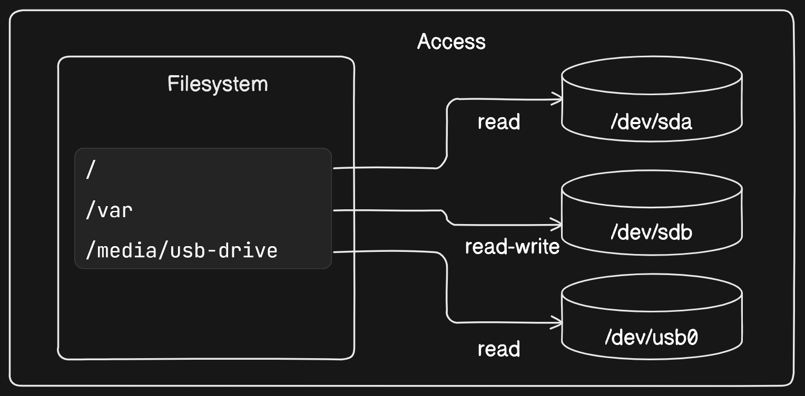

# File Trees and Mount Points in Linux

In Linux, all storage is consolidated into a `single tree structure`, unlike other operating systems. This structure organizes storage devices such as disk partitions or USB drives by attaching them to specific locations within the tree, known as mount points. Mount points define the location in the tree, access properties, and the source of the mounted data.

**Mount points** enable seamless usage of the file tree in a Linux environment without requiring detailed knowledge of storage device `mappings`. This is particularly advantageous in container environments where each container has its own unique file tree root and set of mount points.

Containers utilize mount points to access storage on the host filesystem and share storage between containers. By mounting different storage devices at various points in the file tree, containers can effectively manage data storage.

The subsequent modules elaborate on storage management and mount points in containers, focusing on three common types of storage:

1. **Bind mounts**: Link specific locations on the host filesystem to locations within a container, facilitating data sharing between the host and container environments.

2. **In-memory storage**: Utilize memory-backed storage, such as `tmpfs`, within containers for temporary data storage.

3. **Docker volumes**: Provide persistent storage for containers, offering enhanced management capabilities compared to bind mounts.

All three types of mount points can be created using the `--mount` flag on the docker run and docker create subcommands.