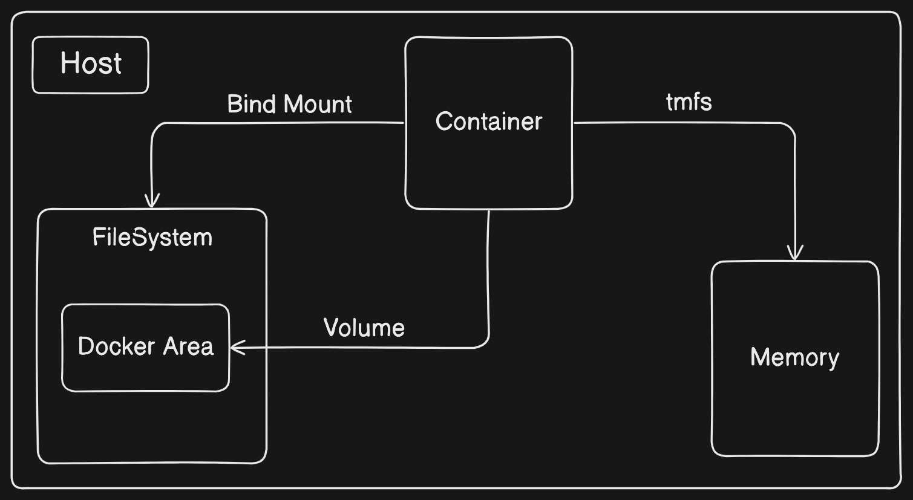
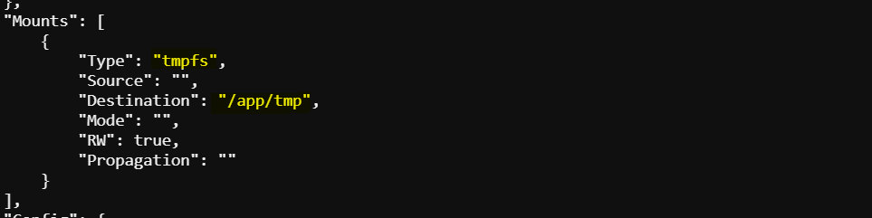
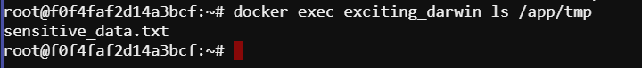
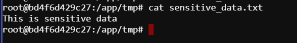

# In-Memory Storage

Many service software and web applications require handling sensitive configuration files such as *private key files, database passwords, and API key files*. These files should never be included in the image or written to disk for **security** reasons. Instead, utilizing `in-memory storage` is crucial to ensure sensitive data remains secure. This readme provides guidance on implementing in-memory storage using Docker containers with tmpfs mounts.



## Using tmpfs Mounts
To implement in-memory storage, we can use `tmpfs` mounts with Docker containers. The `tmpfs` mount type allow us to create *a memory-based filesystem* within the container's `file tree`. This readme explains how to use tmpfs mounts effectively.

### Command Syntax
We can use the following command to mount a `tmpfs` device into a container's file tree:

```bash
docker run --rm \
    --mount type=tmpfs,dst=/tmp \
    --entrypoint mount \
    alpine:latest -v
```

### Command Explanation
- `--mount type=tmpfs,dst=/tmp`: This part of the command specifies that a `tmpfs` device will be mounted at the `/tmp` directory within the container's file system.
- `--entrypoint mount`: This specifies the `entry point` for the container as the `mount` command.
- `alpine:latest`: This indicates the Docker image to be used for the container.

### Configuration Details
When the above command is executed, it creates an **empty tmpfs device** and attaches it to the container's file tree at `/tmp`. Files created under this file tree will be stored in **memory instead of on disk**. The mount point is configured with sensible defaults for generic workloads. 

### Mount-point Configuration
Upon execution, the command displays a list of all mount points for the container. Here's a breakdown of the configuration provided:

- `tmpfs on /tmp type tmpfs (rw,nosuid,nodev,noexec,relatime)`: This line describes the mount-point configuration.
  - `tmpfs on /tmp`: Indicates that a tmpfs device is mounted to the tree at `/tmp`.
  - `type tmpfs`: Specifies that the device has a `tmpfs` filesystem.
  - `rw`: Indicates that the tree is `read/write` capable.
  - `nosuid`: Specifies that `suid` bits will be ignored on all files in this tree.
  - `nodev`: Indicates that no files in this tree will be interpreted as `special` devices.
  - `noexec`: Specifies that no files in this tree will be `executable`.
  - `relatime`: Indicates that file `access times` will be updated if they are older than the current modify or change time.

### Additional Options
We can further customize the tmpfs mount by adding the following options:

- `tmpfs-size`: Specifies the `size limit` of the tmpfs device.
- `tmpfs-mode`: Specifies the `file mode` for the tmpfs device.

### Example Command with Additional Options
```bash
docker run --rm \
    --mount type=tmpfs,dst=/app/tmp,tmpfs-size=16k,tmpfs-mode=1770 \
    --entrypoint mount \
    alpine:latest -v
```

This command limits the tmpfs device mounted at `/tmp` to **16 KB** and configures it to be *not readable* by other in-container users.

## Scenerio
Consider a scenario where you're developing a **microservice-based application** that requires handling sensitive configuration files and temporary data processing. Instead of storing these files on disk, you opt for `in-memory` storage to enhance security and performance.

### Implementation:

1. **Docker Configuration**: 
   - Create a Dockerfile for the microservice.
   - Configure the Dockerfile to use a tmpfs mount for storing sensitive data in memory.

```Dockerfile
# Use an official Python runtime as a base image
FROM python:3.9-slim

# Set the working directory in the container
WORKDIR /app

# Copy the current directory contents into the container at /app
COPY . .

# Ensure the directory exists
RUN mkdir -p /app/tmp

# Run the application and keep the container running otherwise exec command will not work
CMD ["sh", "-c", "python3 example_microservice.py && tail -f /dev/null"]
```

2. **Sensitive Data Processing**:
   - Now task is to develop a microservice to generate and process sensitive data within the memory-based filesystem.
   - We have to ensure that any temporary files or sensitive configuration files are created and accessed within the mounted tmpfs directory.

### Example microservice

```python
import os

# Path to temporary directory within the mounted tmpfs
tmp_dir = "/app/tmp"

def process_sensitive_data(data):
    # Ensure the temporary directory exists.
    if not os.path.exists(tmp_dir):
        os.makedirs(tmp_dir)

    # Write sensitive data to a temporary file within the mounted tmpfs
    with open(os.path.join(tmp_dir, "sensitive_data.txt"), "w") as f:
        f.write(data)
    
    # Perform processing on the sensitive data
    # For demonstration purposes, let's just read it back
    with open(os.path.join(tmp_dir, "sensitive_data.txt"), "r") as f:
        processed_data = f.read()

# Example usage
data_to_process = "This is sensitive data"
process_sensitive_data(data_to_process)
```

In this completion:
- The `process_sensitive_data` function now writes the data to a file within the tmpfs-mounted directory, processes it (in this case, reading it back).

3. **Build and Run Docker Container**:
   - Build the Docker image for the microservice.
   - Run the Docker container, ensuring that the tmpfs mount is properly configured.

```bash
# Build Docker image
docker build -t my_microservice .

# Run Docker container
docker run --rm \
    --mount type=tmpfs,dst=/app/tmp,tmpfs-size=16k,tmpfs-mode=1770 \
    --entrypoint mount \
    my_microservice -v
```

4. Ensure that the tmpfs mount is properly configured

To ensure that the `tmpfs` mount is properly configured when running the Docker container involves verifying that the **container has access to the tmpfs-mounted directory** and that **sensitive data is being stored within this directory**. Here's how we can ensure this:

1. **Verify Mount Configuration**: When running the Docker container, ensure that the tmpfs mount is configured correctly. we can do this by inspecting the container's mounts:

    ```bash
    docker inspect <container_id_or_name>
    ```

    

    This command will display information about the container, including its mounts. Ensure that the tmpfs mount is listed and mounted at the expected directory (e.g., `/app/tmp`).

2. **Check File Storage Location**: Confirm that sensitive data is being stored within the tmpfs-mounted directory. We can do this by examining the files created or accessed by the container.

    ```bash
    docker exec <container_id_or_name> ls /app/tmp
    ```

    

    This command lists the contents of the `/app/tmp` directory within the running container. Here we can see the example_microservice.py file which contains the sensitive data. We can also see the file contents by:

    ```bash
    docker exec <container_id_or_name> -it /bin/bash
    cat /app/tmp/example_microservice.py
    ````
    

So we have successfully completed the task.