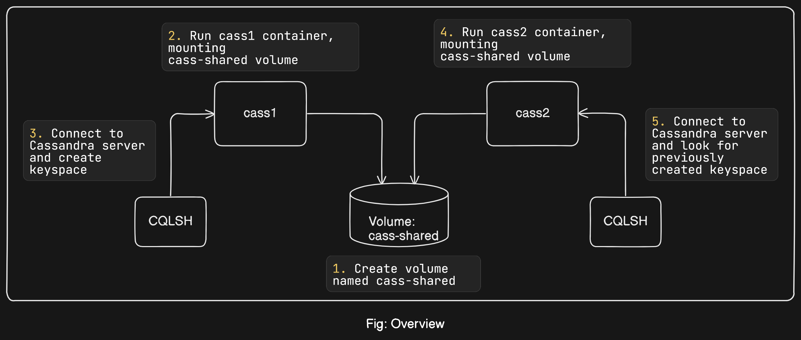
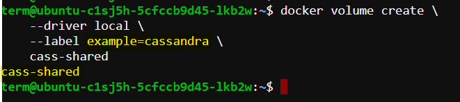
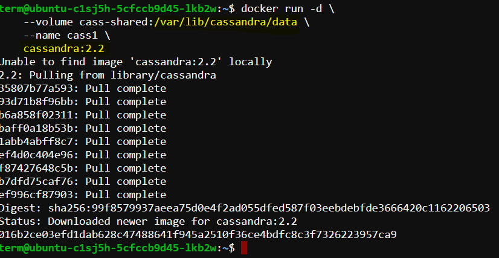
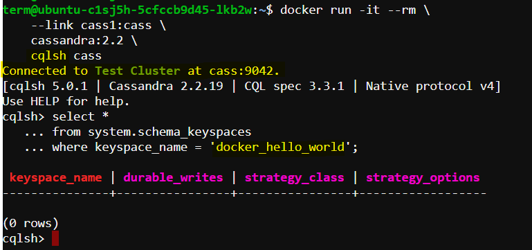
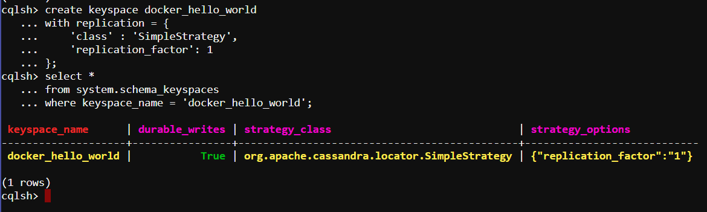
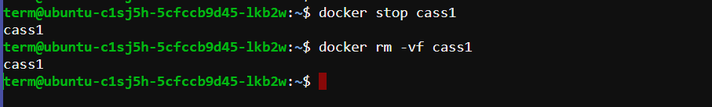
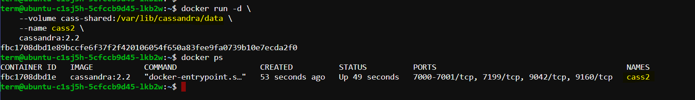
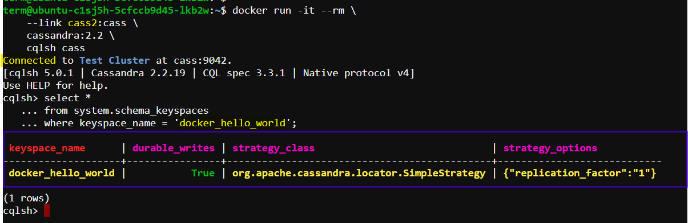
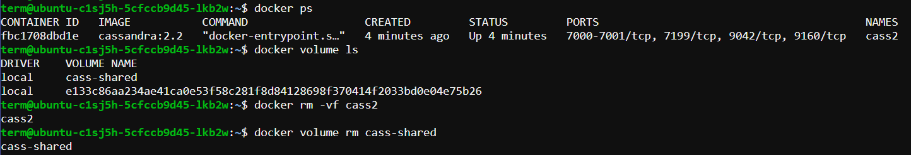

## Working with Docker Volumes

Docker Volume is a mechanism in Docker that allows you to persist data even after a container is deleted or recreated. It provides a way to store data outside of the container's filesystem, so that data is not lost when the container is restarted or deleted.


## Why do we need Docker Volumes?

When you run a container, it has its own filesystem, which is ephemeral. This means that any data written to the container's filesystem will be lost when the container is deleted or restarted. Docker Volumes provide a way to decouple the data from the container's filesystem, so that data can be preserved even when the container is recreated.

## How do Docker Volumes work?

A Docker Volume is a directory that is **shared** between the host machine and a container. When you create a volume, Docker creates a directory on the host machine, and mounts it to a directory inside the container. This allows data to be written to the volume, which is persisted even when the container is deleted or recreated.

## Example Scenerio: Using Docker volumes with a NoSQL Database (Apache Cassandra)

In this scenario, we will use `Docker` to create and manage a single-node `Cassandra cluster`. We'll create a `keyspace`, delete the container, and then recover the `keyspace` on a new node in another container using Docker volumes. Follow the detailed steps below:



## Step 1: Create Docker Volume

First, we will create a Docker volume that will store the `Cassandra database` files. This volume will use `disk space` on the local machine.

```bash
docker volume create \
    --driver local \
    --label example=cassandra \
    cass-shared
```



**Explanation:** 

- **docker volume create:** Command to create a Docker volume.
- **--driver local:** Specifies that the volume should use the local driver.
- **--label example=cassandra:** Adds a label to the volume for easier management and identification.
- **cass-shared:** The name of the volume.

## Step 2: Run a Cassandra Container

Next, run a `Cassandra container` and mount the previously created volume to the container.

```bash
docker run -d \
    --volume cass-shared:/var/lib/cassandra/data \
    --name cass1 \
    cassandra:2.2
```


**Explanation:**

- **docker run -d:** Runs the container in detached mode.
- **--volume cass-shared:/var/lib/cassandra/data:** Mounts the cass-shared volume to /var/lib/cassandra/data inside the container.
- **--name cass1:** Names the container cass1.
- **cassandra:2.2:** Uses the Cassandra image version 2.2 from Docker Hub.

## Step 3: Connect to the Cassandra Container

Use the Cassandra client tool `(CQLSH)` to connect to the running Cassandra server.

```bash
docker run -it --rm \
    --link cass1:cass \
    cassandra:2.2 \
    cqlsh cass
```

**Explanation:**

- **docker run -it --rm:** Runs the container interactively and removes it after exit.
- **--link cass1:cass:** Links the client container to the cass1 container.
- **cassandra:2.2:** Uses the Cassandra image version 2.2.
- **cqlsh cass:** Runs the CQLSH command line tool to connect to the Cassandra server.

Now you can inspect or modify your `Cassandra database` from the `CQLSH` command line. First, look for a keyspace named `docker_hello_world`:

```sql
select *
from system.schema_keyspaces
where keyspace_name = 'docker_hello_world';
```

**Explanation:**

- select * from system.schema_keyspaces where keyspace_name = 'docker_hello_world';: Queries the system schema for the docker_hello_world keyspace.



Cassandra should return an *empty* list. This means the database hasn’t been *modified* by the example.

## Step 04: Create and Verify a Keyspace

Inside the CQLSH shell, create a keyspace named `docker_hello_world`.

```sql
create keyspace docker_hello_world
with replication = {
    'class' : 'SimpleStrategy',
    'replication_factor': 1
};
```

**Explanation:**

- create keyspace: Creates a new keyspace.
- docker_hello_world: The name of the keyspace.
- with replication = { 'class' : 'SimpleStrategy', 'replication_factor': 1 }: Specifies the replication strategy and factor.

### Verify the keyspace creation:

```sql
select *
from system.schema_keyspaces
where keyspace_name = 'docker_hello_world';
```

If the keyspace was created successfully, you will see the entry in the query result.



## Step 5: Stop and Remove the Cassandra Container

Exit the CQLSH shell and remove the Cassandra container.

```bash
quit
```

```bash
docker stop cass1
docker rm -vf cass1
```



**Explanation:**

- **quit**: Exits the CQLSH shell.
- **docker stop cass1**: Stops the cass1 container.
- **docker rm -vf cass1**: Removes the cass1 container `forcefully` and deletes associated `resources`.

## Step 6: Test Data Recovery

Create a new Cassandra container and attach the volume to it.

```bash
docker run -d \
    --volume cass-shared:/var/lib/cassandra/data \
    --name cass2 \
    cassandra:2.2
```



### Connect to the new Cassandra container using CQLSH.

```bash
docker run -it --rm \
    --link cass2:cass \
    cassandra:2.2 \
    cqlsh cass
```

### Query the keyspace to verify data persistence.

```sql
select *
from system.schema_keyspaces
where keyspace_name = 'docker_hello_world';
```

If the keyspace docker_hello_world is listed in the result, it confirms that the data `persisted` in the `cass-shared` volume.



## Step 7: Clean Up

Exit the `CQLSH shell` and remove the containers and volume.

```bash
quit
```

```bash
docker rm -vf cass2
docker volume rm cass-shared
```

**Explanation:**

- **quit**: Exits the CQLSH shell.
- **docker rm -vf cass2**: Removes the cass2 container forcefully.
- **docker volume rm cass-shared**: Deletes the cass-shared volume.



## Summary

In this scenario, we have:
1. Created a Docker volume.
2. Ran a Cassandra container with the volume mounted.
3. Connected to the Cassandra container using CQLSH.
4. Created and verified a keyspace.
5. Stopped and removed the Cassandra container.
6. Tested data recovery by creating a new container and verifying the keyspace.
7. Cleaned up by removing the containers and volume.

This demonstrates how to use Docker volumes for data persistence in a Cassandra database, ensuring that data remains available even after the container is deleted.