# Log Sharing Between Containers

This scenario demonstrates the process of sharing files between multiple Docker containers using two methods: `bind mounts` and `Docker volumes`. The goal is to showcase the benefits of Docker volumes over bind mounts, and to illustrate the flexibility and ease of use provided by anonymous volumes and the `--volumes-from` flag.

## Scenario Overview

1. **Bind Mount Example**: We start by setting up a directory on the host and bind-mounting it into two containers—one for writing log files and one for reading them.


2. **Docker Volume Example**: We then perform the same operation using Docker volumes, eliminating host-specific dependencies.
3. **Anonymous Volumes and `--volumes-from` Flag**: Finally, we demonstrate using anonymous volumes and the `--volumes-from` flag to dynamically share volumes between multiple containers.


## Initial setup:

First we will create a docker image that performs simple file writting application in a Docker container. Here’s how you can create your own:

**1. Create a Dockerfile**

```Dockerfile
FROM alpine:latest
RUN apk add --no-cache bash
CMD ["sh", "-c", "while true; do date >> /data/logA; sleep 1; done"]
```

**2. Build the Docker image**

```sh
docker build -t my_writer .
```

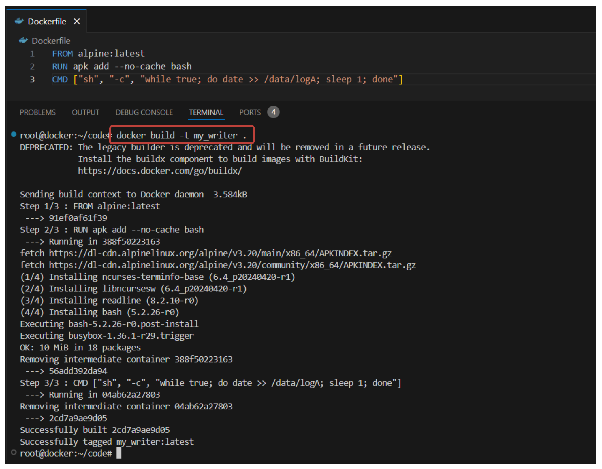

**3. Verify the docker image**

```sh
docker images
```
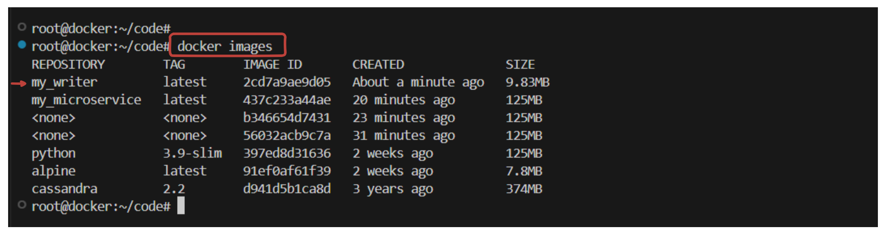

## Log sharing using Bind Mount:

**1. Setup a Known Location on Host**:

```sh
LOG_SRC=~/web-logs-example
mkdir ${LOG_SRC}
```
- **LOG_SRC**: This is an environment variable that stores the path to the directory where the logs will be stored.
- **mkdir ${LOG_SRC}**: This command creates a new directory at the path specified by LOG_SRC.

**2. Create and Run a Log-Writing Container and use `bind mounts` to share the log directory**:

```sh
docker run --name plath -d \
    --mount type=bind,src=${LOG_SRC},dst=/data \
    my_writer
```

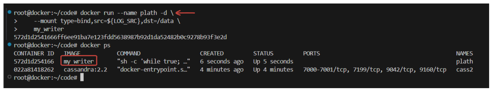

**3. Create and Run a Log-Reading Container and use `bind mounts` to share**:

```sh
docker run --rm \
    --mount type=bind,src=${LOG_SRC},dst=/data \
    alpine:latest \
    head /data/logA
```

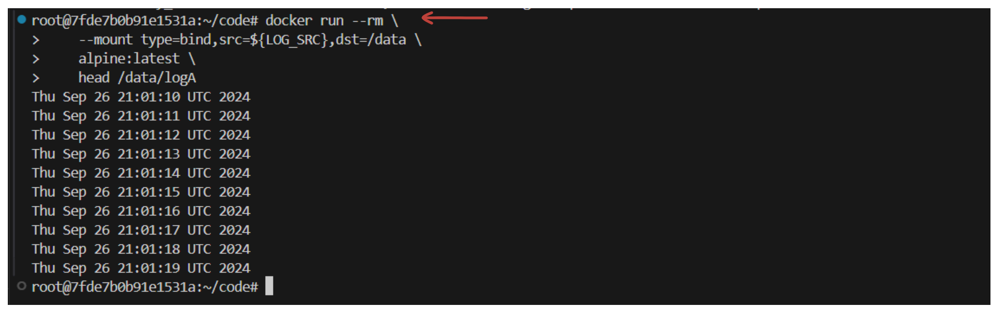

*Explanation:*

- **docker run**: This command creates and starts a new container.
- **--name plath**: This names the container "plath".
- **-d**: This flag runs the container in detached mode, meaning it runs in the background.
- **--mount type=bind,src=${LOG_SRC},dst=/data**: This option specifies a bind mount. It maps the host directory (src) to the container directory (dst).
  - **type=bind**: Indicates the type of mount.
  - **src=${LOG_SRC}**: Source directory on the host.
  - **dst=/data**: Destination directory inside the container.
- **--rm**: This flag automatically removes the container when it exits.
- **alpine:latest**: The image used to create the container. Alpine is a lightweight Linux distribution.
- **head /data/logA**: This command reads the top part of the log file.

**View Logs from Host**:

We can also view the logs directly from the host.

```sh
cat ${LOG_SRC}/logA
```
- **cat**: This command displays the contents of the file.
- **${LOG_SRC}/logA**: Path to the log file on the host.

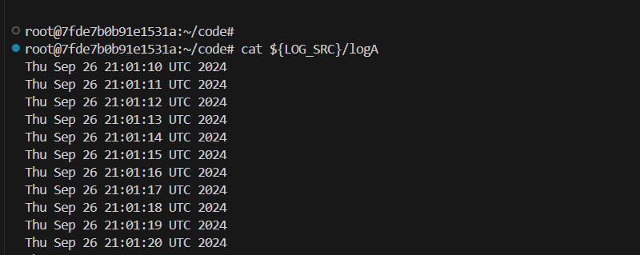

**Stop the Log-Writing Container**:

```sh
docker rm -f plath
```

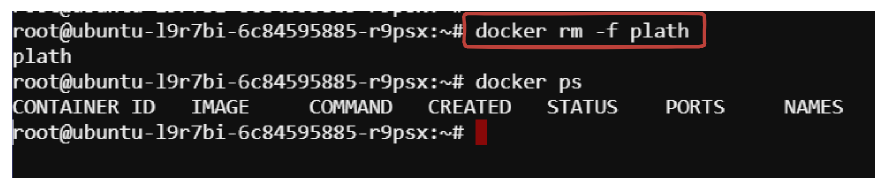

## Log sharing using Docker Volume: 

Now we will achieve the same result using docker volume.

**1. Create Docker Volume**:

```sh
docker volume create --driver local logging-example
docker volume ls
```

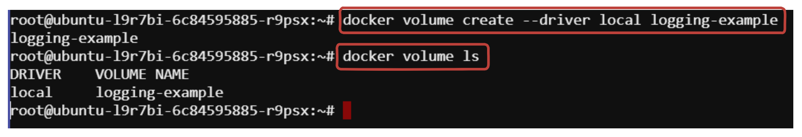

**Explanation:**

- **docker volume create**: This command creates a new Docker volume.
- **--driver local**: This specifies the volume driver to use. "local" is the default driver.
- **logging-example**: Name of the volume.

**2. Create and Run a Log-Writing Container**:

```sh
docker run --name plath -d \
    --mount type=volume,src=logging-example,dst=/data \
    my_writer
```

**3. Create and Run a Log-Reading Container**:

```sh
docker run --rm \
    --mount type=volume,src=logging-example,dst=/data \
    alpine:latest \
    head /data/logA
```

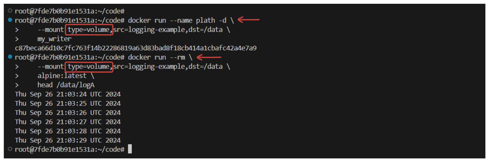

**Explanation:**

- **docker run**: This command runs a new container.
- **--mount type=volume,src=logging-example,dst=/data**: This option specifies a volume mount.
  - **type=volume**: Indicates the type of mount.
  - **src=logging-example**: Source volume.
  - **dst=/data**: Destination directory inside the container.


**4. View Logs from Host**:

```sh
cat /var/lib/docker/volumes/logging-example/_data/logA
```

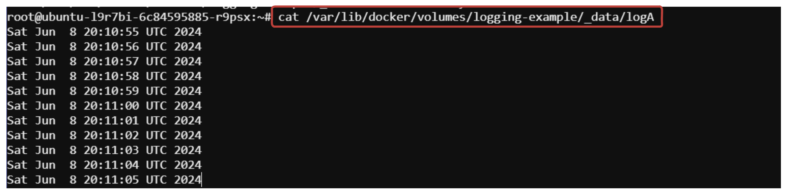


**5. Stop the Log-Writing Container**:
```sh
docker stop plath
```

## Anonymous Volumes

Now, let's explore using anonymous volumes and the `--volumes-from` flag.

**1. Create Containers with Anonymous Volumes**:
```sh
docker run --name fowler \
    --mount type=volume,dst=/library/PoEAA \
    --mount type=bind,src=/tmp,dst=/library/DSL \
    alpine:latest \
    echo "Fowler collection created."

docker run --name knuth \
    --mount type=volume,dst=/library/TAoCP.vol1 \
    --mount type=volume,dst=/library/TAoCP.vol2 \
    --mount type=volume,dst=/library/TAoCP.vol3 \
    --mount type=volume,dst=/library/TAoCP.vol4.a \
    alpine:latest \
    echo "Knuth collection created"
```

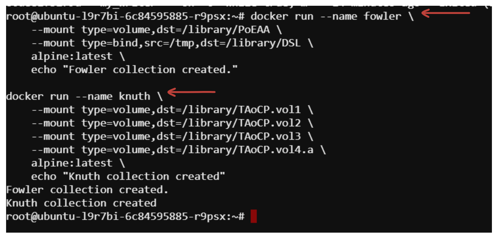

**Explanation:**

- **--mount type=volume,dst=/library/PoEAA**: Creates an anonymous volume mounted at /library/PoEAA.
- **--mount type=bind,src=/tmp,dst=/library/DSL**: Creates a bind mount from /tmp on the host to /library/DSL in the container.

**2. Share Volumes with Another Container**

Create a container that uses the volumes from the previous containers.

```sh
docker run --name reader \
    --volumes-from fowler \
    --volumes-from knuth \
    alpine:latest ls -l /library/
```

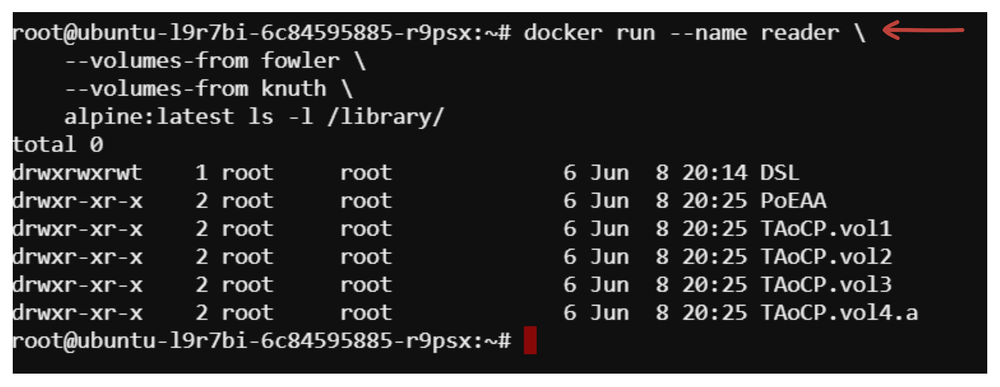

**Explanation:**

- **--volumes-from fowler**: Copies the mount points from the container "fowler".
- **--volumes-from knuth**: Copies the mount points from the container "knuth".
- **ls -l /library/**: Lists the contents of the /library/ directory.

**3. Inspect Volumes of the New Container**:

Check the volumes of the new container.

```sh
docker inspect --format "{{json .Mounts}}" reader | jq .
```

*Expected Output:* (Make sure to install `jq` command-line tool if you want to format the JSON output in a prettier way)

```bash
sudo apt-get update
sudo apt install jq -y
```

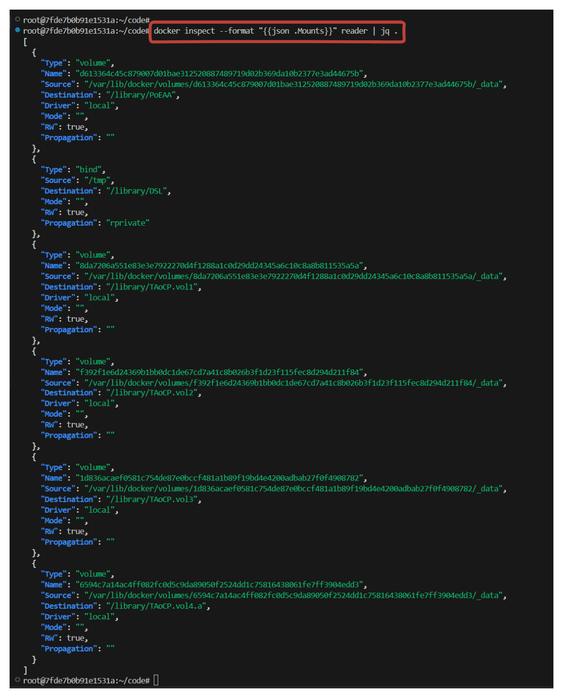
- **docker inspect**: Provides detailed information about Docker objects.
- **--format "{{json .Mounts}}"**: Formats the output to show the mounts of the container.

## Cleaning up volumes

### Removing a Specific Volume

```sh
docker volume ls
docker volume rm <volume_name>
```

### Pruning Unused Volumes

```sh
docker volume prune
```

### Forcefully Removing All Volumes

```sh
docker stop $(docker ps -aq)
docker rm $(docker ps -aq)
docker volume rm $(docker volume ls -q)
```

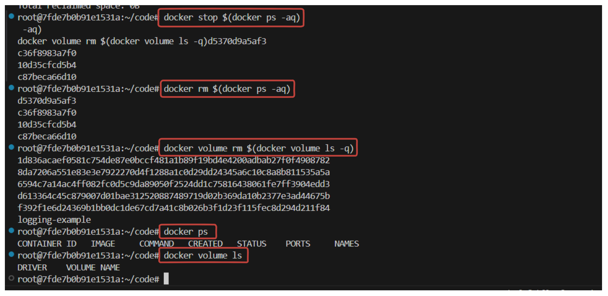

By following these procedures, you can efficiently manage and remove Docker volumes, ensuring your Docker environment remains clean and optimized.

### Conclusion

This scenario highlights the advantages of using Docker volumes over bind mounts for sharing files between containers. Docker volumes offer better portability, simplified management, and improved security. Additionally, using anonymous volumes and the `--volumes-from` flag provides dynamic and flexible data sharing, making it easier to manage complex containerized applications.