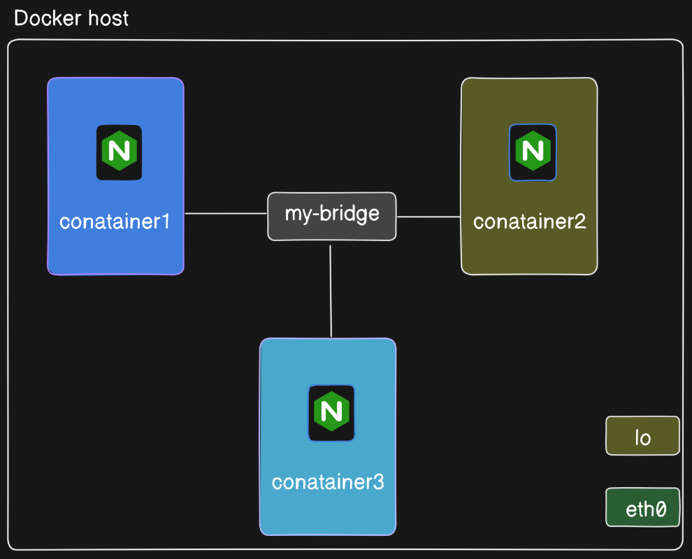
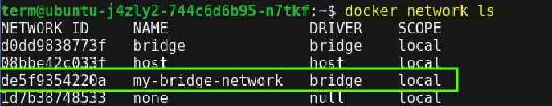
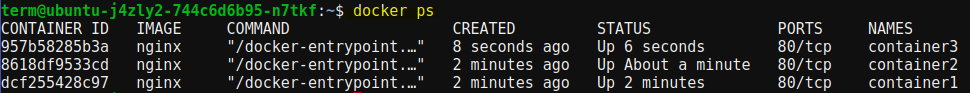
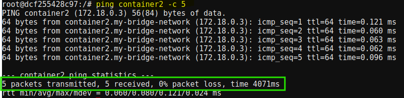
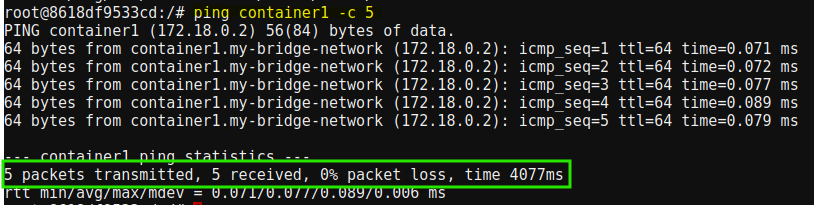
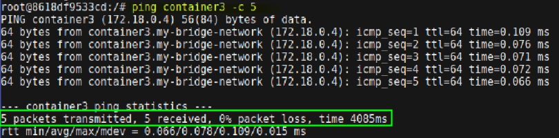

# Communication Between Containers in a Custom Bridge Network

Consider a scenario,where we will set up a custom bridge network in Docker, launch three Nginx containers, connect them to the network, and test their communication by pinging one container from another.



## Creating the User-Defined Bridge Network

Let's start by creating the bridge network:

```shell
docker network create --driver bridge my-bridge-network
```

This command sets up a user-defined bridge network named `my-bridge-network`.

To see the networks:

```shell
docker network ls
```
Expected Output:




## Launching Containers and Connecting to the Network

Next, we'll launch three containers named `container1`, `container2`, and `container3`, and connect them to the `my-bridge-network` we created.

### Launching Container 1

```shell
docker run -d --name container1 --network=my-bridge-network nginx
```

### Launching Container 2

```shell
docker run -d --name container2 --network=my-bridge-network nginx
```

### Launching Container 3

```shell
docker run -d --name container3 --network=my-bridge-network nginx
```

## Verifying container 

To check the container status:



## Verifying Communication

### Container Shell Access

Access the shell of any container1:

```shell
docker exec -it container1 /bin/bash
```

Once inside the container1, we can ping the other containers by their names or IP addresses:

```shell
ping container2 -c 5
```

```shell
ping container2 -c 5
```
Expected output:




Access the shell of any container2:

```shell
docker exec -it container2 /bin/bash
```

Once inside the container2, we can ping the other containers by their names or IP addresses:

```shell
ping container1 -c 5
```

```shell
ping container3 -c 5
```
Expected output:





## Conclusion

By following these steps, we can create a user-defined bridge network in Docker and demonstrate successful communication between multiple containers connected to the same network. This setup showcases the flexibility and efficiency of Docker networking, enabling seamless interaction between containerized applications.