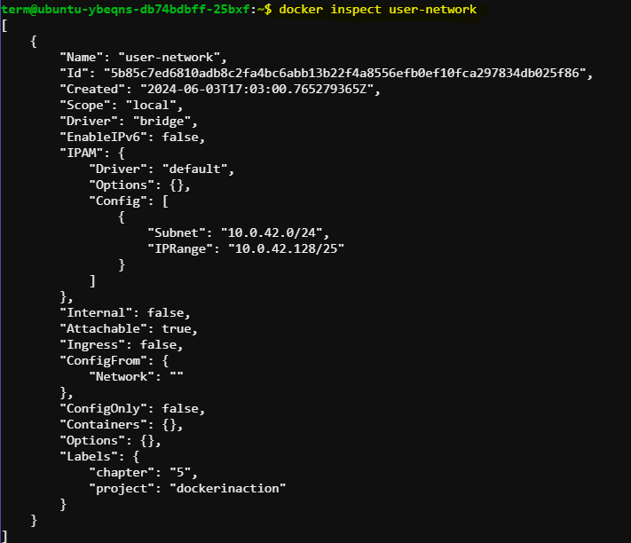
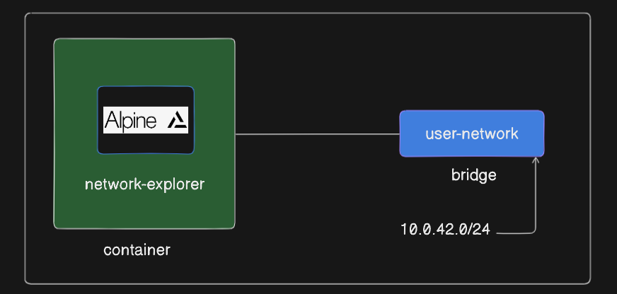
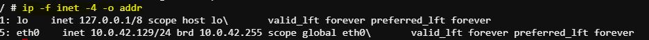
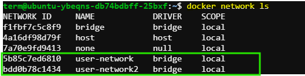
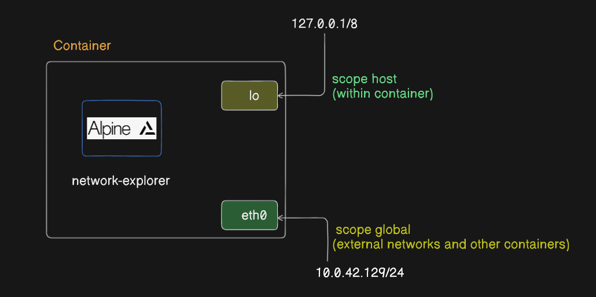
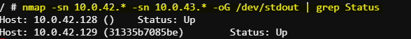

# Exploring Bridge Networks in Docker

In this documentation, we'll explore bridge networks in Docker by creating and examining custom bridge networks, attaching containers to multiple networks, and using tools like `ip` and `nmap` to examine network configurations and discover other containers.

## Creating and Examining a Custom Bridge Network

Let's start by creating a custom bridge network named `user-network` and exploring its configuration:

```bash
docker network create \
  --driver bridge \
  --label project=dockerinaction \
  --label chapter=5 \
  --attachable \
  --scope local \
  --subnet 10.0.42.0/24 \
  --ip-range 10.0.42.128/25 \
  user-network
```


This command creates a bridge network with custom settings and labels.

To inspect the newly created bridge:



Now, let's launch a container attached to this network and examine its network interfaces:

```bash
docker run -it \
  --network user-network \
  --name network-explorer \
  alpine:3.8 \
    sh
```



Inside the container, run the following command to list the available IPv4 addresses:

```bash
ip -f inet -4 -o addr
```

We'll see output similar to:



This output shows that the container has an IP address within the range and subnet specified by the `user-network` configuration.

## Attaching Containers to Multiple Networks

Now, let's attach the `network-explorer` container to another bridge network named `user-network2`:

```bash
docker network create \
  --driver bridge \
  --label project=dockerinaction \
  --label chapter=5 \
  --attachable \
  --scope local \
  --subnet 10.0.43.0/24 \
  --ip-range 10.0.43.128/25 \
  user-network2
```
To see the networks :

```bash
docker network ls
```
Expected Output:



Next, attach the `network-explorer` container to `user-network2`:

```bash
docker network connect \
  user-network2 \
  network-explorer
```


## Installing `nmap` Inside the Container

Inside the `network-explorer` container, install the `nmap` package:

```bash
docker exec -it network-explorer sh -c "apk update && apk add nmap"
```

This command executes a shell within the `network-explorer` container and installs the `nmap` package.

**nmap**: Installing nmap inside a Docker container provides network administrators and developers with a versatile tool for network exploration, security auditing, troubleshooting, and monitoring within the containerized environment.

## Using `nmap` to Explore the Network

Now, scan the subnets of both bridge networks:

```bash
nmap -sn 10.0.42.* -sn 10.0.43.* -oG /dev/stdout | grep Status
```



**Ping Scan**: `nmap` is used to perform a ping scan (`-sn`) on IP ranges `10.0.42.*` and `10.0.43.*`.

**Output Filtering**: Results are formatted in a greppable format (`-oG /dev/stdout`) and filtered using `grep` to display only lines containing "Status".

We'll see output indicating the status of devices on each subnet, including containers and gateway adapters.

## Conclusion

Exploring bridge networks in Docker allows us to understand network configurations, attach containers to multiple networks, and use tools like `ip` and `nmap` to examine network settings and discover other containers. This knowledge is essential for managing containerized applications and designing network architectures in Docker environments.