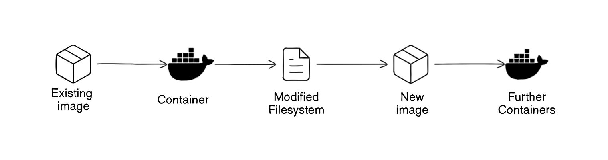
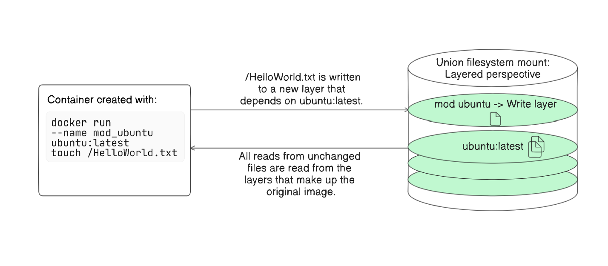
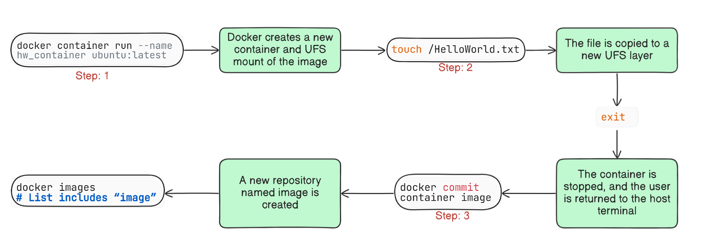

# Building Docker Images from a Container

Building Docker images from a container involves creating a container from an existing image, making modifications, and then committing those changes to form a new image. 

In this lab, we'll learn how to create a Docker image by making changes to a container and committing those changes. We'll start with a simple example where we create a `file` in a container and then `commit` this change to form a `new image`. 


## How It Works

When we create a Docker container, it uses a `Union File-System (UFS)` mount to provide its filesystem. Any changes made to the filesystem within the container are written as new layers, which are owned by the container that created them. 

To build a new image, we start with an existing image, make changes to it by modifying the container's filesystem, and then commit these changes to form a new image. This new image can then be used to create further containers, encapsulating the changes made.



### How UFS Works 

- **Base Layer:** This is the original, unchanged filesystem, like a basic Linux operating system.
- **Layers:** Each time you make changes (like installing software or creating files), these changes are saved as new layers on top of the base layer.
- **Union Mount:** The union filesystem merges these layers into a single, cohesive filesystem that the container uses.

    

    The above figure demonstrates how UFS works.

## Task
1. Create a container from the `ubuntu:latest` image and modify its filesystem by creating a file named `HelloWorld`.
2. Commit the changes made in the container to a new image named `hw_image`.
3. Remove the modified container to clean up.
4. Verify the changes by running a new container from the `hw_image` and checking the existence of the `HelloWorld` file.




## Solution

Follow these steps to complete the task:

1. **Create a container and modify its filesystem:**

    Create a container from the `ubuntu:latest` image and enter the container bash:
    ```sh
    docker run -it --name hw_container ubuntu:latest /bin/bash
    ```

    Create a file named `HelloWorld.txt` in the container:
    ```bash
    touch HelloWorld.txt
    ```

    Exit the container:
    ```bash
    exit
    ```

2. **Commit the changes to a new image:**

    Here we are creating a new image from our container:
    ```sh
    docker container commit hw_container hw_image
    ```

    We can see the new image using the following command:
    ```bash
    docker images
    ```

    Expected output:

    ```bash
    term@ubuntu-xhb8pe-6bc6869699-vmmr9:~$ docker container commit hw_container hw_image
    sha256:3d6172495dcf3736de54f049f32f21f6816dd2766c4c85647edfe6e2f191238d

    term@ubuntu-xhb8pe-6bc6869699-vmmr9:~$ docker images
    REPOSITORY   TAG       IMAGE ID       CREATED          SIZE
    hw_image     latest    3d6172495dcf   38 seconds ago   76.2MB
    ubuntu       latest    bf3dc08bfed0   4 weeks ago      76.2MB
    ```

3. **Remove the modified container:**

    Let's delete the existing container:
    ```sh
    docker container rm -vf hw_container
    ```

4. **Create new Container from the new Image:**

    Let's create a new container from the new image that we have created and enter the bash in the new container:
    ```sh
   docker run -it --name new_hw_container hw_image /bin/bash
    ```

    Use the following comand to see the files:

    ```bash
    ls
    ```

    Expected output:

    ```bash
    term@ubuntu-xhb8pe-6bc6869699-vmmr9:~$ docker run -it --name new_hw_container hw_image /bin/bash 

    root@2d9b5c80997a:/# ls
    HelloWorld.txt  bin  boot  dev  etc  home  lib  lib64  media  mnt  opt  proc  root  run  sbin  srv  sys  tmp  usr  var
    ```

    We can see the `HelloWorld.txt` in this container from our new image!

    This output confirms that the file `HelloWorld` was successfully created in the new image, demonstrating that the modifications made in the original container were correctly committed to the new image.


    ## Cleanup

    Remove the container and image:

    ```bash
    docker rm  new_hw_container
    docker rmi hw_image
    ```
