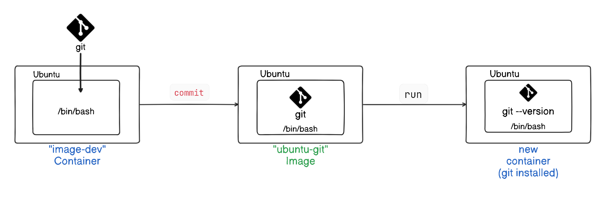

# Create and Commit an Ubuntu Container with Git Installed

This session will guide us through creating an `Ubuntu` container, installing `Git`, and committing the changes to a `new image`. Additionally, we'll learn how to set an `entrypoint` to make using the image more efficient.

## Task

We will perform the following steps:
1. Create an `ubuntu` container and open a `bash` session.
2. Install `git` inside the container and verify the git.
3. Create new `image` by using `commit`.
4. Set the `entrypoint` for the new image to make it easier to use.

## Simple Explanation of the Process
In this lab, we will start by creating a container from the `Ubuntu` image and open a `bash` session within it. Inside this container, we will install `git` and verify that the installation was successful by checking the git `version`. After exiting the container, we will commit these changes to create a new Docker image that includes `git`. We will run a container from that image.



Finally, we will set an `entrypoint` for this new image to make it easier to use git directly without needing to specify the git command each time we start a container from this image.


## Steps

1. **Create an Ubuntu container and open a bash session:**
    ```sh
    docker run -it --name image-dev ubuntu:latest /bin/bash
    ```
    This command creates a new container named `image-dev` from the `ubuntu:latest` image and opens an interactive bash session.

2. **Install Git inside the container:**
    ```sh
    apt-get update
    apt-get install -y git
    ```
    This updates the package list and installs Git in the container.

3. **Verify the Git installation by checking its version:**
    ```sh
    git --version
    ```
    Expected output:
    ```bash
    root@d15b204bcec5:/# git --version
    git version 2.43.0
    ```
    This command confirms that Git was installed correctly.

4. **Exit the container:**
    ```sh
    exit
    ```
    This command exits the interactive bash session and returns to the host terminal.

5. **Review the filesystem changes and commit these changes to create a new image:**
    ```sh
    docker container commit -a "@poridhi" -m "Added git" image-dev ubuntu-git
    ```
    This command commits the changes made in the `image-dev` container to a new image named `ubuntu-git` with an author tag and a commit message.

6. **Remove the modified container:**
    ```sh
    docker container rm -vf image-dev
    ```
    This command forcefully removes the `image-dev` container to clean up.

7. **Verify the new image by checking the Git version in a new container:**

    ```sh
    docker container run --rm ubuntu-git git --version
    ```
    This command runs a temporary container from the `ubuntu-git` image to verify that Git is installed correctly.

## Setting the Entrypoint to Git

1. **Create a new container with the entrypoint set to Git:**
    ```sh
    docker container run --name cmd-git --entrypoint git ubuntu-git
    ```
    This command creates a new container named `cmd-git` with the entrypoint set to `git`, showing the standard Git help and exiting.

2. **Commit the new image with the entrypoint:**
    ```sh
    docker container commit -m "Set CMD git" -a "@poridhi" cmd-git ubuntu-git
    ```
    This command commits the changes to the `ubuntu-git` image, setting the entrypoint to Git.

3. **Remove the modified container:**
    ```sh
    docker container rm -vf cmd-git
    ```
    This command forcefully removes the `cmd-git` container to clean up.

4. **Test the new image:**
    ```sh
    docker container run --name cmd-git ubuntu-git version
    ```
    This command runs a new container from the `ubuntu-git` image, verifying that the entrypoint is set correctly and showing the Git version:
    ```sh
    git version 2.43.0
    ```

This setup ensures that any container started from the `ubuntu-git` image will automatically use Git as the entrypoint, making it easier for users to work with Git directly.