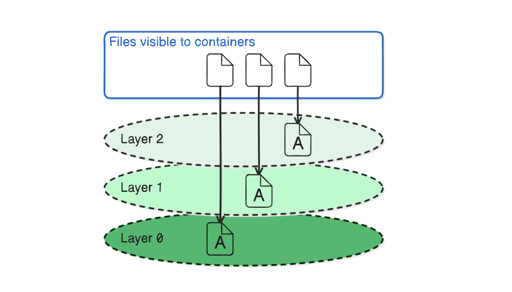
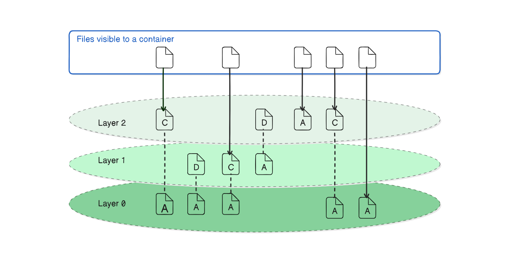
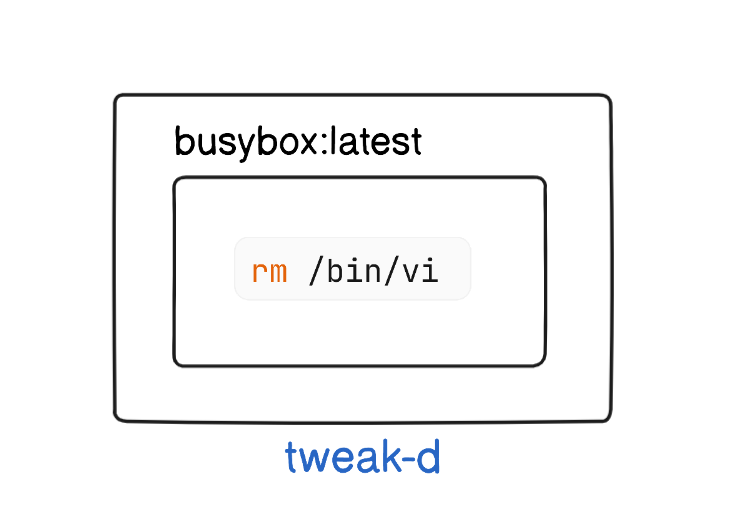
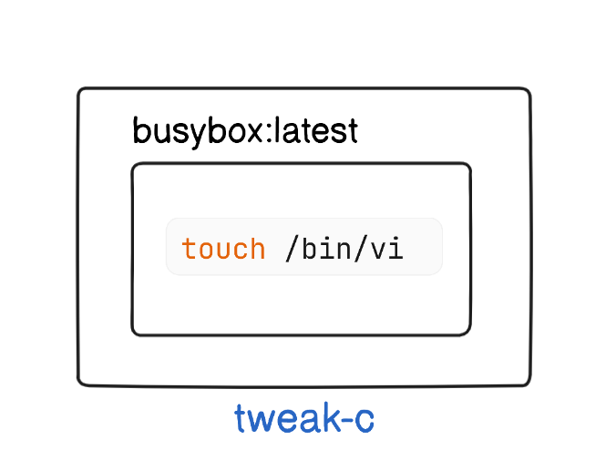

# Reviewing filesystem changes

In this lab, we will learn how to review filesystem changes made inside a Docker container. Docker provides a command to list all changes to the filesystem, including added, changed, or deleted files and directories.

<!-- The objective of this lab is to create containers, make various modifications to their filesystems, and use the `docker container diff` command to review those changes. We will also learn how to clean up our workspace by removing the containers created during the lab. -->

 When you read a file from a union filesystem, that file will be read from the topmost
 layer where it exists. If a file was not created or changed on the top layer, the read will
 fall through the layers until it reaches a layer where that file does exist. Here is a simple example:

 

The layer functionality is hidden by the UFS. No special actions are required by the software running in a container to utilize these features. The UFS manages the complexity of handling files across multiple layers.

Most union filesystems use something called copy-on-write, which is easier to under
stand if you think of it as copy-on-change. When a file in a read-only layer (not the
top layer) is modified, the whole file is first copied from the read-only layer into the
writable layer before the change is made.



In this illustration,
 files are added, changed, deleted, and added again over a range of three layers.

## Task

1. Create a container and `add` a new file and review changes
2. Create another container and `delete` an existing file and review changes
3. Create yet another container and `change` an existing file and review changes
4. Clean up our workspace

## Steps

Follow these steps to complete the task:

1. **Create a container and add a new file:**

    

    **Command**:
    ```sh
    docker container run --name tweak-a busybox:latest touch /HelloWorld
    ```

    This command runs a new container named `tweak-a` from the `busybox:latest` image and creates an empty file named `/HelloWorld` inside the container.

2. **Review the filesystem changes:**
    ```sh
    docker container diff tweak-a
    ```

    This command lists all the changes made to the `filesystem` of the `tweak-a` container. You should see:

    **Expected Output:**
    ```
    A /HelloWorld
    ```

    This indicates that the file /HelloWorld was added.


3. **Create another container and delete an existing file:**

    

    **Command:**
    ```sh
    docker container run --name tweak-d busybox:latest rm /bin/vi
    ```

    This command runs a new container named `tweak-d` from the `busybox:latest` image and deletes the file `/bin/vi`.

4. **Review the filesystem changes:**
    ```sh
    docker container diff tweak-d
    ```

    This command lists all the changes made to the `filesystem` of the `tweak-d` container. You should see:

    **Expected Output:**
    ```
    C /bin
    D /bin/vi
    ```

    This indicates that the directory `/bin` was changed and the file `/bin/vi` was deleted.


5. **Create yet another container and change an existing file:**

    

    **Command:**
    ```sh
    docker container run --name tweak-c busybox:latest touch /bin/vi
    ```

    This command runs a new container named `tweak-c` from the `busybox:latest` image and updates the modification time of the file `/bin/vi`.

6. **Review the filesystem changes:**
    ```sh
    docker container diff tweak-c
    ```

    This command lists all the changes made to the `filesystem` of the `tweak-c` container. You should see:

    **Expected Output:**
    ```
    C /bin
    C /bin/busybox
    ```

    This indicates that the directories /bin and /bin/busybox were changed.

7. **Clean up our workspace by removing the containers:**
    ```sh
    docker container rm -vf tweak-a
    docker container rm -vf tweak-d
    docker container rm -vf tweak-c
    ```

    These commands forcefully remove the `tweak-a`,` tweak-d`, and `tweak-c` containers, cleaning up our workspace.

## Explanation of `docker container diff` Output

- Lines that start with an `A` indicate files that were **added**.
- Lines that start with a `C` indicate files that were **changed**.
- Lines that start with a `D` indicate files that were **deleted**.

By following these steps, you'll be able to track and understand filesystem changes within Docker containers. This is particularly useful for debugging and for ensuring that your containerized applications behave as expected.

## Commands Summary

1. **Create a container and add a new file:**
    ```sh
    docker container run --name tweak-a busybox:latest touch /HelloWorld
    ```

2. **Review the filesystem changes:**
    ```sh
    docker container diff tweak-a
    ```

3. **Create another container and delete an existing file:**
    ```sh
    docker container run --name tweak-d busybox:latest rm /bin/vi
    ```

4. **Review the filesystem changes:**
    ```sh
    docker container diff tweak-d
    ```

5. **Create yet another container and change an existing file:**
    ```sh
    docker container run --name tweak-c busybox:latest touch /bin/vi
    ```

6. **Review the filesystem changes:**
    ```sh
    docker container diff tweak-c
    ```

7. **Clean up your workspace:**
    ```sh
    docker container rm -vf tweak-a
    docker container rm -vf tweak-d
    docker container rm -vf tweak-c
    ```

