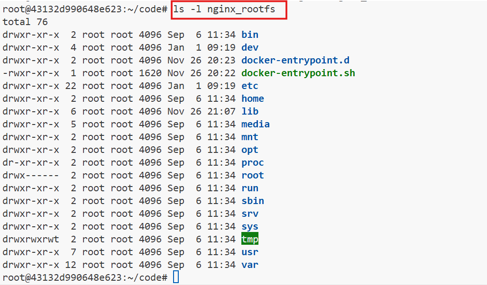

# **Extracting Container Image Filesystem Using Docker**

## **Objective**
Learn how to extract the filesystem of a Docker container image using different methods and understand their trade-offs.


## **Prerequisites**
- Docker installed on your system (version 18.09+ recommended).
- Basic understanding of Docker commands.
- A Linux-based operating system or Docker Desktop.
- Access to the internet to pull Docker images.


## **Lab Steps**

### **1. Setting Up**
1. Verify your Docker installation:
   ```bash
   docker --version
   ```
2. Pull the target container image:
   ```bash
   docker pull nginx:alpine
   ```


### **2. Method 1: Using `docker save`**

`docker save` produces a tarball containing image layers and metadata but not a complete filesystem. This method is ideal for transferring or archiving images.

1. Use the `docker save` command to export the image:
   ```bash
   docker save nginx:alpine -o nginx_alpine.tar
   ```
2. Extract the `.tar` file:
    ```bash
    mkdir image_layers
    tar -xf nginx_alpine.tar -C image_layers
    ```
3. Explore the extracted layers:
   ```bash
   ls -l image_layers
   ```

    


### **3. Method 2: Using `docker export`**

`docker export` extracts the filesystem of a container in its current state, excluding Docker-specific metadata (e.g., image layers). It's useful for obtaining a clean snapshot of the container's filesystem.

1. Start a container:
   ```bash
   CONT_ID=$(docker run -d nginx:alpine)
   ```
2. Export the filesystem:
   ```bash
   docker export ${CONT_ID} -o nginx_fs.tar.gz
   ```
3. Extract the `.tar` file:
   ```bash
    mkdir nginx_rootfs
    tar -xf nginx_fs.tar.gz -C nginx_rootfs
   ```
4. Explore the filesystem:
   ```bash
   ls -l nginx_rootfs
   ```

    

    Tip: Stop and remove the container after this step:

    ```bash
    docker rm -f ${CONT_ID}    
    ```


### **4. Method 3: Using `docker create + docker export`**

Using `docker create` avoids starting the container, creating a lightweight placeholder for exporting its filesystem. This method is useful when you don't need to execute any processes within the container.

1. Create a container without starting it:
   ```bash
   CONT_ID=$(docker create nginx:alpine)
   ```
2. Export the filesystem:
   ```bash
   docker export ${CONT_ID} -o nginx_fs.tar.gz
   ```
3. Extract the `.tar` file:
   ```bash
    mkdir nginx_rootfs
    tar -xf nginx_fs.tar.gz -C nginx_rootfs
   ```
4. Explore the filesystem:
   ```bash
   ls -l nginx_rootfs
   ```

    

5. **Cleanup:**
   ```bash
   docker rm ${CONT_ID}
   ```
6. **Observation:** This method avoids starting a container, preserving the original filesystem structure.


### **5. Method 4: Using `ctr image mount`**

`containerd` is the runtime underlying Docker. Using `ctr`, you can directly mount image layers as a unified filesystem. This is efficient for temporary exploration without exporting.


1. Install `ctr` (containerd CLI) if not already installed.
2. Pull the image using `ctr`:
   ```bash
   sudo ctr image pull docker.io/library/nginx:alpine
   ```
3. Mount the image filesystem:
   ```bash
   mkdir nginx_rootfs
   sudo ctr image mount docker.io/library/nginx:alpine nginx_rootfs
   ```
4. Explore the filesystem:
   ```bash
   ls -l nginx_rootfs
   ```
5. **Cleanup:**
   ```bash
   sudo umount ginx_rootfs
   ```


## **Comparison of Methods**
| Method                    | Pros                                    | Cons                                      |
|---------------------------|-----------------------------------------|-------------------------------------------|
| `docker save`             | Simple to use                          | Exports layers, not the final filesystem. |
| `docker export`           | Exports filesystem of a running container | Requires starting a container.           |
| `docker create + export`  | Avoids running a container              | Some small artifacts may still exist.    |
| `docker build -o`         | Accurate filesystem representation     | Requires BuildKit and might lose ownership metadata. |
| `ctr image mount`         | Artifact-free filesystem export         | Requires containerd and additional setup.|


## **Conclusion**
In this lab, you explored multiple methods to extract the filesystem of a Docker image. Each method has its use case, and the choice depends on your requirements for accuracy, speed, and security.

 
