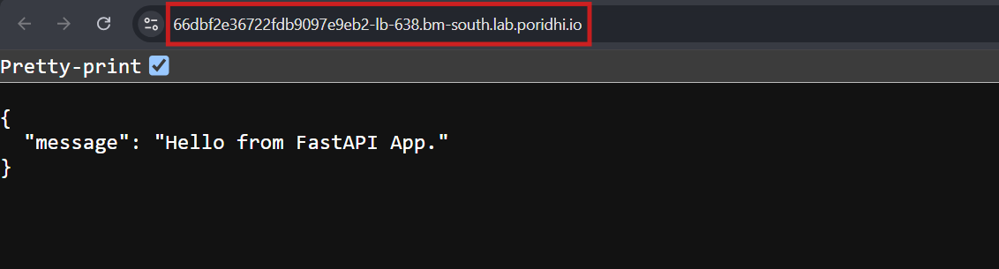

# **FastAPI Fundamentals**

## **What is FastAPI?**
FastAPI is a modern, fast (high-performance) web framework for building APIs with Python. It leverages standard Python type hints to enable features like automatic data validation and interactive API documentation.

### **Key Features:**
1. **Fast:** Built on Starlette and Pydantic, FastAPI is optimized for high performance.
2. **Type-Safe:** Supports Python type hints for input validation and code readability.
3. **Interactive API Docs:** Automatically generates Swagger UI (`/docs`) and ReDoc (`/redoc`) documentation.
4. **Easy to Use:** Minimal setup required for getting started.


## **Basic Workflow of FastAPI**

1. **Define Endpoints:** Use Python decorators (`@app.get`, `@app.post`, etc.) to define routes for HTTP methods.
2. **Add Route Paths:** Assign URL paths to endpoints to define the API structure.
3. **Use Type Annotations:** Leverage Python type hints to validate request parameters and bodies.
4. **Run the Server:** Use Uvicorn to serve your application.


## **Objectives**

1. Learn the fundamentals of FastAPI.
2. Install and set up FastAPI on a local environment.
3. Define API endpoints with decorators.
4. Use Pydantic models for data validation and nested schemas.
5. Understand query parameters, request bodies, and validation techniques.


## **Task Description**

1. Install FastAPI and its dependencies.
2. Define API endpoints for basic operations.
3. Create list-based endpoints.
4. Use Pydantic models, including nested schemas.
5. Filter data with URL query parameters.
6. Handle request bodies with data validation.


## **Setting Up FastAPI**

### **1. Installing FastAPI**

1. **Install the Python Virtual Environment Package:**
   ```bash
   sudo apt update
   sudo apt install python3.8-venv
   ```

2. **Create a Virtual Environment:**
   Open a terminal in your project directory and create a virtual environment:
   ```bash
   python3 -m venv venv-fastapi
   source venv-fastapi/bin/activate
   ```

3. **Install FastAPI and Uvicorn:**
   Run the following command to install FastAPI and Uvicorn (ASGI server):
   ```bash
   pip install fastapi uvicorn
   ```


### **2. Creating the FastAPI Application**

1. **Create a File:**  
   Inside your project folder, create a file named `main.py`:
   ```python
   # main.py
   from fastapi import FastAPI

   app = FastAPI()

   @app.get("/")
   async def index():
       return {"message": "Hello, FastAPI!"}
   ```

2. **Run the Server:**  
   Use Uvicorn to start the development server:
   ```bash
   uvicorn main:app --reload --host 0.0.0.0
   ```
   - Open [http://127.0.0.1:8000](http://127.0.0.1:8000) to view the response.
   - Access interactive API docs at [http://127.0.0.1:8000/docs](http://127.0.0.1:8000/docs).

### **3. Access FastAPI Application using Poridhi's Loadbalancer**

To access the FastAPI Application with poridhi's Loadbalancer, use the following steps:

- Find the `eth0` IP address for the `Poridhi's VM` currently you are running by using the command:

  ```bash
  ifconfig
  ```
  
    
- Go to Poridhi's `LoadBalancer`and Create a `LoadBalancer` with the `eht0` IP and port `8000`.

  

- By using the Provided `URL` by `LoadBalancer`, you can access the FastAPI Application from any browser.

  

## **Defining API Endpoints**

### **Example 1: Root Endpoint**
```python
@app.get("/")
async def index():
    return {"message": "Hello, FastAPI!"}
```

### **Example 2: List Endpoint**
```python
BANDS = [
    {"id": 1, "name": "The Kinks", "genre": "Rock"},
    {"id": 2, "name": "Aphex Twin", "genre": "Electronic"},
    {"id": 3, "name": "Black Sabbath", "genre": "Metal"},
    {"id": 4, "name": "Wu-Tang Clan", "genre": "Hip-hop"},
]

@app.get("/bands")
async def get_bands():
    return BANDS
```

### **Run and Test:**
Visit [http://127.0.0.1:8000/bands](http://127.0.0.1:8000/bands) to view the list of bands.


## **Pydantic Models for Data Validation**

Pydantic models are used to validate and serialize data. Define schemas using Python classes.

### **Example: Pydantic Model**
```python
from pydantic import BaseModel

class Band(BaseModel):
    id: int
    name: str
    genre: str
```

1. Modify the `get_bands` endpoint to use the Pydantic model:
   ```python
   @app.get("/bands", response_model=list[Band])
   async def get_bands():
       return BANDS
   ```

2. Test the updated endpoint at `/bands`. The Swagger UI now shows the schema for the response.


## **Using Nested Models**

If your data structure contains nested objects, define separate Pydantic models for each level.

### **Example: Band with Albums**
```python
from datetime import date
from typing import List

class Album(BaseModel):
    title: str
    release_date: date

class BandWithAlbums(BaseModel):
    id: int
    name: str
    genre: str
    albums: List[Album] = []
```

### **Modify Endpoint:**
```python
BANDS_WITH_ALBUMS = [
    {
        "id": 1,
        "name": "The Beatles",
        "genre": "Rock",
        "albums": [
            {"title": "Abbey Road", "release_date": "1969-09-26"},
            {"title": "Sgt. Pepper's Lonely Hearts Club Band", "release_date": "1967-06-01"},
        ],
    },
]

@app.get("/bands_with_albums", response_model=List[BandWithAlbums])
async def get_bands_with_albums():
    return BANDS_WITH_ALBUMS
```

### **Run and Test:**
Visit [http://127.0.0.1:8000/bands_with_albums](http://127.0.0.1:8000/bands_with_albums) to see nested data.


## **Using Query Parameters**

Filter data based on URL query parameters.

### **Example: Filter by Genre**
```python
@app.get("/bands_by_genre")
async def bands_by_genre(genre: str):
    return [band for band in BANDS if band["genre"].lower() == genre.lower()]
```

### **Run and Test:**
Visit [http://127.0.0.1:8000/bands_by_genre?genre=rock](http://127.0.0.1:8000/bands_by_genre?genre=rock).


## **Handling Request Bodies**

FastAPI allows handling request bodies for `POST`, `PUT`, or `DELETE` endpoints using Pydantic models.

### **Example: Add a New Band**
```python
@app.post("/bands")
async def add_band(band: Band):
    BANDS.append(band.dict())
    return {"message": "Band added successfully!", "band": band}
```

### **Run and Test:**
- Use Swagger UI to test the `POST` request at `/bands`.

    

## **Interactive API Documentation**

FastAPI automatically generates:
- **Swagger UI:** [http://127.0.0.1:8000/docs](http://127.0.0.1:8000/docs)
- **ReDoc:** [http://127.0.0.1:8000/redoc](http://127.0.0.1:8000/redoc)


### **Conclusion**

FastAPI makes API development fast, efficient, and highly interactive. Using Pydantic for validation, decorators for routing, and Uvicorn for deployment ensures a modern and scalable framework for building APIs.

Let me know if you'd like detailed examples for advanced features like authentication, middleware, or database integration!