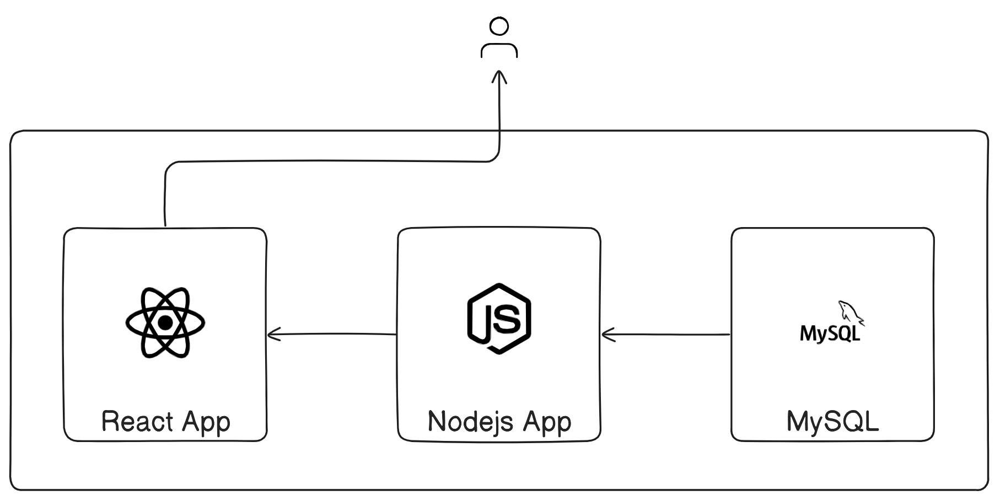
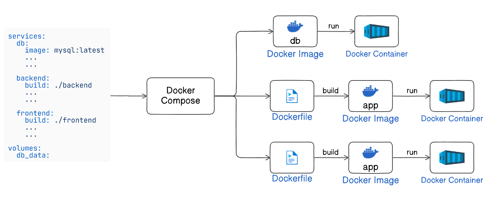
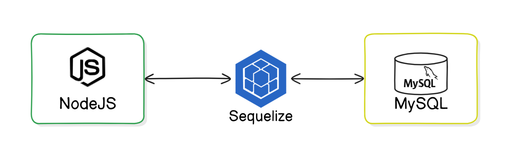
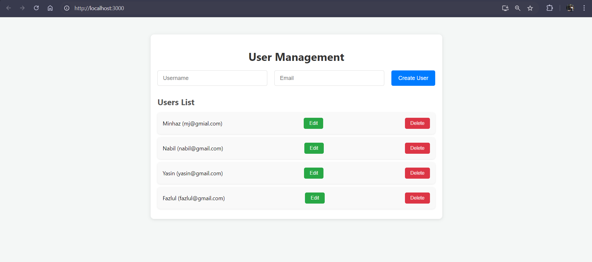
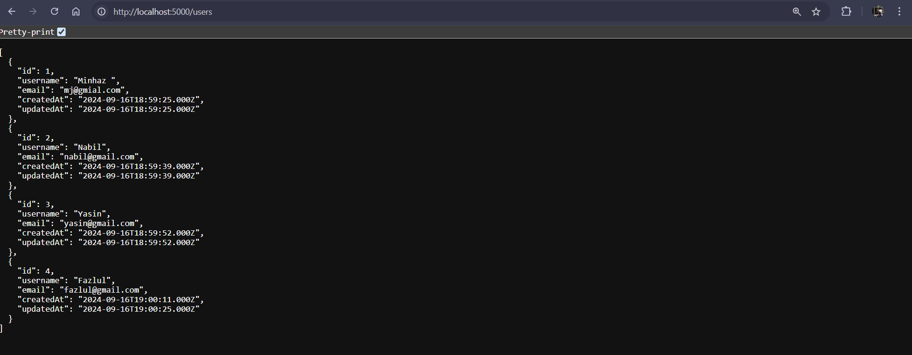

# Running a Fullstack App Using Docker Compose

This guide provides step-by-step instructions on how to run a full-stack React and Node.js application using Docker Compose. The app consists of a React frontend, a Node.js backend, and a MySQL database.



Docker Compose simplifies the process of setting up multi-container applications by defining services, networks, and volumes in a single YAML file.



### **Introduction**

In this document, we will set up a full-stack application using Docker Compose. We will run three services:
1. **Frontend**: React application (served by Node.js)
2. **Backend**: Node.js REST API
3. **Database**: MySQL for data persistence

This guide will walk you through:
- Setting up the file/directory structure.
- Creating Dockerfiles for both the frontend and backend.
- Writing the `docker-compose.yml` file.
- Running the app using Docker Compose.


## **File/Directory Structure**

Here is the structure of the files and directories you need to create for the project:

```
/my-fullstack-app
|-- /backend
|-- /frontend
|-- docker-compose.yml
```

### **Explanation:**
- **/backend**: Contains the Node.js backend REST API code and Dockerfile.
- **/frontend**: Contains the React frontend application and Dockerfile.
- **docker-compose.yml**: The configuration file to manage the services.


## **Step 1: Setting Up the React App**

### Create a new React application

In your project directory add the following command to create a new React application:

```bash
npm create-react-app frontend .
```

We will edit the codes as follows.  

### React App: `frontend/src/app.js`

The React app manages users and interacts with the backend via REST API calls to manage user data.

```jsx
import React, { useState, useEffect } from 'react';
import './App.css';

function App() {
  const [users, setUsers] = useState([]);
  const [newUser, setNewUser] = useState({ username: '', email: '' });
  const [selectedUser, setSelectedUser] = useState(null);

  useEffect(() => {
    const apiurl = process.env.REACT_APP_API_BASE_URL;
    fetchUsers(apiurl);
  }, []);

  const fetchUsers = (apiurl) => {
    fetch(`${apiurl}/users`)
      .then((response) => response.json())
      .then((data) => setUsers(data))
      .catch((error) => console.error('Error fetching users:', error));
  };

  const handleCreateUser = () => {
    const apiurl = process.env.REACT_APP_API_BASE_URL;
    fetch(`${apiurl}/users`, {
      method: 'POST',
      headers: {
        'Content-Type': 'application/json',
      },
      body: JSON.stringify(newUser),
    })
      .then(() => {
        fetchUsers(apiurl);
        setNewUser({ username: '', email: '' });
      })
      .catch((error) => console.error('Error creating user:', error));
  };

  const handleUpdateUser = () => {
    const apiurl = process.env.REACT_APP_API_BASE_URL;
    fetch(`${apiurl}/users/${selectedUser.id}`, {
      method: 'PUT',
      headers: {
        'Content-Type': 'application/json',
      },
      body: JSON.stringify(selectedUser),
    })
      .then(() => {
        fetchUsers(apiurl);
        setSelectedUser(null);
      })
      .catch((error) => console.error('Error updating user:', error));
  };

  const handleDeleteUser = (id) => {
    const apiurl = process.env.REACT_APP_API_BASE_URL;
    fetch(`${apiurl}/users/${id}`, {
      method: 'DELETE',
    })
      .then(() => fetchUsers(apiurl))
      .catch((error) => console.error('Error deleting user:', error));
  };

  return (
    <div className="App">
      <h1>User Management</h1>

      <div className="form-container">
        <input
          type="text"
          placeholder="Username"
          value={newUser.username}
          onChange={(e) => setNewUser({ ...newUser, username: e.target.value })}
        />
        <input
          type="email"
          placeholder="Email"
          value={newUser.email}
          onChange={(e) => setNewUser({ ...newUser, email: e.target.value })}
        />
        <button onClick={handleCreateUser}>Create User</button>
      </div>

      <h2>Users List</h2>
      <ul>
        {users.map((user) => (
          <li key={user.id}>
            {user.username} ({user.email})
            <button onClick={() => setSelectedUser(user)}>Edit</button>
            <button onClick={() => handleDeleteUser(user.id)}>Delete</button>
          </li>
        ))}
      </ul>

      {selectedUser && (
        <div className="edit-container">
          <h2>Edit User</h2>
          <input
            type="text"
            value={selectedUser.username}
            onChange={(e) => setSelectedUser({ ...selectedUser, username: e.target.value })}
          />
          <input
            type="email"
            value={selectedUser.email}
            onChange={(e) => setSelectedUser({ ...selectedUser, email: e.target.value })}
          />
          <br />
          <button onClick={handleUpdateUser}>Update User</button>
          <button onClick={() => setSelectedUser(null)}>Cancel</button>
        </div>
      )}
    </div>
  );
}

export default App;
```

### React `frontend/.env` File
Set the backend URL for API requests:

```env
REACT_APP_API_BASE_URL=http://localhost:5000
```

### React App styles: `frontend/src/app.css`

```css
/* General Styles */
body {
  background-color: #f4f7f6;
  font-family: 'Segoe UI', Tahoma, Geneva, Verdana, sans-serif;
  margin: 0;
  padding: 0;
}

.App {
  max-width: 800px;
  margin: 50px auto;
  padding: 20px;
  background-color: #ffffff;
  box-shadow: 0 2px 10px rgba(0, 0, 0, 0.1);
  border-radius: 10px;
}

h1 {
  color: #333;
  font-size: 2em;
  margin-bottom: 20px;
  text-align: center;
}

h2 {
  color: #555;
  margin-bottom: 15px;
  font-size: 1.5em;
}

/* Form Styles */
.form-container {
  display: flex;
  justify-content: space-between;
  margin-bottom: 30px;
  gap: 10px;
}

.form-container input {
  flex: 1;
  padding: 12px 15px;
  font-size: 16px;
  border-radius: 5px;
  border: 1px solid #ddd;
  margin-right: 10px;
}

.form-container button {
  padding: 12px 20px;
  font-size: 16px;
  cursor: pointer;
  background-color: #007bff;
  color: white;
  border: none;
  border-radius: 5px;
  transition: background-color 0.3s ease;
}

.form-container button:hover {
  background-color: #0056b3;
}

/* User List Styles */
ul {
  list-style: none;
  padding: 0;
  margin: 0;
}

li {
  background-color: #f9f9f9;
  padding: 15px;
  margin-bottom: 10px;
  border-radius: 8px;
  display: flex;
  justify-content: space-between;
  align-items: center;
  box-shadow: 0 1px 4px rgba(0, 0, 0, 0.1);
}

li span {
  font-size: 1.1em;
  color: #333;
}

/* Button Styles */
li button {
  margin-left: 10px;
  padding: 8px 16px;
  font-size: 14px;
  cursor: pointer;
  border: none;
  border-radius: 5px;
  transition: background-color 0.3s ease;
}

li button:first-of-type {
  background-color: #28a745;
  color: white;
}

li button:first-of-type:hover {
  background-color: #218838;
}

li button:last-of-type {
  background-color: #dc3545;
  color: white;
}

li button:last-of-type:hover {
  background-color: #c82333;
}

/* Edit User Styles */
.edit-container {
  margin-top: 30px;
  padding: 20px;
  background-color: #f1f1f1;
  border-radius: 8px;
  box-shadow: 0 1px 4px rgba(0, 0, 0, 0.1);
}

.edit-container input {
  padding: 12px 15px;
  margin-bottom: 10px;
  font-size: 16px;
  border-radius: 5px;
  border: 1px solid #ddd;
  width: calc(50% - 12px);
  margin-right: 10px;
}

.edit-container button {
  padding: 12px 20px;
  font-size: 16px;
  cursor: pointer;
  background-color: #ffc107;
  color: white;
  border: none;
  border-radius: 5px;
  transition: background-color 0.3s ease;
}

.edit-container button:hover {
  background-color: #e0a800;
}

.edit-container .cancel-button {
  background-color: #6c757d;
}

.edit-container .cancel-button:hover {
  background-color: #5a6268;
}
```


`localhost:5000` is the backend URL where the nodejs application will be served.

### React Dockerfile (`frontend/Dockerfile`)
The Dockerfile sets up the container to serve the React app.

```dockerfile
FROM node:16-alpine

WORKDIR /app

COPY package*.json ./

RUN npm install

COPY . .

COPY .env .env

EXPOSE 3000

CMD ["npm", "start"]
```


We are done with the React app. Now, let's create the server using Node.js


## **Step 2: Setting Up the Node.js Backend**

In this step, we'll configure the Node.js backend for our full-stack application. We'll set up a RESTful API using Express, connect to a MySQL database using Sequelize, and manage user data. The backend will provide endpoints for creating, reading, updating, and deleting users.



### **Project Structure**

Here's the folder structure for the backend:

```
/backend
├── /models
│   ├── index.js
│   └── user.js
├── /routes
│   ├── home.js
│   └── user.js
├── .env
├── Dockerfile
├── index.js
├── package.json
└── package-lock.json
```


### **1. Initialize the Node.js Project**

1. Create a directory for your project:

   ```bash
   mkdir backend
   cd backend
   ```

2. Initialize a new Node.js project:

   ```bash
   npm init -y
   ```


### **2. Install Required Packages**

Install the necessary dependencies for the backend. These include `express` for building the API, `sequelize` for database interaction, `mysql2` for MySQL support, and additional utilities like `body-parser`, `dotenv`, and `cors`.

```bash
npm install express sequelize mysql2 dotenv body-parser cors nodemon
```

Add the start script in the `package.json` similar to this:

```json
"scripts": {
    "start": "nodemon index.js"
},
```


### **3. Set Up Environment Variables**

Create a `.env` file in the root of your project to store sensitive database credentials and the port number:

```
DB_USERNAME=myuser
DB_PASSWORD=mypassword
DB_NAME=my_db
DB_HOST=localhost
PORT=5000
```


### **4. Create the Sequelize Models**

- **`models/index.js`**

  This file connects to the MySQL database and loads all models dynamically.

  ```javascript
  const fs = require('fs');
  const path = require('path');
  const Sequelize = require('sequelize');
  const basename = path.basename(__filename);

  const config = {
      username: process.env.DB_USERNAME, 
      password: process.env.DB_PASSWORD, 
      database: process.env.DB_NAME, 
      host: process.env.DB_HOST, 
      dialect: "mysql"
  };

  const db = {};

  let sequelize;
  if (config.use_env_variable) {
    sequelize = new Sequelize(process.env[config.use_env_variable], config);
  } else {
    sequelize = new Sequelize(config.database, config.username, config.password, config);
  }

  fs
    .readdirSync(__dirname)
    .filter(file => {
      return (file.indexOf('.') !== 0) && (file !== basename) && (file.slice(-3) === '.js');
    })
    .forEach(file => {
      const model = require(path.join(__dirname, file))(sequelize, Sequelize.DataTypes);
      db[model.name] = model;
    });

  Object.keys(db).forEach(modelName => {
    if (db[modelName].associate) {
      db[modelName].associate(db);
    }
  });

  db.sequelize = sequelize;
  db.Sequelize = Sequelize;

  module.exports = db;
  ```

- **`models/user.js`**

  Defines the `User` model with fields for `username` and `email`.

  ```javascript
  module.exports = (sequelize, DataTypes) => {
    const User = sequelize.define('User', {
      username: {
        type: DataTypes.STRING,
        allowNull: false,
        unique: true,
      },
      email: {
        type: DataTypes.STRING,
        allowNull: false,
        unique: true,
        validate: {
          isEmail: true,
        },
      }
    });

    return User;
  };
  ```


### **5. Set Up Express Routes**

- **`routes/home.js`**

  This route serves a welcome message with information about available endpoints.

  ```javascript
  const express = require('express');
  const router = express.Router();

  router.get('/', (req, res) => {
      try {
          res.json({
              message: 'Welcome to NodeJS App. You can now use tools like Postman or curl to test the following endpoints:',
              endpoints: [
                  { method: 'POST', route: '/users', description: 'Create a new user.' },
                  { method: 'GET', route: '/users', description: 'Get all users.' },
                  { method: 'GET', route: '/users/:id', description: 'Get a user by ID.' },
                  { method: 'PUT', route: '/users/:id', description: 'Update a user by ID.' },
                  { method: 'DELETE', route: '/users/:id', description: 'Delete a user by ID.' }
              ]
          });
      } catch (error) {
          res.status(500).json({ error: error.message });
      }
  });

  module.exports = router;
  ```

- **`routes/user.js`**

  This route provides the CRUD operations for the `User` model.

  ```javascript
  const express = require('express');
  const router = express.Router();
  const { User } = require('../models');

  // Create a new user
  router.post('/', async (req, res) => {
    try {
      const { username, email } = req.body;
      if (!username || !email) {
        return res.status(400).json({ error: 'Username and email are required' });
      }
      const user = await User.create(req.body);
      res.status(201).json(user);
    } catch (error) {
      res.status(500).json({ error: error.message });
    }
  });

  // Get all users
  router.get('/', async (req, res) => {
    try {
      const users = await User.findAll();
      res.json(users);
    } catch (error) {
      res.status(500).json({ error: error.message });
    }
  });

  // Get user by id
  router.get('/:id', async (req, res) => {
    try {
      const user = await User.findByPk(req.params.id);
      if (user) {
        res.json(user);
      } else {
        res.status(404).json({ error: 'User not found' });
      }
    } catch (error) {
      res.status(500).json({ error: error.message });
    }
  });

  // Update user by id
  router.put('/:id', async (req, res) => {
    try {
      const user = await User.findByPk(req.params.id);
      if (user) {
        await user.update(req.body);
        res.json(user);
      } else {
        res.status(404).json({ error: 'User not found' });
      }
    } catch (error) {
      res.status(500).json({ error: error.message });
    }
  });

  // Delete user by id
  router.delete('/:id', async (req, res) => {
    try {
      const user = await User.findByPk(req.params.id);
      if (user) {
        await user.destroy();
        res.json({ message: 'User deleted' });
      } else {
        res.status(404).json({ error: 'User not found' });
      }
    } catch (error) {
      res.status(500).json({ error: error.message });
    }
  });

  module.exports = router;
  ```


### **6. Create the `index.js` File**

The `index.js` file will initialize the server, configure middleware, sync the database, and set up API routes.

```javascript
require('dotenv').config();
const express = require('express');
const bodyParser = require('body-parser');
const db = require('./models');
const userRoutes = require('./routes/user');
const homeRoutes = require('./routes/home'); 
const cors = require('cors');

const app = express();
const PORT = process.env.PORT || 5000;

app.use(cors());
app.use(bodyParser.json());
app.use('/', homeRoutes);
app.use('/users', userRoutes);

const startServer = async () => {
    try {
        await db.sequelize.sync();
        console.log("Database synced successfully.");
        app.listen(PORT, () => {
            console.log(`Server is running on port ${PORT}`);
        });
    } catch (err) {
        console.error("Unable to sync database:", err);
    }
};

startServer();
```

### **6. Create Dockerfile**

```dockerfile
FROM node:14

WORKDIR /app

COPY package*.json ./

RUN npm install

COPY . .

COPY .env .env

EXPOSE 5000

CMD ["npm", "start"]
```


This completes the setup for the Node.js backend of the project.

## **Step 3: Writing the `docker-compose.yml` File**

The `docker-compose.yml` file defines all the services (frontend, backend, and database) and manages the interconnections between them.

### **docker-compose.yml**

```yaml
version: '3.8'

services:
  db:
    image: mysql:latest
    environment:
      MYSQL_ROOT_PASSWORD: root
      MYSQL_DATABASE: my_db
      MYSQL_USER: myuser
      MYSQL_PASSWORD: mypassword
    ports:
      - "3306:3306"
    volumes:
      - db_data:/var/lib/mysql
    healthcheck:
      test: ["CMD", "mysqladmin", "ping", "-h", "localhost"]
      timeout: 3s
      retries: 2

  backend:
    build: ./backend
    ports:
      - "5000:5000"
    environment:
      DB_USERNAME: myuser
      DB_PASSWORD: mypassword
      DB_NAME: my_db
      DB_HOST: db
      PORT: 5000
    depends_on:
      db:
        condition: service_healthy
    volumes:
      - ./backend:/app
      - /app/node_modules
    command: npm start

  frontend:
    build: ./frontend
    ports:
      - "3000:3000"
    depends_on:
      backend:
        condition: service_started
    volumes:
      - ./frontend:/app
      - /app/node_modules
    environment:
      REACT_APP_BACKEND_URL: http://localhost:5000
    command: npm start

volumes:
  db_data:
```

### **Explanation:**
- **db**: Runs the MySQL database.
- **backend**: The Node.js REST API, connecting to the MySQL database.
- **frontend**: The React frontend app

 that communicates with the backend.


## **Step 4: Running the Application**

1. Ensure Docker and Docker Compose are installed on your machine.
2. Navigate to the project directory: `cd my-fullstack-app`.
3. Run the following command to build and start the services:

```bash
docker-compose up --build
```

Docker Compose will pull the necessary images, build the custom images for the frontend and backend, and start the containers.

## **Step 5: Verify the App**

Open `localhost:3000` to see the frontend of the application. Try to  add/delete/update some users. 



Open `localhost:5000` to see response from the express server at `/` route:


Open `localhost:5000/users` to see all the users we've created:




## **Conclusion**

This guide outlines how to set up a full-stack React and Node.js app using Docker Compose, with a MySQL database. Docker Compose simplifies running multi-container applications by managing all services in a single configuration file.