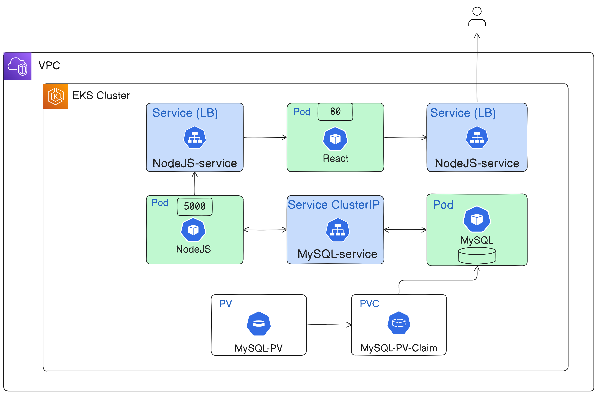
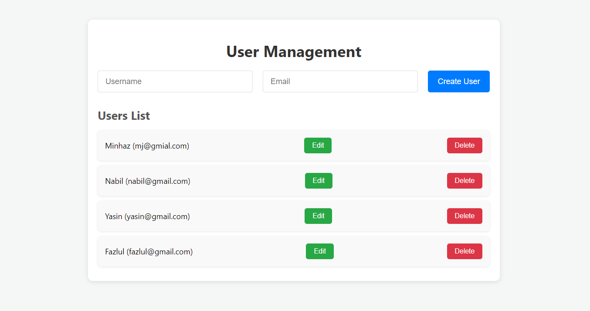

# Deploy a Full Stack App on Amazon EKS

This document guides you through deploying a full-stack application with a React frontend, Node.js backend, and MySQL database on Amazon EKS (Elastic Kubernetes Service).

After we create our app, we will create a EKS Cluster in AWS.


Then we will deploy our app in the cluster by applying the manifests. 




## Steps Overview
2. Create a React app, dockerize it and push image.
3. Create a Node.js app, dockerize it and push image.
4. Create an EKS cluster.
5. Deploy MySQL on EKS.
6. Deploy Node.js on EKS.
7. Deploy React on EKS.
8. Expose services using LoadBalancer.


## **File/Directory Structure**

Here is the structure of the files and directories you need to create for the project:

```
/my-fullstack-app
|-- /backend
|-- /frontend
|-- /Manifests
|-- Makefile
```

### **Explanation:**
- **/backend**: Contains the Node.js backend REST API code and Dockerfile.
- **/frontend**: Contains the React frontend application and Dockerfile.
- **Makefile**: Contains the makefile configuration for docker image build and push to dockerhub.
- **/Manifests**: Contains all the manifest files for app deployment in k8s.


## Configure AWS CLI

Use the following command to configure AWS CLI using the following command:

```
aws configure
```

Provide the secret key, secret access key, region etc.


## **Step 1: Setting Up the React App**

### Create a new React application

In your project directory add the following command to create a new React application:

```bash
npm create-react-app frontend .
```

We will edit the codes as follows.  

### React App: `frontend/src/app.js`

The React app manages users and interacts with the backend via REST API calls to manage user data.

```jsx
import React, { useState, useEffect } from 'react';
import './App.css';

function App() {
  const [users, setUsers] = useState([]);
  const [newUser, setNewUser] = useState({ username: '', email: '' });
  const [selectedUser, setSelectedUser] = useState(null);

  useEffect(() => {
    const apiurl = process.env.REACT_APP_API_BASE_URL;
    fetchUsers(apiurl);
  }, []);

  const fetchUsers = (apiurl) => {
    fetch(`${apiurl}/users`)
      .then((response) => response.json())
      .then((data) => setUsers(data))
      .catch((error) => console.error('Error fetching users:', error));
  };

  const handleCreateUser = () => {
    const apiurl = process.env.REACT_APP_API_BASE_URL;
    fetch(`${apiurl}/users`, {
      method: 'POST',
      headers: {
        'Content-Type': 'application/json',
      },
      body: JSON.stringify(newUser),
    })
      .then(() => {
        fetchUsers(apiurl);
        setNewUser({ username: '', email: '' });
      })
      .catch((error) => console.error('Error creating user:', error));
  };

  const handleUpdateUser = () => {
    const apiurl = process.env.REACT_APP_API_BASE_URL;
    fetch(`${apiurl}/users/${selectedUser.id}`, {
      method: 'PUT',
      headers: {
        'Content-Type': 'application/json',
      },
      body: JSON.stringify(selectedUser),
    })
      .then(() => {
        fetchUsers(apiurl);
        setSelectedUser(null);
      })
      .catch((error) => console.error('Error updating user:', error));
  };

  const handleDeleteUser = (id) => {
    const apiurl = process.env.REACT_APP_API_BASE_URL;
    fetch(`${apiurl}/users/${id}`, {
      method: 'DELETE',
    })
      .then(() => fetchUsers(apiurl))
      .catch((error) => console.error('Error deleting user:', error));
  };

  return (
    <div className="App">
      <h1>User Management</h1>

      <div className="form-container">
        <input
          type="text"
          placeholder="Username"
          value={newUser.username}
          onChange={(e) => setNewUser({ ...newUser, username: e.target.value })}
        />
        <input
          type="email"
          placeholder="Email"
          value={newUser.email}
          onChange={(e) => setNewUser({ ...newUser, email: e.target.value })}
        />
        <button onClick={handleCreateUser}>Create User</button>
      </div>

      <h2>Users List</h2>
      <ul>
        {users.map((user) => (
          <li key={user.id}>
            {user.username} ({user.email})
            <button onClick={() => setSelectedUser(user)}>Edit</button>
            <button onClick={() => handleDeleteUser(user.id)}>Delete</button>
          </li>
        ))}
      </ul>

      {selectedUser && (
        <div className="edit-container">
          <h2>Edit User</h2>
          <input
            type="text"
            value={selectedUser.username}
            onChange={(e) => setSelectedUser({ ...selectedUser, username: e.target.value })}
          />
          <input
            type="email"
            value={selectedUser.email}
            onChange={(e) => setSelectedUser({ ...selectedUser, email: e.target.value })}
          />
          <br />
          <button onClick={handleUpdateUser}>Update User</button>
          <button onClick={() => setSelectedUser(null)}>Cancel</button>
        </div>
      )}
    </div>
  );
}

export default App;
```

### React `frontend/.env` File
Set the backend URL for API requests:

```env
REACT_APP_API_BASE_URL=http://localhost:5000
```

### React App styles: `frontend/src/app.css`

```css
/* General Styles */
body {
  background-color: #f4f7f6;
  font-family: 'Segoe UI', Tahoma, Geneva, Verdana, sans-serif;
  margin: 0;
  padding: 0;
}

.App {
  max-width: 800px;
  margin: 50px auto;
  padding: 20px;
  background-color: #ffffff;
  box-shadow: 0 2px 10px rgba(0, 0, 0, 0.1);
  border-radius: 10px;
}

h1 {
  color: #333;
  font-size: 2em;
  margin-bottom: 20px;
  text-align: center;
}

h2 {
  color: #555;
  margin-bottom: 15px;
  font-size: 1.5em;
}

/* Form Styles */
.form-container {
  display: flex;
  justify-content: space-between;
  margin-bottom: 30px;
  gap: 10px;
}

.form-container input {
  flex: 1;
  padding: 12px 15px;
  font-size: 16px;
  border-radius: 5px;
  border: 1px solid #ddd;
  margin-right: 10px;
}

.form-container button {
  padding: 12px 20px;
  font-size: 16px;
  cursor: pointer;
  background-color: #007bff;
  color: white;
  border: none;
  border-radius: 5px;
  transition: background-color 0.3s ease;
}

.form-container button:hover {
  background-color: #0056b3;
}

/* User List Styles */
ul {
  list-style: none;
  padding: 0;
  margin: 0;
}

li {
  background-color: #f9f9f9;
  padding: 15px;
  margin-bottom: 10px;
  border-radius: 8px;
  display: flex;
  justify-content: space-between;
  align-items: center;
  box-shadow: 0 1px 4px rgba(0, 0, 0, 0.1);
}

li span {
  font-size: 1.1em;
  color: #333;
}

/* Button Styles */
li button {
  margin-left: 10px;
  padding: 8px 16px;
  font-size: 14px;
  cursor: pointer;
  border: none;
  border-radius: 5px;
  transition: background-color 0.3s ease;
}

li button:first-of-type {
  background-color: #28a745;
  color: white;
}

li button:first-of-type:hover {
  background-color: #218838;
}

li button:last-of-type {
  background-color: #dc3545;
  color: white;
}

li button:last-of-type:hover {
  background-color: #c82333;
}

/* Edit User Styles */
.edit-container {
  margin-top: 30px;
  padding: 20px;
  background-color: #f1f1f1;
  border-radius: 8px;
  box-shadow: 0 1px 4px rgba(0, 0, 0, 0.1);
}

.edit-container input {
  padding: 12px 15px;
  margin-bottom: 10px;
  font-size: 16px;
  border-radius: 5px;
  border: 1px solid #ddd;
  width: calc(50% - 12px);
  margin-right: 10px;
}

.edit-container button {
  padding: 12px 20px;
  font-size: 16px;
  cursor: pointer;
  background-color: #ffc107;
  color: white;
  border: none;
  border-radius: 5px;
  transition: background-color 0.3s ease;
}

.edit-container button:hover {
  background-color: #e0a800;
}

.edit-container .cancel-button {
  background-color: #6c757d;
}

.edit-container .cancel-button:hover {
  background-color: #5a6268;
}
```


`localhost:5000` is the backend URL where the nodejs application will be served.

### React Dockerfile (`frontend/Dockerfile`)
The Dockerfile sets up the container to serve the React app.

```dockerfile
FROM node:16-alpine

WORKDIR /app

COPY package*.json ./

RUN npm install

COPY . .

COPY .env .env

EXPOSE 3000

CMD ["npm", "start"]
```


### Build and Push Docker image in Dockerhub

```docker
docker build -t react-app-aws-eks .

docker tag react-app-aws-eks:latest <DOCKERHUB_USERNAME>/react-app-aws-eks:latest

docker push <DOCKERHUB_USERNAME>/react-app-aws-eks:latest
```

We are done with the React app. Now, let's create the server using Node.js.


## **Step 2: Setting Up the Node.js Backend**

In this step, we'll configure the Node.js backend for our full-stack application. We'll set up a RESTful API using Express, connect to a MySQL database using Sequelize, and manage user data. The backend will provide endpoints for creating, reading, updating, and deleting users.

### **Project Structure**

Here's the folder structure for the backend:

```
/backend
├── /models
│   ├── index.js
│   └── user.js
├── /routes
│   ├── home.js
│   └── user.js
├── .env
├── Dockerfile
├── index.js
├── package.json
└── package-lock.json
```


### **1. Initialize the Node.js Project**

1. Create a directory for your project:

   ```bash
   mkdir backend
   cd backend
   ```

2. Initialize a new Node.js project:

   ```bash
   npm init -y
   ```


### **2. Install Required Packages**

Install the necessary dependencies for the backend. These include `express` for building the API, `sequelize` for database interaction, `mysql2` for MySQL support, and additional utilities like `body-parser`, `dotenv`, and `cors`.

```bash
npm install express sequelize mysql2 dotenv body-parser cors nodemon
```

Add the start script in the `package.json` similar to this:

```json
"scripts": {
    "start": "nodemon index.js"
},
```


### **3. Set Up Environment Variables**

Create a `.env` file in the root of your project to store sensitive database credentials and the port number:

```
DB_USERNAME=myuser
DB_PASSWORD=mypassword
DB_NAME=my_db
DB_HOST=localhost
PORT=5000
```


### **4. Create the Sequelize Models**

- **`models/index.js`**

  This file connects to the MySQL database and loads all models dynamically.

  ```javascript
  const fs = require('fs');
  const path = require('path');
  const Sequelize = require('sequelize');
  const basename = path.basename(__filename);

  const config = {
      username: process.env.DB_USERNAME, 
      password: process.env.DB_PASSWORD, 
      database: process.env.DB_NAME, 
      host: process.env.DB_HOST, 
      dialect: "mysql"
  };

  const db = {};

  let sequelize;
  if (config.use_env_variable) {
    sequelize = new Sequelize(process.env[config.use_env_variable], config);
  } else {
    sequelize = new Sequelize(config.database, config.username, config.password, config);
  }

  fs
    .readdirSync(__dirname)
    .filter(file => {
      return (file.indexOf('.') !== 0) && (file !== basename) && (file.slice(-3) === '.js');
    })
    .forEach(file => {
      const model = require(path.join(__dirname, file))(sequelize, Sequelize.DataTypes);
      db[model.name] = model;
    });

  Object.keys(db).forEach(modelName => {
    if (db[modelName].associate) {
      db[modelName].associate(db);
    }
  });

  db.sequelize = sequelize;
  db.Sequelize = Sequelize;

  module.exports = db;
  ```

- **`models/user.js`**

  Defines the `User` model with fields for `username` and `email`.

  ```javascript
  module.exports = (sequelize, DataTypes) => {
    const User = sequelize.define('User', {
      username: {
        type: DataTypes.STRING,
        allowNull: false,
        unique: true,
      },
      email: {
        type: DataTypes.STRING,
        allowNull: false,
        unique: true,
        validate: {
          isEmail: true,
        },
      }
    });

    return User;
  };
  ```


### **5. Set Up Express Routes**

- **`routes/home.js`**

  This route serves a welcome message with information about available endpoints.

  ```javascript
  const express = require('express');
  const router = express.Router();

  router.get('/', (req, res) => {
      try {
          res.json({
              message: 'Welcome to NodeJS App. You can now use tools like Postman or curl to test the following endpoints:',
              endpoints: [
                  { method: 'POST', route: '/users', description: 'Create a new user.' },
                  { method: 'GET', route: '/users', description: 'Get all users.' },
                  { method: 'GET', route: '/users/:id', description: 'Get a user by ID.' },
                  { method: 'PUT', route: '/users/:id', description: 'Update a user by ID.' },
                  { method: 'DELETE', route: '/users/:id', description: 'Delete a user by ID.' }
              ]
          });
      } catch (error) {
          res.status(500).json({ error: error.message });
      }
  });

  module.exports = router;
  ```

- **`routes/user.js`**

  This route provides the CRUD operations for the `User` model.

  ```javascript
  const express = require('express');
  const router = express.Router();
  const { User } = require('../models');

  // Create a new user
  router.post('/', async (req, res) => {
    try {
      const { username, email } = req.body;
      if (!username || !email) {
        return res.status(400).json({ error: 'Username and email are required' });
      }
      const user = await User.create(req.body);
      res.status(201).json(user);
    } catch (error) {
      res.status(500).json({ error: error.message });
    }
  });

  // Get all users
  router.get('/', async (req, res) => {
    try {
      const users = await User.findAll();
      res.json(users);
    } catch (error) {
      res.status(500).json({ error: error.message });
    }
  });

  // Get user by id
  router.get('/:id', async (req, res) => {
    try {
      const user = await User.findByPk(req.params.id);
      if (user) {
        res.json(user);
      } else {
        res.status(404).json({ error: 'User not found' });
      }
    } catch (error) {
      res.status(500).json({ error: error.message });
    }
  });

  // Update user by id
  router.put('/:id', async (req, res) => {
    try {
      const user = await User.findByPk(req.params.id);
      if (user) {
        await user.update(req.body);
        res.json(user);
      } else {
        res.status(404).json({ error: 'User not found' });
      }
    } catch (error) {
      res.status(500).json({ error: error.message });
    }
  });

  // Delete user by id
  router.delete('/:id', async (req, res) => {
    try {
      const user = await User.findByPk(req.params.id);
      if (user) {
        await user.destroy();
        res.json({ message: 'User deleted' });
      } else {
        res.status(404).json({ error: 'User not found' });
      }
    } catch (error) {
      res.status(500).json({ error: error.message });
    }
  });

  module.exports = router;
  ```


### **6. Create the `index.js` File**

The `index.js` file will initialize the server, configure middleware, sync the database, and set up API routes.

```javascript
require('dotenv').config();
const express = require('express');
const bodyParser = require('body-parser');
const db = require('./models');
const userRoutes = require('./routes/user');
const homeRoutes = require('./routes/home'); 
const cors = require('cors');

const app = express();
const PORT = process.env.PORT || 5000;

app.use(cors());
app.use(bodyParser.json());
app.use('/', homeRoutes);
app.use('/users', userRoutes);

const startServer = async () => {
    try {
        await db.sequelize.sync();
        console.log("Database synced successfully.");
        app.listen(PORT, () => {
            console.log(`Server is running on port ${PORT}`);
        });
    } catch (err) {
        console.error("Unable to sync database:", err);
    }
};

startServer();
```

### **6. Create Dockerfile**

```dockerfile
FROM node:14

WORKDIR /app

COPY package*.json ./

RUN npm install

COPY . .

COPY .env .env

EXPOSE 5000

CMD ["npm", "start"]
```

### **7. Build and Push Docker image in Dockerhub**

```docker
docker build -t nodejs-app-aws-eks .

docker tag nodejs-app-aws-eks:latest <DOCKERHUB_USERNAME>/nodejs-app-aws-eks:latest

docker push <DOCKERHUB_USERNAME>/nodejs-app-aws-eks:latest
```


This completes the setup for the Node.js backend of the project.


## Step 4: Create an EKS Cluster using `eksctl`

`eksctl` is a command-line tool that simplifies the process of creating and managing EKS clusters. It abstracts the complexity of Kubernetes setup, making it easier to deploy clusters on AWS.

1. Download `eksctl`:

    ```bash
    curl --silent --location "https://github.com/weaveworks/eksctl/releases/latest/download/eksctl_$(uname -s)_amd64.tar.gz" | tar xz -C /tmp
    ```

2. Move the binary to `/usr/local/bin`:

    ```bash
    sudo mv /tmp/eksctl /usr/local/bin
    ```

3. Verify the installation:

    ```bash
    eksctl version
    ```

    This command should display the `eksctl` version, confirming that it’s correctly installed.


4. Create the EKS cluster:

    ```bash
    eksctl create cluster \
    --name poridhi-cluster \
    --version 1.30 \
    --region ap-southeast-1 \
    --zones ap-southeast-1a,ap-southeast-1b \
    --without-nodegroup
    ```

    **Note:** It may take 15–20 minutes for the cluster to be fully operational. You will see the status of the cluster 'Active' once it is fully operational.

5. Verify the cluster creation in the AWS Console:

    ```bash
    eksctl get cluster --name poridhi-cluster --region ap-southeast-1
    ```

    This command confirms that your EKS cluster is up and running.


6. Create NodeGroup Using `eksctl`

    Use the command below to create NodeGroup

    ```bash
    eksctl create nodegroup \
    --cluster=poridhi-cluster \
    --name=poridhi-nodes \
    --region=ap-southeast-1 \
    --node-type=t3.medium \
    --managed \
    --nodes=2 \
    --nodes-min=1 \
    --nodes-max=2
    ```

    This command creates a managed node group named `poridhi-nodes` in the `poridhi-cluster` Amazon EKS cluster, located in the `ap-southeast-1` AWS region. The node group uses `t3.medium` EC2 instances, with a desired number of 2 nodes. The node group will automatically scale between a minimum of 1 node and a maximum of 2 nodes based on demand.


    It might take a few minutes for the Node Group to be fully created. You can monitor the progress in the EKS Console. The status of the Node Group will be updated to 'active' once it is fully created.

7. Update the kubeconfig file to interact with the EKS cluster:

    ```bash
    aws eks update-kubeconfig --name poridhi-cluster --region ap-southeast-1
    ```

8. Confirm the connection to the EKS cluster:

    ```bash
    kubectl get nodes
    ```

    These commands list the worker nodes in the cluster.

This process will add the worker nodes to your EKS cluster, making them ready to run workloads.


## Step 5: Deploy MySQL on EKS

Create a `manifests` directory in our project directory.  

Create the following Kubernetes manifests:

1. **mysql-pv.yml**: Define PersistentVolume and PersistentVolumeClaim.
   ```yaml
   apiVersion: v1
   kind: PersistentVolume
   metadata:
     name: mysql-pv
   spec:
     capacity:
       storage: 1Gi
     accessModes:
       - ReadWriteOnce
     hostPath:
       path: "/mnt/data"
   
   apiVersion: v1
   kind: PersistentVolumeClaim
   metadata:
     name: mysql-pv-claim
   spec:
     resources:
       requests:
         storage: 1Gi
     accessModes:
       - ReadWriteOnce
   ```

2. **mysql-deploy.yml**: Define MySQL Deployment and Service.
   ```yaml
   apiVersion: apps/v1
   kind: Deployment
   metadata:
     name: mysql
   spec:
     selector:
       matchLabels:
         app: mysql
     strategy:
       type: Recreate
     template:
       metadata:
         labels:
           app: mysql
       spec:
         containers:
         - image: mysql:5.7
           name: mysql
           env:
           - name: MYSQL_ROOT_PASSWORD
             value: root
           - name: MYSQL_USER
             value: myuser
           - name: MYSQL_PASSWORD
             value: mypassword
           - name: MYSQL_DATABASE
             value: my_db
           ports:
           - containerPort: 3306
             name: mysql
           volumeMounts:
           - name: mysql-persistent-storage
             mountPath: /var/lib/mysql
         volumes:
         - name: mysql-persistent-storage
           persistentVolumeClaim:
             claimName: mysql-pv-claim
   
   apiVersion: v1
   kind: Service
   metadata:
     name: mysql
   spec:
     type: ClusterIP
     ports:
     - port: 3306
     selector:
       app: mysql
   ```

3. Apply these configurations:
   ```bash
   kubectl apply -f mysql-pv.yml
   kubectl apply -f mysql-deploy.yml
   ```


## Step 6: Deploy Node.js App on EKS

1. **nodejs-app-deploy.yml**: Define Node.js Deployment and Service.
   ```yaml
   apiVersion: apps/v1
   kind: Deployment
   metadata:
     name: nodejs-app
   spec:
     selector:
       matchLabels:
         app: nodejs-app
     template:
       metadata:
         labels:
           app: nodejs-app
       spec:
         containers:
         - name: nodejs-app
           image: <your-dockerhub-username>/nodejs-app-aws-eks:latest
           ports:
           - containerPort: 5000
           env:
           - name: DB_HOST
             value: mysql
           - name: DB_USERNAME
             value: myuser
           - name: DB_PASSWORD
             value: mypassword
           - name: DB_NAME
             value: my_db
   
   apiVersion: v1
   kind: Service
   metadata:
     name: nodejs-service
   spec:
     type: LoadBalancer
     ports:
     - port: 5000
       targetPort: 5000
     selector:
       app: nodejs-app
   ```

2. Apply the manifest:
   ```bash
   kubectl apply -f nodejs-app-deploy.yml
   ```


## Step 7: Deploy React App on EKS

1. **react-app-deploy.yml**: Define React App Deployment and Service.
   ```yaml
   apiVersion: apps/v1
   kind: Deployment
   metadata:
     name: react-app
   spec:
     replicas: 1
     selector:
       matchLabels:
         app: react-app
     template:
       metadata:
         labels:
           app: react-app
       spec:
         containers:
         - name: react-app
           image: <your-dockerhub-username>/react-app-aws-eks:latest
           ports:
           - containerPort: 3000
           env:
           - name: REACT_APP_API_BASE_URL
             value: http://<nodejs-load-balancer-url>:5000
   
   apiVersion: v1
   kind: Service
   metadata:
     name: react-app
   spec:
     type: LoadBalancer
     selector:
       app: react-app
     ports:
       - protocol: TCP
         port: 80
         targetPort: 3000
   ```

2. Apply the manifest:
   ```bash
   kubectl apply -f react-app-deploy.yml
   ```


## Step 8: Access the Application

1. Get the LoadBalancer URL for both the Node.js service and the React app:
   ```bash
   kubectl get svc
   ```

2. Open the React app using the React service LoadBalancer URL.

    

3. Test the full stack by interacting with the React frontend, which communicates with the Node.js API and MySQL database.


By following these steps, you will successfully deploy a full-stack React-Node.js-MySQL application on EKS.