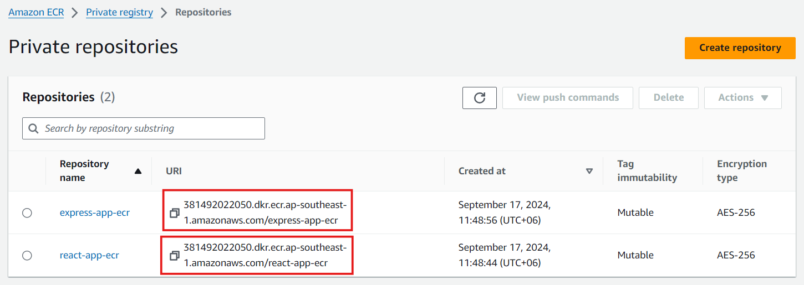
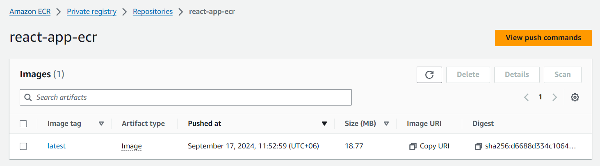
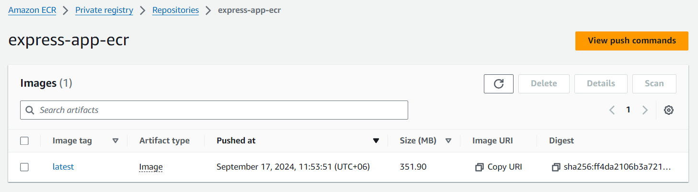
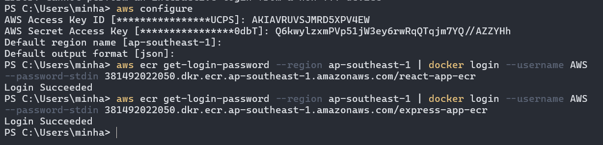
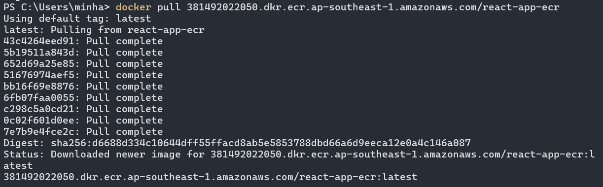
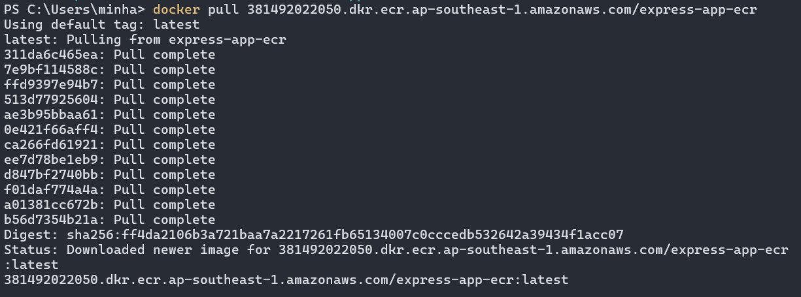
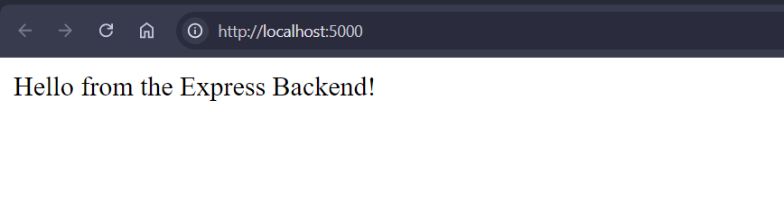
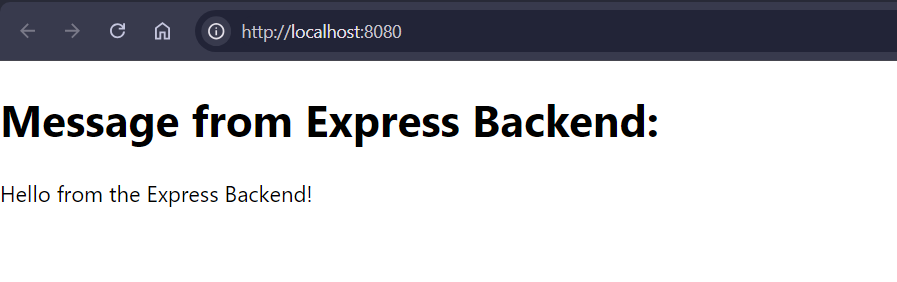
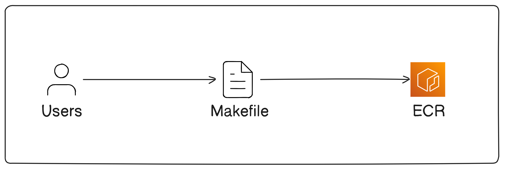

# Deploy React-NodeJS App in ECR and Run App using Docker

This guide demonstrates how to set up a simple React frontend that fetches data from an Express backend service. We will containerize both services using Docker, push the Docker images to Amazon Elastic Container Registry (ECR), and run the images locally after pulling them from ECR.

## Prerequisites

1. Configure the AWS CLI using `aws configure` command.
2. Create a project directory using the following command:

    ```bash
    mkdir my-app
    cd my-app
    ```

## Step 1: React Application Setup

### 1. **Create the React Application**

First, create a simple React application:

```bash
npx create-react-app react-app
cd react-app
```

### 2. **Modify the React App to Fetch from Express**

Edit the `src/App.js` to fetch data from the Express backend at the `/` route and display it.

```javascript
import React, { useEffect, useState } from "react";

function App() {
  const [message, setMessage] = useState("");

  useEffect(() => {
    fetch("http://localhost:5000") // This is the route for the Express backend
      .then((response) => response.text())
      .then((data) => setMessage(data));
  }, []);

  return (
    <div>
      <h1>Message from Express Backend:</h1>
      <p>{message}</p>
    </div>
  );
}

export default App;
```

### 3. **React Dockerfile**

In the `react-app` directory, create a `Dockerfile` to build and serve the React app:

```dockerfile
# Stage 1: Build
FROM node:16 AS build
WORKDIR /app
COPY package.json ./
RUN npm install
COPY . ./
RUN npm run build

# Stage 2: Serve
FROM nginx:alpine
COPY --from=build /app/build /usr/share/nginx/html
EXPOSE 80
CMD ["nginx", "-g", "daemon off;"]
```

### 4. **Build the React Docker Image**

Navigate to the `react-app` directory and build the Docker image:

```bash
docker build -t react-app .
```


## Step 2: Express Application Setup

### 1. **Create the Express Backend**

Now, let's set up a simple Express backend that will send a message to the React app.

```bash
mkdir express-app
cd express-app
npm init -y
npm install express cors
```

Create a file named `index.js` inside the `express-app` directory:

```javascript
const express = require('express');
const cors  = require('cors')
const app = express();

app.use(cors());

app.get('/', (req, res) => {
  res.send('Hello from the Express Backend!');
});

app.listen(5000, () => {
  console.log('Server is running on port 5000');
});

```

### 2. **Express Dockerfile**

Create a `Dockerfile` in the `express-app` directory to containerize the Express app:

```dockerfile
FROM node:16
WORKDIR /app
COPY package.json ./
RUN npm install
COPY . ./
EXPOSE 5000
CMD ["node", "index.js"]
```

### 3. **Build the Express Docker Image**

Build the Docker image for the Express app:

```bash
docker build -t express-app .
```


## Step 3: Pushing Docker Images to Amazon ECR

### 1. **Create ECR Repositories**
Create two ECR repositories for the React and Express apps.

- Go to **Amazon ECR** in the AWS Console.
- Select **Create repository**.
- Provide a **repository name** for React (e.g., `react-app-ecr`) and another for Express (e.g., `express-app-ecr`).

- Copy the repository URIs for both.

    

### 2. **Authenticate Docker to Amazon ECR**

Use the AWS CLI to authenticate Docker with your ECR. Run the following command for each image:

```bash
aws ecr get-login-password --region <your-region> | docker login --username AWS --password-stdin <your-ecr-uri>
```

Replace  <your-ecr-uri> with your ECR `URI` and <your-region> with `ap-southeast-1`.

#### For React:

```bash
aws ecr get-login-password --region ap-southeast-1 | docker login --username AWS --password-stdin 381492022050.dkr.ecr.ap-southeast-1.amazonaws.com/react-app-ecr
```

#### For NodeJS:

```bash
aws ecr get-login-password --region ap-southeast-1 | docker login --username AWS --password-stdin 381492022050.dkr.ecr.ap-southeast-1.amazonaws.com/express-app-ecr
```

### 3. **Tag the Docker Images**

Tag both Docker images for the respective ECR repositories.

#### For React:

```bash
docker tag react-app:latest 381492022050.dkr.ecr.ap-southeast-1.amazonaws.com/react-app-ecr:latest
```

#### For Express:

```bash
docker tag express-app:latest 381492022050.dkr.ecr.ap-southeast-1.amazonaws.com/express-app-ecr:latest
```

### 4. **Push the Docker Images to ECR**

Push the Docker images to their respective ECR repositories.

#### For React:

```bash
docker push 381492022050.dkr.ecr.ap-southeast-1.amazonaws.com/react-app-ecr:latest
```

#### For Express:

```bash
docker push 381492022050.dkr.ecr.ap-southeast-1.amazonaws.com/express-app-ecr:latest
```


So, our images have been pushed to the ECR repositories. Let's look at them in AWS console.






## Step 4: Pull and Run Docker Images Locally from ECR

Open a terminal in your local machine and try running the app using the images form ECR. Don't forget to configure the AWS CLI locally using `aws configure` command.

### 1. **Authenticate Docker to ECR**

Before pulling the images, authenticate Docker to ECR again if needed:

```bash
aws ecr get-login-password --region <your-region> | docker login --username AWS --password-stdin <ecr-uri>
```

#### For React:

```bash
aws ecr get-login-password --region ap-southeast-1 | docker login --username AWS --password-stdin 381492022050.dkr.ecr.ap-southeast-1.amazonaws.com/react-app-ecr
```

#### For NodeJS:

```bash
aws ecr get-login-password --region ap-southeast-1 | docker login --username AWS --password-stdin 381492022050.dkr.ecr.ap-southeast-1.amazonaws.com/express-app-ecr
```
Expected result:



### 2. **Pull Docker Images from ECR**

Pull both the React and Express images from ECR.

For React:

```bash
docker pull 381492022050.dkr.ecr.ap-southeast-1.amazonaws.com/react-app-ecr:latest
```

Expected output:



For Express:

```bash
docker pull 381492022050.dkr.ecr.ap-southeast-1.amazonaws.com/express-app-ecr:latest
```

Expected output:




### 3. **Run Docker Containers Locally**

Run both containers locally. Make sure Express is running on port `5000` and React is running on port `80`.

For React (exposing port 8080 locally):

```bash
docker run -d -p 8080:80 381492022050.dkr.ecr.ap-southeast-1.amazonaws.com/react-app-ecr:latest
```

For Express (exposing port 5000 locally):

```bash
docker run -d -p 5000:5000 381492022050.dkr.ecr.ap-southeast-1.amazonaws.com/express-app-ecr:latest
```

Now, you can access the React app at `http://localhost:8080`, which will fetch the message from the Express app running at `http://localhost:5000`.

#### NodeJS App



#### React App




## Step 5: Automate with Makefile



Let's automate the steps of build, tag and push images of both of our app using `Makefile`. Go to project directory `my-app`. Then create a file named `Makefile`.

Here’s how you can automate the process using a `Makefile`:

```makefile
REGION = ap-southeast-1
REACT_IMAGE = react-app
EXPRESS_IMAGE = express-app
REACT_ECR_URI = 381492022050.dkr.ecr.ap-southeast-1.amazonaws.com/react-app-ecr
EXPRESS_ECR_URI = 381492022050.dkr.ecr.ap-southeast-1.amazonaws.com/express-app-ecr

TAG ?= latest

# React
build-react:
	docker build -t $(REACT_IMAGE):$(TAG) ./frontend

tag-react:
	docker tag $(REACT_IMAGE):$(TAG) $(REACT_ECR_URI):$(TAG)

push-react:
	docker push $(REACT_ECR_URI):$(TAG)

# Express
build-express:
	docker build -t $(EXPRESS_IMAGE):$(TAG) ./backend

tag-express:
	docker tag $(EXPRESS_IMAGE):$(TAG) $(EXPRESS_ECR_URI):$(TAG)

push-express:
	docker push $(EXPRESS_ECR_URI):$(TAG)

# Authenticate Docker to ECR
login:
	aws ecr get-login-password --region $(REGION) | docker login --username AWS --password-stdin $(REACT_ECR_URI) $(EXPRESS_ECR_URI)

# Run all steps
all: login build-react tag-react push-react build-express tag-express push-express
```

To run the full process:

```bash
make all TAG=v1.0
```

Now if you go to the AWS console you will see the images with v1.0 tags.

## Conclusion

In this document, we covered:
1. Setting up a React app that fetches data from an Express backend.
2. Creating Dockerfiles to containerize both services.
3. Pushing Docker images to Amazon ECR.
4. Pulling and running the images locally using Docker.
5. Automating the entire process with a `Makefile`.

This approach allows you to manage your React and Express apps as containerized services, easily deploy them to Amazon ECR, and run them either in a cloud environment or locally for testing.