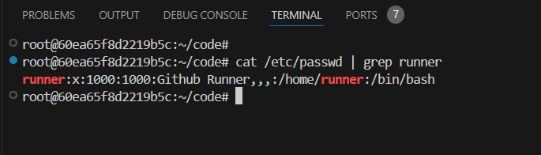
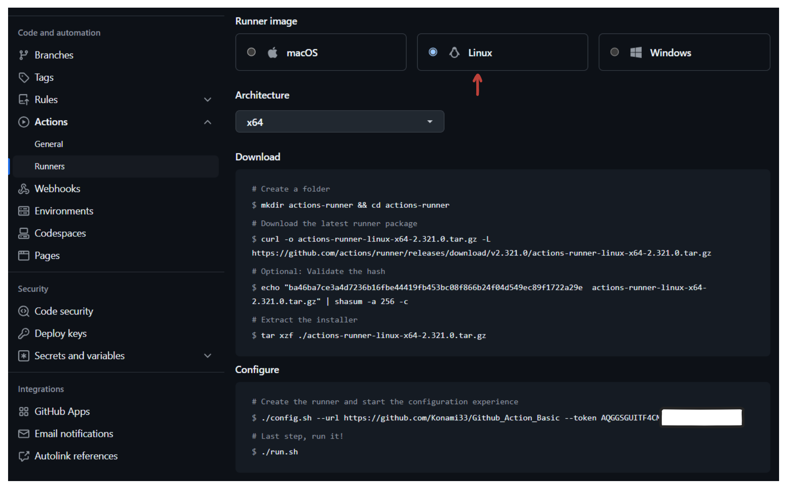
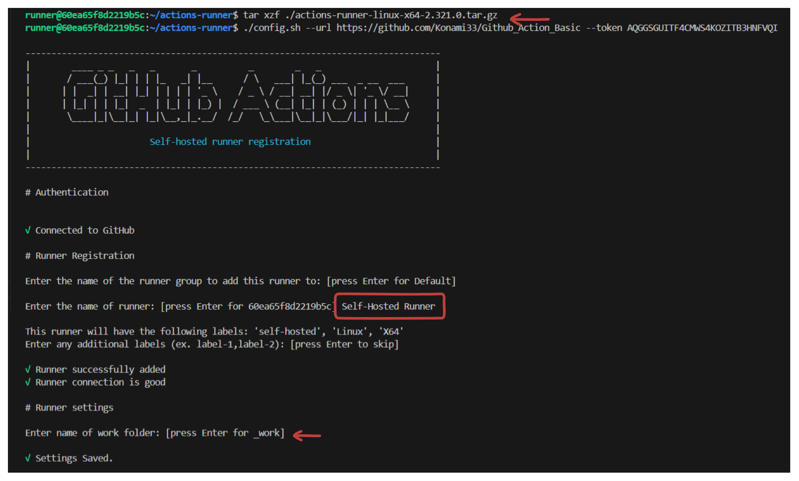
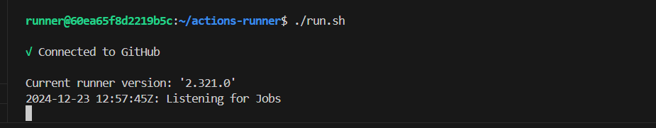
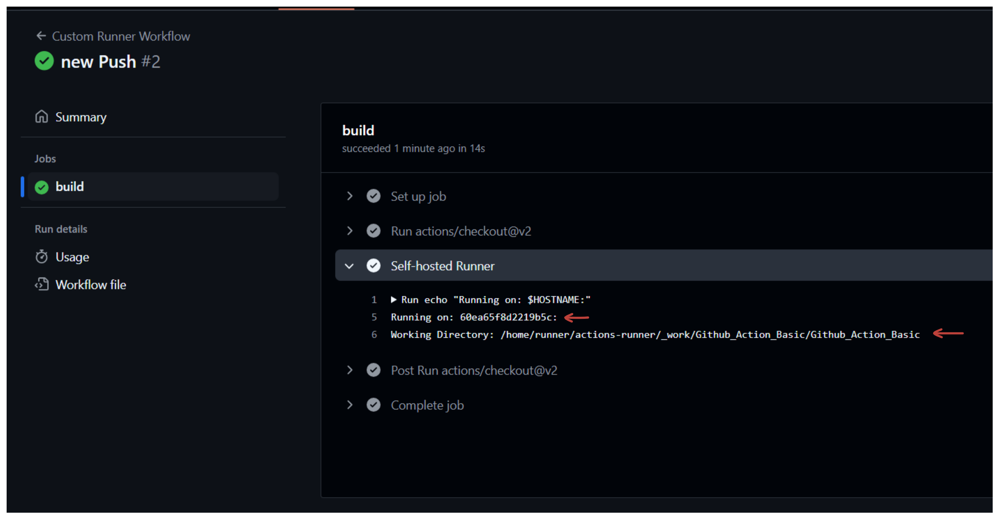

# Self-Hosted GitHub Actions Runner Setup

GitHub Actions is a powerful automation platform that allows developers to automate software development workflows directly in GitHub repositories. It uses **runners** to execute workflows. By default, GitHub Actions provides **hosted runners**, but you can also set up **self-hosted runners** for more control and customisation.


## **Self-Hosted Runner (VM)**

A self-hosted runner is a virtual machine (VM) or physical machine configured to execute GitHub Actions workflows. It includes the following components:

**Runner Service**:

- **Runner Listener**: This component continuously polls GitHub for new jobs in the queue. It listens for job assignments from the GitHub server.
- **Job Controller**: Responsible for managing and orchestrating jobs assigned to the runner.
- **Worker Process**: Executes individual jobs. The worker runs the steps defined in the workflow file, such as shell commands, scripts, or external actions.
- **Job Steps**: Specific tasks or commands in the workflow executed sequentially (e.g., running tests, building applications).

## **How a Self-Hosted Runner Works**

1. **Triggering a Workflow**: When an event (e.g., code push, pull request) occurs in the repository, it triggers the GitHub Actions workflow defined in the workflow file (`.github/workflows/`).

2. **Job Queuing**: The triggered workflow creates jobs and places them in the **Job Queue** in GitHub's server.

3. **Runner Listener Polling**: The **Runner Listener** on the self-hosted runner continuously polls the GitHub job queue to check for new job assignments.

4. **Job Assignment**: When a job is available in the queue and matches the runner’s criteria (e.g., labels, OS requirements), GitHub assigns the job to the runner.

5. **Executing Jobs**: The **Job Controller** receives the job assignment and delegates the execution to the **Worker Process**.The **Worker Process** executes the job by running the defined **Job Steps** (e.g., installing dependencies, running tests, building the application).

6. **Reporting Status**: he runner continuously reports the status of the job (e.g., success, failure) back to the GitHub server. Once the job is completed, the runner marks the job as finished in GitHub's system.

### Prerequisites for Setting Up Self-Hosted Runners

**1. Machine Requirements**:

- Supported operating system: Linux, Windows, or macOS. We will configure `Poridhi's VM` as our self-hosted runner.
- Access to the internet to communicate with GitHub (or a GitHub Enterprise server).

**2. User Permissions**:

- Admin access to the GitHub repository, organisation, or enterprise where the runner will be used.

## Steps

### **1. Create a Runner User**

First create a new User. Run the following command, replacing `<username>` with the desired username:

```bash
sudo adduser <username>
```

The system will prompt you to:

- Enter and confirm a password for the new user.
- Provide additional information (full name, room number, etc.). These are optional; press `Enter` to skip.


**Verify the User Creation**

Check if the user was created successfully:
```bash
cat /etc/passwd | grep <username>
```



This will display details about the new user if it exists.

**Assign the User to Groups (Optional)**

To give the user administrative (sudo) privileges:

```bash
sudo usermod -aG sudo <username>
```

**Switch to the New User**

To switch to the new user account, use:

```bash
su - <username>
```


### **2. Create a Self-Hosted Runner on GitHub**

- Navigate to your repository.
- Navigate to **Settings > Actions > Runners**.
- Click **Add Runner**.
- Select the operating system (Linux) for the runner.

   

### **3. Download the Runner Software**

- GitHub provides a download link for the runner software during setup.
- Use the link to download the software on your self-hosted machine:

   ```bash
   curl -o actions-runner-linux-x64-<version>.tar.gz -L https://github.com/actions/runner/releases/download/<version>/actions-runner-linux-x64-<version>.tar.gz
   ```
- Extract the downloaded file:

   ```bash
   tar xzf actions-runner-linux-x64-<version>.tar.gz
   ```

### **4. Configure the Runner**
- From GitHub, copy the registration token provided during the setup process.
- Run the configuration script in the extracted folder:
   ```bash
   ./config.sh --url https://github.com/<owner>/<repo> --token <token>
   ```
- Options during setup:
   - You can configure the runner with a name, labels, and other settings.
   - Labels help differentiate runners for specific jobs.

   

### **4. Start the Runner**

- Start the runner application:
   ```bash
   ./run.sh
   ```
   

- Keep this terminal open to maintain the runner's activity.

### **5. Install the Runner as a Service (Optional)**

For Linux systems, you can set up the runner as a service to ensure it runs in the background:

```bash
sudo ./svc.sh install
sudo ./svc.sh start
```

This will allow the runner to start automatically when your system boots up.
### **6. Verify the Runner**

To verify the runner, go to **Settings > Actions > Runners**. You will see the Runner is in the `idle` state.


### Connecting the Runner to Workflows

Once the self-hosted runner is set up, you can define it in your GitHub Actions workflows.

#### Example `workflow.yml`:

```yaml
name: Custom Runner Workflow
on: push

jobs:
  build:
    runs-on: self-hosted
    steps:
      - uses: actions/checkout@v2
      - name: Test Runner
        run: |
          echo "Running on: $HOSTNAME"
          echo "Working Directory: $PWD"
```

Here:
- `runs-on: self-hosted` tells GitHub Actions to use a self-hosted runner.
- You can specify custom labels for targeting specific runners (e.g., `self-hosted`, `linux`).

To verify the job is executed in the self-hosted runner, save and commit the changes and push to your github repository.

### Expected Output:

In the Actions section, we can see the workflow output:



In the Runner VM, we can also see that our job is successfully executed.


### Management Commands: Explanation

These commands are used to manage a self-hosted GitHub Actions runner.

#### 1. **Start Runner**

```sh
./run.sh
```
This command starts the GitHub Actions runner on the host machine. 

**How It Works**:

- The `run.sh` script is provided when you download and configure the runner from GitHub.
- It initializes the runner, connects it to the repository or organization, and starts listening for jobs triggered in workflows.

#### 2. **Stop Runner**
```sh
Ctrl+C
```
This command is used to stop the runner gracefully.
**How It Works**:

- Pressing `Ctrl+C` sends an interrupt signal (`SIGINT`) to the running process.
- This is useful when you want to temporarily stop the runner without removing it.

#### 3. **Remove Runner**

```sh
./config.sh remove --token [REMOVE-TOKEN]
```
Removes the runner from GitHub and deletes its local configuration.

**How It Works**:

- The `config.sh` script is used to configure and manage the runner.
- The `remove` command detaches the runner from your GitHub repository or organization.
- The `--token` flag requires a removal token, which can be generated from the GitHub Actions settings in your repository or organization.

**Why Needed**:

- Useful when decommissioning a runner or transferring it to a different repository/organization.
- Ensures the runner is cleanly unregistered from GitHub to prevent accidental job execution on an untrusted environment.


### Troubleshooting Common Issues

1. **Runner Offline**:
   - Ensure the runner machine is powered on and connected to the internet.
   - Restart the runner service if necessary.

2. **Jobs Not Triggering**:
   - Verify that the `runs-on` label matches the runner's configuration.
   - Check permissions for accessing the repository.

### Conclusion

Setting up a self-hosted GitHub Actions runner provides significant benefits for developers and organisations that need flexibility, cost-efficiency, and control. By following these steps, you can create a customised CI/CD pipeline tailored to your project's unique needs.
